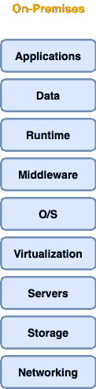
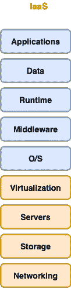
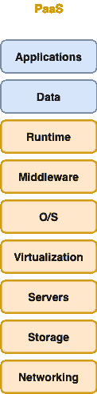
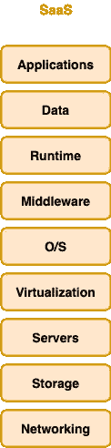
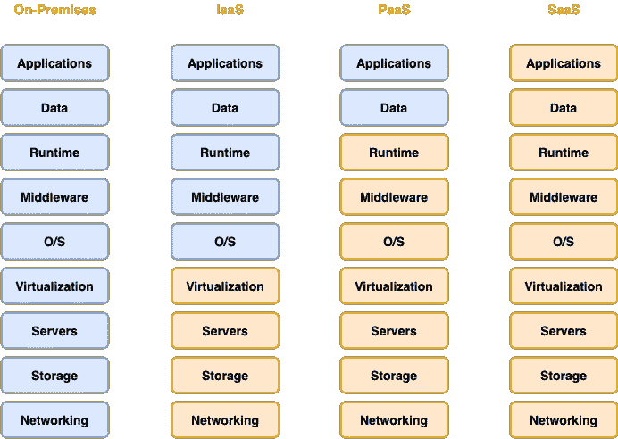

# 云计算的类型

> 原文：<https://towardsdatascience.com/types-of-cloud-computing-952ae75e07c9?source=collection_archive---------20----------------------->

## 了解云计算类型以及 IaaS、PaaS 和 SaaS 之间的区别

埃伯哈德·🖐·格罗斯加斯泰格在 [Unsplash](https://unsplash.com/s/photos/technology-cloud?utm_source=unsplash&utm_medium=referral&utm_content=creditCopyText) 上拍摄的照片

## 介绍

在我最近的一篇文章中，我讨论了云计算中的[部署模型](/deployment-models-cloud-computing-b17fe1e58d44)，即私有、公共和混合模型。现在，除了部署模型，了解三种不同类型的云计算并能够识别它们也同样重要。

过去，每个组织都必须购买、运营和维护自己的基础设施和资源。换句话说，企业必须**管理网络、存储、服务器、虚拟化、操作系统、中间件、运行时、数据和应用**。

您需要在内部管理的服务—来源:[作者](https://gmyrianthous.medium.com/)

然而有了云计算，组织现在可以按需访问由第三方公司提供和维护的资源和基础设施。这些资源以服务的形式提供，可分为三种不同类型:基础设施即服务(IaaS)、平台即服务(Paas)和软件即服务(SaaS)。

## 基础设施即服务(IaaS)

云计算的第一种类型是基础设施即服务(IaaS)，它为云 IT 提供基本的构建模块，如与网络、存储空间、计算机硬件和虚拟化相关的组件。

IaaS 与传统上由 IT 部门维护的 IT 资源非常相似，在管理这些资源时，它提供了最高级别的灵活性和管理。

在下图中，蓝色的服务对应于组织需要在 IaaS 环境中管理的服务，而橙色的服务是由 IaaS 产品本身管理的服务。

您需要在 IaaS 中管理的蓝色服务—来源:[作者](https://gmyrianthous.medium.com/)

## 平台即服务(PaaS)

第二种类型的云计算是平台即服务(PaaS ),它在 IaaS 之上添加了一个额外的层，因为它消除了组织管理基础架构的需要，因此他们只需专注于开发、部署和管理将利用 it 基础架构和资源的应用程序。

在下图中，蓝色的服务对应于组织需要在 PaaS 环境中管理的服务，而橙色的服务是由 PaaS 产品本身管理的服务。

您需要在蓝色 PaaS 中管理的服务—来源:[作者](https://gmyrianthous.medium.com/)

## 软件即服务(SaaS)

最后一种云计算是软件即服务，本质上是为组织提供由第三方提供商执行和管理的完整产品。

在 SaaS，除了如何利用所提供的服务或产品来实现某个目标之外，组织实际上不必担心其他任何事情。

SaaS 最常见的例子之一是基于网络的电子邮件服务，在这里你只关心发送和接收电子邮件。IT 基础设施、资源管理、功能添加等。是软件提供商的责任。

在 SaaS 不需要管理任何服务——来源:[作者](https://gmyrianthous.medium.com/)

## 最后的想法

在今天的文章中，我们讨论了云计算的三种主要类型，即基础设施即服务、平台即服务和软件即服务。下图总结了我们今天文章中所涉及的内容。

来源:[作者](https://gmyrianthous.medium.com/)

[**成为会员**](https://gmyrianthous.medium.com/membership) **阅读介质上的每一个故事。你的会员费直接支持我和你看的其他作家。你也可以在媒体上看到所有的故事。**

 [## 通过我的推荐链接加入 Medium-Giorgos Myrianthous

### 作为一个媒体会员，你的会员费的一部分会给你阅读的作家，你可以完全接触到每一个故事…

gmyrianthous.medium.com](https://gmyrianthous.medium.com/membership) 

**你可能也会喜欢**

 [## 云计算中的部署模型

### 了解私有云、公共云和混合云之间的区别

towardsdatascience.com](/deployment-models-cloud-computing-b17fe1e58d44)  [## 选择 AWS 地区时需要考虑的 5 件事

### 如何为你的亚马逊网络服务找到合适的区域

better 编程. pub](https://betterprogramming.pub/5-things-to-consider-when-choosing-your-aws-region-484e800cb6f0)  [## 使用 MLFlow 和 LakeFS 实现高效工作流的数据版本控制

### 构建弹性、原子和版本化的数据湖操作

pub.towardsai.net](https://pub.towardsai.net/data-versioning-for-efficient-workflows-with-mlflow-and-lakefs-892df1f8e7d8)