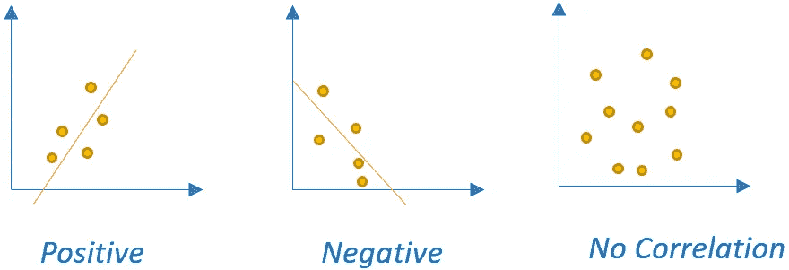
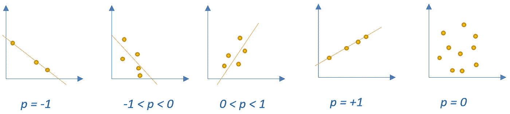
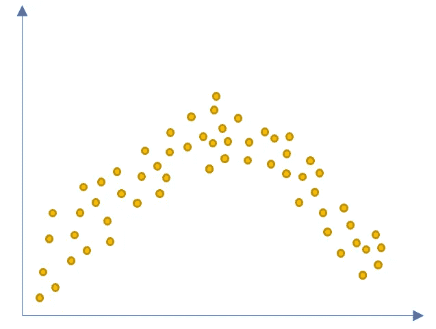

# 相关系数的类型

> 原文：<https://towardsdatascience.com/types-of-correlation-coefficients-db5aa9ea8fd2?source=collection_archive---------11----------------------->

## 深入研究不同种类的相关系数


([来源](https://pixabay.com/illustrations/network-social-abstract-3139214/))

在现有数据集中，能够区分适当类型的相关系数以决定是否在即将到来的分析和建模步骤中保留数据集中的变量是非常重要的。在数据中，特征之间可能存在递增(正)或递减(负)关系，如下所示。



相关系数的方向(归作者所有)

每一个相关系数都通过其使用领域和方面包含了非常独特的描述。在整篇文章中，将有四个主要的相关系数作为*协方差、皮尔逊的斯皮尔曼相关系数和多元相关系数。*

# 1.协方差相关系数

基本上，当特征之间存在正态分布关系时，可以应用协方差相关。它可以很容易地用于评估两个具体特征的方差之和。

通过使用该系数，可以推测特征的方向。然而，在需要测量变量的相关性时，应选择一个额外的度量，因为协方差系数不能响应这种关系。

简单地说，协方差相关的公式可以在下面找到。

```
Covariance(X, Y) = (sum (x - mean(X)) * (y - mean(Y)) ) * 1/(n-1)
```

# 2.皮尔逊相关系数

对于皮尔逊相关，还需要一对变量之间的线性关系。在文献中可以称之为“皮尔逊积矩相关” [1](https://statistics.laerd.com/statistical-guides/pearson-correlation-coefficient-statistical-guide.php) 。

皮尔逊相关公式可以从协方差相关数学公式中生成。

```
Pearson(X, Y) = Covariance(X, Y) / (stdDev(X) * stdDev(Y))
```

根据变量在 x 轴和 y 轴上的当前位置，可以在五个不同的范围内观察到皮尔逊相关系数参数，相关性的范围可能会发生变化。

当数据点遵循下降趋势时，可以接受为 ***负相关*。**另一方面，当观察到趋势向上时，可以将其标记为两个比较变量之间的 ***正相关*** 。

在下面的描述中， *p* 可以被接受为相关系数。您可以根据数据点的分布来检查相关性的排列。



皮尔逊相关系数的变化值(归作者所有)

# 3.斯皮尔曼相关系数

斯皮尔曼相关在学术环境中也可称为*“斯皮尔曼秩序相关”*[2](https://statistics.laerd.com/statistical-guides/spearmans-rank-order-correlation-statistical-guide.php)适用于变量集内缺乏正态分布性质的情况。



非高斯分布数据集(归作者所有)

Spearman 相关公式也可以通过在公式中添加变量的*排名*从协方差相关公式中导出。排序可以总结为指定变量标签的排列，以便能够计算观察对之间的对应程度，这可以用于评估它们彼此的影响率。

```
Spearman(X, Y) = Covariance(rank(X), rank(Y)) / (stdDev(rank(X)) * stdDev(rank(Y)))
```

# 4.多轴相关系数

多分位数相关或四分位数相关[ [3](https://core.ac.uk/download/pdf/14378486.pdf) ]可以表示为一种类型的系数，该系数用于提取对两个高斯分布连续观察值的关联的解释，这两个观察值是通过调查和个性测试收集的，这些调查和测试需要在之后生成评级量表。作为这种相关性的一个示例使用领域"*李克特量表"* [ [4](https://www.britannica.com/topic/Likert-Scale) ]，这是一种在社会科学领域广泛使用的标度系统*。*

在有连续数据的情况下，这个系数的公式可以由皮尔逊相关系数演化而来。

# 结论

当我们遇到需要了解数据集中相关强度的问题时，能够区分要应用的相关系数的正确类型是很重要的。

为了能够准确地确定相关性的类型，首先，可视化数据可能有助于了解它是否具有高斯分布。在它存在的情况下，我们可能会被引导到更深入地研究它的其他方面，如变量的类型和数量。

非常感谢您的阅读！

# 参考

1.  [皮尔逊积差相关](https://statistics.laerd.com/statistical-guides/pearson-correlation-coefficient-statistical-guide.php)
2.  [斯皮尔曼的秩次相关](https://statistics.laerd.com/statistical-guides/spearmans-rank-order-correlation-statistical-guide.php)
3.  [四分相关](https://core.ac.uk/download/pdf/14378486.pdf)
4.  [李克特量表](https://www.britannica.com/topic/Likert-Scale)