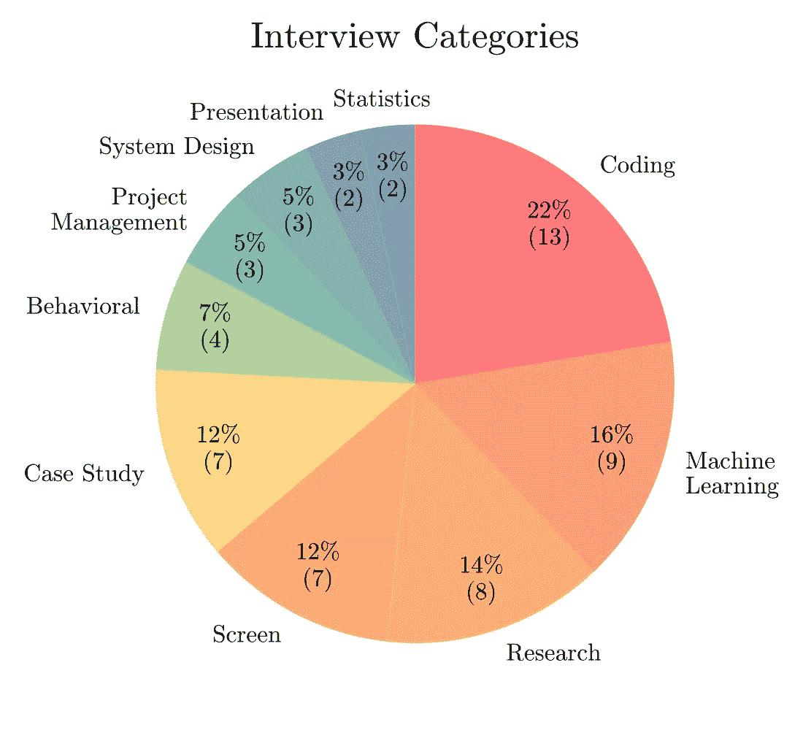

# 机器学习面试的类型以及如何胜出

> 原文：<https://towardsdatascience.com/types-of-machine-learning-interviews-and-how-to-ace-them-51587a95f847?source=collection_archive---------2----------------------->

[活动发起人](https://unsplash.com/@campaign_creators?utm_source=medium&utm_medium=referral)在 [Unsplash](https://unsplash.com?utm_source=medium&utm_medium=referral) 上的照片

## 关于不同类别的机器学习面试以及如何准备面试的详细指南。

21 年春天，我开始申请工作。我找不到一篇简洁的文章来说明我将要接受采访的不同方面。在最初的采访系列中，有时我毫无头绪。我不得不艰难地认识到，无论你是一名多么优秀的研究员或 ML 工程师，在面试时都是不够的。你必须做好准备！在你开始准备之前，你需要知道你将被测试的不同领域。

在这篇文章中，我将根据我今年早些时候进行的 58 个小时的面试，讨论不同类型的机器学习面试。下面的饼状图总结了机器学习工程师/数据科学家面试的不同类别。

58 小时的机器学习访谈——图片由作者提供

我们将专注于筛选、编码、机器学习、案例研究和系统设计。

# 1.排查

这种面试相当随意，通常是一系列面试的第一步。这通常是由招聘人员或招聘经理进行的。这次面试的主要目的是让候选人了解公司、工作描述和职责。候选人还会在非正式场合被问及他/她的背景，以了解候选人的兴趣领域是否与工作相符。

**性质:**非技术性

**模式:**正常情况下打电话

**持续时间:**15–20 分钟

准备:你应该能在几分钟内说明你的经历。

# 2.编码

编码/编程是机器学习面试的重要组成部分，通常用于在将候选人推向机器学习相关面试之前筛选掉他们。在这样的面试中需要良好的编程技巧。编码面试通常持续 45-60 分钟，由两个问题组成。面试官解释问题，并期望应聘者在最佳的时间和空间复杂度内解决问题。

## 准备资源:

准备这样的采访需要很好地理解数据结构，时空复杂性，理解问题的能力，以及良好的时间管理技巧。以下是一些好的资源

<https://aqeel-anwar.medium.com/how-to-prepare-for-coding-interviews-8bdd16b09659>  </how-to-answer-a-coding-interview-question-1613776358e>  </seven-7-essential-data-structures-for-a-coding-interview-and-associated-common-questions-72ceb644290>  

# 3.机器学习

机器学习面试评估你的机器学习相关知识。根据工作要求，主题可以包括监督学习、非监督学习、强化学习、卷积神经网络、递归神经网络、生成对抗网络、自然语言处理等。

## 准备资源:

确保你仔细阅读了工作要求，并确定了所要求的 ML 的具体主题。如果没有具体提到，那么你可以把重点放在基础上。

**答:关于 ML 的深入课程:**如果你在学习期间没有正式参加过 ML 课程，我强烈建议你参加网上课程。在网上提供的各种课程中，我推荐吴恩达在 Coursera 上开设的机器学习课程。

<https://www.coursera.org/learn/machine-learning>  

**b .复习文章:**如果你已经上过这样的课程，那么浏览几篇关于 ML 的复习文章将非常有助于你深入理解 ML 主题。这类文章的一个小列表(10)可以在下面找到。

> [https://AQ eel-an war . medium . com/list/understanding-machine-learning-a-list-of-easytouunderstand-tutorials-02 f 0f 9f 2f 0d 8](https://aqeel-anwar.medium.com/list/understanding-machine-learning-a-list-of-easytounderstand-tutorials-02f0f9f2f0d8)

c .面试问题范例:了解 ML 面试中通常会问些什么有助于衡量你的准备工作。下面可以找到这样的示例问题。确保在 做好准备后，再看一遍 ***。***

<https://www.interviewbit.com/machine-learning-interview-questions/>  <https://www.springboard.com/blog/ai-machine-learning/machine-learning-interview-questions/>  

**d .备忘单:**在面试前一天晚上准备好备忘单总是好的。下面是 ML 备忘单的链接

<https://medium.com/swlh/cheat-sheets-for-machine-learning-interview-topics-51c2bc2bab4f>  

# 4.案例研究:

这些通常是开放式问题，旨在分析候选人就整体项目管理和项目敏锐度进行有意义的 ML 讨论的能力。面试官提出了一个开放式问题，比如*“你会如何改进谷歌地图？”。*如果处理不当，这种开放式问题会导致非常混乱的答案。

## 准备资源:

一个好的答案模板对解决这类问题大有帮助。尝试使用以下模板组织您的答案

1.  听这个问题
2.  描述产品及其使命
3.  提出澄清性问题
4.  陈述你的假设
5.  确定棘手问题
6.  确定棘手问题的解决方案
7.  通过表格比较解决方案
8.  讨论 KPI
9.  总结

以下是深入理解案例研究问题的良好资源

<https://workera.ai/resources/machine-learning-case-study-interview>  

下面是这种开放式问题的一些例子

<https://www.productmanagementexercises.com/119/how-would-you-improve-google-maps>  <https://www.productmanagementexercises.com/591/how-can-you-improve-facebook-stories>  <https://www.productmanagementexercises.com/753/how-would-you-design-a-bicycle-renting-app-for-tourists>  <https://www.productmanagementexercises.com/5080/how-would-you-measure-the-success-of-uber-ride>  

# 5.系统设计:

这些面试评估候选人针对潜在问题设计端到端可扩展系统的能力。大多数工程师太专注于一个 bug，以至于他们忘记或者有时甚至没有意识到更大的图景。系统设计面试需要了解各种组件的知识，这些组件共同创建一个可扩展的问题解决方案。这些组件包括前端设计、负载平衡器、数据库分片、缓存、代理、SQL、API 等。对这些主题的良好理解有助于设计高效且可伸缩的端到端系统。

## 准备资源

1.  **组件和概念:**

<https://www.geeksforgeeks.org/5-common-system-design-concepts-for-interview-preparation/>    </the-complete-guide-to-the-system-design-interview-ba118f48bdfc>  

**2。示例问题和解决方案**

<https://www.educative.io/blog/uber-backend-system-design>  <https://www.educative.io/blog/top-10-system-design-interview-questions>  <https://igotanoffer.com/blogs/tech/system-design-interviews>  

# 总结:

如今的机器学习面试不仅仅是关于基本 ML 主题的问题。还包括开放式问题、案例研究、编码、系统设计等。了解不同类别的机器学习面试可以帮助候选人了解情况并做好相应的准备。在这篇文章中，我们详细介绍了五种最常见的 ML 面试类别，以及如何为它们做准备。

**如果这篇文章对你有帮助，或者你想了解更多关于机器学习和数据科学的知识，请关注**[**【Aqeel an war】**](https://medium.com/u/a7cc4f201fb5?source=post_page-----51587a95f847--------------------------------)**，或者在**[***LinkedIn***](https://www.linkedin.com/in/aqeelanwarmalik/)***或***[***Twitter***](https://twitter.com/_aqeelanwar)***上联系我。你也可以订阅我的邮件列表。***