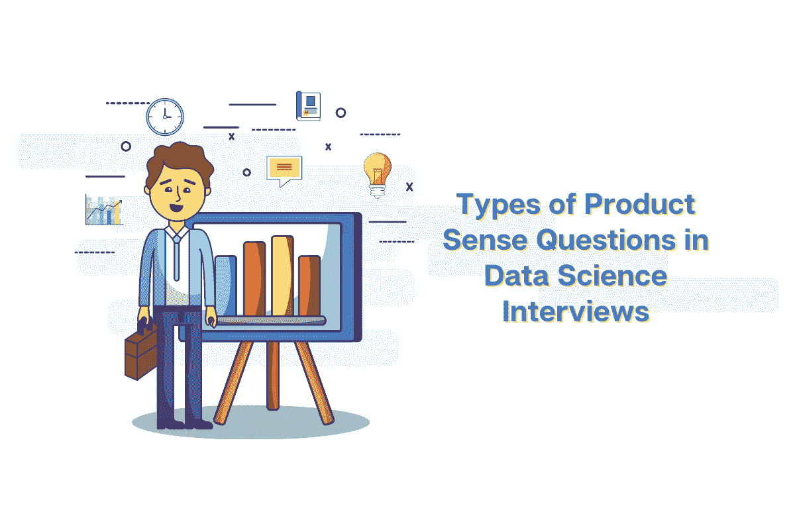

# 数据科学访谈中产品感觉问题的类型

> 原文：<https://towardsdatascience.com/types-of-product-sense-questions-in-data-science-interviews-ad0f80222643?source=collection_archive---------16----------------------->

## 不同类型的产品感觉问题，或者换句话说，公司询问的关于产品和功能的面试问题。

作者在 [Canva](https://canva.com/) 上创建的图片

在本文中，我们将讨论产品感问题的类型，或者换句话说，公司询问的关于产品和功能的面试问题。从某种程度上来说，这可以是一个关于当前或潜在的涉及或与产品相关的复杂问题，一直到你对产品了解多少的宽泛问题。

[数据科学公司](https://www.stratascratch.com/blog/ultimate-guide-to-the-top-5-data-science-companies/?utm_source=blog&utm_medium=click&utm_campaign=medium)出于几个原因询问这些类型的产品感觉面试问题，例如测试你诊断和解决实际产品问题的能力，查看你对公司产品和业务的熟悉程度，评估你对问题的解决方案的实用性，评估你定义和理解指标的影响和权衡的能力，或者检查你是否能以有效和结构化的方式传达你的解决方案。

产品感问题主要有三类。

1.  **分析与指标相关的问题(最常见)**:分析与指标相关的问题提问，以提供产品指标或指标变化的原因。
2.  **衡量新产品/功能的影响**:关于衡量影响的问题始于新产品、功能、最近或计划中的产品变更，并询问如何评估这些更新的性能。
3.  **设计产品**:第三类问题是关于设计产品的，这些是最宽泛的问题，通常没有正确的答案。

# 分析与指标相关的问题

作者在 [Canva](https://canva.com/) 上创建的图像

第一类产品意识问题是关于分析与指标相关的问题。这些问题通常提到与公司产品相关的指标，以及它在某种程度上受到了影响。解决方案应该给出为什么会发生这种情况的思考过程。

让我们看一些例子。对于与指标相关的问题，最常见的[场景](https://www.stratascratch.com/blog/sql-scenario-based-interview-questions-and-answers/?utm_source=blog&utm_medium=click&utm_campaign=medium)是某些特性的使用已经改变了一定的百分比。就像在这个问题中，脸书看到喜欢数每年增长 10%，并问为什么会这样？但是这个问题也涉及到两个衡量标准。例如，在这种情况下，脸书问，如果 70%的脸书用户在 iOS 上使用 Instagram，但只有 35%的脸书用户在 Android 上使用 Instagram，你会如何调查这种差异？

在这些产品感问题中，指标的概念自然很重要。然而，在大多数情况下，问题中已经给出了度量标准的示例。在这里，指标是使用脸书和 Instagram 的某些平台的用户在只使用脸书的用户中所占的份额。没有必要拿出你自己的度量标准的例子，这使得这些问题变得简单了一些。最重要的是根据问题正确识别相关指标，并理解这些指标与产品或问题的相关性。在这个例子中，讨论中的指标与三个方面有关:移动操作系统、脸书应用和 Instagram 应用。他们都以某种方式相互交流，对脸书来说非常重要，因为该公司拥有两个社交平台，移动用户是他们的重要目标群体。

与指标相关的问题实际上是在问与痛点概念直接相关的问题。痛点是产品中令客户不愉快的部分，使他们自愿停止使用它。在脸书的例子中，我们可以尝试和推测可能导致统计数据差异的难点。也许 Android Instagram 应用程序比其 iOS 版本更慢、更不直观或更重？

另一个关键概念是确定产品和具体指标之间的权衡。看看脸书公司如何拥有两个社交媒体平台:脸书和 Instagram。在这种情况下，当他们对两个平台做出不同的决策时，这可能会反映在指标中。例如，该公司可能会遵循最佳营销策略，向不同于脸书的目标受众推广 Instagram，比如更年轻、对品牌更谨慎的人，这些人也更有可能使用苹果产品。这可能会导致大多数安卓用户只使用脸书。

# 衡量影响

作者在 [Canva](https://canva.com/) 上创建的图片

第二种类型的产品感问题是关于衡量一个公司的新产品或新特征的影响。这些问题可以是类似于[这个来自 Twitter](https://platform.stratascratch.com/technical/2051-influencer-metrics?utm_source=blog&utm_medium=click&utm_campaign=medium) 的问题，他们问你如何量化一个 Twitter 用户的影响力？还有专门关于功能更新的问题，比如 [Quora 问](https://platform.stratascratch.com/technical/2025-search-toolbar-change?utm_source=blog&utm_medium=click&utm_campaign=medium)你会用什么标准来衡量搜索工具栏变化的影响？

与度量相关的问题类似，度量的概念也是衡量影响的关键。在这种情况下，就更加困难了，因为候选人需要给出可以用来衡量所讨论的影响的度量标准的例子。每当建议一个指标时，重要的是要定义它，解释该指标与目标的相关性，并可能解释为什么选择某个指标而不是另一个。

此外，在衡量影响时，定义 3 个指标是一个好策略:2 个衡量成功的指标和 1 个不会恶化的指标。在回答这个产品感采访问题时，我们可以假设，有了新的搜索工具栏，Quora 希望提高自己的点击率和回头客数量，但同时又不希望找到一条信息所花费的时间增加。

在提到、定义和解释为问题选择这些指标的原因后，需要解释他们将使用什么方法来度量它们。换句话说，如何得出这些指标？好的方法是尽可能具体地设计和解释实验。例如，测试一个新特性是否成功的一般实验被称为 A/B 测试。它类似于对照组和治疗组的概念，在测量用户界面更新的影响时特别有用。

但是当建议进行 A/B 测试这样的实验时，提及实验将涉及的用户群是至关重要的。在 Quora 的这个问题中，我们试图测量公众对新产品的反应，所以我们想在随机分组的小组中进行实验。但是如果我们将产品扩展到新的用户群，那么在特定的人群中进行实验是有意义的。

# 设计产品

作者在 [Canva](https://canva.com/) 上创建的图像

第三类也是最后一类产品感问题是关于产品设计的。这些是完全开放式的问题，没有正确的答案，而且通常是数据科学产品意识面试中最难的问题，因为这些测试的是候选人的思维过程，而不是答案本身。

我们来看几个这类问题的例子。 [Lyft 可以问](https://platform.stratascratch.com/technical/2035-heatmap-telling-taxi-drivers?utm_source=blog&utm_medium=click&utm_campaign=medium):“描述如何设计热图，告诉出租车司机去哪里最大化他们获得客户的概率。你怎么定义接下来哪个地区需求高，你想让谁去？”。另一个例子是来自[微软](https://platform.stratascratch.com/technical/2026-twitter-feed?utm_source=blog&utm_medium=click&utm_campaign=medium)的问题:“你会怎么总结一个 Twitter feed？”或者来自 [Yelp](https://platform.stratascratch.com/technical/2198-yelp-feature?utm_source=blog&utm_medium=click&utm_campaign=medium) :“如果你必须提出一个新的 Yelp 功能，它会是什么？”。

更重要的是，这些类型的问题有时可能会延伸到如何衡量设计产品的成功。例如，在要求提出一项新功能后，Yelp 可以接着问一个后续问题，如何确定该功能的推出是否成功。这将与衡量产品成功类型的问题联系在一起。

当面对一个与设计产品相关的问题时，答案中应该包含许多概念。首先，为一个功能的产品定义目标受众是很重要的。如果问题和访谈都没有指定目标受众，说明你认为谁是目标受众，并提到你正在基于这个目标受众开发产品。在 Yelp 的例子中，它可能是当前站点的人口统计数据，但是您可能也希望新的功能能够吸引新的目标受众。

另一个要考虑的重要概念是产品的关键性能指标，或 KPI。KPI 是业务问题中的关键指标，基于以下两种类型:产品或系统性能，例如应用程序初始化时间，以及用户体验，例如他们推荐产品的可能性。如果衡量 KPI 需要任何数据，那么解释这些数据是什么以及如何在产品中收集它们是很重要的。回到 Lyft 的这个示例问题，KPI 可能包括司机的收入、公司总收入或司机在两个客户之间等待的平均时间。但是在最后一个例子中，我们可能没有收集平均等待时间数据的系统，所以我们需要从乘车数据库中获得这个指标。

还有一个概念，许多候选人在回答关于设计产品的问题时忘记了，即提及边缘案例以及解决方案如何解释它们。假设你对 Lyft 提出的这个产品感问题的回答是，根据过去的数据，按小时、星期几、月份和年份来预测乘坐情况。您的解决方案的一个边缘情况是城市中有一个重大事件，如音乐节。由于音乐节并不总是在同一日期的同一地点举行，这可能会在几天内成倍增加 Lyft 的需求，然后立即消失，如果你只使用过去的数据，这很难预测。像这样的重大事件的真实世界的数据收集需要被合并，但是，再次强调，弄清楚数据管道的大致样子是至关重要的。

# 结论

总而言之，我们向您展示了三种类型的产品感问题。分析指标相关问题要求您解释特定指标的变化。在回答这些问题时，理解所提到的指标的相关性，找出相关的难点，并思考是否存在任何折衷。

关于衡量影响的问题要求提出量化特性和产品性能的方法。定义几个指标并记住，对于一些指标，目标是改善它们，而对于其他指标，我们不应该看到它们恶化。说出你用来衡量影响的具体实验，不要忘记指定关注哪些目标受众。

最后，就产品设计问题而言，通常没有正确的答案，重要的是思考过程。一个好的答案应该定义目标受众，提及相关的关键绩效指标，描述衡量影响所需的所有新数据管道，并涵盖最重要的边缘案例。

此外，请查看我们的[产品数据科学面试问题终极指南](https://www.stratascratch.com/blog/the-ultimate-guide-to-product-data-science-interview-questions/?utm_source=blog&utm_medium=click&utm_campaign=medium)，了解如何在进入面试前准备这些问题。

*最初发表于*[T5【https://www.stratascratch.com】](https://www.stratascratch.com/blog/types-of-product-sense-questions-in-data-science-interviews/?utm_source=blog&utm_medium=click&utm_campaign=medium)*。*