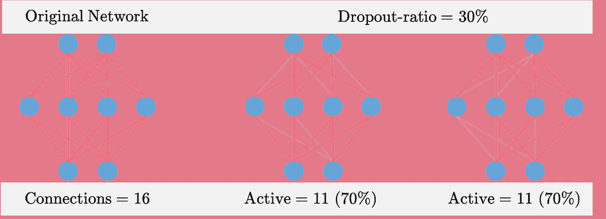
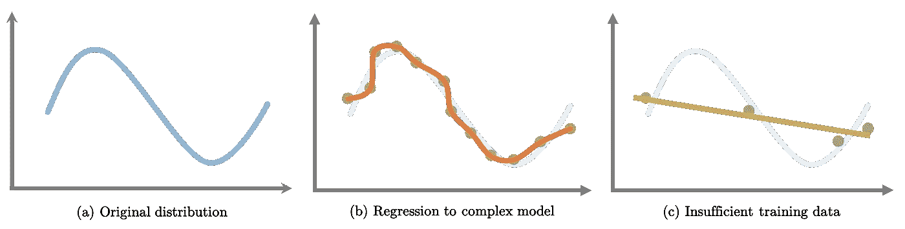
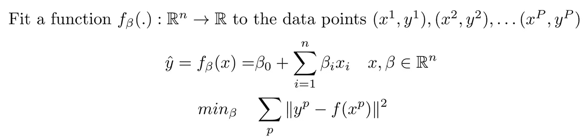
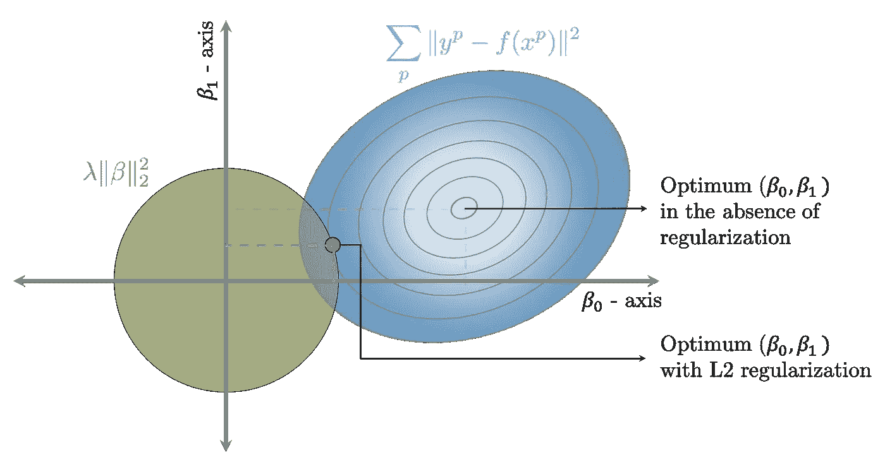
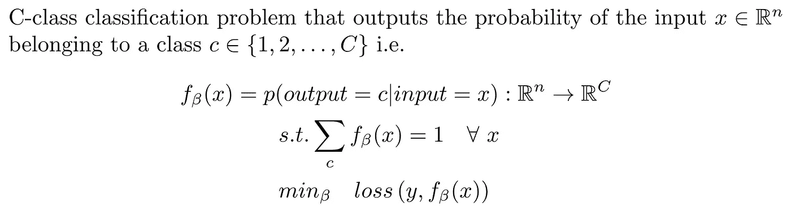
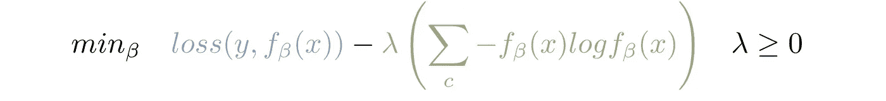
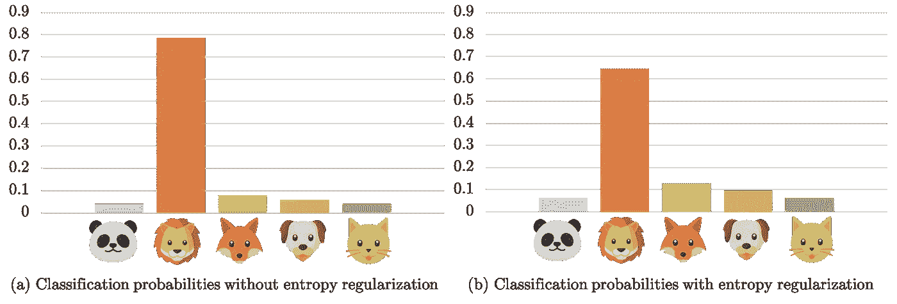
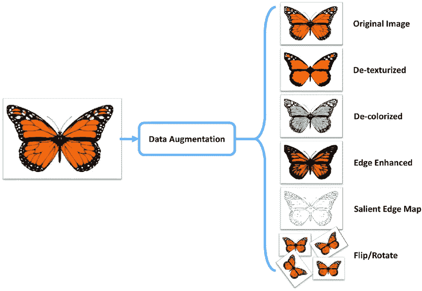
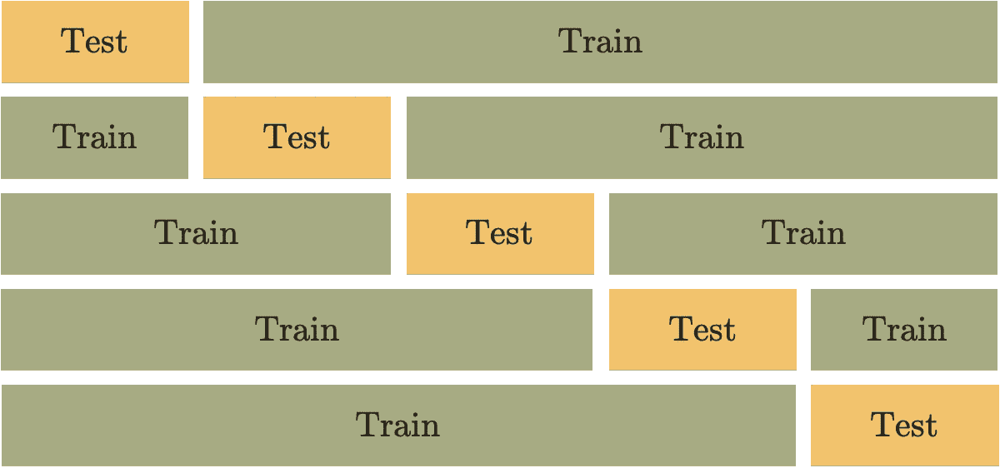
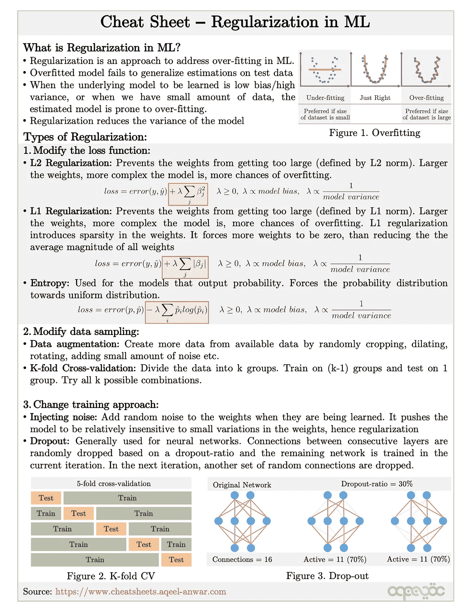

# 机器学习中的正则化类型

> 原文：<https://towardsdatascience.com/types-of-regularization-in-machine-learning-eb5ce5f9bf50?source=collection_archive---------3----------------------->

作者图片

机器学习正则化初学者指南。

在本文中，我们将介绍什么是正则化，我们为什么需要它，以及机器学习模型中常用的正则化的不同类型。

# 为什么要正规化？

正则化经常被用来解决机器学习中的过拟合问题。过度拟合的常见原因有

1.  当模型足够复杂时，它开始对训练数据中的噪声进行建模。
2.  当训练数据相对较小，并且不足以表示作为样本的基础分布时，模型无法学习可概括的映射。

机器学习中的过度拟合—作者图片

正规化有助于我们克服过度拟合的问题。

# 什么是正规化？

*正则化由不同的技术和方法组成，用于通过减少泛化误差而不太影响训练误差来解决过拟合问题。*为训练数据点选择过于复杂的模型通常会导致过度拟合。另一方面，更简单的模型会导致数据拟合不足。因此，在模型中选择合适的复杂度是至关重要的。由于模型的复杂性不能从可用的训练数据中直接推断出来，因此通常不可能偶然发现用于训练的正确的模型复杂性。

这就是正则化发挥作用的地方，使得复杂的模型容易过度拟合。

# 正规化的类型

基于用于克服过拟合的方法，我们可以将正则化技术分为三类。基于方法在解决过度拟合问题上的有效性，每种正则化方法被标记为强、中、弱。

## 1.修改损失函数

在这些正则化技术中，优化模型的损失函数被修改以直接考虑学习参数或输出分布的范数。我们有以下基于损失函数的正则化技术。

## a.L2 正规化(强):

考虑以下具有均方损失的线性回归问题。

在 L2 正则化中，我们修改损失以包括被优化的权重(β)的加权 L2 范数。这可以防止砝码变得过大，从而避免它们过重。

L2 正则化的修正损失-作者图片

常数λ(≥0)用于控制过拟合和欠拟合之间的折衷。当 lambda 较高(较低)时，模型倾向于欠拟合(过拟合)。

让我们考虑 2D 的情况(n=2 ),在这里我们可以在笛卡尔平面中可视化回归。下图在笛卡尔平面上绘制了损失函数的两个部分(MSE 损失和 L2 正则化)。L2 正则项被绘制成半径等于λ的圆。MSE 损失被绘制成等值线图，其中损失在椭圆上相等。求解上面显示的 L2 正则化损失的权重直观地意味着在绿色球内的 MSE 等值线(蓝色)上找到损失最小的点。增加 lambda 的值对应于绿球尺寸的增加。当λ增加超过某一点时，绿色球开始与实际的未调整的最小值点相交(在图中显示为“在没有调整的情况下的最佳β_ 0，β_ 1”)。这意味着增加λ超过这个值不会改变我们的解决方案。对于解决过度拟合问题的模型，选定的λ值必须在该λ值和 0 之间。

如上所示，求解 L2 正则化损失的权重直观地表示在位于 L2 球(绿色圆圈)内的 MSE 等值线(蓝色)上找到损失最小的点。

## b.L1 正规化(强):

在 L1 正则化中，使用权重的 L1 范数(绝对值),而不是在损失函数中使用权重的 L2 范数。修改后的损失变成

使用 L1 正则化修改损失-图片由作者提供

就像 L2 正则化一样，L1 正则化在 MSE 等值线图上找到位于单位范数球内的损失最小的点。L1 范数的单位范数球是一个带边的菱形。这可以在下图中直观地看到。

求解上面显示的 L1 正则化损失的权重直观地意味着在位于 L1 球(贪婪菱形)内的 MSE 轮廓(蓝色)上找到具有最小损失的点。

使用 L1 正则化子优于 L2 正则化子的另一个优点是 L1 范数倾向于导致权重的稀疏。这意味着，通过这样的正则化，权重β可能具有为零的元素。使用 L2 正则化的权重可以变得非常小，但是它们实际上永远不会变为零。

增加λ值会增加钻石的尺寸，减少实际的 MSE 损失。这意味着权重开始越来越好地拟合数据点，这可能导致过度拟合。与 L2 正则项类似，当λ非常高时，回归模型的未调节最小值与 L1 调节的最小值相同。

## c.熵正则化(强):

熵根据概率分布中的不确定性来量化概率分布。分布的不确定性越大，熵就越大。均匀分布的所有事件发生的概率相等，这意味着不确定性的数量最大，因此熵也最大。另一方面，看起来像脉冲的分布意味着，如果从这样的分布中抽取一个随机事件，我们知道它总是同一个。因此，这种看起来像脉冲的分布具有最小的熵。

当模型的输出是概率分布时，例如分类、策略梯度强化学习等，使用熵正则化。熵正则化器包括由λ缩放的输出分布的熵，而不是直接使用损失项中权重的范数。

考虑下面的分类问题。

损失函数通常是二元交叉熵或铰链损失。在熵正则化的情况下，损失函数被修改如下

熵正则化的修正损失—作者图片

因为我们希望输出概率有一定程度的不确定性，这意味着我们希望增加熵。由于我们正在减少损失，因此在损失函数中使用熵需要乘以-1。比例常数λ控制正则化。λ值越大，输出分布越均匀。

熵正则化的输出分布—作者图片

## 2.修改采样方法

这些方法有助于克服由于可用数据集大小有限而导致的过度拟合。这些正则化方法试图操纵可用的输入来创建实际输入分布的公平表示。以下是属于这一类别的两种正则化方法

## a.数据扩充(弱):

数据扩充包括通过随机裁剪、扩张、旋转、添加少量噪声等创建的更多输入来扩充可用数据集的大小，如下图所示。这个想法是人为地创建更多的数据，希望增加的数据集能够更好地表示潜在的隐藏分布。由于我们只受到可用数据集的限制，这种方法通常不能很好地作为正则化方法。

图片来源:[https://www.researchgate.net/publication/319413978](https://www.researchgate.net/publication/319413978)

## b.k 倍交叉验证(中等):

此方法用于创建多个经过训练的网络，然后选择泛化误差最小的网络。在从隐藏分布中采样的不可见数据集上，具有最小泛化误差的模型有望比其他模型表现得更好。

在 K-fold 交叉验证中，将可用的训练数据集分成 K 个不重叠的子集，并训练 K 个模型。对于每个模型，k 个子集之一用于验证，而其余(k-1)个子集用于训练(如下图所示)。该模型一旦被训练，就在拒绝验证子集上被评估，并且性能被记录。一旦训练了所有 K 个模型，并且记录了在拒绝确认子集上的性能，则选择具有最佳性能度量的模型作为最终模型。

五重交叉验证—作者图片

## 3.修改训练算法

正则化也可以通过以各种方式修改训练算法来实现。下面讨论两种最常用的方法。

## a.辍学(强)

当训练模型是神经网络时，使用退出。神经网络由多个隐藏层组成，其中一层的输出用作下一层的输入。后续层通过可学习的参数修改输入(通常通过将其乘以一个矩阵并添加一个偏差，然后添加一个激活函数)。输入流经神经网络层，直到到达用于预测的最终输出层。

神经网络中的每一层都由不同的节点组成。前一层的节点连接到后一层的节点。在丢弃方法中，连续层的节点之间的连接基于丢弃率(丢弃的总连接的百分比)被随机丢弃，并且剩余的网络在当前迭代中被训练。在下一次迭代中，另一组随机连接被丢弃。

dropout 方法确保神经网络学习一组更健壮的特征，这些特征对于所选节点的随机子集同样表现良好。通过随机丢弃连接，网络能够学习从输入到输出的更好的一般化映射，从而减少过拟合。辍学比例需要仔细选择，对学习模型有重大影响。丢弃率的一个较好值在 0.25 到 0.4 之间。

## b.注入噪声(弱)

与 dropout 类似，当正在学习的模型是神经网络时，通常使用这种方法。在这种方法中，我们篡改通过反向传播学习的权重，以使其对小变化更加鲁棒或不敏感。在训练期间，少量的随机噪声被添加到更新的权重中，这有助于模型学习更鲁棒的特征集。一组强大的功能可确保模型不会过度拟合训练数据。然而，这种方法作为正则化器并不十分有效。

# 摘要

正则化在机器学习中被用作通过减少所考虑的 ML 模型的方差来解决过度拟合的方法。正则化可以通过修改损失函数、采样方法或训练方法本身以多种方式实现。下面的备忘单总结了不同的正则化方法。

ML Cheatsheet 中的正则化—图像来源:[www.cheatsheets.aqeel-anwar.com](http://www.cheatsheets.aqeel-anwar.com)

# 奖金:

可以在下面的链接中找到这个主题和机器学习中许多其他重要主题的紧凑备忘单

<https://medium.com/swlh/cheat-sheets-for-machine-learning-interview-topics-51c2bc2bab4f>  

**如果这篇文章对你有帮助，欢迎鼓掌、分享和回复。如果你想了解更多关于机器学习和数据科学的知识，请关注我@**[**Aqeel an war**](https://medium.com/u/a7cc4f201fb5?source=post_page-----eb5ce5f9bf50--------------------------------)**或者在**[***LinkedIn***](https://www.linkedin.com/in/aqeelanwarmalik/)***上与我联系。***