# 不平衡航空影像语义分割的 U-Net 方法

> 原文：<https://towardsdatascience.com/u-net-for-semantic-segmentation-on-unbalanced-aerial-imagery-3474fa1d3e56?source=collection_archive---------3----------------------->

## 用于航空影像语义分割的 U-Net py torch 实现。

在这篇文章中，我们回顾了不平衡二进制掩码的语义分割问题。引入焦点损耗和 mIoU 作为损耗函数来调整网络参数。最后，我们训练 PyTorch 中实现的 U-Net 对航拍图像进行语义分割。训练代码和 PyTorch 实现可以通过 [Github](https://github.com/amirhosseinh77/UNet-AerialSegmentation) 获得。

# **数据集**

这里使用的数据集是“[航空影像语义分割](https://www.kaggle.com/humansintheloop/semantic-segmentation-of-aerial-imagery)”，包含阿联酋迪拜的 72 幅卫星影像，被分割成 6 类。这些类别包括水、土地、道路、建筑、植被和未标注。

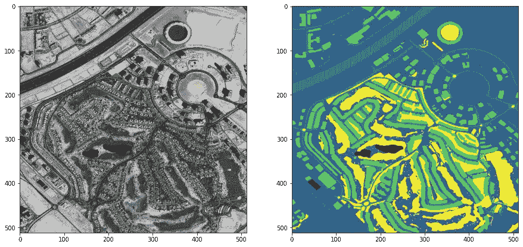

图一。[数据集](https://www.kaggle.com/humansintheloop/semantic-segmentation-of-aerial-imagery)的样本

# U-Net 神经网络

[U-Net](https://arxiv.org/pdf/1505.04597v1.pdf) 是一种卷积神经网络，最初由弗赖堡大学计算机科学系用于生物医学图像分割。它基于完全卷积神经网络，并具有修改和扩展的架构，以使用更少的训练图像并产生更精确的分割。

主要概念是使用一个收缩的网络，然后是一个扩展的网络，在扩展的网络中用上采样操作代替池操作。这些图层提高了输出的分辨率。此外，一个扩展的卷积网络可以学习根据编码信息组合一个精确的输出。

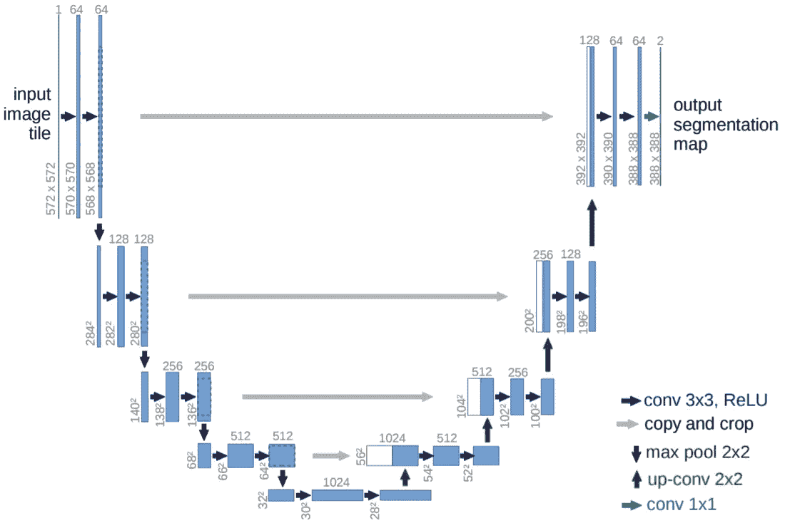

图二。Unet 结构(图片由 [U-Net](https://arxiv.org/pdf/1505.04597v1.pdf) 提供)

该网络由一条收缩路径(左侧)和一条扩张路径(右侧)组成，这使其具有 u 形架构。收缩路径是一个典型的卷积网络，由重复的卷积组成，每个卷积后面都有一个校正线性单元(ReLU)和一个最大汇集操作。在收缩期间，空间信息减少，而特征信息增加。扩展路径通过一系列上卷积和连接将特征和空间信息与来自收缩路径的高分辨率特征相结合。

# 损失函数

本文的目的是回顾损失函数对分割输出结果的影响。在训练过程中使用了三种不同的损失函数。但首先，让我们快速回顾一下。

让我们假设 p 是图像中每个像素的输出值。在这种情况下，我们可以将研究的损失函数定义如下:

## 交叉熵损失

交叉熵(或对数损失)计算输出的对数值，因为我们讨论的是图像，所以它是输出张量中每个像素的对数值。

阿尔法项是不同类别的权重超参数，是平衡不平衡类别损失的一种方式。加权交叉熵损失的最终等式如等式 1 所示。

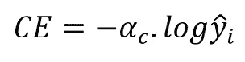

Eq 1。加权交叉熵损失

## 焦点损失

[焦损](https://arxiv.org/pdf/1708.02002.pdf)为不平衡数据集问题提供了更好的解决方案。它增加了一个额外的项，以减少正确预测的影响，并专注于不正确的示例。伽马是一个超参数，它规定了这种减少的力度有多大。

这种损失影响网络在不平衡数据集上的训练，并且可以改善分割结果。

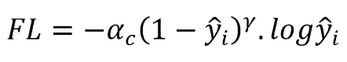

Eq 2。焦点损失

## 借据损失(Jaccard 指数)

最后，我们得到 IoU 损失，这是不平衡分段的另一个选项，它比其他选项具有更少的超参数。但首先，让我们熟悉一下等式 3 中的这个度量。

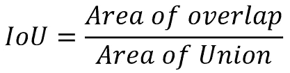

Eq 3。并集上的交集

在等式中，命名者是预测的和基本事实掩码之间的重叠，分母是它们的联合。IoU 的计算方法是将这两个数字相除，数值越接近 1 表示预测越准确。

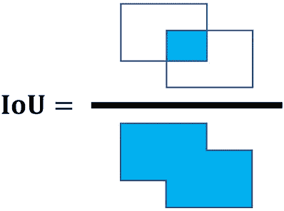

图三。IoU(图片由作者提供)

优化的目的是最大化 IoU，其值介于 0 和 1 之间，因此损失函数定义为:

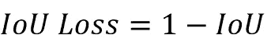

Eq 3。欠条损失

# 培训和结果

我在提到的数据集上用所有三个损失函数训练了 U-Net。需要注意的是，只有 65 张图片用于训练，7 张图片用于验证，所以我们不能期望有很好的结果。但是这个数据数量对于我们的目的来说已经足够了。

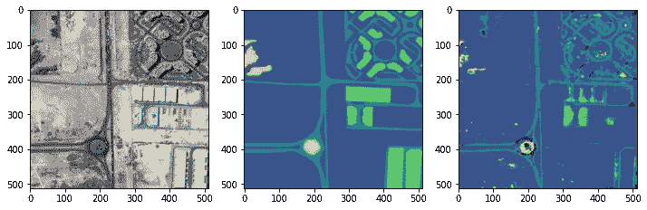

图 4。使用**交叉熵损失**的分割结果(图片由作者提供)

如你所见，交叉熵在分割小区域方面有问题，并且在这些损失函数中性能最差。

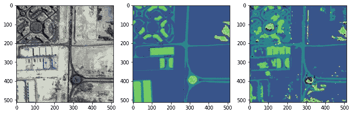

图五。使用**聚焦损失**的分割结果(图片由作者提供)

焦损可以达到更好的效果，尤其是在小区域，但是仍然需要通过试错进行一些超参数调谐。

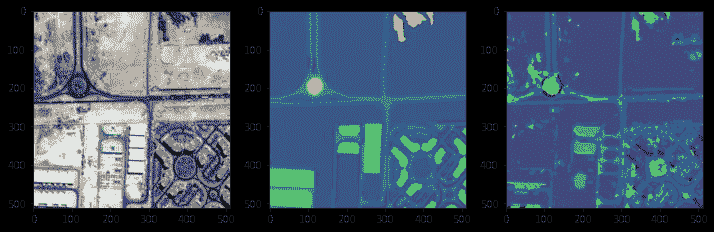

图六。使用 **IoU loss** 的分割结果(图片由作者提供)

最后，我们可以看到，无论是小区域还是大区域，IoU loss 在分割方面也非常出色。

这里您可以看到一些其他输出:

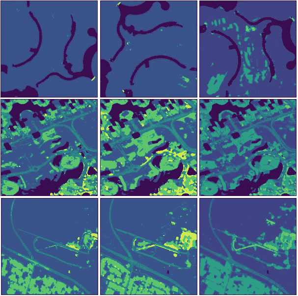

图六。左边是交叉熵，中间是焦损，右边是 IoU 损(图片由作者提供)

# 结论

本文综述了损失函数对不平衡图像分割的影响。我们训练 U-Net 神经网络使用 3 种不同的损失函数，交叉熵损失、焦点损失和 IoU 损失来执行语义分割航空图像。

结果表明交叉熵损失不能处理不平衡的数据集。即使是针对不同的阶层增加权重也不是很有效。另一方面，焦点损失和 IoU 损失都代表不平衡图像分割的更好结果。

也可以参考 [GitHub](https://github.com/amirhosseinh77/UNet-AerialSegmentation) 页面访问项目和 PyTorch 实现。