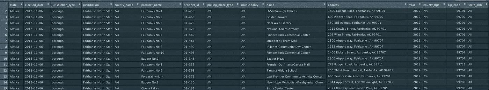
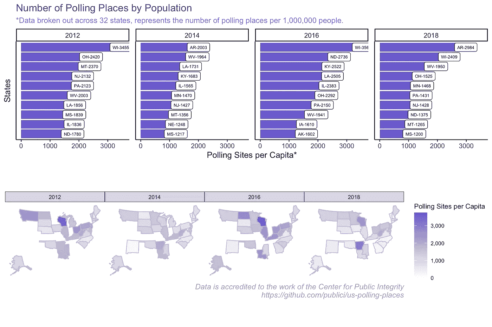
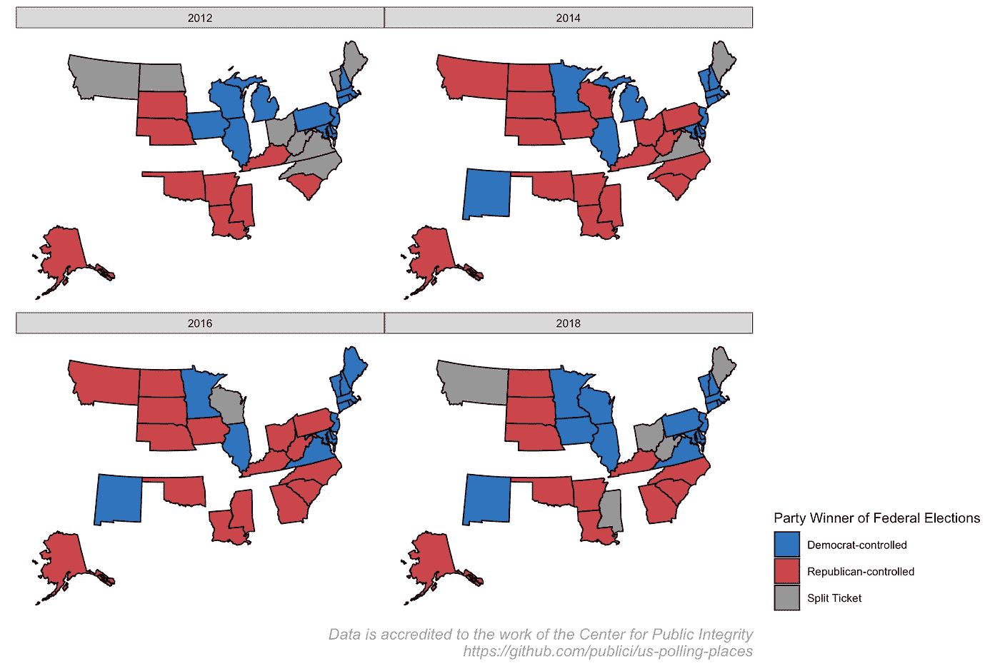
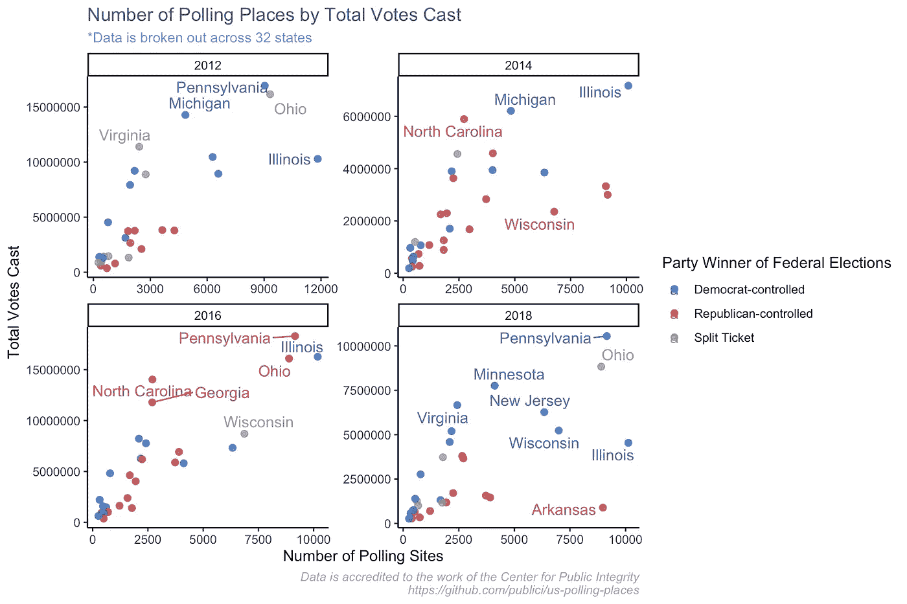
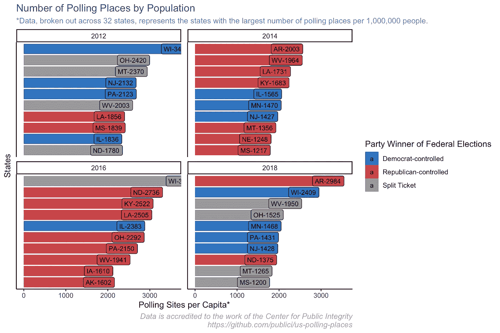
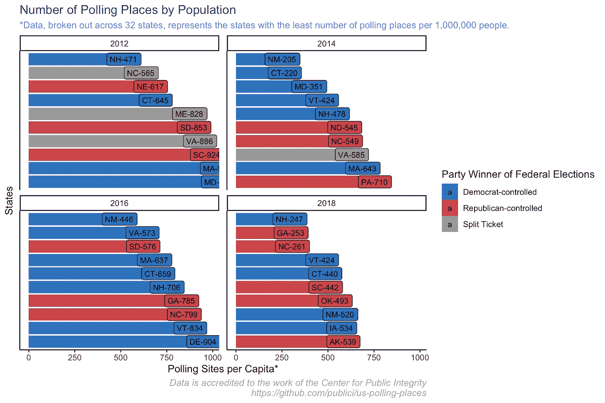
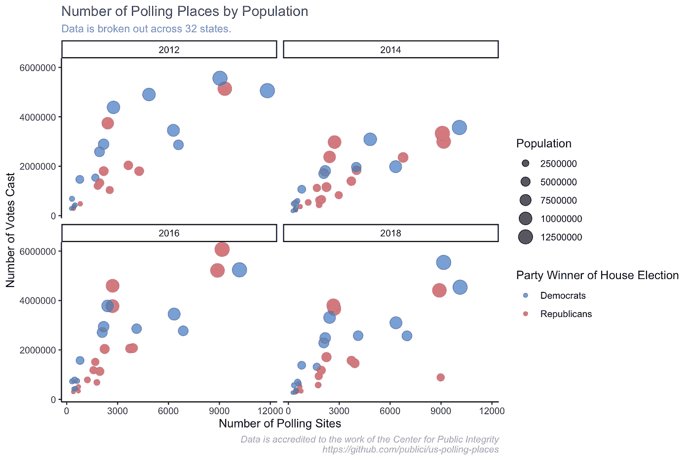
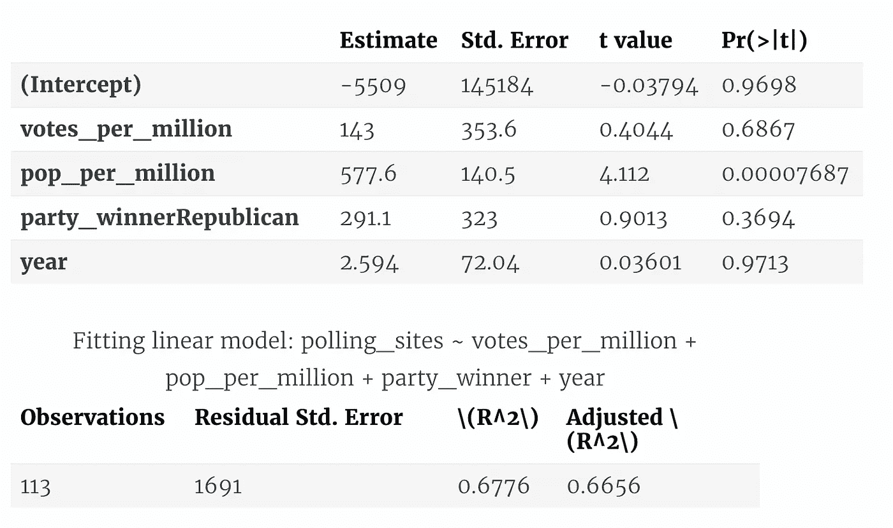

# 美国投票站

> 原文：<https://towardsdatascience.com/u-s-polling-places-389ca5ed7960?source=collection_archive---------66----------------------->

## R 中的探索性数据分析

由 [Unsplash](https://unsplash.com?utm_source=medium&utm_medium=referral) 上的 [Element5 数码](https://unsplash.com/@element5digital?utm_source=medium&utm_medium=referral)拍摄

在民主国家，投票站不仅仅是一个不知情的公民在临时搭建的投票站填写一张纸上的泡泡的地方。它是民主承诺的象征，是公民和政府之间的连接器。如果受到保护和尊重，这就是一个民主国家的力量所在。

这篇文章通过分析由[公共诚信中心](https://publicintegrity.org/politics/elections/ballotboxbarriers/data-release-sheds-light-on-past-polling-place-changes)编辑的美国投票站数据集来分析美国民主的象征。由于 CPI 所做的大量工作，2012 年、2014 年、2016 年和 2018 年选举的 30 多个州的投票站位置和地址信息已经公布。我将使用各种探索和建模技术来分析数据，以回答以下问题:

*   哪些州提供最多的投票站？
*   随着时间的推移，投票点的数量趋势如何？
*   投票点的数量和每个州的人口数量成正比吗？
*   倾向于共和党的州比倾向于民主党的州有更少的投票点吗？

我们先来看一下数据。

在数据集中，我们可以看到相当多的信息！每行对应于给定选举中的一个投票点。因此，2012 年在阿拉斯加费尔班克斯的 FNSB 市政办公室有一个投票站。对于每个投票点，我们可以看到一些感兴趣的东西，包括站点的位置、在该州选举中投票的人数(不是在该站点投票的人数)、该州的人口，等等。

利用这些数据，让我们试着理解每个州投票点数量的趋势。我们先来看看投票站的数量和每个州的人口之间的关系。

随着人口的增加，投票站的数量也在增加。无论是总统选举(2012 + 2016)还是众议院/参议院选举(2014 + 2018)，这一趋势在每次选举中都是如此。

让我们更好地看看哪些州的投票点比总人口(人均比率)多。

在上面，我用一个柱状图展示了前 10 个州的人均投票网站，并在地图上显示了同样的情况。虽然各州的人均投票站数量没有太大的地理差异(CPI 只收集了 32 个州的数据，这肯定会有所伤害)，但我确实注意到，东北和南方的数据并没有发生倾斜，这是我最初的假设。同样明显的是，各州在总统选举年委托的公共投票站比非选举年多。

# 选举相关性

在下一节中，我将利用选举数据来研究一个州的投票点数量与哪个政党赢得该州选举之间的关系。我使用的选举数据来自 FEC.gov 的 T2。在这些数据中，我查看了 2012 年至 2018 年期间每次大选的众议院、参议院和总统竞选的党派细分以及总票数，并使用这些数据与投票站数据进行匹配。

我将通过确定一个新的变量来做到这一点，该变量由一个政党在给定州赢得的总选举数来定义。例如，如果在新泽西州 2018 年，民主党赢得了众议院和参议院的竞选，民主党控制了新泽西州的选举年。如果在威斯康星州，一名共和党人(特朗普)赢得了 2016 年的总统选举，但民主党人总体上赢得了众议院的竞选，那么这是一个“分裂票”州。

让我们从了解这个新变量开始。在过去的 4 次选举中，哪个政党赢得了每个州的选举？

现在我们更好地理解了这个变量是如何工作的，让我们将它与该州可供选民使用的投票站数量联系起来。现在我们有了数据集，我们将根据总投票数构建 4 个投票点散点图(每年一个)。

让我们再来看看之前的前 10 项，看看哪一个政党赢得了某个州是否有关联。

有趣的是，在我们的数据集涵盖的最著名的选举中——2016 年的选举——最终成为完全共和党的州人均拥有最多的投票站。2016 年人均投票站最多的州——威斯康星州——值得注意的是，它支持特朗普，这让希拉里竞选团队非常惊讶。

老实说，这一发现让我有点惊讶，尤其是考虑到共和党各州竭力让个人投票变得更加困难的言论。显然，这并不能说明全部情况。仅仅因为*有更多*投票点并不意味着*可以进入*，或者有很多人*有资格*投票(因为选民登记过程中的困难)。不过，这是一个有助于理解更全面情况的指标。

让我们看看我们“最差”的 10 个州，看看这一趋势是否会逆转。

看看垫底的投票点会让争论变得更加混乱。总的来说，这是一个更健康的州组合，完全由民主党人和共和党人组成(同时也有相当一部分州的结果有好有坏)。

让我们仔细看看我们的 **House** 比赛。具体来说，让我们把之前讨论的三个度量结合起来:
1。投票站数量
2。投票数
3。总人口

就趋势而言，我看不出共和党和民主党赢得众议院的州有什么不同。让我们用回归来正式测试一下。特别是，让我们拟合一个众议院选举的回归模型，使用政党、投票人数和人口作为预测因素。根据上面的图表，我们期望看到投票人数、人口和投票点数量之间的高度相关关系。真正的问题在于党。

以下是运行基本回归的结果:

polling _ sites ~ votes _ per _ million+pop _ per _ million+party _ winner+year

查看模型摘要，对于给定州中投票站点数量的趋势，有一些有趣的事情需要指出。

1.  **人口|** 需要注意的最重要的一点是**只有一个因素可以充分预测投票站的数量:人口**。该模型表明，一个州每增加*百万人口，就会有 577 个额外的投票站。*
2.  **总投票数|** 现在，如果你回头看看上面的气泡图，你可能(和我一样)会认为总投票数也是投票站点数量的一个强有力的预测因素。当一个增加时，另一个也增加。那么，为什么 p 值(*在模型输出中表示为 PR( > |t|)* ) .6867 —比通常用于确定统计显著性的. 05 阈值高得多？嗯，总票数与一个州的人口高度相关也是事实。人口多的州自然会有更多的人出来投票。因此，使用这两个特征作为预测是多余的。
3.  **Party |** 我们一直在等待的问题。在某个州赢得众议院选举的政党确定了该州的投票站数量，这是真的吗？事实证明，并不尽然。**政党赢家**(表示为 *party_winnerRepublican* ，代表一个州成为共和党的基本情况)**的 p 值是. 3694，远高于通常的阈值. 05** 。因此，我们不能拒绝我们最初的零假设，即政党获胜者预测投票站的数量。

# 未来分析

这篇文章实际上只是对选举的一个方面的一个小小的观察:投票站。这篇文章还应该放在哪里？嗯，如果我能得到更小的县级选举数据，甚至更细的选举数据，我就可以在一个更强大的数据集上运行许多以前的分析。不幸的是，这些数据非常昂贵。

否则，此分析的一个好方法是将投票地点的可用性与邮政编码或县一级的人口统计数据进行比较。这里的假设是，美国白人有更好(即更多)的机会进入投票站。

我还应该带着这个去哪里？请在评论中留下你的想法。

*原载于 2021 年 1 月 26 日*[*https://data cracy . netlify . app*](https://datacracy.netlify.app/post/2021-01-26-polling-places-exploratory-data-analysis/)*。*