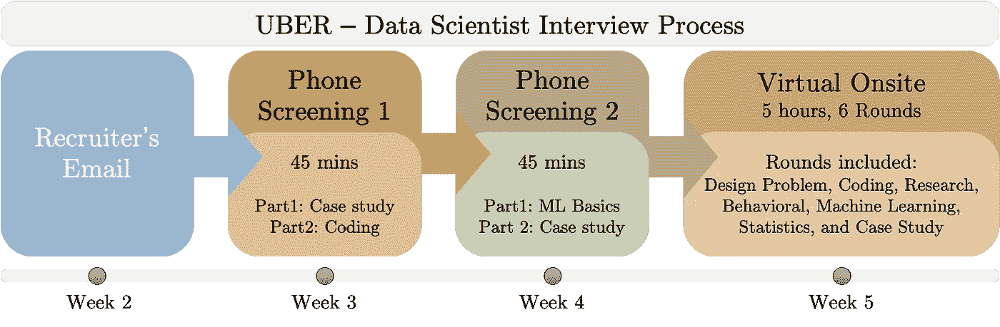

# 优步数据科学家面试经历

> 原文：<https://towardsdatascience.com/uber-data-scientist-interview-experience-78305114540c?source=collection_archive---------3----------------------->

[Firmbee.com](https://unsplash.com/@firmbee?utm_source=medium&utm_medium=referral)在 [Unsplash](https://unsplash.com?utm_source=medium&utm_medium=referral) 上拍照

## 从招聘人员的电子邮件到现场面试，面试过程的详细时间表

在本文中，我将讲述我面试优步旧金山办公室数据科学家职位的经历。我将从我的教育/研究背景开始，然后进入面试过程和我的经历。在整篇文章中，我会尽量在需要的地方用类似的问题替换原来的问题，保持问题的主旨和性质不变，让读者清楚地了解所提问题的类型。

# 我的背景

在我进入细节之前，我想浏览一下我的个人资料。我是佐治亚理工学院电气和计算机工程的博士生，从事节能机器学习系统的设计。在我采访优步的时候，我已经发表了 8 篇文章，获得了 2 项专利，并且一直积极参与开源工具。更多细节可以在我的 [LinkedIn](https://www.linkedin.com/in/aqeelanwarmalik/) 个人资料中找到。

优步数据科学家采访时间表和流程—图片由作者提供

# 应用

在过去的几个月里，我一直在积极申请机器学习的工作。我的主要申请来源是 LinkedIn。我通过 LinkedIn 申请了优步*数据科学家*的职位。工作职责包括为现实生活中与优步莱德和优步 Eats 相关的挑战性问题实现 ML 算法。

# 招聘人员的电子邮件

两周内我收到了招聘人员的邮件。招聘人员询问我是否有空，并提供了一份详细的文件，提到了面试时间表和有用的资源。这份文件对我很好地理解面试过程很有帮助。

# 电话屏幕 1:

我有两个相隔十天的电话筛选。每次放映都是 45 分钟的视频采访，并遵循相同的格式。在前 5 分钟，面试官介绍了他/她自己。接下来是我的介绍和我的简历。第一次电话面试由两部分组成

*   **案例研究:**案例研究由一个类似于 UberEats 的相关开放式问题组成。采访者和我讨论了问题的各个方面，如理解目标、收集数据、进行探索性数据分析、扩展系统、问题的重要 KPI、底层机器学习解决方案、部署解决方案以及将其集成到现有系统中。这个案例研究的目的是评估我处理大规模机器学习问题的方法。
*   **编码:**第二部分由通过 CodeSignal 的中等编码问题组成。我被要求选择我喜欢的语言。面试官解释问题的时候很明确。我能够在给定的时间内最佳地解决这个问题。

最后面试官问我有没有问题。我们就他在优步的工作职责进行了很好的讨论。

# 电话屏幕 2:

我在 3 天后听到了我的第一次电话面试反馈，我的下一次电话面试被安排在一周内。与第一次面试相似，这次面试有两个部分

*   **机器学习基础知识:**面试官问了一些与机器学习相关的基础到中级问题，如反向传播、图形 ML、集成方法、消失梯度、精确度与召回率、偏差-方差权衡等。在下面有用的链接中可以找到对这些主题的很好的理解

 [## 机器学习面试主题的备忘单

### ML 面试的视觉备忘单(www.cheatsheets.aqeel-anwar.com)

medium.com](https://medium.com/swlh/cheat-sheets-for-machine-learning-interview-topics-51c2bc2bab4f) 

*   **ML 案例研究:**与第一次访谈类似，讨论了与 UberEats 相关的开放式案例研究。与第一次面试相反，这次的案例研究要复杂得多，而且更加面向机器学习和统计。我被要求为一个相关的基于产品的问题设计一个基于 ML 的解决方案。面试官每一步都问了相关的细节问题。讨论从简单的逻辑回归模型开始，到稍微复杂的 SVM 和决策树，最后到甚至复杂的图 ML 模型。我们还讨论了可用数据集的重要特征以及如何使用它们来解决问题。

同样，面试官非常友好，并确保面试环境对我来说足够舒适。

# 现场

现场面试包括 6 轮，总时间为 5-6 小时，中间有两次 15 分钟的休息时间。他们给了我足够的时间来解释我的答案，让我感到受欢迎。他们首先介绍了自己并描述了他们的工作职责，让我轻松地进入了这个过程。没有一个面试官分心，完全专注于我要说的内容。根据所提问题的性质，我将这六轮问题归为以下几类。

## 1.设计问题

这次采访包括一个开放式的案例研究，与设计一个网上杂货店有关。我带着面试官走过了数据收集、探索性数据分析、特征选择、特征转换、机器学习模型选择、训练模型、选择正确的 KPI 来分析绩效的过程。这一轮更加关注大局。面试官感兴趣的是我对问题的高层次理解，而不是算法的技术细节。我们还讨论了一些与业务相关的 KPI 来衡量问题的解决方案。

## 2.编码:

编码面试的重点是我对统计学的理解。面试官让我做一个涉及假设检验的问题。由于我习惯了与现实世界问题相关的 LeetCode 类型的问题，这个编码问题给了我一段艰难的时间。我花了一些时间才明白面试官想要我实现什么。当我陷入困境时，面试官给了我一些提示。这个编码问题有多个后续编码问题。可以在下面找到对该部分的很好理解

 [## 如何回答一个编码面试问题？

### 帮助您回答编码问题的分步指南。

towardsdatascience.com](/how-to-answer-a-coding-interview-question-1613776358e)  [## 编码面试的七(7)个基本数据结构和相关的常见问题

### 用动画可视化的重要数据结构

towardsdatascience.com](/seven-7-essential-data-structures-for-a-coding-interview-and-associated-common-questions-72ceb644290) 

## 3.研究

现场的这一部分完全由我以前的研究经验组成。面试官让我解释我的博士研究，问了一些后续问题。这部分更多的是讨论。面试官仔细查看了我的简历，并就我提到的项目问了一些相关问题。他让我接一个研究项目，详细说明目标、挫折和最终结果。

## 4.行为:

面试官问了我一些问题，关于我读博士的经历，我实习的经历，还有一个机器学习工程师。这些问题围绕着我的领导能力、时间管理、按时完成任务、与难相处的同事相处以及解决冲突。对这些问题的理解可以在下面找到

 [## 如何准备行为/软技能面试？

### 用备忘单准备数据科学行为面试的有组织指南。

towardsdatascience.com](/how-to-prepare-for-a-behavioral-soft-skills-interview-cheat-sheet-9347aaeaef82) 

## 5.机器学习/统计:

这部分是与优步的一个产品相关的开放式讨论。这个问题是作为一个案例研究提出的，采访者对我处理这个问题的 ML 方法最感兴趣。我们从一个非常基本的 ML 解决方案开始，讨论了这种非常简单的方法在现实生活中会失败，然后转向更复杂的解决方案。在整个采访中，我们讨论了各种 ML 概念，以及如何改变一些事情来解决与 ML 管道相关的问题。还讨论了诸如图 ML 模型、嵌入、损失函数等主题。

一些相关的主题可以在下面的链接中找到。

 [## 机器学习中的正则化类型

### 机器学习正则化初学者指南。

towardsdatascience.com](/types-of-regularization-in-machine-learning-eb5ce5f9bf50) 

## 6.案例研究:

这类似于设计问题和机器学习/统计，但是考虑中的优步产品是不同的。面试官感兴趣的是我对设计给定问题的解决方案的高度理解，以及当扩展到更大的数据集时，我将如何设计解决方案。案例研究有点类似于 FAANG 公司的设计问题。

# 总结:

总的来说，我在优步的采访经历非常好。面试官专注于我要说的内容，给了我充足的时间来解释我的答案。面试主要集中在设计问题/案例研究，机器学习概念，编码问题，以及我的研究背景。我发现以下资源在准备面试时很有用。

## 优步工程博客:

1.  [https://eng.uber.com/uber-eats-recommending-marketplace/](https://eng.uber.com/uber-eats-recommending-marketplace/)
2.  https://eng.uber.com/uber-eats-query-understanding/
3.  【https://eng.uber.com/uber-eats-graph-learning/ 
4.  [https://eng . Uber . com/women-in-data-science-move-the-world-with-data/](https://eng.uber.com/women-in-data-science-moving-the-world-with-data/)
5.  [https://www.uber.com/us/en/marketplace/](https://www.uber.com/us/en/marketplace/)
6.  [https://eng . Uber . com/making-a-real-world-impact-with-data-science/](https://eng.uber.com/making-a-real-world-impact-with-data-science/)
7.  [https://eng . Uber . com/米开朗基罗-机器学习-平台/](https://eng.uber.com/michelangelo-machine-learning-platform/)

## 案例研究/设计问题的重点:

*   **可扩展解决方案:**优步拥有超过 9000 万活跃用户，是一家非常重视可扩展解决方案的公司。每当回答案例研究或设计问题时，确保你的解决方案
*   以顾客为导向的方法:优步直接与人打交道。顾客是普通大众。因此，您的解决方案应该更加重视让客户的生活更轻松。应该在考虑用户体验的情况下修改设计问题。
*   **业务关键绩效指标:**最后，优步的最终目标是创收。你的解决方案应该关注用户保持、用户流失、新用户、乘客数量、优步 eats 的订单数量、优步 eats 新增的餐厅等。扪心自问，这些指标最终会如何影响产生的收入？

如果你有一个与优步的面试，我希望这篇文章能帮助你。

**如果这篇文章对你有帮助，或者你想了解更多关于机器学习和数据科学的知识，请关注**[**【Aqeel an war】**](https://medium.com/u/a7cc4f201fb5?source=post_page-----78305114540c--------------------------------)**，或者在**[***LinkedIn***](https://www.linkedin.com/in/aqeelanwarmalik/)***或***[***Twitter***](https://twitter.com/_aqeelanwar)***上联系我。***