# 优步·H3 用 Python 进行数据分析

> 原文：<https://towardsdatascience.com/uber-h3-for-data-analysis-with-python-1e54acdcc908?source=collection_archive---------2----------------------->

> **编辑 2023-3 月**:自从写这篇文章的时候(H3 v3)，H3 v4 已经发布了和这篇文章中提到的那些有不同函数名的。你可以安装 v3 来跟随这篇文章，或者安装 v4 来查看[的变更日志](https://github.com/uber/h3/blob/master/CHANGELOG.md#400---2022-08-23)和[的相关文章](https://medium.com/foursquare-direct/introducing-h3-version-4-0-0-c60eb2fffaaa)，并按照它们在这篇文章中出现的那样进行修改。

如果你曾经玩过[文明 VI](https://en.wikipedia.org/wiki/Civilization_VI) 或者[卡坦岛](https://en.wikipedia.org/wiki/Catan)的定居者，你可能会注意到棋盘地图是规则的六边形。这是一种著名的游戏设计技术，称为 [Hex Map](https://en.wikipedia.org/wiki/Hex_map) ，用于棋盘游戏如六角象棋和视频游戏如帝国锻造。这是游戏的自然特征，因为这些地图为游戏带来了很多优势，尤其是在移动和平铺方面。

如果我们用一层六边形重新建模我们自己的地图，这种设计在现实世界中被证明是有用的，会怎么样？也许我们可以找到一些可以用这种模型解决的实际业务问题。优步·H3 出场了。

# 为什么是 H3 和六角形？🌏

目前，有多种方法可以分析与地图相关的数据。最基本的方法之一是绘制一个坐标列表，看看密度和集群出现在哪里。

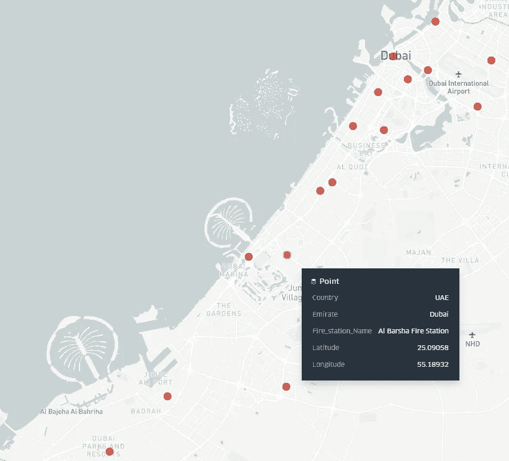

[阿联酋迪拜的消防站位置](http://data.bayanat.ae/en_GB/dataset/dubai-civil-defence-fire-stations/resource/c877382c-a545-482a-9cf4-72f8bb033542)

分析个别点有一定的弊端。对于某一区域内的点，没有明确的分类形式，我们通常希望进行的分析可能是区域式的或区域性的。

如果我们有一个网格系统，其中点可以包含在某个围栏内，并且我们分析网格本身的行为来表示下面所有点的行为，这将会有所帮助。这意味着每个网格代表其下方点的数据。另一个问题是，当直接使用点时，虽然人类可以看到地图并注意到数据聚集的位置，但对于计算机系统来说，计算成本可能会更高。计算机需要计算相邻点的距离，以便将它们组合在一起，从而获得与人类相同的视觉洞察力。

然而，对于地理定位数据，坐标点是尽可能细的，所以现在还不要忽略它们。我们只需要找到一个网格框架，我们或计算机可以围绕它查看地理空间数据，并从中获得洞察力。

更局部地使用网格系统的一种常见形式是在城市中定义区域，通过在一个街区、城市、地区或国家上画出一个形状。行政和政治边界虽然有助于将地理空间分析划分为现实区域，但在许多方面仍可能存在问题。在一个城市中，有些区域可能比其他区域大，并且两个或更多区域之间可能会有重叠。此外，**从数学/绝对的角度来看，以这种形式定义区域是非常随意的**。**可以根据自然特征、人口、经济等来定义区域或地区。并且随着时间的推移会发生变化。**

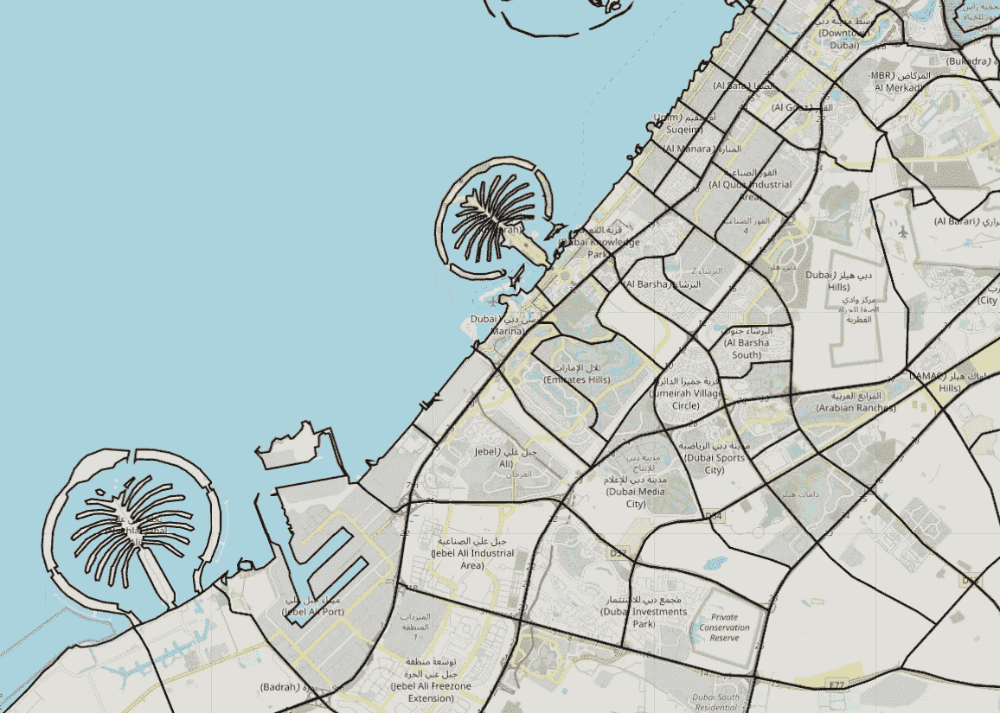

GADM 学术数据库的阿联酋地理包第三层[中定义的阿联酋迪拜区域](https://gadm.org/download_country_v3.html)

使用统一网格系统的一个绝对方法是用重复平铺的方法覆盖地球。假设我们想要有规律地、完全地平铺我们的平面，**我们需要选择一个形状，这个形状作为一个积木来促进完全平铺**。**该形状需要闭合并均匀重复**。我们的候选形状是三角形(3 条边)、正方形(4 条边)和六边形(6 条边)。

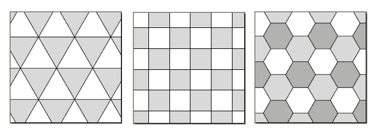

[https://plus.maths.org/content/trouble-five](https://plus.maths.org/content/trouble-five)

这里没有正确的答案，因此选择其中之一取决于您的用例。在优步，我们最受欢迎的用例之一是确定乘车和送货的距离。

> 使用六边形作为细胞形状对 H3 至关重要。 [**六边形在六边形的中心点和它的邻居**](http://eng.uber.com/h3)**’**之间只有一个距离，相比之下，正方形有两个距离，三角形有三个距离。该属性极大地简化了梯度上的分析和平滑。

除了距离，选择一个六边形作为基础形状通常是个好主意，因为[六边形是最好的！](https://www.youtube.com/watch?v=thOifuHs6eY)；)

# 关于 H3 ⚫️

H3 是由优步用 C 语言开发的开源框架。在其核心，H3 是一个地理空间分析工具，提供了一个六边形，层次空间索引，以获得从大型地理空间数据集的洞察力。H3 的积木是不同大小的正六边形。这些多边形分布在地球地图从极点到极点的整个投影上。这意味着地球上的任何位置都可以归属于一个 H3 六边形，精确到 0.0000009 公里的区域。

想象它是地球上的一个层，其中层的每个单元是一个六边形，每个六边形都有一个唯一的 ID，可以非常快速地执行地理空间计算。每个 H3 六边形可以被认为是它自己的对象，每个对象都可以在给定 ID 的情况下在很短的时间内被访问。

# H3 决议📷

**H3 的一个核心优势是它用不同大小的六边形**覆盖了整个世界。这意味着图层的分辨率可以根据正在解决的问题进行调整，例如上下缩放整个格网。如下表所述，H3 总共包含 16 个分辨率，每个分辨率都有一定数量的六边形，这些六边形作为一层跨越整个地球，从最高层的 122 个六边形到最底层的大约 500 万亿个六边形。每一层由更细粒度的六边形组成，每一层的每个六边形都有自己唯一的 ID。

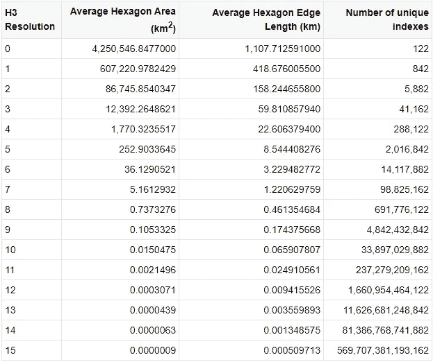

[H3 决议](https://h3geo.org/docs/core-library/restable)

H3 通过十六进制格式(16 位，因此 16 种分辨率)定义其索引，因此通过查看单元的 ID 可以立即确定单元分辨率。不同大小的六边形的分层方式赋予了 H3“层次”的力量。每个低分辨率六边形包含一组较高分辨率的子六边形。分辨率的每个六边形都可以有共享同一组父六边形的同级六边形。这些层本质上定义了一个六边形树，最后一层(分辨率)包含 500 万亿个兄弟。

值得看看这款[笔记本](https://observablehq.com/@four43/h3-index-visualizer)。分辨率可以相应调整，六边形可以在整个地球上看到。

# H3 函数🔩

你可以在这里找到一些在 C 语言中直接使用 H3 函数的例子。我们将使用与 Python 编程语言绑定的 H3 库，因为用 Python 分析数据相对更容易。

```
pip install h3
```

假设你有一个坐标点，或者一个坐标列表。您可以使用以下函数获取每个点的 H3 指数:

```
h3.**geo_to_h3(** *lat*=25.32,
    *lng*=55.46,
    *resolution*=7 **)**
```

如果以字符串表示的索引有效，则获取 H3 索引的分辨率

```
h3_result = lambda id_str: h3.**h3_get_resolution(**id_str**)** if h3.**h3_is_valid(**id_str**)** else Noneh3_result('8843a13687fffff')
```

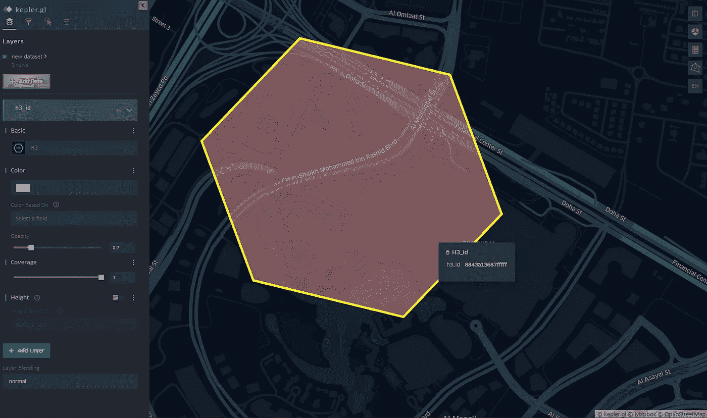

上面片段中的 H3 指数用[开普勒可视化了。GL](https://kepler.gl)

让我们尝试一个完整的函数，在给定 H3 指数的情况下，返回一组 H3 属性

H3 的另一个有用的功能是它能够快速返回索引的 k 近邻。这意味着对于 k =1，返回六边形的第一级邻居，对于 k = 2，返回第二级邻居(或邻居的邻居)，以此类推。

```
h3_id = "*8843a13687fffff*"
h3.**k_ring(**h3_id,1**)**
h3.**k_ring(**h3_id,2**)**
h3.**k_ring(**h3_id,10**)**
```

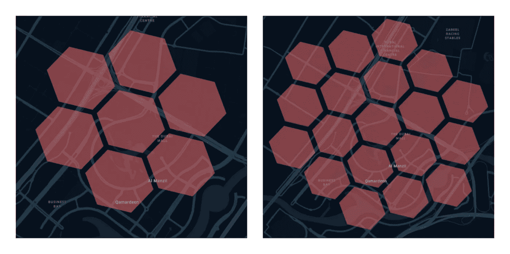

六角形 ID: 8843a13687fffff 中用于 1 和 2 的 k 形圈

# 可选 Sprinkles:用地图数据填充六边形📍

现在我们有了一些绝对的方法来定义地球上的网格，这将适合我们开始为六边形分配真实世界的细节。这是因为尽管给了我们一个 H3 指数和它的形心坐标，我们并没有太多关于这个六边形所代表的物理位置的信息。

扩展 H3 功能的一种方法是将其与包含地面信息的地图 API 结合在一起。常见的选择有[谷歌地图 API](https://developers.google.com/maps/documentation) 、 [Mapbox API](https://docs.mapbox.com/api/overview/) 和[提名](https://developer.mapquest.com/documentation/open/nominatim-search/)。这些服务允许我们为每个六边形分配更多有用的地理信息。

一个常见的功能是*反向地理编码*，这是一种通过查找将给定坐标转换为物理文本地址的技术。让我们使用[Google Maps Client for Python](https://github.com/googlemaps/google-maps-services-python/blob/master/googlemaps/geocoding.py)找到 H3 指数质心的反向地理编码结果。


反向地理编码六边形-工具提示包含地理信息

# 聚合填料🌐

**如果 H3 包含跨越整个地球的不同分辨率的六边形，那么如果您想选择这些六边形中的一小部分来代表一个国家、城市或社区，该怎么办？**

[多边形填充函数](https://h3geo.org/docs/api/regions)用 H3 六边形填充多边形。地理围栏是在地图上展开的多边形。城市中的区域或乡村形状可以被建模为地理围栏。地理围栏通常用 [Geo-JSON](https://en.wikipedia.org/wiki/GeoJSON) 文件或[形状优美的多边形](https://stackoverflow.com/questions/30457089/how-to-create-a-shapely-polygon-from-a-list-of-shapely-points)来表示。形状良好的多边形的 WKT 示例(众所周知的文本表示):

```
**POLYGON** ((*55.13977696520102 25.09805053895709*, 55.14002932545401 25.09743871100549, 55.1407574981263 25.0972787358399, 55.14123332293791 25.09773058763684, 55.14098097073993 25.09834242241949, 55.14025278567518 25.09850239857415, *55.13977696520102 25.09805053895709*))
```

顾名思义，WKT 是多边形顶点的文本表示。请注意多边形中的第一组坐标和最后一组坐标是如何相同的(如代码块中突出显示的)。这是一个封闭的多边形。

多边形的每个“点”对象可以是(lat，lng)或(lng，lat)的形式。后者通常是面的 Geo-JSON 表示，因为 Geo-JSON 规范要求经度首先出现在点对象中。

shapely 面对象需要从 WKT 中提取，WKT 是 shapely 面的一个属性，如下所示:

*loads* 函数从其 WKT 表示中解析出并构建一个形状优美的多边形。

我已经采取了 H3 六边形自己的 WKT 在这里，但你可以得到几乎任何多边形的 WKT。另一点需要注意的是，该形状没有对地图的引用。这是因为我们需要一个底图来绘制我们的多边形，作为一个图层。

让我们用一整个城市的地理围栏，比如说阿联酋的迪拜，来看看这个多边形物体是什么样子的。我将使用 [GADM](https://gadm.org/download_country_v3.html) 数据库提取阿联酋国家的地理包。通过这种方式，我们可以将整个城市/地区视为一个几何图形。我们将处理地理包并输出迪拜 3 区的多边形，如下所示:

> 它是一个“多多边形”,因为它包含一个多边形列表，如迪拜海岸外的世界岛屿所示，其中每个岛屿都是自己的多边形。

迪拜的 3 区为多边形，无底图

下面是一个 Geo-JSON 文件的示例，这是表示 geofences 的另一种有用形式。再次注意列表的第一个和最后一个坐标是相同的。

```
{
  "type": **"FeatureCollection"**,
  "features": [
    {
      "type": **"Feature"**,
      **"properties"**: {},
      "geometry": {
        "type": **"Polygon"**,
        "coordinates": [
          [
            [
            *  55.07652282714844,
              25.11731056144692*
            ],
            [
              55.15205383300781,
              25.055745117015316
            ],
            [
              55.223464965820305,
              25.112958466940725
            ],
            [
              55.15068054199219,
              25.18070920440447
            ],
            [
              *55.07652282714844,
              25.11731056144692*
            ]
          ]
        ]
      }
    }
  ]
}
```

Geo-JSON 文件是一个标准的 JSON 文件，具有特殊的键名，有助于某些框架理解所传递数据的性质。Geo-JSON 规范定义了一个名为*要素集合*的*要素列表，在这种情况下，该要素属于*多边形*类型。*属性*字典可以用自定义数据填充，并且可以用于为不同的*特征 id 提供*属性*。*举例来说，如果您想要存储一个城市的每个多边形的人口，那么*属性*就是您可以保存该信息的地方。它是面的扩展，允许每个面/要素携带特定于自身的相关信息以供以后分析。*

您可以使用 [geojson.io](https://geojson.io) 或任何 GIS 工具/软件通过绘制自己的形状来创建自定义地理围栏。

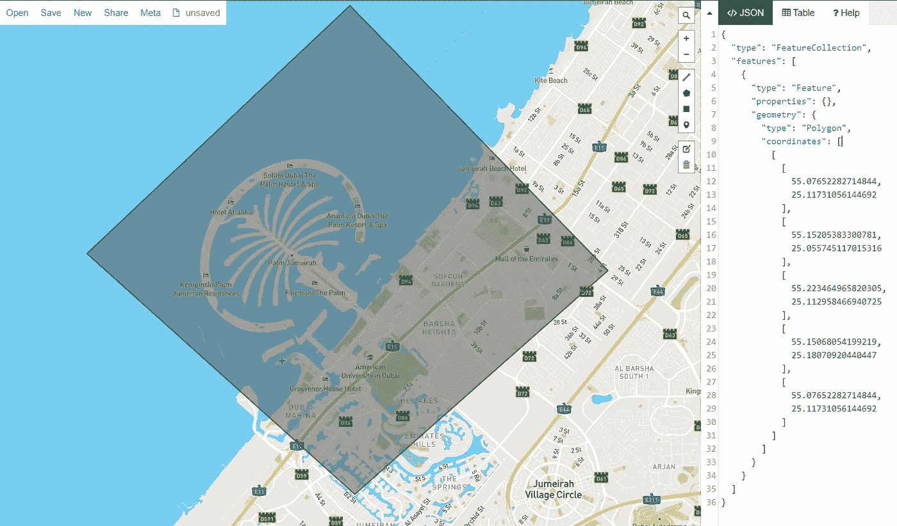

> 定义区域允许我们构建[带状地图](https://en.wikipedia.org/wiki/Choropleth_map)(带有区域颜色的地图)。Plotly 图形库使用 Geo-JSON 文件支持[本地 choropleth。开普勒通过仅使用数据中 H3 六边形的索引来支持 H3 可视化。](https://plotly.com/python/choropleth-maps/)

现在我们知道我们需要什么来对付房间里的大象。我们如何使地理围栏与 H3 相协调？我们用特定分辨率的六边形多边形填充整个边界(在我们的例子中分辨率为 10)。H3 有能力多边形填充形状良好的多边形和 Geo-JSON 对象。

使用 H3 多边形填充函数用六边形填充地理边界。

# 多填充画廊💠

这个数据帧的输出是从优步的开普勒望远镜上看到的。不同分辨率的 GL 如下。

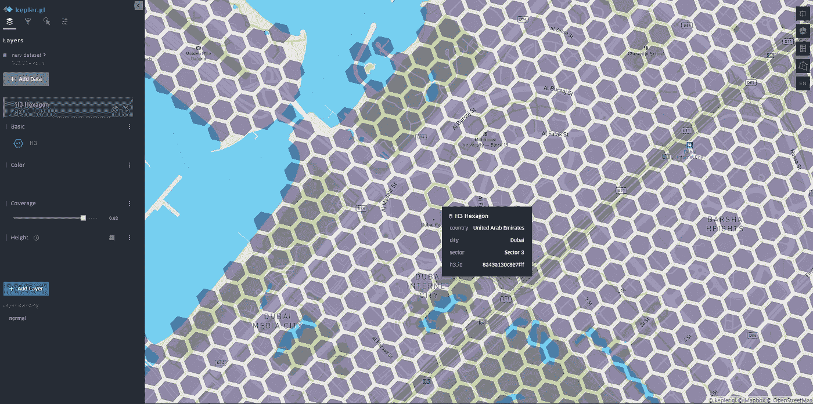

10 号决议六角形特写

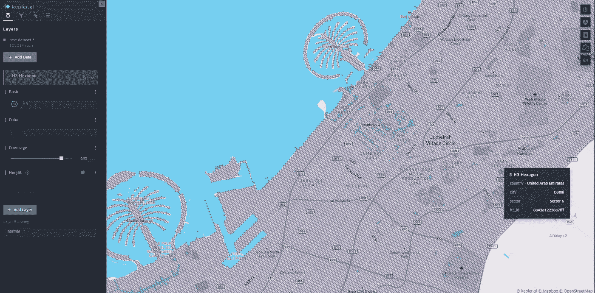

迪拜多边形-填充分辨率为 10 的六边形(100，000 个六边形横跨整个城市)

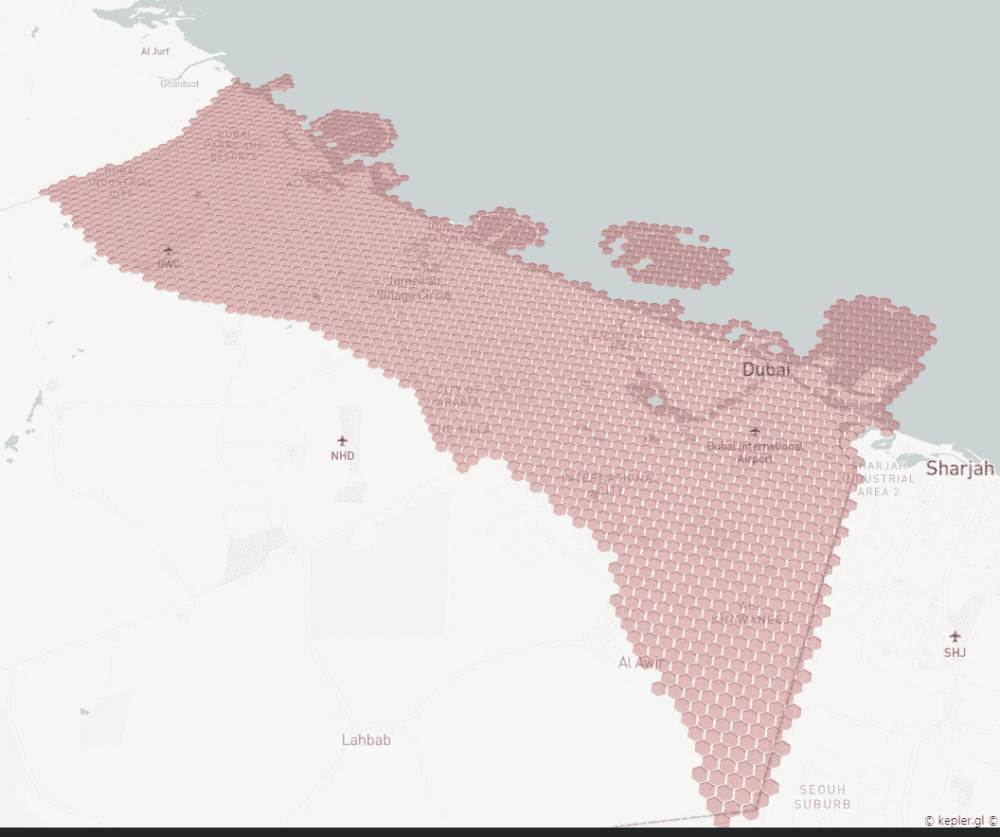

迪拜多边形-填充分辨率为 8 的六边形(2500 个六边形横跨整个城市)

看起来像一个复古的 16 位 T21 城市。

# 分析📈

现在我们已经有了遍布整个城市的六边形，并且每个六边形的 ID 都存储在一个表/数据框中，

1.  我们可以在每个六边形上执行任何与 H3 相关的功能(找到它的父对象以进行更全面的分析，存储它的地理围栏，找到它的相邻六边形，等等)
2.  我们可以跟踪按各自的六边形分组的坐标级别数据。在这种情况下，六边形成为桶，我们可以使用它对每个桶/十六进制的一组坐标点执行分组分析

充分利用 H3 的一些非穷尽方法是:

1.  将其用作“开/关”指示器，以突出显示特定区域的活动。请记住，H3 六边形可以有不同的分辨率，因此您可以根据自己的需要进行细化，或者将其向上聚合以降低分辨率。
2.  通过分析一段时间内六边形的演变来查看时间序列数据。每个六边形代表位于其边界内的多个坐标的邻域。
3.  具有特定活动水平的聚类区域。

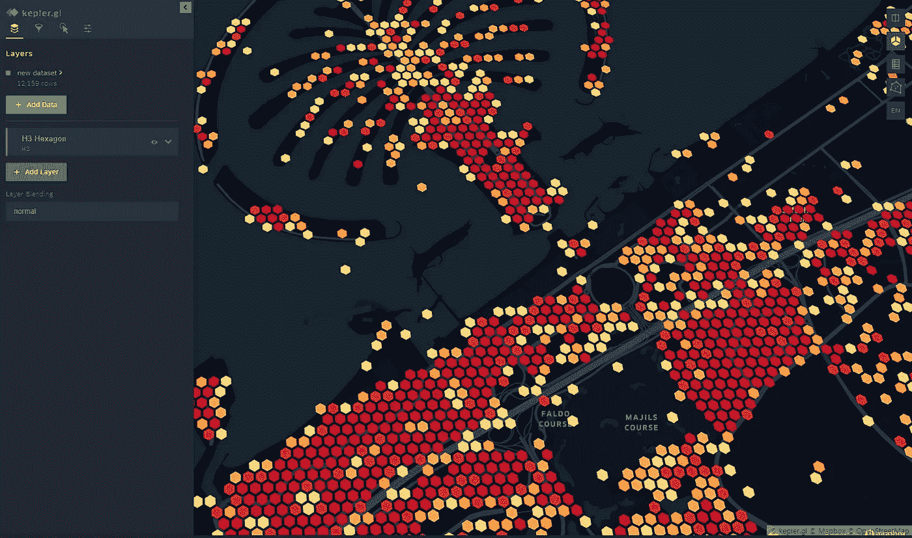

剩下的就看你自己了；)

感谢阅读！

**再来几个链接:**

[优步开源:为优步的超级本地市场设计次级城市地理信息系统](https://www.youtube.com/watch?v=wDuKeUkNLkQ)

真理的[《永不重复的无限模式》](https://www.youtube.com/watch?v=48sCx-wBs34)

***参考文献:***

[优步工程博客:H3:优步六边形层次空间索引](https://eng.uber.com/h3/)

[H3 文件](https://h3geo.org/docs)