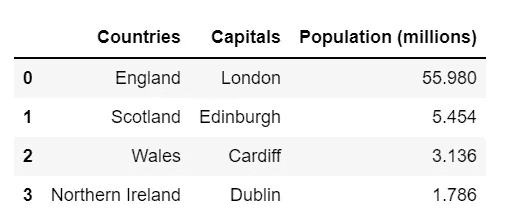
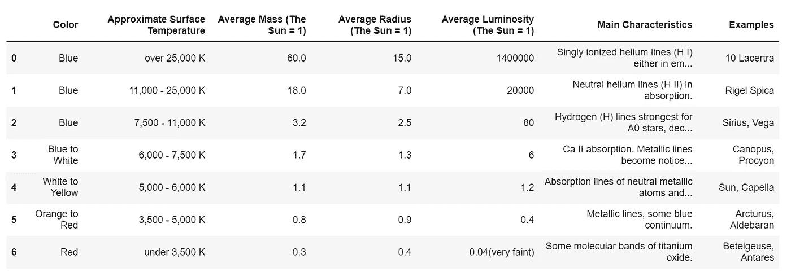
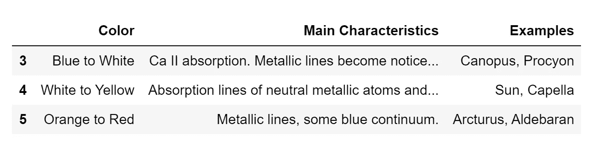
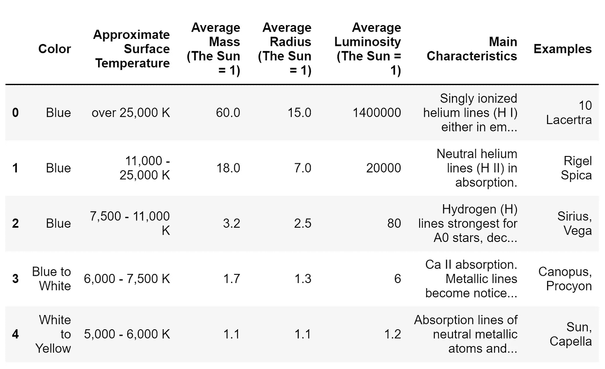
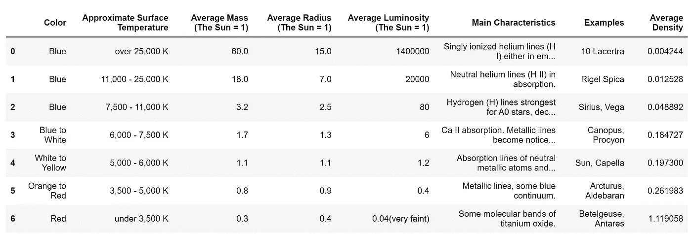
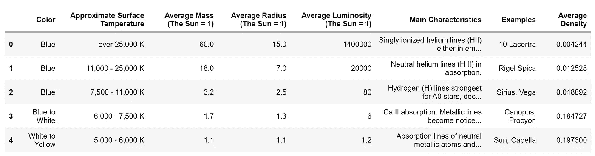
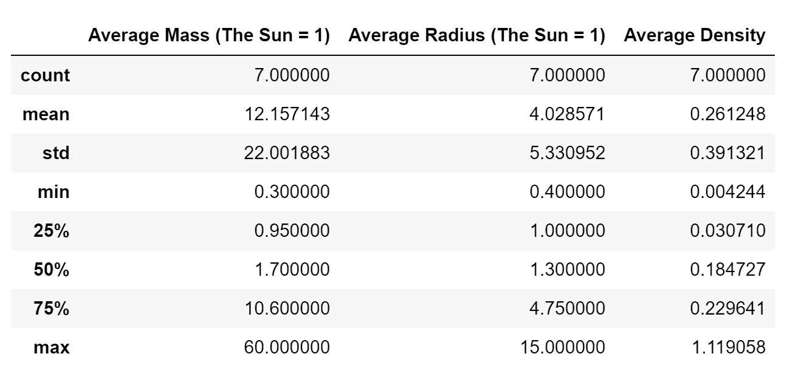

# UCL 数据科学学会:熊猫

> 原文：<https://towardsdatascience.com/ucl-data-science-society-pandas-8ad28c2b22e5?source=collection_archive---------25----------------------->

## 工作坊 6:什么是 Pandas，Pandas 系列，Pandas 数据框架，访问数据和 Pandas 操作


迈克尔·佩恩在 [Unsplash](https://unsplash.com?utm_source=medium&utm_medium=referral) 上的照片

今年，作为 UCL 数据科学学会的科学负责人，该学会将在整个学年举办一系列 20 场研讨会，涵盖的主题包括数据科学家工具包 Python 和机器学习方法简介。每一篇文章的目标都是创建一系列的小博客，这些小博客将概述要点，并为任何希望跟进的人提供完整研讨会的链接。所有这些都可以在我们的 [GitHub](https://github.com/UCL-DSS) 资源库中找到，并将在全年更新新的研讨会和挑战。

本系列的第六个研讨会是对 pandas python 包的介绍，我们将向您介绍 pandas、Pandas 系列、Pandas 数据帧、访问数据和 Pandas 操作。虽然这里将分享一些亮点，但完整的研讨会(包括自测题)可以在这里找到[。](https://github.com/UCL-DSS/pandas-workshop)

如果您错过了我们之前的任何研讨会，您可以在以下链接中找到最后三场:

[](/ucl-data-science-society-introduction-to-numpy-7d962d63f47d) [## UCL 数据科学协会:Numpy 简介

### 工作坊 5:什么是 Numpy，Numpy 数组，数学运算符，随机数

towardsdatascience.com](/ucl-data-science-society-introduction-to-numpy-7d962d63f47d) [](/ucl-data-science-society-object-oriented-programming-d69cb7a7b0be) [## UCL 数据科学学会:面向对象编程介绍

### 工作坊 4:什么是 OOP，在 Python 中定义类、添加属性、添加方法、类继承

towardsdatascience.com](/ucl-data-science-society-object-oriented-programming-d69cb7a7b0be) [](/ucl-data-science-society-python-logic-3eb847362a97) [## UCL 数据科学学会:Python 逻辑

### 讲习班 3:条件语句、逻辑语句、循环和函数

towardsdatascience.com](/ucl-data-science-society-python-logic-3eb847362a97) 

## 熊猫是什么？

Pandas 是一个开源 Python 包，广泛用于数据科学/分析和机器学习任务，建立在我们上周介绍的 Numpy 包之上。它是数据科学工作流中最受欢迎的数据争论包之一，并与此过程中使用的许多其他库集成良好。它很有用，因为它使任务像:

*   数据清理
*   数据填充
*   数据标准化
*   合并和连接
*   数据可视化
*   数据检查

比其他方式简单多了。该功能有助于实现以下目标:

> *…在 Python 中进行实际、真实世界数据分析的基本高级构建模块。此外，它还有一个更广泛的目标，那就是成为任何语言中最强大、最灵活的开源数据分析/操作工具。*

如[文档](https://pandas.pydata.org/about/)中所述。

## 熊猫系列

熊猫系列是构成熊猫数据框架的基础结构。虽然它们在结构上类似于 Numpy 数组，但主要区别在于我们可以为始终链接的 pandas 系列指定一个非数字索引，从而允许我们基于该值访问信息的位置。然而，在大多数其他方面，如应用数值运算时，序列的行为很像数组或列表。

要生成一个序列，我们需要使用`pd.series(x)`符号，其中`x`是一个要转换成序列的列表或数组。为此，我们可以使用`index`参数来设置`index = y`，其中`y`是我们希望用于各个系列值的索引列表。这意味着，如果我们愿意，我们可以同时使用数字和字符串符号(即最小值、中值、最大值，而不是 1、2、3)。这方面的一个例子是:

```
# Generating Pandas series
series = pd.Series([10,20,30,40])
print(series)#out:
0    10
1    20
2    30
3    40
dtype: int64
```

或者:

```
# Generating Pandas series
series = pd.Series([10,20,30,40], index=["a","b","c","d"])
print(series)#out:
a    10
b    20
c    30
d    40
dtype: int64
```

## 熊猫数据框

这些序列可以组合起来构成 Pandas 数据框架，这是与 Pandas 相关的主要数据结构。本质上，它是一个以变量形式存储的数据表，类似于将一个列表字典或一个数组中的多个值存储为变量。数据帧中的每一列都由一个熊猫序列表示，这意味着如果我们愿意，我们可以单独提取每一列，而索引将保持不变。

我们可以用两种方法创建数据帧，要么将已经存储在 Python 中的数据转换成数据帧，要么读入外部文件。在第一种情况下，我们可以从各种结构中创建数据帧，例如从列表或列表列表或压缩列表中创建数据帧。然而，在我们的例子中，我们将使用一个列表字典，如下所示，使用“pd.DataFrame()”函数:

```
#create a dictionary of lists
data_dict = {"Countries": ["England", "Scotland", "Wales", "Northern Ireland"],
            "Capitals": ["London", "Edinburgh", "Cardiff", "Dublin"],
            "Population (millions)": [55.98,  5.454, 3.136, 1.786]}#convert this to a dataframe
data_df = pd.DataFrame(data_dict)#display the dataframe
data_df
```



或者我们可以使用`pd.read_csv`从一个现有的数据源中提取数据，比如一个 **csv(逗号分隔变量)**文件，如下所示:

```
# Defines df as a data frame without adding an additional index column 
df = pd.read_csv("StarColours.csv")# Displays the data frame df
df
```



其中 **csv** 是一种与 pandas 结合使用的常见数据结构，顾名思义，每列由一个列分隔。当然，也可以使用其他数据结构来读入，例如文本文件或 excel 文件，并且可以指定各种其他参数来允许读入这些数据，例如分隔符(如何分隔列)、编码(字符序列)和压缩(如何压缩文件)。这可以与参数结合使用，例如`use_cols`指定要读入的列，或者`nrows`指定要读入多少行。

## 数据帧切片

就像列表、数组或字典一样，我们也可以从数据结构中查看特定的值或值的范围。在 DataFrame 的情况下，我们可以像处理列表或数组一样查看切片，但是我们可以使用列名或索引来访问这些信息。

在 star colours 数据集的情况下，我们可以像选择字典值一样选择特定的列。这里的关键字是字符串形式的列名，如下所示:

```
# Returns the colour column
df["Color"]#alterntaively you can use dot notation
#df.Color
#but only if there are no spaces in the title#out:
0               Blue
1               Blue
2               Blue
3      Blue to White
4    White to Yellow
5      Orange to Red
6                Red
Name: Color, dtype: object
```

我们可以进一步从列中选择一个或多个特定的项，就像在列表字典中一样，首先访问列，然后访问索引，如下所示:

```
# Selects seventh item in colour column
df["Color"][6]#out:
'Red'
```

或者对于一个范围:

```
# Selects 4th to 6th items in colour column
df["Color"][3:6]#out:
3      Blue to White
4    White to Yellow
5      Orange to Red
Name: Color, dtype: object
```

我们可以通过传递列名列表来进一步指定几个列，如下所示:

```
# Returns the specified columns
df[["Color", "Main Characteristics", "Examples"]][3:6]
```



或者，我们可以使用`df.loc`从满足特定条件的数据帧中获取信息。在这里，我们可以开始使用条件语句来访问使用符号`df.loc[df["columname"] > x]`的信息，对于标有`columname`的列，该符号将返回值大于`x`的所有行。然后，它可以与其他条件结合使用，以访问或更改信息。例如:

```
# Returns all rows with values greater than 
#one for the average mass column
df.loc[df["Average Mass (The Sun = 1)"] > 1]
```



## 数据帧操作

使用 DataFrame 数据结构的好处是可以对数据执行各种操作，包括对列和跨列执行数学运算的能力，创建新列以添加回数据集中，以及许多内置功能。

例如，就像我们处理 Numpy 数组一样，我们可以对列中的每个元素执行数学运算。例如，我们可以将质量平均值和质量半径列相加:

```
# Adding the average mass and radius columns
(df["Average Mass (The Sun = 1)"] 
+ df["Average Radius (The Sun = 1)"])#out:
0    75.0
1    25.0
2     5.7
3     3.0
4     2.2
5     1.7
6     0.7
dtype: float64
```

或者，我们可以根据平均质量和平均半径计算恒星的平均密度，并将其赋回数据集中的一个新列:

```
# Defines a new average density column accordingly
df["Average Density"] = ((df["Average Mass (The Sun = 1)"]
                          *3)
                         /(4*
                           np.pi*
                           (df["Average Radius (The Sun = 1)"]
                            **3)))# Displays the data frame
df 
```



除此之外，我们还有多个内置函数，可以用来查看数据或更改数据。例如，我们可以使用`df.head()`来检查数据集的前五行，或者我们可以使用`df.tail()`来访问数据集的底部五行:

```
# Returns first five rows from the data frame
df.head()
```



我们还可以将一列中的所有唯一项(即没有重复项)作为一个数组来访问:

```
# Returns unique items from the colours column
df["Color"].unique()#out:
array(['Blue', 'Blue to White', 'White to Yellow', 'Orange to Red', 'Red'],
      dtype=object)
```

或者，我们可以返回所有列的大量统计参数的数值，如下所示:

```
# Returns unique items from the colours row
df.describe()
```



我们还可以使用内置的 Numpy 函数来单独访问其他统计值，例如使用`df.mean()`来访问列的平均值、`df.median()`来访问列的中值、`df.min()`来访问列的最小值或`df.max()`来查找列的最大值。例如:

```
# Returns the mean of each numerical column
df.mean()Average Mass (The Sun = 1)      12.157143
Average Radius (The Sun = 1)     4.028571
Average Density                  0.261248
dtype: float64
```

当然，该结构内置了更多的功能，包括设置索引、将列转换为数组、列表和字典、根据条件删除一行或一列、合并数据帧、处理 NaN 值以及最终将数据推送到 csv 文件。

虽然此处未涉及此功能，但可在车间文件[中找到此处](https://github.com/UCL-DSS/pandas-workshop/blob/master/workshop.ipynb)。或者，如果你认为你知道所有关于熊猫的数据，那么为什么不试试[问题单](https://github.com/UCL-DSS/pandas-workshop/blob/master/problem.ipynb)？

恒星数据集来自:[https://www . enchanted learning . com/subjects/astronomy/stars/start types . shtml](https://www.enchantedlearning.com/subjects/astronomy/stars/startypes.shtml)

完整的研讨会笔记本，以及更多示例和挑战，可在 [**这里**](https://github.com/UCL-DSS/pandas-workshop) 找到。如果您想了解我们协会的更多信息，请随时关注我们的社交网站:

https://www.facebook.com/ucldata

Instagram:[https://www.instagram.com/ucl.datasci/](https://www.instagram.com/ucl.datasci/)

领英:[https://www.linkedin.com/company/ucldata/](https://www.linkedin.com/company/ucldata/)

如果你想了解 UCL 数据科学协会和其他优秀作者的最新信息，请使用我下面的推荐代码注册 medium。

[](https://philip-wilkinson.medium.com/membership) [## 通过我的推荐链接加入媒体-菲利普·威尔金森

### 作为一个媒体会员，你的会员费的一部分会给你阅读的作家，你可以完全接触到每一个故事…

philip-wilkinson.medium.com](https://philip-wilkinson.medium.com/membership) [](/london-convenience-store-classification-using-k-means-clustering-70c82899c61f) [## 使用 K-均值聚类的伦敦便利店分类

### 伦敦的便利店怎么分类？

towardsdatascience.com](/london-convenience-store-classification-using-k-means-clustering-70c82899c61f) [](/introduction-to-random-forest-classifiers-9a3b8d8d3fa7) [## 随机森林分类器简介

### 预测 NBA 球员的位置——我们正在看到一个真正的“无位置”联盟吗？

towardsdatascience.com](/introduction-to-random-forest-classifiers-9a3b8d8d3fa7) [](/an-introduction-to-object-oriented-programming-for-data-scientists-879106d90d89) [## 面向数据科学家的面向对象编程介绍

### 面向对象的基础知识，适合那些以前可能没有接触过这个概念或者想知道更多的人

towardsdatascience.com](/an-introduction-to-object-oriented-programming-for-data-scientists-879106d90d89)