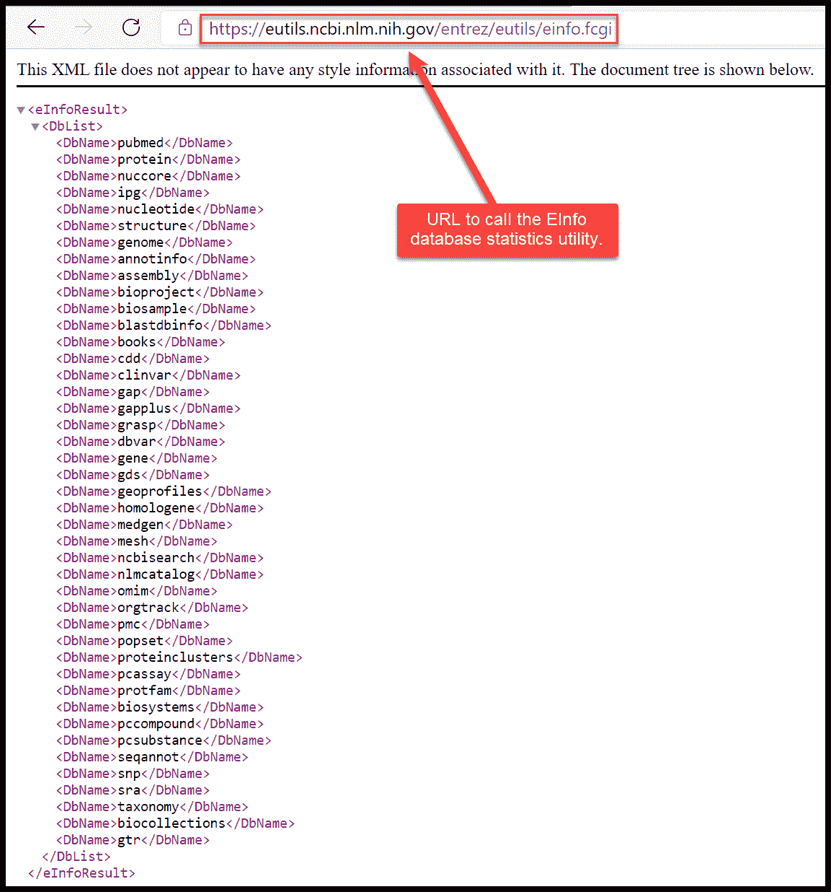
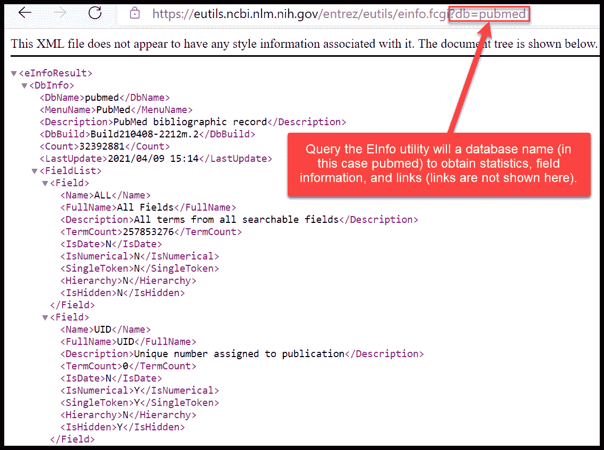

# 使用这个 Python 类查询 43 个 NIH 生物医学数据库的元数据

> 原文：<https://towardsdatascience.com/uery-information-about-43-nih-biomedical-databases-with-this-python-4e534a12c3fb?source=collection_archive---------27----------------------->

## NIH 的国家生物技术信息中心(NCBI)管理着 43 个向公众开放的 Entrez 生物医学信息数据库。使用 Python 类 c_e_info 来检索数据库的统计数据和其他信息。

> “我们相信上帝，所有其他人都会带来数据。” —爱德华兹·戴明

照片由 [Joshua Sortino](https://unsplash.com/@sortino?utm_source=unsplash&utm_medium=referral&utm_content=creditCopyText) 在 [Unsplash](https://unsplash.com/s/photos/technology?utm_source=unsplash&utm_medium=referral&utm_content=creditCopyText) 上免费提供

# 介绍

美国政府已经积累了难以置信的大量数据。公众可以通过文件下载或 API 免费获得其中的大部分内容。例如，美国国立卫生研究院(NIH)的国家生物技术信息中心(NCBI)管理着 43 个公共可访问的生物医学数据库，统称为 Entrez 数据库。

Entrez 数据库包含各种数据，如超过 3000 万篇生物医学期刊文章的参考文献和摘要、基因组序列以及公共序列数据库中所有生物的分类和命名。

数据工程师、数据分析师、数据科学家和软件开发人员可以将 Entrez 数据库中存储的各种生物医学和生物技术数据用于他们的项目。例如，我开发了几个解决方案来查询、检索和分析来自 Entrez PubMed biomedical 文章摘要数据库的数据。

本文描述了可以用来访问 Entrez 数据库的 Entrez 编程实用程序(E-utilities)。它还演示了 Python c_e_info 类来查询关于数据库的元数据。它调用 Entrez EInfo 实用程序来获取 Entrez 数据库的列表以及 43 个数据库中任何一个的元数据。您可以使用其他电子工具来搜索数据库，并为您的项目检索生物医学数据。

# 电子工具概述

E-utilities 包括 9 个服务器端程序，为程序员提供了一个从 Entrez 查询和数据库系统中查询和检索数据的界面。

虽然本文详细介绍了 EInfo 电子实用程序，但以下部分提供了所有电子实用程序的概述。

## EInfo

EInfo 提供两种类型的信息。首先，它返回所有 Entrez 数据库的名称列表。其次，它为指定的数据库提供元数据。它检索名称、其他描述符、它包含的记录数以及上次更新数据的日期和时间。它还提供了每个数据库字段的名称以及如何链接到其他 Entrez 数据库的信息。

## 电子搜索

ESearch 对数据库执行文本搜索。它返回与搜索条件匹配的记录的唯一标识符(uid)列表。然后，程序员使用这些 uid 通过其他电子工具检索数据，包括 ESummary、ELink 和 EFetch。

## 电子公告

EPost 用于将一组 uid 上传到历史服务器。它返回数据集的查询关键字和 web 环境。程序员以后可以用存储在历史服务器上的 uid 从数据库中检索数据。

## 电子摘要

当使用数据库的 uid 列表调用时，ESummary 返回文档摘要。

## 埃菲奇

当用一组 uid 调用时，EFech 以指定的格式从数据库返回数据记录。

## 埃林克

当提供了一个数据库的 uid 列表时，ELink 返回同一个数据库中的相关 uid 列表或另一个 Entrez 数据库中的链接 uid 列表。

## 马术

EQuery 返回每个数据库中匹配文本搜索的记录数。

## 埃斯佩尔

ESpell 为数据库的文本查询解析拼写建议。

## ECitMatch

ECitMatch 检索与一组给定的引用文本字符串相对应的 PubMed id(pmid)。PubMed 是 Entrez 数据库，包含超过 3000 万篇生物医学期刊文章的摘要。

# 电子工具文档

电子工具在帮助网页上有很好的文档记录。您也可以下载这些页面的 PDF 文件。

这些帮助页面提供了电子实用程序的概述以及有关 EInfo 实用程序的其他详细信息:

*   [电子工具的一般介绍](https://www.ncbi.nlm.nih.gov/books/NBK25497/)
*   [电子公用事业快速启动](https://www.ncbi.nlm.nih.gov/books/NBK25500/#chapter1.For_More_Information_8)
*   [深度信息](https://www.ncbi.nlm.nih.gov/books/NBK25499/#chapter4.EInfo)

# EInfo 电子工具

如上所述，EInfo 返回所有 Entrez 数据库的列表，或者在给定数据库名称的情况下，它返回关于数据库的一般信息、其字段的描述以及关于其到其他 Entrez 数据库的链接的信息。

电子实用程序深入帮助页面的[电子信息部分提供了有关如何使用该实用程序的信息。](https://www.ncbi.nlm.nih.gov/books/NBK25499/#chapter4.EInfo)

## 检索 Entrez 数据库列表的 URL

像所有的电子工具一样，EInfo 有一个基本 URL，用来从 Entrez 或它的一个数据库中请求数据。

**电子信息基础网址**:

[*https://eutils.ncbi.nlm.nih.gov/entrez/eutils/einfo.fcgi*](https://eutils.ncbi.nlm.nih.gov/entrez/eutils/einfo.fcgi)

*要查看调用 EInfo 的返回输出及其基本 URL，请在 web 浏览器中打开该 URL。它应该返回 XML 格式的有效 Entrez 数据库列表，如下面的屏幕截图所示。*

**

*Entrez EInfo 实用程序返回 XML 格式的 Entrez 数据库列表。图片由作者提供。*

## *检索 Entrez 数据库详细信息的 URL*

*要检索关于 Entrez 数据库的详细信息，调用 EInfo 基本 URL，用 ***db*** 参数和数据库的名称作为它的值。调用以下示例 URL 将返回关于 PubMed 数据库的信息。*

***带数据库参数的 EInfo 基本 URL:***

*[*https://eutils.ncbi.nlm.nih.gov/entrez/eutils/einfo.fcgi*？db=pubmed](https://eutils.ncbi.nlm.nih.gov/entrez/eutils/einfo.fcgi)*

*要查看使用 ***db*** 参数调用 EInfo 返回的输出，请在 web 浏览器中导航到 URL 地址。它应该返回关于数据库的元数据、关于每个字段的细节以及关于到其他 Entrez 数据库的每个链接的细节。*

**

*Entrez EInfo 实用程序以 XML 格式返回关于 Entrez 数据库的元数据，在本例中是 PubMed。图片由作者提供。*

## *其他 EInfo 参数*

*除了 ***db*** 参数外，EInfo 还将可选的 ***版本*** 和 ***retmode*** 参数作为输入。*

***版本***

*使用可选的 ***版本*** 参数指定版本 2.0 **EInfo** XML。它只允许值“2.0”。使用时， **EInfo** 将返回两个额外的字段:<is truncate>和<is ranged>。Truncatable 允许在搜索词中使用通配符“*”。通配符将扩展以匹配最多 600 个唯一扩展的任意字符集。范围字段允许范围运算符“:”介于值范围的界限之间(如 *2018:2020[pdat]* )。*

***retmode***

*使用可选的***retmode****参数指定检索数据的格式。默认值为“xml ”,以 XML 格式返回数据。值“json”也可用于检索 JSON 格式的数据。**

# **Python 控制器和 c_e_info 类**

**Python c_e_info 类包装了 EInfo 并扩展了它的功能。它执行以下功能:**

*   **调用 EInfo 实用程序获取 Entrez 数据库的有效列表。以 XML 格式返回输出。**
*   **调用 EInfo 实用程序以获取指定数据库的概览、字段列表和数据库链接列表。以 XML 格式返回输出。**
*   **将调用 EInfo 实用程序返回的 XML 输出写入文件。**

## **Python 控制器**

**下面显示的控制器代码导入 c_e_info 类模块，并执行这些任务来获取、显示和存储有效 Entrez 数据库的列表以及 Entrez PubMed 数据库的详细信息:**

1.  **创建一个不带参数的 c_e_info 实例。类构造函数将调用一个函数，该函数调用 EInfo 实用程序并以 XML 格式返回数据库列表。**
2.  **将包含数据库列表的 XML 流写入文件。**
3.  **创建一个 c_e_info 的实例，带有一个数据库名称参数(本例中为‘PubMed’)。类构造函数将调用一个函数，该函数调用 EInfo 实用程序并返回数据库的概述、其字段的详细信息以及其与其他 XML 格式的 Entrez 数据库的链接的详细信息。**
4.  **将包含指定数据库详细信息的 XML 流写入文件。**

**调用 c_e_info 类以获取 Entrez 数据库列表和 PubMed 数据库元数据的控制器代码。**

## **Python c_e_info 类**

**c_e_info 类执行控制器请求的任务。下面代码中的注释描述了它的功能。**

**Python c_e_info 类调用 Entrez EInfo 实用程序来获取 Entrez 数据库列表和关于 Entrez 数据库的元数据。**

# **c_e_info 类和控制器的使用**

**虽然您可以使用其他电子工具来查询和检索 Entrez 数据库中的数据，但是可以使用 EInfo 来获得对 Entrez 数据库的基本了解。以下是 EInfo 和 c_e_info 类的一些可能用法:**

*   ****了解数据结构** —使用通过 EInfo 为 Entrez 数据库检索的字段和链接数据来了解数据结构，为数据分析、数据科学或软件开发项目做准备。**
*   ****建立数据库** —获取 Entrez 数据库中字段的详细信息，以建立数据库表(在数据库管理系统中，如 Microsoft SQL Server、MySQL、Oracle 或 PostgreSQL ),以包含来自电子工具调用的数据。**
*   ****查看基本数据库元数据** —检索数据库列表，并大致了解每个数据库、其记录数量、上次更新时间、其字段及其与其他 Entrez 数据库的链接。**

# **从这里去哪里**

**我开发了几个数据分析产品和一个应用程序，其核心是来自 Entrez PubMed 数据库的生物医学文章摘要。也许您可以在项目中使用存储在 Entrez 数据库中的数据。以下是一些想法:**

*   **增强 c_e_info 类来优雅地处理错误。**
*   **将有关 c_e_infor 执行的任务的信息写入日志文件。**
*   **审查每个 Entrez 数据库的现场信息，并确定用例，以便为即将到来的或潜在的项目利用数据。**
*   **更改或扩展 c_e_info 类的功能以满足您的需要。**
*   **了解如何使用其他电子工具从 Entrez 数据库获取数据。**
*   **编写程序或类来解析和创建从 E-utilities 调用返回的 XML 或 JSON 输出的索引。**
*   **编写一个 Python 类，将调用 E-utilities 返回的 XML 转换为 HTML 文件，并将它们发布到 Web 服务器。**
*   **编写一个 Python 类，将调用 E-utilities 返回的 XML 转换为其他格式(如 CSV)，以便在商业智能和数据可视化工具中呈现和分析，如 [Tableau](https://www.tableau.com/) 或 [Microsoft Power BI](https://powerbi.microsoft.com/en-us/) 。**
*   **编写一个实用程序类，调用 E-utilities 从 Entrez 数据库中检索数据，并将其插入数据库。**
*   **用 Python 或其他语言构建包装类，以简化和扩展其他电子工具的使用。**

# **程序设计环境**

**我使用了以下操作系统和工具来编写和测试这个项目和文章的代码:**

*   **Windows 10——Windows 是我选择的操作系统，但 Python 代码可以在其他平台上运行。**
*   **[Python 3.9](https://www.python.org/)——我在这个项目中使用了 Python 3.9.2，但其他 Python 3 版本应该也可以。**
*   **[Visual Studio Community 2019](https://visualstudio.microsoft.com/vs/community/)—我使用微软 Visual Studio 已经几十年了，发现它可靠、功能多样、速度快。免费社区版很好地满足了我的大部分需求。Visual Studio Code (VS Code)或者任何你喜欢的集成开发环境(IDE)或者代码编辑器应该可以很好的工作。**

**在代码示例中，使用标准的 Windows 文件目录和名称格式调用 c_e_info.write_db_xml()函数，如下所示。您可能需要修改文件目录名格式，以便与您的操作系统配合使用。**

***PubMed _ db _ list . write _ db _ XML(' c://project _ data/c _ e _ info/entrez _ db _ list . XML ')***

# **摘要**

**43 个 Entrez 生物医学数据库存储了丰富多样的数据集合，可以推动或增强许多数据分析和数据科学项目。9 Entrez E-utilities 易于使用。您可以将它们集成到您的程序中，并使用用 Python 或其他程序编写的包装类来扩展它们。**

**我希望本文及其示例代码已经为您提供了对 E-utilities 的基本理解、关于其 EInfo 实用程序的有用操作信息，以及如何使用包装和扩展其功能的 Python c_e_info helper 类。**

# **关于公共数据集的其他文章**

**如果您对推动或增强您的项目的数据感兴趣，请参见我在《走向数据科学》杂志上发表的关于免费访问公共数据集的其他文章:**

*   **[使用 Data.gov 上编目的公共数据集推动数据科学项目](/use-public-datasets-cataloged-on-data-gov-to-power-data-science-projects-1a7d84e9212b)**
*   **[用 Python 和 Tableau 从 analytics.usa.gov 采集和分析数据](/acquiring-and-analyzing-data-from-analytics-usa-gov-with-python-and-tableau-b61870ea065c)**
*   **[如何编写 Python 程序在 PubMed 数据库中查询生物医学期刊引文](https://rruntsch.medium.com/how-to-write-a-python-program-to-query-biomedical-journal-citations-in-the-pubmed-database-c7e842e4df89)**

# **关于作者**

**Randy Runtsch 是一名作家、数据工程师、数据分析师、程序员、摄影师、自行车手和冒险家。他和妻子住在美国明尼苏达州东南部。**

**Randy 撰写关于公共数据集的文章，以推动见解和决策、写作、编程、数据工程、数据分析、摄影、野生动物、自行车旅行等。**