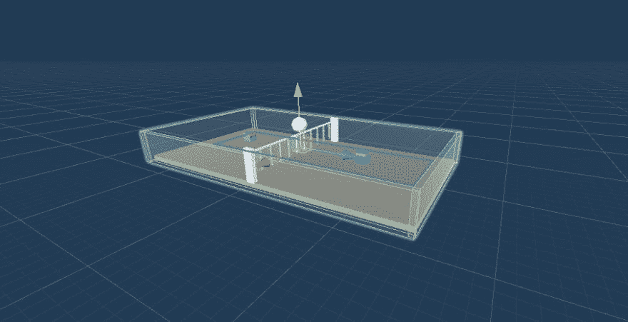
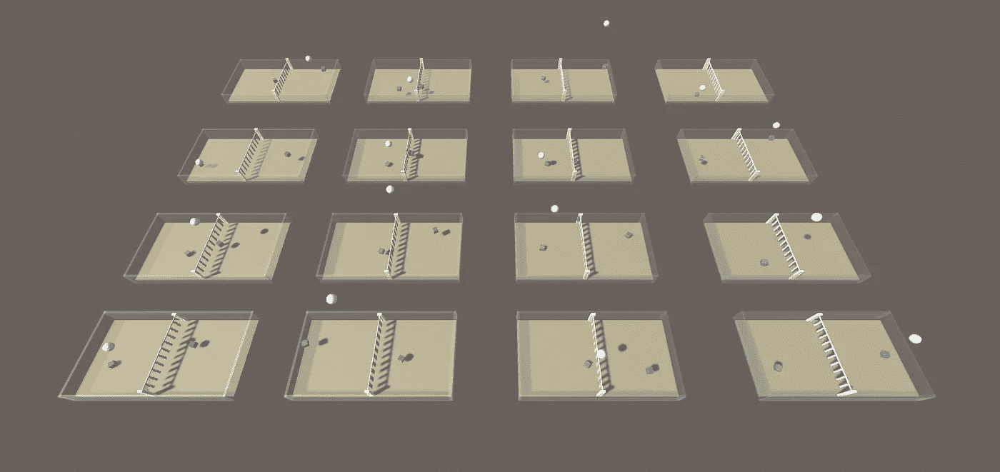
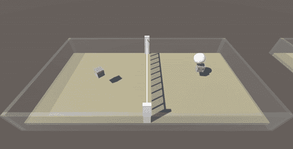

# 🏐终极排球:使用 Unity ML-agent 构建的多 agent 强化学习环境

> 原文：<https://towardsdatascience.com/ultimate-volleyball-a-3d-volleyball-environment-built-using-unity-ml-agents-c9d3213f3064?source=collection_archive---------19----------------------->

## 训练强化学习代理打排球

作者图片

受 [**黏液排球馆**](https://github.com/hardmaru/slimevolleygym) 的启发，我用 Unity 的**[**ML-Agents toolkit**](https://github.com/Unity-Technologies/ml-agents)搭建了一个训练强化学习 agent 的 3D 排球环境。整个项目是开源的，可以在 [**获得🏐终极排球**](https://github.com/CoderOneHQ/ultimate-volleyball) 。**

**在本文中，我分享了从设计环境到培训 it 代理的实施细节、挑战和经验。有关 ML-Agents 的背景，请查看我的[**ML-Agents 简介文章**](https://medium.com/nerd-for-tech/an-introduction-to-machine-learning-with-unity-ml-agents-af71938ca958) 。**

> *****所用版本:****Release 18(2021 年 6 月 9 日)* ***Python 包:****0 . 27 . 0* ***Unity 包:*** *2.1.0***

# **🥅建立法院**

**之前没有游戏设计或 3D 建模的经验，我发现 Unity 的免费资源和样本项目库非常有用。**

**以下是我用过的:**

*   **代理立方体预置来自[**ML-代理样例项目**](https://github.com/Unity-Technologies/ml-agents/blob/main/docs/Learning-Environment-Examples.md)**
*   **[**免费沙滩必需品资源包**](https://assetstore.unity.com/packages/3d/props/free-beach-essentials-asset-pack-131149) 中的排球预制品和沙子材料**
*   **网材来自 [**自由网格&网材包**](https://assetstore.unity.com/packages/2d/textures-materials/yughues-free-grids-nets-materials-13004)**

**球场的其余部分(网柱、墙、球门和地板)都被重新调整了大小，并旋转了拼凑在一起的立方体对象。**

****

**作者图片**

**地板实际上由两层组成:**

1.  **薄薄的紫色和蓝色边**目标**放在一个“触发”碰撞器的顶部**
2.  **一层**可步行**地板**下面****

****球门**检测球何时撞击地板，而**可行走** **地板**为球提供碰撞物理学。**

**需要注意的一些其他实现细节:**

*   **代理看起来像立方体，但是有球体碰撞器来帮助他们控制球的轨迹。**
*   **我还在球场周围加了一道无形的边界。我发现，在训练期间，如果你因为击球出界而惩罚他们，代理人可能会回避学习击球。**

# **📃剧本**

**在 Unity 中，可以将脚本分配给各种游戏对象来控制它们的行为。下面是用于定义环境的 4 个脚本的简要概述。**

## **`VolleyballAgent.cs`**

***附属于代理人***

**这控制了代理的**观察集合**和**动作**。**

**( [**链接到完整代码**](https://github.com/CoderOneHQ/ultimate-volleyball/blob/master/Assets/Scripts/VolleyballAgent.cs) )**

## **`VolleyballController.cs`**

***附球***

**这个脚本检查球是否落地。如果是这样，它会触发`VolleyballEnv.cs`的奖励分配**

**( [**链接到完整代码**](https://github.com/CoderOneHQ/ultimate-volleyball/blob/master/Assets/Scripts/VolleyballController.cs) )**

## **`VolleyballEnvController.cs`**

***附属于母排球区(其中包含代理人、球等。)***

**这个脚本包含了管理剧集开始/停止，如何产生对象，以及如何分配奖励的所有逻辑。**

**( [**链接到完整代码**](https://github.com/CoderOneHQ/ultimate-volleyball/blob/master/Assets/Scripts/VolleyballEnvController.cs) )**

## **`VolleyballSettings.cs`**

***附加到一个单独的‘排球设置’对象***

**这保持基本环境设置的常数，例如代理运行速度和跳跃高度。**

**( [**链接到完整代码**](https://github.com/CoderOneHQ/ultimate-volleyball/blob/master/Assets/Scripts/VolleyballSettings.cs) )**

# **🤖代理人**

**环境被设计成对称的，这样两个代理可以共享同一个模型，并使用 [**自我游戏**](https://github.com/Unity-Technologies/ml-agents/blob/main/docs/ML-Agents-Overview.md#training-in-competitive-multi-agent-environments-with-self-play) 进行训练。**

**我决定从简单的矢量观测开始。这些都是相对于代理定义的，所以代理是扮演蓝色立方体还是紫色立方体并不重要。**

## **观察结果:**

**总观察空间大小:11**

*   **旋转(Y 轴)——*1***
*   **从代理到球的 3D 矢量— *3***
*   **到球的距离— *1***
*   **代理速度(X、Y 和 Z 轴)— *3***
*   **球速(X、Y 和 Z 轴)— *3***

****注意:**对于一个代理来说，知道关于其环境的这种直接观察是非常不现实的。进一步的改进可能包括添加 [**光线投射**](https://learn.unity.com/tutorial/let-s-try-shooting-with-raycasts#5c7f8528edbc2a002053b468) 、对手位置(以鼓励竞争性比赛)，以及规范数值(以帮助训练更快收敛)。**

## **可用操作**

**4 个分立分支:**

*   **向前、向后移动，保持静止(尺寸:3)**
*   **向左、向右移动，保持不动(尺寸:3)**
*   **向左、向右旋转，保持静止(尺寸:3)**
*   **跳，不跳(尺寸:2)**

# **🍭奖励**

**为了训练一个简单的代理人截击，我选择了一个简单的奖励+1，因为我把球打过了网。正如您将在下一节中看到的，这相对来说效果不错，不需要进一步的奖励调整。**

**如果你计划训练一个有竞争力的代理人或者使用自我游戏，ML-Agents 文档****建议保持简单的奖励(胜利者+1，失败者-1)，并允许更多的训练迭代来补偿。******

# ******️‍🏋️‍♀️培训******

******对于训练，我选择使用 [**PPO**](https://openai.com/blog/openai-baselines-ppo/) 仅仅是因为它更简单，而且可能更稳定。******

****Unity ML-Agents 提供了 PPO 算法的开箱即用实现(其他包括 [**盖尔、萨克、POCA**](https://github.com/Unity-Technologies/ml-agents/blob/release_18_docs/docs/Training-Configuration-File.md) )。您需要提供的只是 YAML 配置文件中的超参数:****

****( [**链接到全码**](https://github.com/CoderOneHQ/ultimate-volleyball/blob/master/config/Volleyball.yaml) )****

****为了加快训练速度，我创建了 16 个环境副本，它们都有助于并行训练同一个模型:****

********

****作者图片****

****Unity ML-Agents 在提取强化学习所需的所有样板代码方面做得很好。用于训练的终端命令将类似于:****

******注意:** ML-Agents 默认时间刻度为 20，以加快训练速度。显式设置标志`--time-scale=1`很重要，因为这种环境中的物理特性是依赖于时间的。****

********

****作者图片****

****使用这种设置，训练 2000 万步需要大约 7 个小时。到了这个阶段，特工们已经能够近乎完美地来回凌空了！****

# ****👟后续步骤****

****感谢阅读！****

****我希望这篇文章能让你对 Unity ML-Agents 中设计和训练强化学习代理的过程有一个好的了解。对于任何对强化学习动手项目感兴趣的人，或者正在寻找一种方法来创建复杂和物理丰富的 RL 环境的人，我强烈建议尝试一下 Unity ML-Agents。****

****请做 [**检查环境**](https://github.com/CoderOneHQ/ultimate-volleyball) 如果你感兴趣，提交你自己的代理来与他人竞争！****

****欢迎任何反馈和问题。也可以通过 [**Twitter**](https://twitter.com/joooy_z) 与我联系。****

# ****📚资源****

****对于希望构建自己的环境的其他人，我发现这些资源很有帮助:****

*   ****[**蜂鸟教程**](https://learn.unity.com/course/ml-agents-hummingbirds) by Unity(可惜过时了，不过还是有用)。****
*   ****[**ML-agent 样本环境**](https://github.com/Unity-Technologies/ml-agents/blob/main/docs/Learning-Environment-Examples.md#:~:text=The%20Unity%20ML%2DAgents%20Toolkit,Agents%2FExamples%20and%20summarized%20below.) (特别是足球&跳墙环境)****