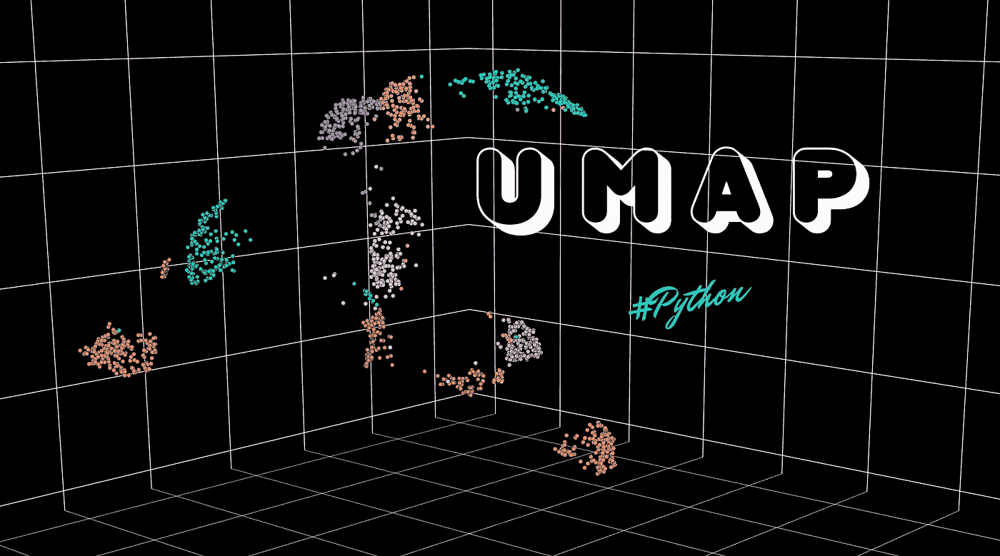
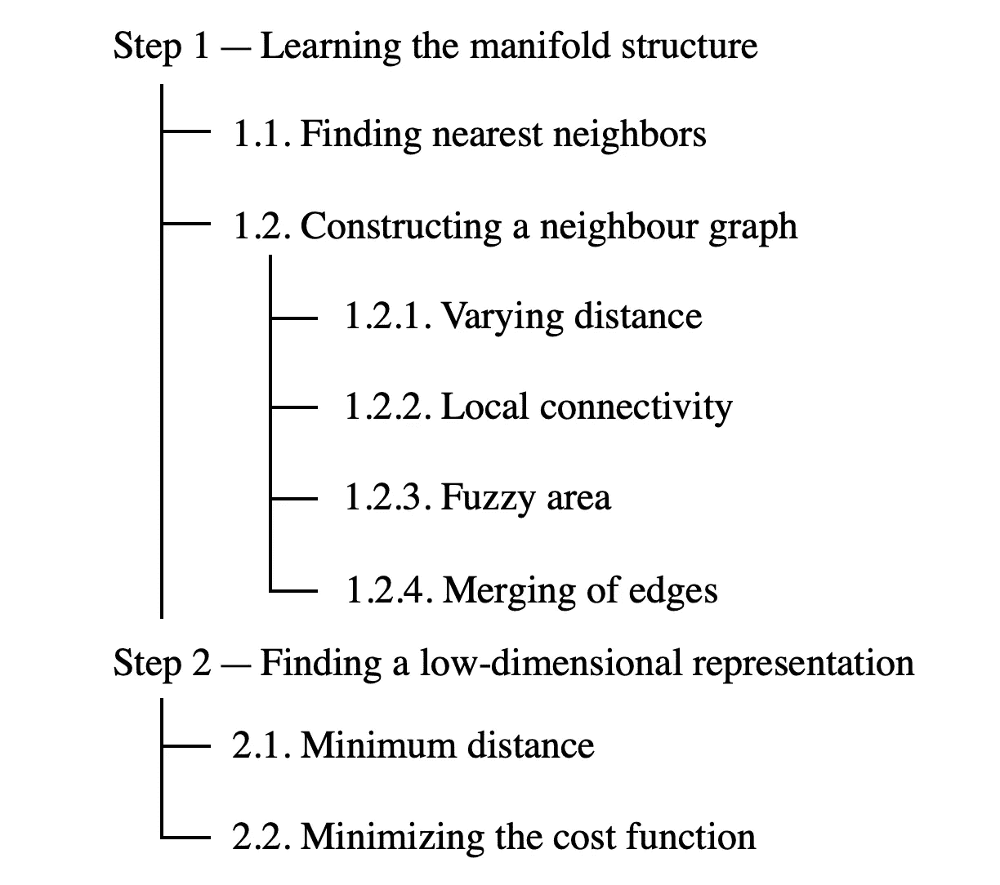
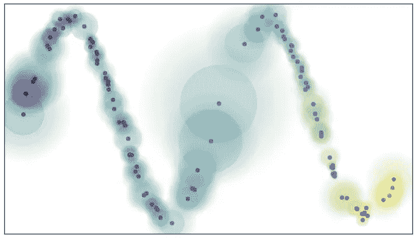
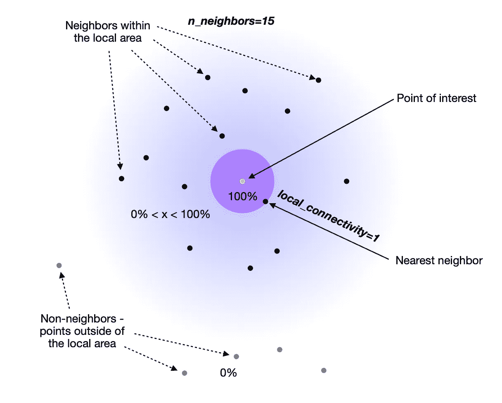
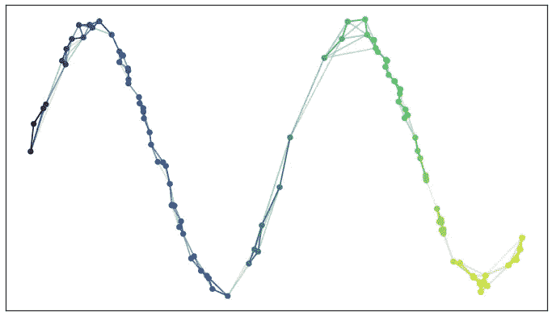
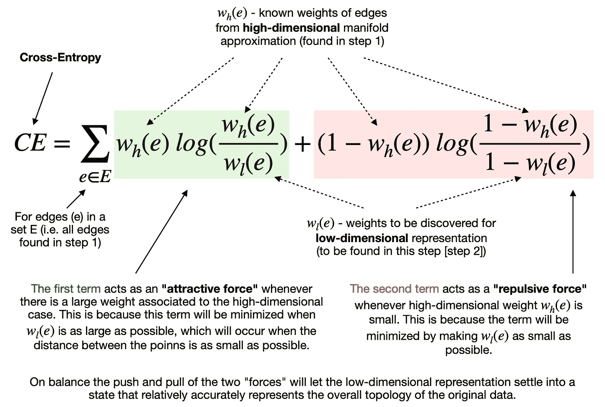
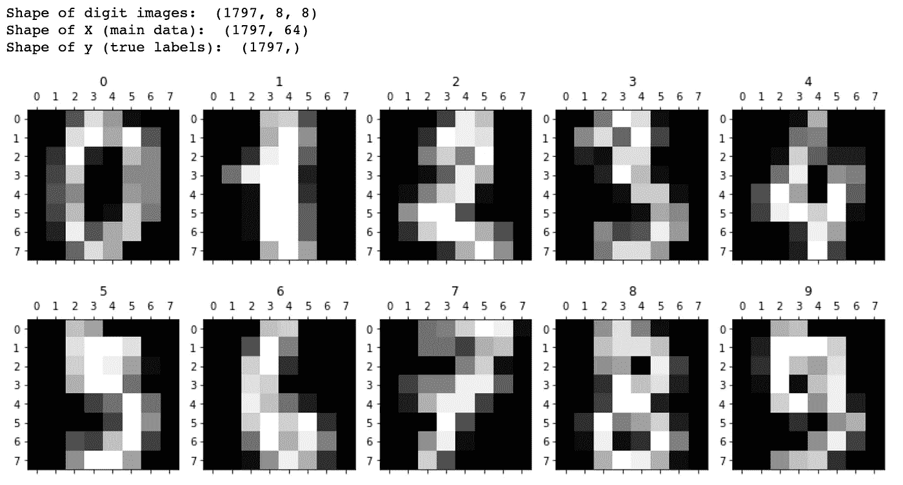
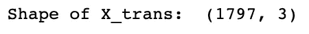
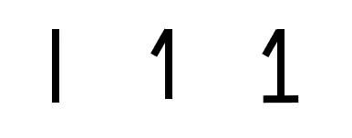
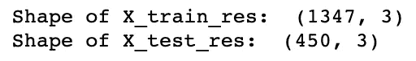

# UMAP 降维——一种非常健壮的机器学习算法

> 原文：<https://towardsdatascience.com/umap-dimensionality-reduction-an-incredibly-robust-machine-learning-algorithm-b5acb01de568?source=collection_archive---------2----------------------->

## [实践教程](https://towardsdatascience.com/tagged/hands-on-tutorials)，机器学习

## 一致流形近似和投影(UMAP)如何工作，以及如何在 Python 中使用它



一致流形近似和投影(UMAP)。图片由[作者](https://solclover.com/)提供。

# 介绍

降维不仅仅是为了数据可视化。它还可以通过识别高维空间中的关键结构并在低维嵌入中保存它们来帮助您克服“T4”维度诅咒。

本文将带您了解一种日益流行的降维技术**均匀流形逼近和投影(UMAP)** 的内部工作原理，并为您提供一个 Python 示例，可以在您从事数据科学项目时用作指南。

# 内容

*   UMAP 在机器学习算法领域的地位
*   对 UMAP 工作原理的直观解释
*   在 Python 中使用 UMAP 的例子

# 机器学习算法领域中的一致流形逼近和投影(UMAP)

下面的旭日图是我对最常用的机器学习算法进行分类的尝试。我创建它是为了满足像你我这样的数据科学家的需求，让他们有一种更结构化、更直观的方式来识别各种算法如何组合在一起。

机器学习领域的这种特殊视图使我们能够看到算法之间的相似之处和不同之处，在为特定项目寻找合适的解决方案时，这可以作为快速指南。

该图是**交互式的**，所以请确保点击👇在不同的类别上对**进行放大并揭示更多的**。

机器学习算法分类。由[作者](https://solclover.com/)创建的互动图表。

***如果你喜欢数据科学和机器学习*** *，请* [*订阅*](https://solclover.com/subscribe) *每当我发布一个新故事时，你都会收到一封电子邮件。*

虽然 UMAP 最常用于**无监督学习**，但它也可以执行**监督**降维。您将在本文结尾的 Python 部分找到一个例子。

# 一致流形近似和投影(UMAP)是如何工作的？

## 解析 UMAP 的名字

让我们从剖析 UMAP 名字开始，这会给我们一个算法应该做什么的大概概念。

> 请注意，以下陈述不是官方定义，而是一组描述，有助于我们理解 UMAP 背后的关键思想。

*   **投影** —通过将点投影到平面、曲面或直线上来再现空间物体的过程或技术。你也可以把它想象成一个物体从高维空间到低维空间的映射。
*   **近似** —该算法假设我们只有有限的一组数据样本(点)，而不是组成流形的整个集合。因此，我们需要根据可用的数据来近似流形。
*   **流形** —流形是在每个点附近局部类似欧几里得空间的拓扑空间。一维流形包括直线和圆，但不包括 8 字形。二维流形(又称曲面)包括平面、球面、圆环面等等。
*   **均匀** —均匀假设告诉我们，我们的数据样本均匀地(均匀地)分布在整个流形上。然而，在现实世界中，这种情况很少发生。因此，这个假设导致了这样一个概念，即流形上的距离是变化的。也就是说，空间本身是扭曲的:根据数据出现的稀疏或密集程度而拉伸或收缩。

综上所述，我们可以将 UMAP 描述为:

> 一种降维技术，假设可用数据样本均匀(**均匀**)分布在拓扑空间(**流形**)中，可以从这些有限数据样本中**近似**，并映射(**投影**)到一个更低维的空间。

上面对算法的描述可能会有所帮助，但对于 UMAP 是如何施展魔法的，它仍然是模糊的。因此，为了回答“如何做”的问题，让我们分析一下 UMAP 执行的各个步骤。

## UMAP 执行的高级步骤

我们可以将 UMAP 分为两个主要步骤:

1.  学习高维空间中的流形结构；
2.  找到所述流形的低维表示。

然而，我们将把它分解成更小的部分，以加深对算法的理解。下面的地图显示了我们分析每一件作品的顺序。



UMAP 的步骤和组成部分——图片由[作者](https://solclover.com/)提供。

## 步骤 1 —学习歧管结构

这并不奇怪，但在我们将数据映射到低维之前，我们首先需要弄清楚它在高维空间中是什么样子的。

**1.1。寻找最近邻居**
从使用董等人的[最近邻居下降算法寻找最近邻居开始。您将在稍后的 Python 部分看到，我们可以通过调整 UMAP 的 ***n_neighbors*** 超参数来指定想要使用的最近邻数。](http://www.cs.princeton.edu/cass/papers/www11.pdf)

试验一下 ***n_neighbors*** 的数量很重要，因为它**控制 UMAP 如何平衡数据**中的局部与全局结构。它通过在试图学习流形结构时限制局部邻域的大小来实现。

从本质上来说， ***n_neighbors*** 的小值意味着我们想要一个非常局部的解释，精确地捕捉结构的细节。相比之下，一个大的 ***n_neighbors*** 值意味着我们的估计将基于更大的区域，从而更广泛地准确跨越整个流形。

**1.2。接下来，UMAP 需要通过连接先前确定的最近邻居来构建一个图。为了理解这个过程，我们需要看几个子组件来解释邻域图是如何形成的。**

**1.2.1。变化的距离**
正如对 UMAP 名字的分析中所概述的，我们假设点在流形上均匀分布，这表明它们之间的空间根据数据看起来更稀疏或更密集的地方而拉伸或收缩。

这实质上意味着距离度量在整个空间中不是通用的，相反，它在不同的区域之间是不同的。我们可以通过在每个数据点周围绘制圆/球来可视化它，由于不同的距离度量，这些圆/球看起来大小不同(见下图)。



局部连通性和模糊开集。图片来源: [UMAP 文档](https://umap-learn.readthedocs.io/en/latest/how_umap_works.html)。

**1.2.2。局部连通性**
接下来，我们要确保我们试图学习的流形结构不会导致许多不相连的点。幸运的是，我们可以使用另一个名为***local _ connectivity***(默认值= 1)的超参数来解决这个潜在的问题。

当我们设置 ***local_connectivity=1，*** 我们告诉算法，高维空间中的每一个点都与至少一个其他点相连。您可以在上图中看到每个实心圆是如何接触到至少一个数据点的。

**1.2.3。模糊区域**
你一定注意到了上面的插图也包含了延伸到最近邻居之外的模糊圆圈。这告诉我们，当我们远离兴趣点时，与其他点的联系的确定性会降低。

最简单的方法是将两个超参数(***local _ connectivity***和 ***n_neighbors*** )视为下限和上限:

*   **local_connectivity(默认值=1)** —每个点都 100%确定连接到至少一个其他点(连接数量的下限)。
*   **n_neighbors(默认值= 15)**-点直接连接到第 16 个以上邻居的可能性为 0%，因为它不在 UMAP 构建图表时使用的本地区域内。
*   **邻居 2 至 15**-某个点连接到其第 2 至第 15 个邻居有一定程度的确定性(> 0%但< 100%)。



邻里插画。图片由[作者](https://solclover.com/)提供。

**1.2.4。边的合并**
最后，我们需要明白，上面讨论的连接确定性是通过边权重( ***w*** )来表示的。

由于我们采用了变化距离的方法，当从每个点的角度来看时，我们将不可避免地出现边缘权重不对齐的情况。例如，点 A→ B 的边权重将不同于 B→ A 的边权重


不一致的边权重。图片由[作者](https://solclover.com/)提供。

UMAP 通过合并两条边克服了我们刚刚描述的边权重不一致的问题。以下是 UMAP 文件对此的解释:

> 如果我们想合并两条权重为 *a* 和 *b* 的不一致的边，那么我们应该有一条权重为𝑎+𝑏−𝑎⋅𝑏.的边思考这个问题的方式是，权重实际上是边(1-单纯形)存在的概率。然后，组合权重是至少一个边存在的概率。

最后，我们得到一个连通的邻域图，如下所示:



*具有组合边权重的图。*图片来源: [UMAP 文档](https://umap-learn.readthedocs.io/en/latest/how_umap_works.html)。

## 步骤 2——寻找低维表示

从高维空间学习了近似流形之后，UMAP 的下一步就是把它投射(映射)到一个低维空间。

**2.1。最小距离** 与第一步不同，我们不希望在低维空间表示中改变距离。相反，我们希望流形上的距离是相对于全局坐标系的标准欧几里得距离。

从可变距离到标准距离的转换也会影响到最近邻居的接近度。因此，我们必须通过另一个名为 ***min_dist*** *(默认值=0.1)* 的超参数来定义嵌入点之间的最小距离。

本质上，我们可以控制点的最小扩散，避免在低维嵌入中许多点相互重叠的情况。

**2.2。最小化代价函数(交叉熵)** 指定了最小距离，算法就可以开始寻找一个好的低维流形表示。UMAP 通过最小化以下成本函数来实现，也称为交叉熵(CE):



最小化交叉熵成本方程。图片由[作者](https://solclover.com/)提供。

如你所见，最终目标是**在低维表示中找到边的最佳权重**。随着迭代随机梯度下降过程，上述交叉熵成本函数被最小化，这些最优权重出现。

就是这样！UMAP 的工作现在完成了，我们得到了一个数组，其中包含了指定的低维空间中每个数据点的坐标。

[](https://solclover.com/membership)[](https://www.linkedin.com/in/saulius-dobilas/)

# 在 Python 中使用 UMAP

最后，我们可以使用新获得的 UMAP 知识在 Python 中进行降维。

我们将在 MNIST 数据集(手写数字的集合)上应用 UMAP 来说明我们如何成功地分离数字并在低维空间中显示它们。

## 设置

我们将使用以下数据和库:

*   [Scikit-learn library](https://scikit-learn.org/stable/index.html)for
    1)MNIST 数字数据([load _ digits](https://scikit-learn.org/stable/modules/generated/sklearn.datasets.load_digits.html))；
    2)将数据拆分成训练样本和测试样本([train _ test _ split](https://scikit-learn.org/stable/modules/generated/sklearn.model_selection.train_test_split.html))；
*   [UMAP](https://umap-learn.readthedocs.io/en/latest/index.html) 库，用于执行降维；
*   用于数据可视化的 [Plotly](https://plotly.com/python/) 和[Matplotlib](https://matplotlib.org/stable/contents.html)；
*   [熊猫](https://pandas.pydata.org/docs/)和 [Numpy](https://numpy.org/doc/stable/index.html) 进行数据操作。

第一步是导入我们上面列出的库。

接下来，我们加载 MNIST 数据并显示前十个手写数字的图像。



前十个手写数字的图像(8×8 = 64 像素，即 64 维)。图片由[作者](https://solclover.com/)提供。

接下来，我们将创建一个绘制 3D 散点图的函数，我们可以多次重用该函数来显示 UMAP 降维的结果。

## 将 UMAP 应用于我们的数据

现在，我们将之前加载到数组 X 中的 MNIST 数字数据。X (1797，64)的形状告诉我们，我们有 1，797 个数字，每个数字由 64 个维度组成。

我们将使用 UMAP 把维数从 64 降低到 3。请注意，我已经列出了 UMAP 所有可用的超参数，并简要说明了它们的功能。

虽然在本例中，我将大多数超参数设置为默认值，但我鼓励您尝试使用它们，看看它们如何影响结果。

上面的代码将 UMAP 应用于我们的 MNIST 数据，并打印出转换后的数组的形状，以确认我们已经成功地将维数从 64 减少到 3。



新转换数组的形状。图片由[作者](https://solclover.com/)提供。

我们现在可以使用之前创建的图表绘图功能来可视化我们的三维数字数据。我们用一行简单的代码调用该函数，传递我们想要可视化的数组。

```
chart(X_trans, y)
```

**无监督 UMAP** 降维的结果。图表作者[作者](https://solclover.com/)。

结果看起来很棒，数字簇之间有清晰的分离。有趣的是，数字 1 形成了三个不同的簇，这可以用人们书写数字 1 的不同方式来解释:



数字 1 的不同写法。图片由[作者](https://solclover.com/)提供。

请注意，在底部用一个碱基书写 1 是如何让它看起来像数字 2 的。我们可以在一个由 1 组成的红色小簇中找到这些案例，这个小簇非常靠近由 2 组成的绿色簇。

## 监督 UMAP

正如本文开头提到的，我们还可以在监督下使用 UMAP 来帮助降低数据的维度。

在执行监督降维时，除了图像数据(X_train 数组)，我们还需要将标签数据(y_train 数组)传递到一个***fit _ transform***方法中(参见下面的代码)。

此外，我想让您注意到我对超参数做了一些其他的小改动，设置 ***min_dist=0.5*** 和***local _ connectivity = 2***以获得更好的可视化效果和测试样本的更好结果。



转换后的训练和测试数组的形状。图片作者。

既然我们已经使用监督 UMAP 方法成功地降低了维度，我们可以绘制 3D 散点图来显示结果。

```
chart(X_train_res, y_train)
```

**监督 UMAP** 降维结果— **训练数据**。图表作者[作者](https://solclover.com/)。

我们可以看到，UMAP 已经形成了非常紧密的每一个相隔相当远的数字集群。

我们现在为测试数据创建相同的 3D 图形，看看 UMAP 是否能成功地将新数据点放入这些簇中。

```
chart(X_test_res, y_test)
```

**监督 UMAP** 降维结果— **测试数据。**图表作者[作者](https://solclover.com/)。

正如您所看到的，结果相当不错，只有少数数字出现在错误的簇中。特别是，它看起来像算法与数字 3 斗争，有几个例子位于 7，8 和 5 的旁边。

# 结论

感谢您阅读这篇长文，我希望其中的每一部分都让您对这个伟大的算法是如何运行的有了更多的了解。

总的来说，UMAP 有着坚实的数学基础，它往往能比 t-SNE 等类似的降维算法做得更好。

秘密在于 UMAP 能够推断出**局部**和**全局**结构，同时保持低维空间中的相对全局距离。这些能力使我们能够开启特定的洞察力，例如发现数字 1 和 2 的手写形式之间的相似之处。

欢迎大家分享自己的想法和反馈，有助于我以后写出更好的文章。

干杯👏
**索尔·多比拉斯**

***如果你已经花光了这个月的学习预算，下次请记得我。*** *我的个性化链接加入媒介是:*

[](https://solclover.com/membership) [## 通过我的推荐链接加入 Medium 索尔·多比拉斯

### 作为一个媒体会员，你的会员费的一部分会给你阅读的作家，你可以完全接触到每一个故事…

solclover.com](https://solclover.com/membership) 

您可能感兴趣的其他文章:

[](/t-sne-machine-learning-algorithm-a-great-tool-for-dimensionality-reduction-in-python-ec01552f1a1e) [## t-SNE 机器学习算法 Python 中降维的利器

### 如何使用 t 分布随机邻居嵌入(t-SNE)来可视化高维数据？

towardsdatascience.com](/t-sne-machine-learning-algorithm-a-great-tool-for-dimensionality-reduction-in-python-ec01552f1a1e) [](/lle-locally-linear-embedding-a-nifty-way-to-reduce-dimensionality-in-python-ab5c38336107) [## LLE:局部线性嵌入 Python 中降维的好方法

### 详细介绍了 LLE 的工作原理，以及它与 Isomap 等类似算法的比较

towardsdatascience.com](/lle-locally-linear-embedding-a-nifty-way-to-reduce-dimensionality-in-python-ab5c38336107)