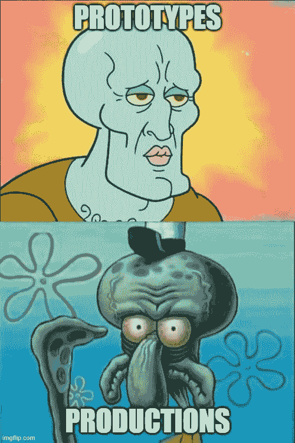
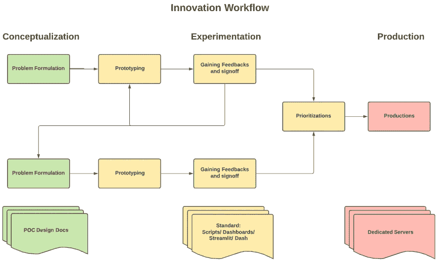
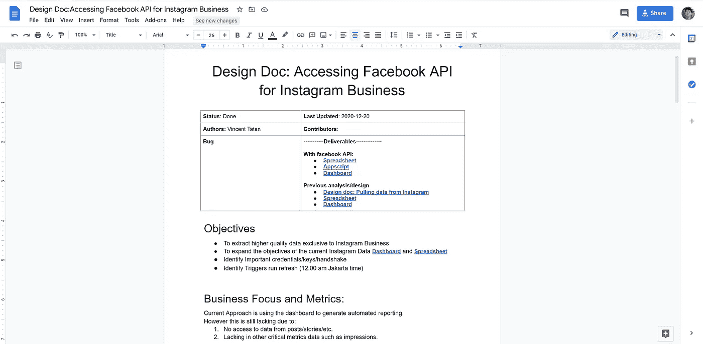
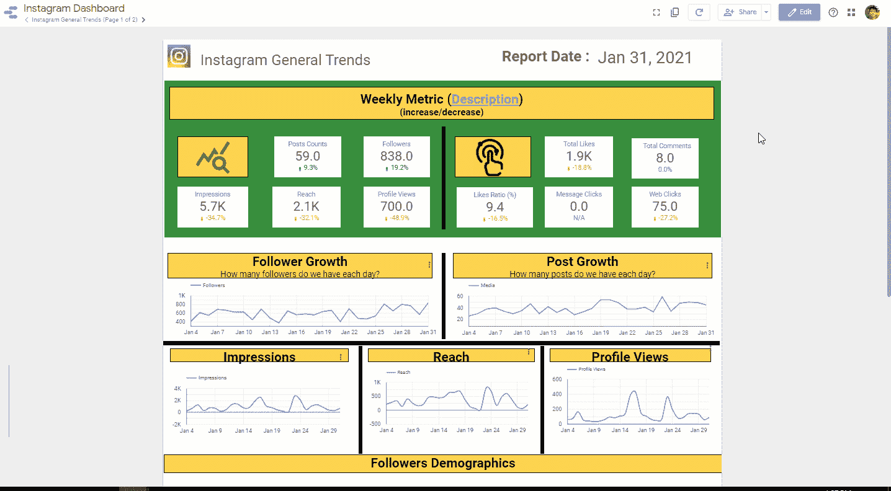
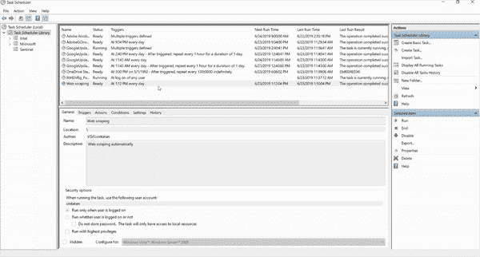

# 数据项目中的拆箱创新

> 原文：<https://towardsdatascience.com/unboxing-innovation-in-data-projects-3f8220618b1a?source=collection_archive---------49----------------------->

## 了解数据职业中的创新工作流程

来源: [Unsplash](https://unsplash.com/photos/2EJCSULRwC8)

# 问题陈述

> 我有一个用图网络的想法。我如何测试和推出这个想法？
> 
> 数据项目创新的正确步骤是什么？

几周前，[,我谈到了构建原型以使你的项目获得成功。](/how-to-effectively-set-your-data-projects-for-success-c0927c24d7aa)

> [原型将测试、说服并引导你的数据项目开花结果。](/how-to-effectively-set-your-data-projects-for-success-c0927c24d7aa) —文森特·塔坦

虽然这确实能带来项目的成功，但这还不够。你仍然需要推出你的想法来产生真正的影响。

但是不要担心…在这篇文章中，我保证给你完整的画面，缩小原型阶段，专注于创新工作流程来启动你的项目。这是基于我自己的个人经验，将有助于管理和收集支持你的实验启动。

实话实说([由作者在 memegenerator](https://imgflip.com/i/5cc6ki) 生成)

# 数据创新工作流程

作者的灵感创新工作流程(来源于作者)

## 根据我的经验，创新有三个阶段:

*   概念化:制定问题陈述和计划，确保你不会在失败的实验上投入太多时间。
*   **实验:**原型实验以获得反馈和认可，从而产生新的想法并进行优先排序。
*   **生产:**在相关利益相关方的大力支持下，启动 ML 应用。

> 让我们一个一个深入挖掘！

# 概念化

[我为 Yayasan Merajut Hati](https://docs.google.com/document/d/12ridJk1BtL-alomt3XXnLG_GZ68NzP6C82Ihy3M8fA8/edit#) 创建的设计文档样本(来源于作者)

设计文档提供 [**概念灯塔来指导你的数据项目**](/the-undeniable-importance-of-design-docs-to-data-scientists-421132561f3c) 。你应该在一开始就用这个来清楚地表达你的问题。

> 你为什么需要设计文档？因为好处是多方面的。

**设计文档从概念上指导** **你**在每一个步骤中理解你的目标、影响和执行，以使利益相关者受益。在执行之前，设计来突出实现和替代解决方案可以节省你**的时间。它**主持团队之间的讨论**以集思广益出最佳解决方案，而**作为永久的工件**来巩固你对未来合作的想法。**

这里有一些关于如何开始的简单结构

1.  **目标:**你为什么要建这个？
2.  **最低可行产品:**对你的受众来说，什么是重要的？
3.  **研究和探索:**有什么时间和资源可以利用？
4.  **里程碑和成果:**能够实现什么，已经实现了什么？
5.  **TL:DR(太久没看):**有什么总结？

> 拥有初步设计文档将突出当前的检测差距，并在着手解决之前集思广益寻找潜在的解决方案。

# 实验

## 1)原型制作

[为 Yayasan Merajut Hati(心理健康组织)创建的原型](/the-quickest-analytics-to-build-your-instagram-business-b7b3c5d68056)(来源于作者)

使用设计文档，如果某种方法可行，我们就创建原型进行反复试验。 [开发一个原型有很多种方法，但是让我和你们分享其中的几种:](/how-to-effectively-set-your-data-projects-for-success-c0927c24d7aa)

Web dashboard(最简单):你可以设计快速的数据片段和实验，然后将结果存储到 Google Big Query 中。之后，你可以免费使用 [Google Data Studio](/the-basic-of-google-data-studio-72081f247220) 快速查询和显示见解。

**Web 应用:您可以进一步使用 Heroku** **快速部署您的原型。** Heroku 是一个广泛使用的商业软件平台(PaaS ),它使数据专业人员能够更轻松地构建、管理和部署各种规模的应用程序。这意味着您现在可以专注于开发分析应用程序，而无需担心部署基础架构。Heroku 为您处理所有部署的繁重工作！

> 所有原型都可以更快地交付，因为您可以复制和修改您的前端代码和部署步骤。

## 2)获得反馈并签字确认

获得高级开发人员/技术领导的认可至关重要。这为你的同事建立了合作的信心。

**这可以通过回答以下检查问题来完成:**

1.  **价值:**我正在解决我陈述的问题吗？
2.  **有效性:**所有的假设和评价都是基于证据吗？
3.  **错综复杂**:它如何与上游/下游应用程序对话？
4.  **清晰**:所有信息都是用 KISS 写的吗(保持简洁明了)？
5.  **支持:**启动该应用程序需要什么支持？

> 在大多数情况下，您将需要迭代您的原型和问题公式，直到您得到您需要进一步优先考虑最小可行产品(MVP)的信号。

## 3)优先级

如果一个经过验证的原型给你的利益相关者带来了承诺和巨大的好处(例如:一个高效的图像检测系统)，那么我们希望分配更多的资源，如时间和人力。

不幸的是，在现实生活中，时间和人力是有限的。在某些情况下，你会发现自己在做 2 个、3 个甚至更多的项目。因此，您需要向您的利益相关者传达**以下优先化练习:**

1.  这个解决方案如何放在我的 OKRs(客观关键结果)中？
2.  我应该为这个项目分配多少时间(人力)？
3.  表示成功的最小可行产品(MVP)是什么？

> 如果出现其他数据项目，拥有一份可靠的优先级文档将有助于您维护您需要的优先级和资源。

# 生产

[使用任务调度程序运行 Web 抓取脚本，然后将其附加到 SQLite 磁盘](/automate-your-python-scripts-with-task-scheduler-661d0a40b279)(由作者提供)

一旦优先级文档被批准。您将有专门的时间和支持来将您的实验结果投入生产。

**最简单的工作**是[用 **Windows 任务调度器启动一个小规模的基于 python 的自动化工作流**](/automate-your-python-scripts-with-task-scheduler-661d0a40b279)。这有助于您管理任务，以响应基于事件或基于时间的触发。例如，您可以建议某次点击和计算机操作(如重新启动)，甚至建议像每季度第一天的*这样的时间来执行任务。*

**但是如果要部署可扩展的 ML 项目**。你[需要使用 ML Operations (ML Ops)来维护、监控和管理你预想的影响](/intro-to-mlops-ml-technical-debt-9d3d6107cd95)。[谷歌经常使用 TFX 来启动、操作和审计人工智能模型](/intro-to-ml-ops-tensorflow-extended-tfx-39b6ab1c7dd7)。

不要忘记评估你发布的结果，并链接回你的问题公式。这将成为你的创新成功记录，并为你将来获得更好的职业机会做好准备。

> 启动您的创新，实现真正的价值。

# 结论:创新带来真正的影响

重要的是通过以下方式实现您的想法并传递共享的影响以推进您的职业发展:

*   概念化:制定问题陈述和计划，确保你不会在失败的实验上投入太多时间。
*   **实验:**原型实验以获得反馈和认可，从而产生新的想法并进行优先排序。
*   **生产:**在相关利益相关方的大力支持下，启动 ML 应用程序。

> 我希望这能帮助你更好地理解数据职业中的创新。

索利·德奥·格洛丽亚

# 关于作者

文森特用 ML @ Google 对抗网络滥用。文森特使用高级数据分析、机器学习和软件工程来保护 Chrome 和 Gmail 用户。

除了在谷歌的工作，文森特还是[乔治亚理工学院计算机科学硕士校友](/5-biggest-tips-to-juggle-work-and-study-as-data-scientists-7cad143f10a)、三项全能运动员和[面向数据科学媒体的特约作家，该杂志在全球拥有 100 多万观众，为有志于数据科学的人和数据从业者提供指导](https://medium.com/@vincentkernn)。

最后，请通过[**LinkedIn**](http://www.linkedin.com/in/vincenttatan/?source=post_page---------------------------)**、**[**Medium**](https://medium.com/@vincentkernn?source=post_page---------------------------)**或** [**Youtube 频道**](https://www.youtube.com/user/vincelance1/videos?source=post_page---------------------------) 联系文森特