# 用石灰打开黑匣子

> 原文：<https://towardsdatascience.com/unboxing-the-black-box-using-lime-5c9756366faf?source=collection_archive---------23----------------------->

## 利用新冠肺炎数据了解石灰的内部结构

压榨石灰(资料来源:Unsplash)

# 可解释的人工智能(XAI)

随着模型复杂性的增加，其准确性会增加，但可解释性会降低。大多数复杂的数学机器学习模型不容易解释，并且作为黑箱运行，很难解释某些预测背后的原因。

可解释的人工智能(XAI)是指帮助理解和解释机器学习模型所做预测的方法和技术。

可解释的人工智能框架的应用使企业能够以“白盒”方式应用更健壮和复杂的解决方案。

可解释的人工智能提供了一个事后预测的理由。

# 什么是石灰？

LIME 代表局部可解释的模型不可知解释，可以描述如下。

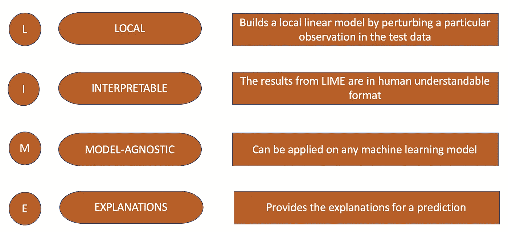

LIME 是一种帮助解释个人预测的可视化技术。它是模型不可知的，因此它可以应用于任何监督回归或分类模型。LIME 是由马尔科·图利奥·里贝罗、萨梅尔·辛格和卡洛斯·盖斯特林在 2016 年提出的。

在 LIME 的工作原理背后，隐藏着一个假设:每一个复杂的模型在局部尺度上都是线性的。LIME 试图围绕单个观察值拟合一个简单的模型，该模型将模拟全球模型在该地区的行为。然后，简单模型可以用来解释更复杂模型的局部预测。

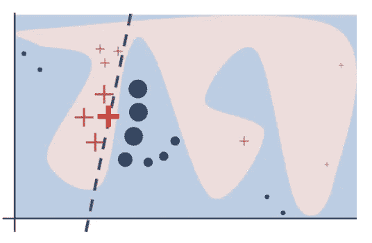

**举例说明石灰的直觉。**来源:[https://arxiv.org/pdf/1602.04938.pdf](https://arxiv.org/pdf/1602.04938.pdf)

在上面关于石灰的论文的例子中，暗红色的十字代表要解释的观察结果。LIME 对实例进行采样，使用预测器获得预测，并通过与被解释的实例的接近程度(这里用大小表示)对它们进行加权。虚线是局部(而非全局)可信的学习解释。

LIME 支持三种类型的输入格式，表格数据、文本数据和图像数据。在本文中，我们将探索 LIME 支持的表格数据格式。

# 了解 LIME 算法

在高层次上，以下步骤是作为 LIME 算法的一部分来执行的。稍后，我们将通过案例研究中的一个示例详细介绍这些步骤。

1.  创建扰动的数据
2.  预测扰动数据的输出
3.  创建离散化要素
4.  求扰动数据到原始观测值的欧几里德距离
5.  将距离转换为相似性得分
6.  选择模型的前 n 个特征
7.  创建一个线性模型并解释预测

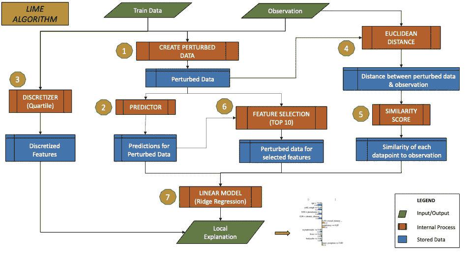

石灰算法—流程(图片由作者提供)

# 案例研究—预测患者是否会康复

我们将使用新冠肺炎数据集来说明 LIME 如何在内部创建对观察结果的解释。

## 问题陈述

本案例研究的目标是使用患者的详细信息，如年龄、性别、症状，并预测患者是否会康复。

## 数据

所使用的数据可以在这个 [Github 仓库](https://github.com/beoutbreakprepared/nCoV2019)中获得。该数据包含新冠肺炎病毒检测呈阳性的患者的详细信息，以及他们的人口统计信息、年龄、性别、症状和结果。

利用这些数据，我们将建立一个模型，在给定患者的年龄、性别和症状的情况下，该模型可以预测患者康复的可能性。一旦模型建立，我们将使用石灰来解释为什么模型做出了特定的预测。

本文中使用的数据集和代码可以在文章结尾提到的 git repo 中访问。

## 数据预处理

下载的数据集有 2676311 个数据点和 33 个特征。听起来很庞大，但做基本的分析表明，它有很多缺失的数据。14 个特征有超过 90%的数据缺失，21 个特征有超过 50%的数据缺失。

由于目标是使用年龄、性别、症状等特征来预测患者康复的可能性，因此必须对包含这些信息的数据行进行过滤。过滤数据后，最终行数减少到 215 行。

数据中缺少许多功能，如坐标、管理区域、日期信息，也不是本案例研究所必需的。在删除这些特性后，最终所需的特性集减少到了 6 个。

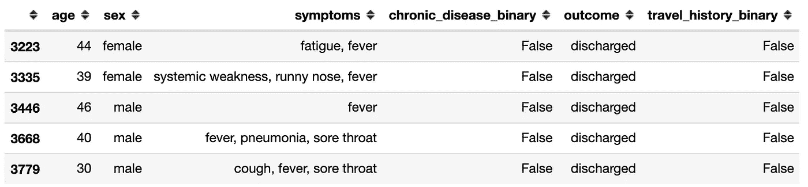

样本数据(图片由作者提供)

## 为“症状”创建特征

每个病人的症状被描述为一个自由文本。对于有多种症状的患者，条目以逗号分隔。基于症状中的关键字，为每个症状创建了标志。

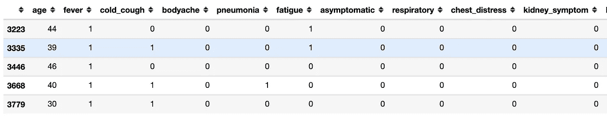

症状标志示例(图片由作者提供)

## 创建目标变量

该数据集包含新冠肺炎病毒检测呈阳性的患者的详细信息。数据集有一个不同状态的结果列，如“出院”、“危急情况”、“稳定”、“死亡”等。对于本案例研究，我们将创建一个目标列“recovered”，如果结果为以下之一，该列将为 0:“dead”、“dead”、“death”、“dead”。在所有其他情况下，假设患者已经康复，目标将设置为 1。

根据结果创建目标(图片由作者提供)

## 创建虚拟变量

为性别、旅行史、慢性病等分类列创建虚拟变量。

## 探索数据

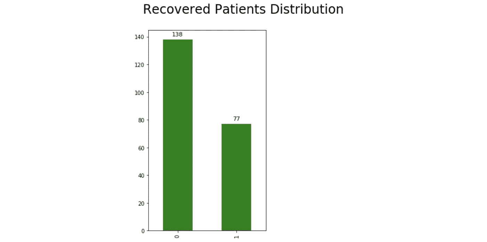

**目标变量**的分布(图片由作者提供)

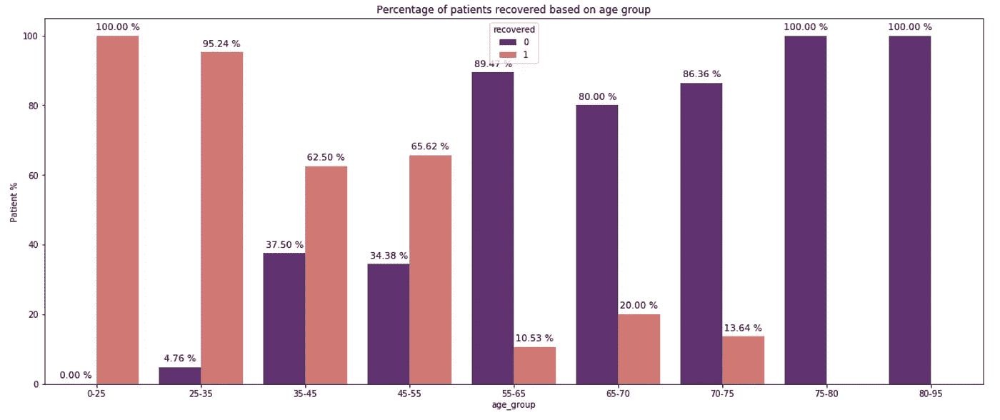

**基于年龄组的康复患者百分比**(图片由作者提供)

年龄正在影响目标变量。随着年龄的增长，从新冠肺炎病中康复的患者比例逐渐降低。

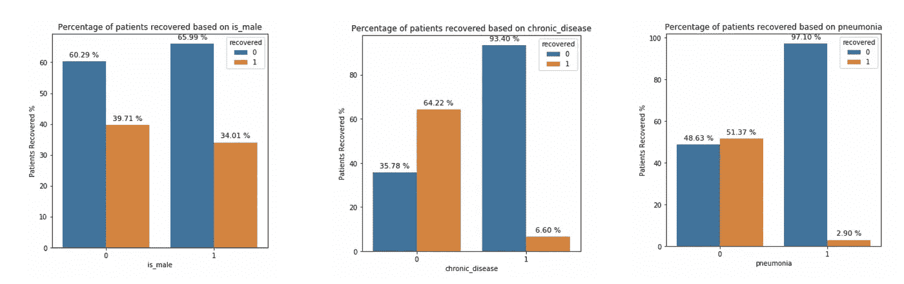

**根据性别、慢性病标记和肺炎标记恢复的患者**(图片由作者提供)

从这张图表来看，似乎性别在决定最终目标时并没有起多大作用。但慢性病和肺炎等变量似乎对目标有更大的影响。患有慢性疾病或肺炎的患者康复的机会较低。

当用相关矩阵检查时，可以对这些变量做出类似的推论。

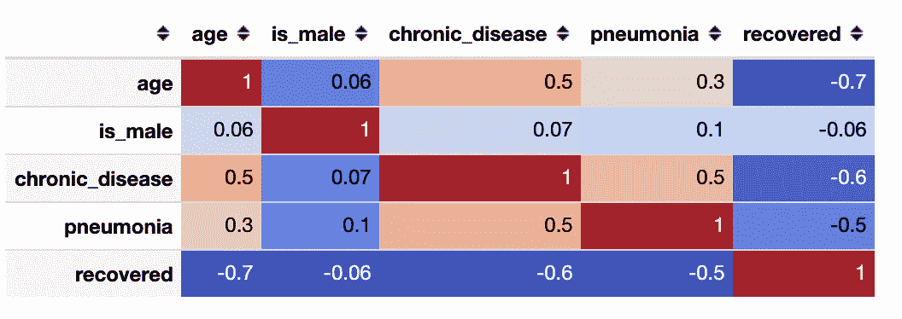

**与恢复的旗帜**的相关矩阵(图片由作者提供)

这里显示了基本的探索性数据分析。有关更详细的 EDA，请参考 git repo 中的笔记本文件。

## 列车测试分离

预处理后的最终数据有 215 个病人的详细资料，包括 15 个特征(包括目标变量)。分层分割以 70:30 的训练-测试比率应用于该数据。

**训练测试分割后的输入数据**(图片由作者提供)

## 训练一个模型——随机森林分类器

下一步是在训练数据集上训练模型，并针对测试数据集运行它。这里我们使用了随机森林分类器。将它与测试数据进行比较，得到了 78%的 R2 分数。

训练随机森林分类器

# 解释预测——石灰

现在，我们已经清理了数据，训练了模型，并对测试数据进行了预测，我们已经到达了本文的核心，即解释模型所做的预测。

LIME 是模型不可知的，下面解释的算法的方法和内部工作对于其他模型也是相同的。

## 1.为表格数据创建时间解释器

## 2.解释一个特殊的预测

## 示例 1—观察结果 1

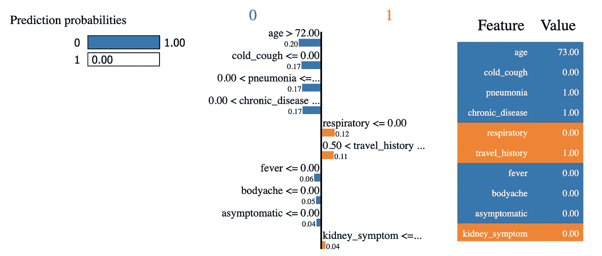

**示例 1:观察值 1 的石灰输出(实际值= 0，预测值= 0)** —图片由作者提供

LIME 围绕要解释的观察结果创建了一个局部替代模型，并使用该模型的系数来识别最具影响的特征，由于这些特征，已经做出了特定的预测。

观察上述结果，很明显，该模型根据年龄和其他症状(如肺炎、慢性病)预测了患者可能无法康复。尽管患者没有呼吸问题，其具有正系数，但是其他负系数超过这些，因此模型预测恢复标志为 0。

## 示例 2 —观察结果 3

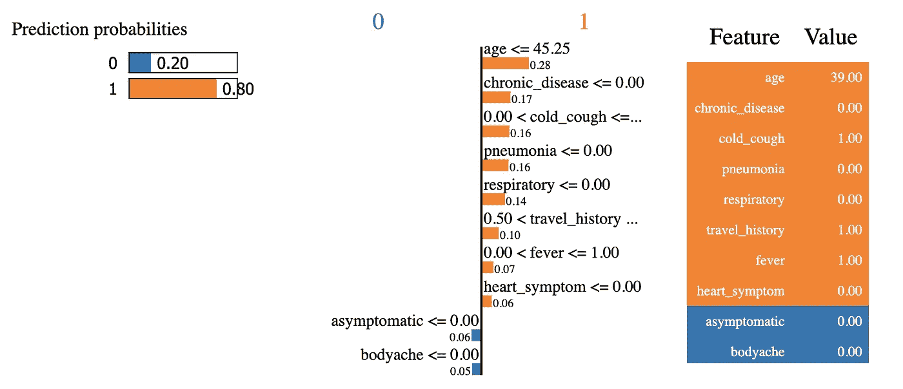

**示例 2:观察 1 的石灰输出(实际= 1，预测= 1)** —作者提供的图片

例 2 是模型预测值为 1，真实值也为 1 的情况。如结果所示，该模型已经基于患者的年龄(年轻患者更有可能康复并且对康复的标志具有积极影响)做出了预测，该患者没有肺炎或呼吸问题，或者慢性疾病。因此，患者更有可能康复，并且模型已经基于这些变量做出了预测。

从上面的两个例子可以看出，查看 LIME 的结果可以让我们更容易地解释模型做出的预测，并以人类可以理解的格式向他人解释它们。

# 解码 LIME 算法

如前所述，LIME 算法中执行了 7 个关键步骤。

在这一节中，我们将深入 LIME 算法的内部，以理解它是如何得出如上所示的最终解释的。我们将观察值 1 作为例子来理解这个流程。

1.  创建扰动的数据
2.  预测扰动数据的输出
3.  创建离散化要素
4.  求扰动数据到原始观测值的欧几里德距离
5.  将距离转换为相似性得分
6.  选择模型的前 n 个特征
7.  创建一个线性模型并解释预测

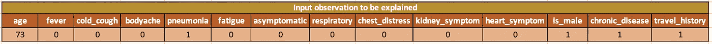

## 步骤 1:创建扰动的数据

对于要解释的观测值，扰动(扰乱或扰乱)观测值 n 次，以创建具有轻微值修改的复制要素数据。这种受干扰的数据是围绕观察值创建的假数据，将被 LIME 用来建立局部线性模型。

要在扰动数据中创建的样本数量对于解释者来说是一个超参数，并且可以调整。默认值设置为 5000。

## 扰动数据的创建

*   对于分类变量，随机值是根据可能的类别值及其在训练数据集中的出现频率选取的。对于分类变量(数据)，扰动数据的值为 0 或 1。如果类别与要解释的观察结果相同，则为 1，否则为 0。
*   对于连续变量，根据训练数据中的平均值和标准偏差，通过从正态(0，1)分布采样并执行平均值居中和缩放的逆操作来扰动数据

**注**:扰动数据的第一个条目将始终是输入观测值，其预测必须得到解释。

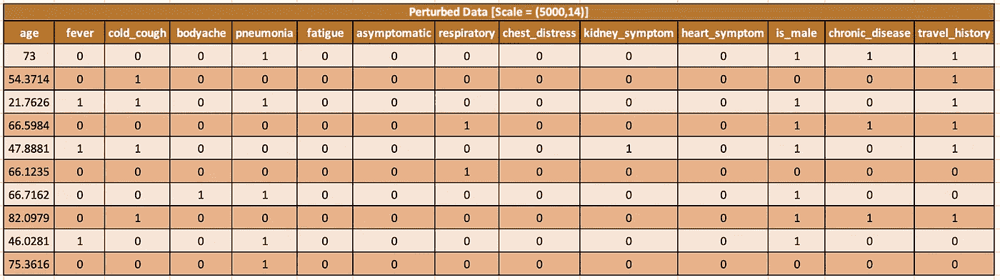

**扰动数据样本(10 行，实际= 5000 行)** —图片由作者提供

## 步骤 2:预测扰动数据的输出

LIME 使用模型的预测函数对扰动数据进行预测。这些预测用于训练由 LIME 建立的局部线性模型。

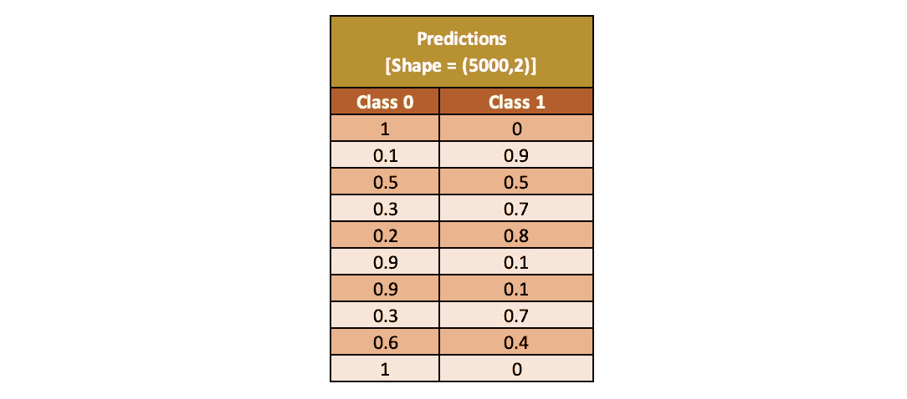

**对扰动数据(10 行)进行预测的示例** —图片由作者提供

## 步骤 3:创建离散化特征

LIME 在内部将连续变量转换为离散变量，以便它们是人类可解释的格式。这是可配置的，默认情况下，连续变量是离散化的。LIME 支持以下 3 种类型的离散化器:四分位数(默认)、十分位数和熵。变量值的范围将因离散化器而异。

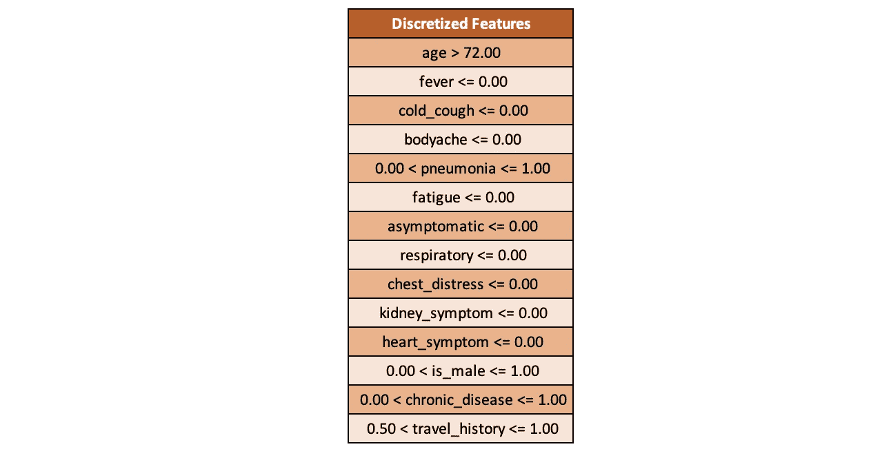

来自四分点离散化器的离散化要素-作者提供的图像

## 步骤 4:找出扰动数据的欧几里德距离

将扰动数据(本例中为 5000 个)中的每个数据点与原始数据点进行比较，并确定两个数据点之间的欧几里德距离。欧几里得距离将给出该点离原始观测值有多远的概念。较小的距离意味着数据点离观测值更近。

## 步骤 5:将距离转换为相似性得分

欧几里德距离被转换成介于 0 和 1 之间的相似性得分。点离观察点越近(欧几里德距离越小)，相似性得分越高。远离观察的点将具有较小的相似性得分。在下面的示例中可以看到同样的情况。

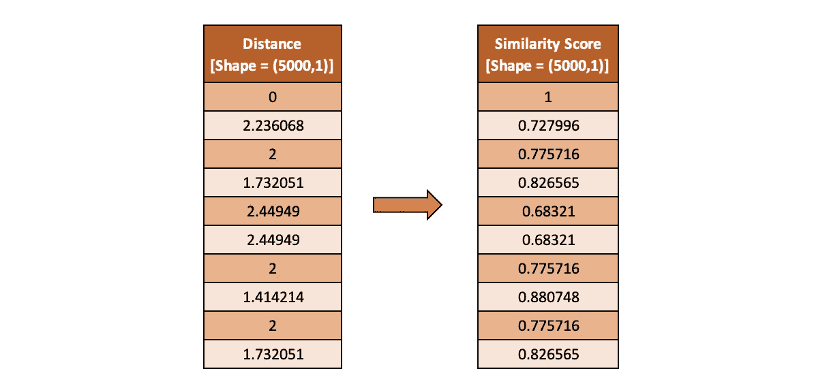

**欧几里得距离及其相似性得分的样本(10 行)** —作者提供的图片

请注意，由于扰动数据中的第一个数据点是输入观测值本身，因此它的距离为 0(最接近观测值)，相似性得分为 1(与观测值完全相同)。

## 步骤 6:为模型选择前 n 个特征

该模型可以用许多变量运行，我们可能只对影响预测的前 n 个特征感兴趣。这个 n 值可以在 LIME 解释器中进行调整。

LIME 支持标准的特征选择技术，如最高权重、前向选择和套索路径。以下是 lime 支持的功能选择选项。

*   **最高权重**-对包含所有要素的缩放数据运行岭回归，并挑选权重最高的前 n 个要素
*   **正向选择** —迭代地将特征添加到模型中，并识别在山脊模型上给出最佳分数的特征。
*   **套索路径**-基于套索正则化路径选择要素
*   **无** —考虑所有特征
*   **自动** —如果 num_features (m) < = 6，则向前选择其他最高权重

**根据最高权重选出的前 10 个特征**(图片由作者提供)

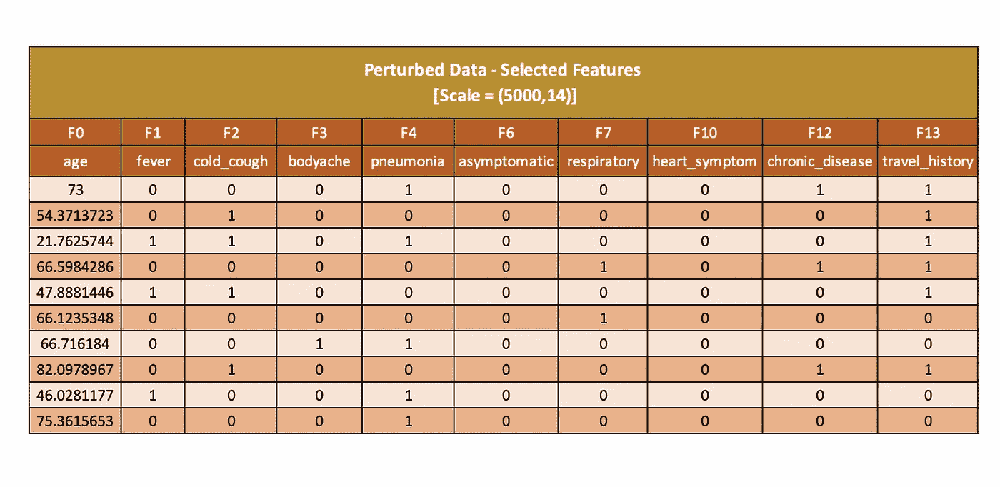

**选定的 10 个特征的扰动数据**(图片由作者提供)

## 步骤 7:创建一个线性模型并解释预测

准备好所有输入数据后，LIME 现在可以创建可用于解释预测的本地线性模型。来自线性回归模型的系数或权重用于解释观察的局部行为。

## 选择线性回归模型

*   对局部线性模型的唯一要求是，它应该与加权输入一起工作，并且应该是可解释的
*   这里的权重是基于扰动观察到原始观察的距离计算的相似性得分。接近原始观察值的实例将具有较高的权重
*   默认情况下，岭回归用作可解释模型
*   LIME 支持任何 sci-kit 学习模型，只要它将 model_regressor.coef_ 和“sample_weight”作为 model_regressor.fit()的参数

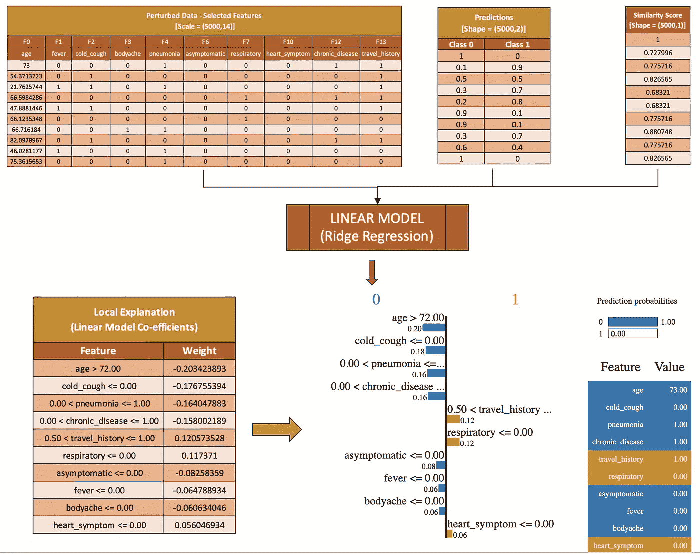

**根据扰动数据训练的线性模型得出的解释** —图片由作者提供

如上图所示，LIME 的最终输出只是线性模型中要素的权重。权重为正的要素将目标推向 1，权重为负的要素将目标推向 0。此外，这种线性模型的特点是以人类可以理解的格式，使任何人都很容易解释为什么一个特定的预测已经由模型。

# 比较不同模型的解释

LIME 也可以用于模型之间的比较。例如，影响随机森林模型所做预测的特征可能不同于逻辑回归或决策树模型。

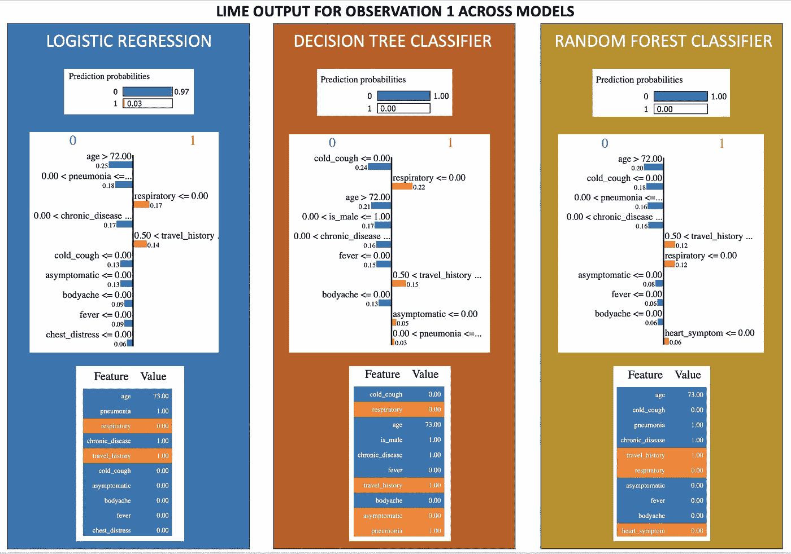

相同观测在不同模型上运行的石灰输出-图片由作者提供

上图显示了 3 个不同模型的 LIME 运行结果，这些模型在相同的数据上进行训练，并运行相同的测试观察。

从结果中可以看出，影响最大的特性因模型的算法而异。对于这个特定的观察，逻辑回归和随机森林给年龄赋予最高的权重，而年龄在决策树分类器中排名第三。

# 结论

LIME 不仅有助于模型创建者向其他利益相关者解释预测，而且有助于在模型开发期间调试和比较模型。

尽管 LIME 是模型不可知的，但它在某些情况下可能会失败。当 LIME 基于高斯分布在观察位置周围创建自己的样本数据时，可能会创建一些“不太可能”的数据点，模型已经学习了这些数据点。此外，如果决策边界过于非线性，线性模型可能无法很好地解释它。结果还取决于为扰动数据调整的数据点数和用于查找最近点的内核宽度。

总之，选择正确的参数，石灰应该给出良好的局部解释，但同时需要注意避免上述潜在的陷阱。

# 数据和代码参考

本案例研究中使用的数据集引用自[此处](https://github.com/beoutbreakprepared/nCoV2019)。

参考 git repo 获取本文使用的数据和代码:[新冠肺炎分类 XAI](https://github.com/Lakshmi-1212/Covid19_Classification_XAI)

# 来源/参考

*   **论文:**[https://arxiv.org/abs/1602.04938](https://arxiv.org/abs/1602.04938)
*   **源代码:**【https://github.com/marcotcr/lime】T2
*   **LIME 简介:**[https://compstat-lmu . github . io/IML _ methods _ limits/LIME . html](https://compstat-lmu.github.io/iml_methods_limitations/lime.html)
*   **了解 lime:**[https://cran . r-project . org/web/packages/lime/vignettes/Understanding _ lime . html](https://cran.r-project.org/web/packages/lime/vignettes/Understanding_lime.html)