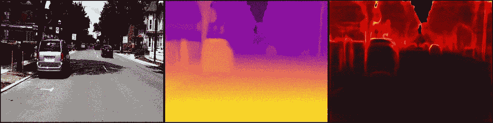
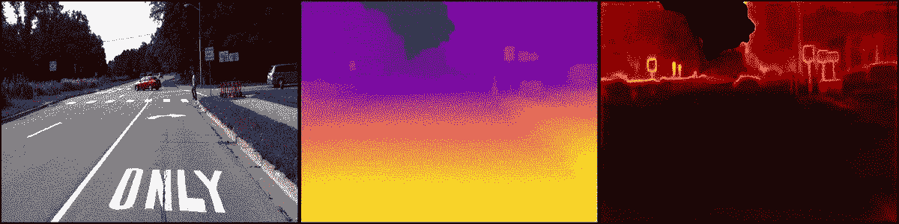
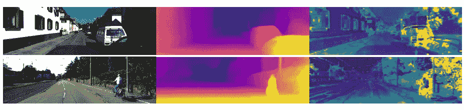
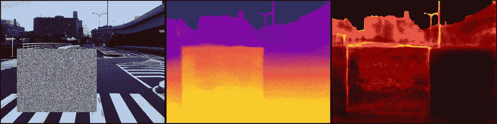
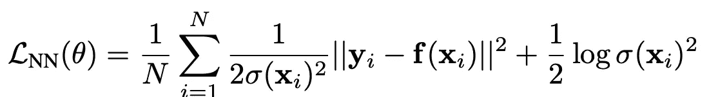
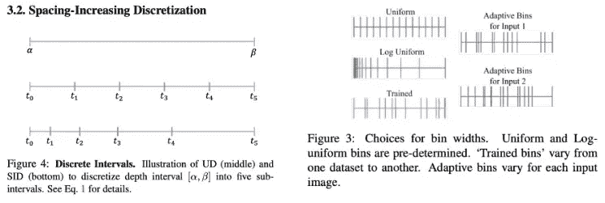
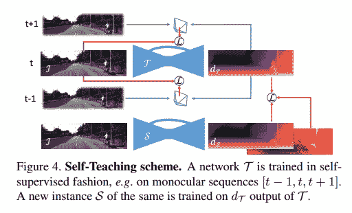
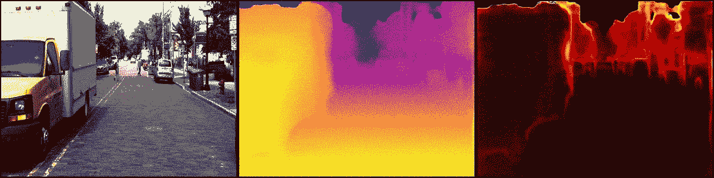

# 深度估计的不确定性

> 原文：<https://towardsdatascience.com/uncertainty-in-depth-estimation-c3f04f44f9?source=collection_archive---------14----------------------->

## 你对你预测的深度有把握吗？



来自 DDAD 数据集的数据。上图:图片。中:悬殊。底部:不确定性

# 那么我们为什么需要 AI 系统对不确定性建模呢？

这里有一些引语，可以让你在不钻研数学的情况下进行思考。

> 知道自己不知道，比认为自己知道并根据错误信息行动要好。
> 
> 如果你没有观察/经历过新的信息，就不要理直气壮地给出预测！

借助心理学的直觉，让我们考虑两种情况:

*   当我们遇到新事物时，我们变得更加忧虑和保守。只有在我们熟悉了新的情况并收集了额外的信息后，我们才能获得信心。
*   只有在经历过类似的事情之后，我们才会对自己的行为和对世界的理解越来越有信心。当我们在熟悉的环境中看到不同的事物时，我们往往会更加警惕。例如，一个近视的人忘记戴眼镜或隐形眼镜，在街上就要加倍小心！

上述两个观察结果应该给我们以下启示:

1.  当我们经历和重复这个动作时，我们获得了自信
2.  我们明白，如果我们遇到新的情况，我们应该不那么确定

同样，我们希望赋予我们的人工智能系统这样的推理能力。在需要的时候更加规避风险。有能力评估一个情况，给我们一个连续的答案，而不是一个二元的答案。我们绝对不希望他们根据错误解读的信息做出决定，这可能会导致生死攸关的局面！

现在，从统计学和机器学习的角度来看。通过从概率的角度构建学习问题，可以从 ML 模型中捕获观察值。这包括 **MLE、MAP、贝叶斯推理、**的概念，它迫使模型预测它认为正确的值、**期望值**以及模型对其预测的确定程度、**方差**。一个理想的 ML 模型应该能够准确地捕捉所有场景的这两个信息。

然而，挑战是存在的，因为在许多情况下，方差并不总是能够正确预测。因此，使用概率方法推理不确定性的目的是:

*   阻止模型自信地预测它以前没有观察到的东西— **认知不确定性**
*   即使观察到数据，固有的不明确、有噪声的数据应导致预测值及其相关的不确定性— **随机不确定性**

在本文中，我们将讨论不确定性的用例，以及它如何具体应用于深度估计问题。然后，我们将经历某些类型的场景，在这些场景中，应该对不确定性进行推理，并对预测不确定性的相关研究方法进行概述。



# 不确定性的应用

不确定性估计在机器学习系统的各个领域中扮演着重要的角色。它可用于:

*   主动学习:不确定性或其互补熵可以成为从大海捞针中提取有用数据的有效技术
*   **伪标签/自训练**:只有模型对其预测有把握，才能通过预测标签获得更多的标注数据
*   **识别有噪声的/看不见的/被破坏的数据**:当遇到这些情况时，模型应该在其预测中更具防御性。黄的这篇论文展示了如何利用物理和数字操作来欺骗模型，产生错误的和高度确定的预测。因此，迫切需要调查 dnn 的可解释性和不确定性，以便能够在安全关键环境中信任它们
*   **安全关键 ML 系统中的实时部署**:从模型输出中识别故障模式，并随后决定适当的行动方案

# 深度估计中的应用

除了上面提到的以外，下面还会提到具体的使用案例。

## 飞行像素去除

不确定性估计在去除“飞行像素”方面是有效的。尤其是在深度不连续和远处物体的区域中。我们预计这个区域本质上是不明确的，如下面的视频和相关论文中所描述的。

## 自我监督培训

正如在[之前的文章](/self-supervised-depth-estimation-breaking-down-the-ideas-f212e4f05ffa)中所讨论的，亮度恒常性假设通常在非朗伯曲面、镜头眩光等区域不成立。当计算光度损失时，这将影响并错误地惩罚模型。在这项[工作](https://arxiv.org/pdf/2003.01060.pdf) DV3O，CVPR2020 中，建模不确定性改善了结果。



此外，来自 SFM 的 DV3O 和 [SFM，ECCV2018](https://www.robots.ox.ac.uk/~vgg/publications/2018/Klodt18/klodt18.pdf) 研究了学习方差的使用，该方差可用于通过抑制由学习不确定性捕获的噪声区域来分别改善视觉里程计和 SFM 的任务。

# 模型应该展示的行为类型

举几个本能的例子，我们预计我们的模型对以下情况的预测深度不太有信心:



更远的像素具有更高的不确定性。模拟任意高斯噪声扰动。

*   **图像上有噪声、失真的伪影**:这可能是由于成像传感器故障、刮伤镜头、外部剧烈的相机运动/扰动或环境(灰尘、天气)引起的。当无法在全球范围内收集足够的背景信息时，这一点变得更加突出
*   **反射/透明物体**:训练时模型拾取的东西可能不明确。是否估计透明/镜面或后面可见或被反射的物体的距离
*   **物体边界和被遮挡区域，深度不连续**
*   **距离分辨率有限的摄像机**较远的像素

# 深度估计中的建模不确定性

上述行为取决于两个显著的不确定性(**任意的**和**认知的)**，并由 [Kendall，NIPS 2017](https://proceedings.neurips.cc/paper/2017/file/2650d6089a6d640c5e85b2b88265dc2b-Paper.pdf) 引入计算机视觉任务。

## 任意不确定性

*不确定性形式化为模型输出的概率分布*

这是它在**观察到的**输入数据的不确定性。这种推导对于线性回归是常见的，线性回归的目标是**最小化负对数似然**。目标是在训练模型之后训练模型变得对任务有信心，并回归所有可能深度值的分布。

下面为您提供了最大似然估计的摘要。

1.  目标是确定一组模型参数**θ**，其最佳地描述了在训练集> `Θ = argmax_Θ likelihood`中的图像数据的条件下观察深度目标的**可能性**
2.  `likelihood = p(y0, y1, ..., yn | x0, x1, ..., xn; Θ)`描述了在给定所有训练数据 X 的情况下观察所有深度目标的概率
3.  这个联合条件概率在数学上很难计算。上述等式可以通过 **1** 简化，假设独立采集图像并应用 I.I.D .假设。 **2)** 利用条件独立性的性质
4.  那么总概率就是单独观察每幅图像的结果。(边际概率的乘积):

```
likelihood = p(y0|x0; Θ) * p(y1|x1; Θ) * ... * p(yn|xn; Θ)Θ = argmax_Θ ∏ p(y_i|x_i; Θ)
```

5.取可能性的对数。这不会改变它的 argmax，因为 log 是单调递增的。这方便地将乘积转换成总和，并留给我们以下目标函数

```
log Θ = argmax_Θ ∑ log p(y_i|x_i; Θ)Divide by n,log Θ = argmax_Θ 1/N ∑ log p(y_i|x_i; Θ)
```

6.通常，预测分布被建模为高斯分布`N(f(x), σ**2)`，均值μ = f(x ),方差σ**2，`f`代表深度回归模型

取负对数，将高斯分布代入目标函数，求导，展开并简化方程。我们的损失函数变成:



负对数似然估计:[损失函数](https://arxiv.org/pdf/1703.04977.pdf)

其中`f(x_i) = predicted depth and σ**2 = predicted variance`是从深度神经网络回归的。我们看到如果预测深度`||y_i — f(x_i)||**2 = 0`。那么损失仅优化正则项为 0。然而，如果`||y_i — f(x_i)||**2 > 0`，模型被迫增加方差，从而增加分母给出的不确定性。

在推断过程中，模型将预测具有最可能深度的相关方差`σ**2`的分布`p(y_pred|x, Θ)`，而不是单个确定值。预测方差描述了我们对预测深度的确信程度。

## 任意不确定性的性质

*   经过训练的模型将能够检测在经过训练的数据分布内的有噪声的新数据点。
*   经过训练的模型将能够解决不确定性，这种不确定性对于不同的输入保持不变。例如恒定的随机噪声
*   为训练获取更多的数据并不能减少不确定性。例如，表示物体边界的像素本质上是模糊的。

**自监督深度的任意不确定性**

在自监督深度中，公式是相同的，除了`||y_i — f(x_i)||**2 = ||target_I — pred_target_I||**2`。`pred_target_I`通过从源图像中采样获得像素。

# 认知不确定性

*不确定性形式化为模型参数的概率分布*

现在，我们的目标不是预测产量的分布，而是将模型权重转化为分布。这可以通过**贝叶斯推理**来发挥作用，贝叶斯推理反映了在一个状态下**模型参数**的不确定程度。随机不确定性无法提供这一点，因为数据集是直接观察到的，因此不是随机的。

## 制定

1.  我们首先从模型权重的先验信念`Prior`开始。随着观察到新数据并做出预测`Likelihood`，我们通过贝叶斯规则更新我们对权重`Posterior`的信念

```
Posterior = (Likelihood * Prior) / Marginal Distribution over Θ**P(Θ|Y, X) = P(Y|X, Θ) * P(Θ) / P(Y|X)**# Marginalized out all possible value of Θ in the denominator**P(Θ|Y, X) = ∫ P(Y|X, Θ) * P(Θ) d(Θ)**
```

2.类似于 MLE，当考虑参数空间时，积分是难以处理的。相反，一个近似解通常就足够了:

```
**P(Θ|Y, X) = 1/M ∑ P(Y|X, Θ_i)**
```

3.其中我们考虑 M 个参数子集

存在 2 种主要的采样策略来逼近 M 组参数。

*   **漏失抽样**:蒙特卡罗漏失法是一种对 M 个独立模型进行抽样的流行方法。脱落层应用于中间的中间层。在测试时，进行 M 个推断，以模拟对 M 个不同的参数集进行采样，并将其平均
*   [**集合**](https://papers.nips.cc/paper/2017/file/9ef2ed4b7fd2c810847ffa5fa85bce38-Paper.pdf) :一个备选方案是在数据集的不同子集上训练模型的 M 个实例，并随机初始化权重。类似地，M 个推理是在推理时进行的

## 认知不确定性的性质

*   运行 M 个模型可能会很慢，并且目前没有直接的方法将随机性注入到模型的权重中
*   在推断过程中，能够捕获超出训练数据分布的新数据点
*   有更多的数据来涵盖新的情况将减少培训后的不确定性水平

## 研究领域

与求解深度本身相比，深度的不确定性估计受到的关注较少。尽管如此，自 Kendall 等人的工作以来，仍有一些值得一提的工作。

**Casting as ordinal regression**:除了从回归中提取不确定性，一些工作已经将 casting depth 作为一个顺序回归问题进行了关注。这是继 [DORN、CVPR2018](https://arxiv.org/pdf/1806.02446.pdf) 和 ada bins 2020 的工作之后。这里，深度的连续范围被离散化成箱。



左:[将深度离散到面元](https://arxiv.org/pdf/1806.02446.pdf) s 中。右:[自适应面元](https://arxiv.org/pdf/2011.14141v1.pdf)

一旦获得离散化深度值，就可以用标准 softmax 回归损失来代替学习。该模型预测 N 个面元上的每像素深度，并以 N 个面元上的概率分布的形式隐含地提取不确定性或置信度。

**自监督深度估计:**[CVPR 波吉 2020](https://arxiv.org/pdf/2005.06209.pdf) ，使用自监督框架评估多种方法对深度学习的影响。与 DV3O 类似，他们观察到了纯粹由深度和自我运动的多视图合成产生的各种假象。为了从视图合成中分离深度不确定性的学习，他们提出了一种两阶段方法。第一阶段是学习深度，随后使用**师生/自学**方法学在不确定的情况下学习深度。第二阶段的目标是让学生网络了解教师网络的分布，而没有人为因素。



[来源](https://arxiv.org/pdf/2005.06209.pdf)

# 包装它

事实上，在人工智能系统中，充分考虑各种不确定性仍然是一个挑战。有一项正在进行的研究表明，对抗性攻击可能会误导模型，从而自信地预测错误的输出。另一个挑战是实时执行认知不确定性。

