# 非常规情绪分析:BERT vs. Catboost

> 原文：<https://towardsdatascience.com/unconventional-sentiment-analysis-bert-vs-catboost-90645f2437a9?source=collection_archive---------13----------------------->

## 省一便士就是赚一便士


作者

# 介绍

情感分析是一种自然语言处理(NLP)技术，用于确定数据是*正面*、*负面*还是*中性*。

情感分析是基础，因为它有助于理解语言中的情感基调。这反过来有助于自动整理评论、社交媒体讨论等背后的观点。，使您能够做出更快、更准确的决策。

尽管情绪分析在最近变得非常流行，但自 21 世纪初以来，这方面的工作一直在进展。传统的机器学习方法，如朴素贝叶斯、逻辑回归和支持向量机(SVMs)被广泛用于大规模情感分析，因为它们具有良好的扩展性。深度学习(DL)技术现已被证明可以为各种 NLP 任务提供更好的准确性，包括情感分析；然而，学习和使用它们的速度往往较慢，成本也较高。

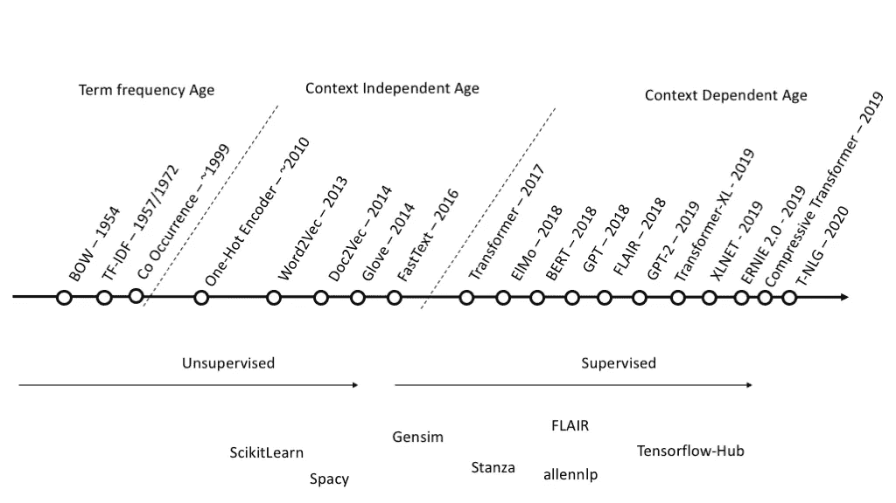

由[贾科莫·维尼里](https://medium.com/@giacomo.veneri?source=post_page-----2a9817952903--------------------------------)

在这个故事中，我想提供一个鲜为人知的结合了速度和质量的选择。对于建议方法的结论和评估，我需要一个基线模型。我选择了久经考验、广受欢迎的伯特。

# 数据

社交媒体是一个以前所未有的规模产生大量数据的来源。我将为这个故事使用的数据集是[冠状病毒推文 NLP](https://www.kaggle.com/datatattle/covid-19-nlp-text-classification) 。

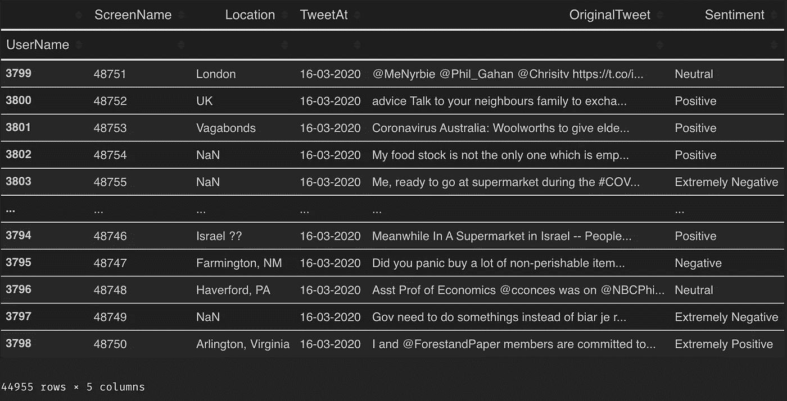

作者

正如我所看到的，模型没有太多的数据，乍一看，似乎没有预先训练的模型是不行的。

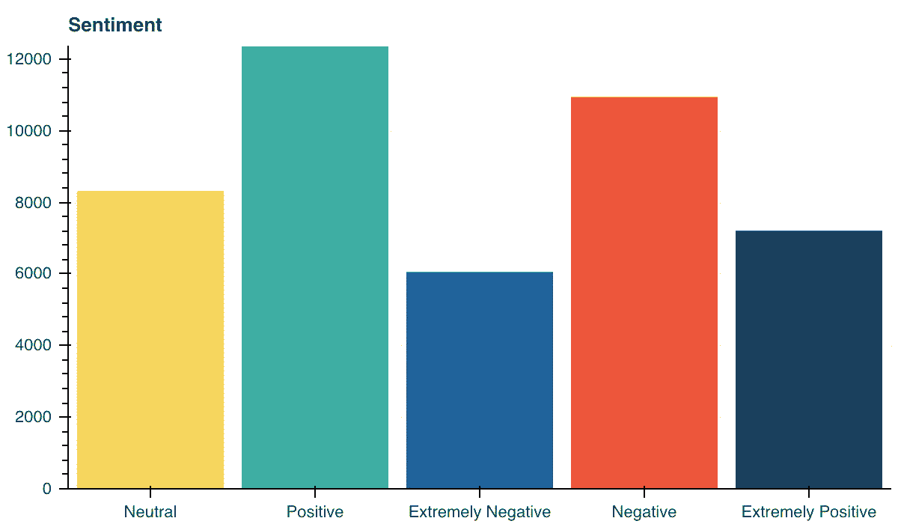

作者

由于用于训练的样本数量很少，我们通过合并它们将类的数量减少到 3 个。

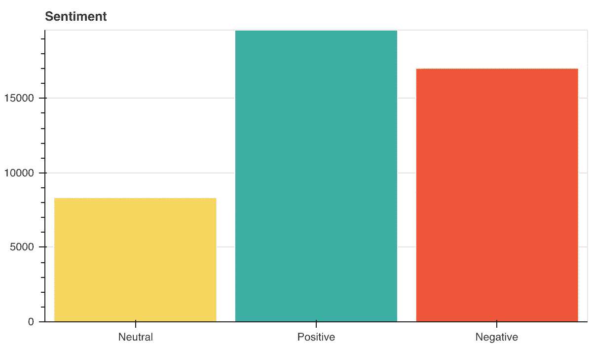

作者

# 基线 BERT 模型

我们用 TensorFlow Hub 吧。TensorFlow Hub 是一个经过训练的机器学习模型库，可随时进行微调，并可部署在任何地方。只需几行代码就可以重用经过训练的模型，如 BERT 和更快的 R-CNN。

```
!pip install tensorflow_hub
!pip install tensorflow_text
```

**small _ bert/BERT _ en _ un cased _ L-4 _ H-512 _ A-8—**更小的 BERT 模型。这是[博学的学生学得更好:关于预培训紧凑模型的重要性](https://arxiv.org/abs/1908.08962)中引用的一个较小的 BERT 模型。较小的 BERT 模型适用于计算资源有限的环境。它们可以像最初的 BERT 模型一样进行微调。然而，它们在知识提炼的环境中是最有效的，在这种环境中，一个更大和更准确的教师产生微调标签。

**bert _ en _ un cased _ preprocess—**针对 BERT 的文本预处理。这个模型使用从维基百科和图书语料库中提取的英语词汇。文本输入已经以“不区分大小写”的方式进行了规范化，这意味着文本在标记为单词片段之前已经小写，并且所有重音标记都已去除。

```
tfhub_handle_encoder = \
    "[https://tfhub.dev/tensorflow/small_bert/bert_en_uncased_L-4_H-512_A-8/1](https://tfhub.dev/tensorflow/small_bert/bert_en_uncased_L-4_H-512_A-8/1)"
tfhub_handle_preprocess = \
    "[https://tfhub.dev/tensorflow/bert_en_uncased_preprocess/3](https://tfhub.dev/tensorflow/bert_en_uncased_preprocess/3)"
```

为了不使代码复杂化，我将不进行参数的选择和优化。同样，这是基准模型，不是 SOTA。

```
def build_classifier_model():

    text_input = tf.keras.layers.Input(
        shape=(), dtype=tf.string, name='text')

    preprocessing_layer = hub.KerasLayer(
        tfhub_handle_preprocess, name='preprocessing')

    encoder_inputs = preprocessing_layer(text_input)
    encoder = hub.KerasLayer(
        tfhub_handle_encoder, trainable=True, name='BERT_encoder')

    outputs = encoder(encoder_inputs)
    net = outputs['pooled_output']
    net = tf.keras.layers.Dropout(0.1)(net)
    net = tf.keras.layers.Dense(
        3, activation='softmax', name='classifier')(net)
    model = tf.keras.Model(text_input, net)

    loss = tf.keras.losses.CategoricalCrossentropy(from_logits=True)
    metric = tf.metrics.CategoricalAccuracy('accuracy')
    optimizer = Adam(
        learning_rate=5e-05, epsilon=1e-08, decay=0.01, clipnorm=1.0)
    model.compile(
        optimizer=optimizer, loss=loss, metrics=metric)
    model.summary()
    return model
```

我已经创建了一个不到 30M 参数的模型。

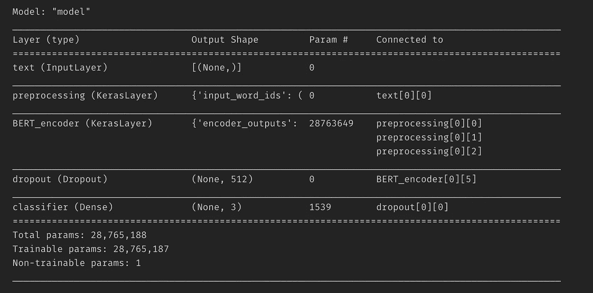

作者

我分配了 30%的*列车*数据用于模型验证。

```
train, valid = train_test_split(
    df_train,
    train_size=0.7,
    random_state=0,
    stratify=df_train['Sentiment'])y_train, X_train = \
    train['Sentiment'], train.drop(['Sentiment'], axis=1)
y_valid, X_valid = \
    valid['Sentiment'], valid.drop(['Sentiment'], axis=1)y_train_c = tf.keras.utils.to_categorical(
    y_train.astype('category').cat.codes.values, num_classes=3)
y_valid_c = tf.keras.utils.to_categorical(
    y_valid.astype('category').cat.codes.values, num_classes=3)
```

历元的数量是凭直觉选择的，不需要证明:)

```
history = classifier_model.fit(
    x=X_train['Tweet'].values,
    y=y_train_c,
    validation_data=(X_valid['Tweet'].values, y_valid_c),
    epochs=5)
```

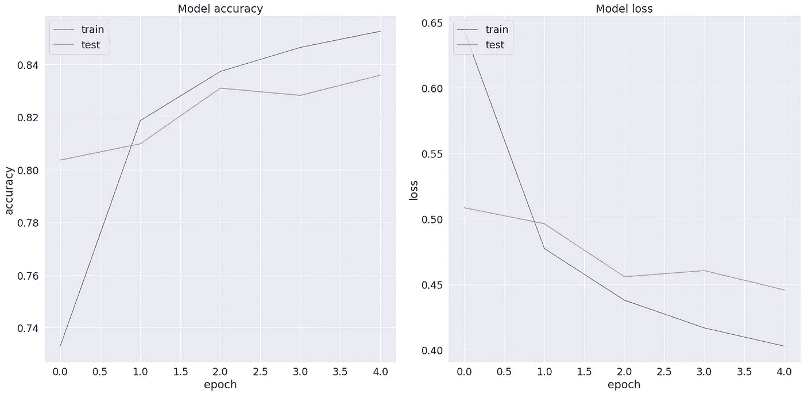

作者

```
BERT Accuracy: 0.833859920501709
```

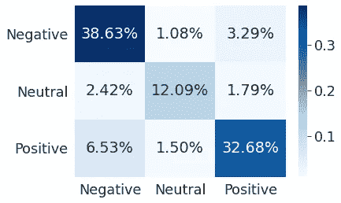

伯特的混淆矩阵

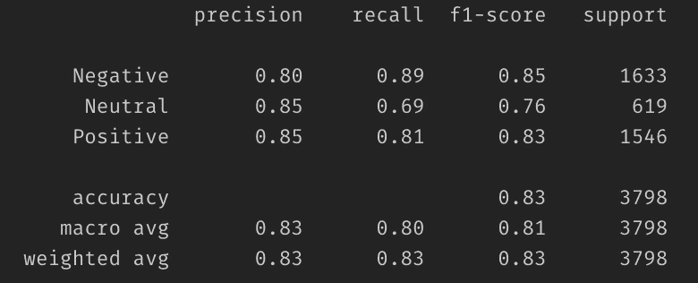

BERT 的分类报告

这是基线模型。显然，这个模型还可以进一步改进。但是让我们把这个任务作为你的家庭作业。

# CatBoost 模型

[CatBoost](https://catboost.ai/) 是一个高性能的开源库，用于决策树的梯度提升。从版本 0.19.1 开始，它支持在 GPU 上开箱即用的分类文本功能。

主要优点是 CatBoost 可以在数据中包含分类函数和文本函数，而无需额外的预处理。对于那些重视推理速度的人来说，CatBoost 预测比其他开源梯度提升库快 20 到 40 倍，这使得 CatBoost 对于延迟关键型任务非常有用。

```
!pip install catboost
```

我不会选择最佳参数；让那成为你的另一个家庭作业。让我们写一个函数来初始化和训练模型。

```
def fit_model(train_pool, test_pool, **kwargs):
    model = CatBoostClassifier(
        task_type='GPU',
        iterations=5000,
        eval_metric='Accuracy',
        od_type='Iter',
        od_wait=500,
        **kwargs
    )return model.fit(
        train_pool,
        eval_set=test_pool,
        verbose=100,
        plot=True,
        use_best_model=True)
```

当使用 CatBoost 时，我推荐使用[池](https://catboost.ai/docs/search/?query=Pool)。它是一个方便的包装器，结合了特性、标签和进一步的元数据，如分类和文本特性。

```
train_pool = Pool(
    data=X_train,
    label=y_train,
    text_features=['Tweet']
)valid_pool = Pool(
    data=X_valid, 
    label=y_valid,
    text_features=['Tweet']
)
```

> ***text _ features*—***文本列索引(指定为整数)或名称(指定为字符串)的一维数组。仅当数据参数是二维特征矩阵(具有以下类型之一:list、numpy.ndarray、pandas)时使用。数据框，熊猫。系列)。如果此数组中的任何元素被指定为名称而不是索引，则必须提供所有列的名称。为此，要么使用此构造函数的 feature_names 参数显式指定它们，要么传递一个 pandas。data 参数中指定了列名的 DataFrame。*

支持的[训练参数](https://catboost.ai/docs/concepts/python-reference_parameters-list.html):

*   **记号赋予器** —记号赋予器用于在创建字典之前预处理文本类型特征列。
*   **字典—** 用于预处理文本类型特征列的字典。
*   **feature_calcers —** 用于基于预处理的文本类型特征列计算新特征的特征计算器。

我直观的设置了所有的参数；调整它们将再次成为你的家庭作业。

```
model = fit_model(
    train_pool, valid_pool,
    learning_rate=0.35,
    tokenizers=[
        {
            'tokenizer_id': 'Sense',
            'separator_type': 'BySense',
            'lowercasing': 'True',
            'token_types':['Word', 'Number', 'SentenceBreak'],
            'sub_tokens_policy':'SeveralTokens'
        }      
    ],
    dictionaries = [
        {
            'dictionary_id': 'Word',
            'max_dictionary_size': '50000'
        }
    ],
    feature_calcers = [
        'BoW:top_tokens_count=10000'
    ]
)
```

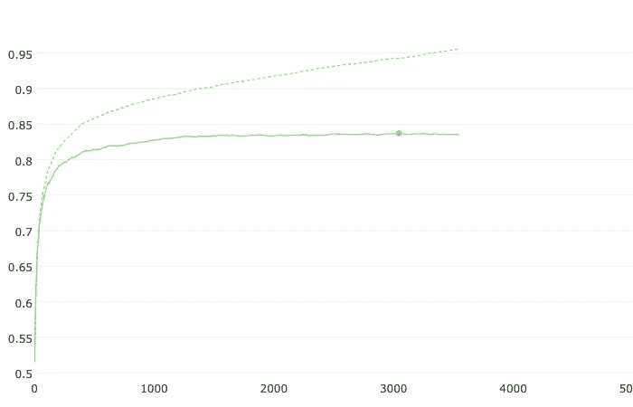

准确(性)

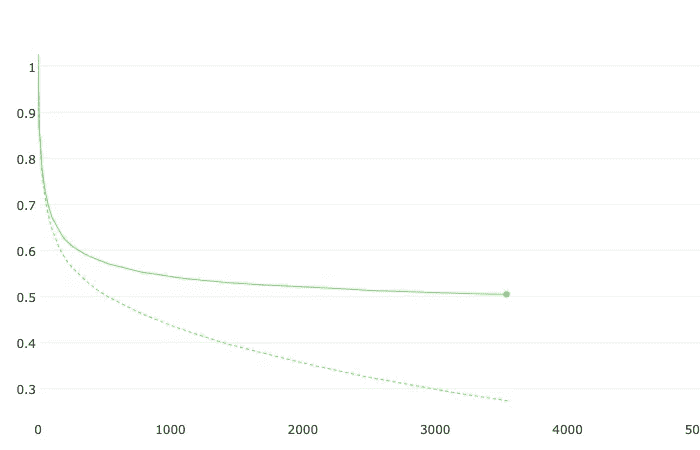

失败

```
CatBoost model accuracy: 0.8299104791995787
```

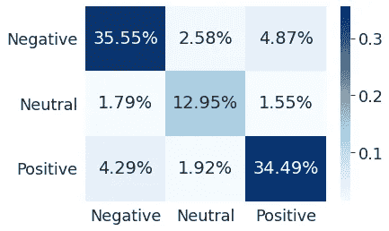

CatBoost 的混淆矩阵

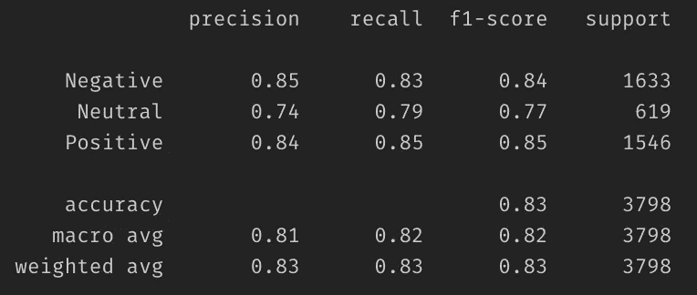

CatBoost 的分类报告

结果非常接近基线 BERT 模型显示的结果。因为我用于训练的数据很少，而且模型是从零开始教的，结果在我看来是令人印象深刻的。

# 奖金

我得到了两个结果非常相似的模型。这能给我们其他有用的信息吗？这两种模式的核心几乎没有共同之处，这意味着它们的结合应该产生协同效应。检验这一结论最简单的方法是将结果平均，看看会发生什么。

```
y_proba_avg = np.argmax((y_proba_cb + y_proba_bert)/2, axis=1)
```

收获令人印象深刻。

```
Average accuracy: 0.855713533438652
```

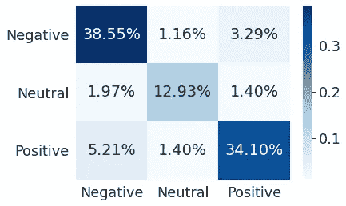

平均结果的混淆矩阵

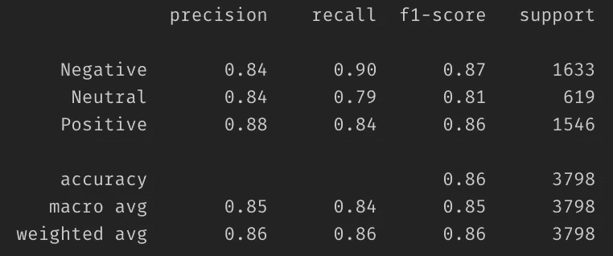

平均结果的分类报告

# 摘要

在这个故事中，我:

*   使用 BERT 创建基线模型；
*   使用内置文本功能创建了 CatBoost 模型；
*   看看如果平均两个模型的结果会发生什么。

在我看来，复杂而缓慢的 SOTAs 在大多数情况下是可以避免的，尤其是当速度是一个关键需求的时候。

CatBoost 提供了开箱即用的强大情感分析功能。对于 [Kaggle](https://www.kaggle.com/) 、 [DrivenData](https://www.drivendata.org/) 等竞赛爱好者来说。CatBoost 可以作为基线解决方案和模型集合的一部分提供一个很好的模型。

文章中的代码可以在这里查看。