# 揭示 Spotify 算法的工作原理

> 原文：<https://towardsdatascience.com/uncovering-how-the-spotify-algorithm-works-4d3c021ebc0?source=collection_archive---------2----------------------->

## Spotify 算法的背后是什么？从基于内容过滤的自然语言处理到协同过滤。

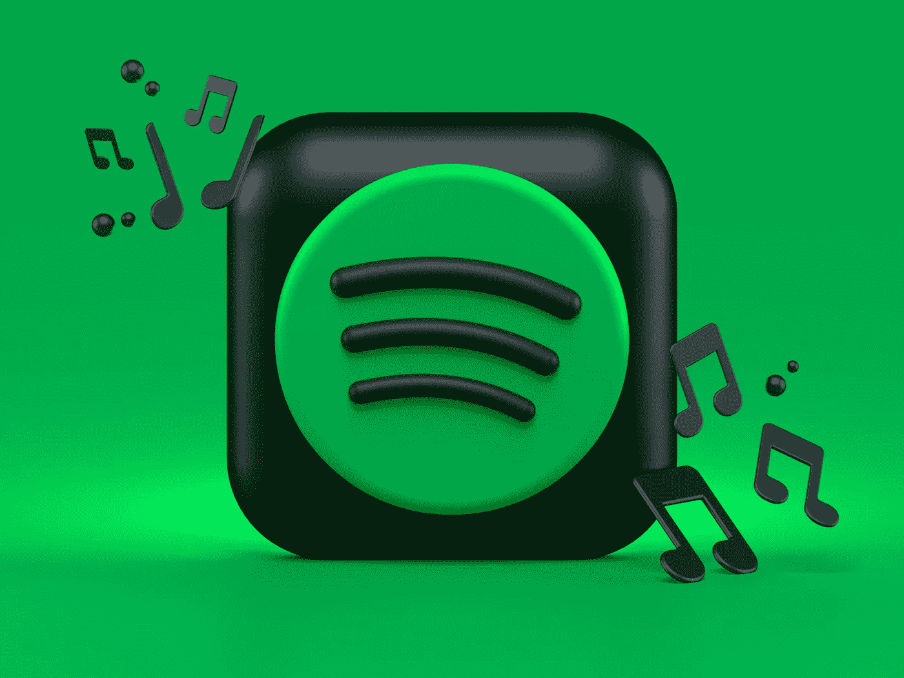

来源:亚历山大·沙托夫在 [Unsplash](https://unsplash.com/s/photos/spotify?utm_source=unsplash&utm_medium=referral&utm_content=creditCopyText) 上拍摄的照片

2008 年，Spotify 通过引入音乐流媒体开始改变音乐世界。从那以后，CD 和 DVD 上的音乐已经离开了我们的生活，音乐产业也发生了很大的变化。

如今，Spotify 是最大的玩家(拥有 3.65 亿。用户和 1.65 亿。但必须在苹果(Apple Music)、亚马逊(Amazon Music)和谷歌(YouTube Music)等美国巨头之间保持自己的地位。为此，Spotify 必须关注两个对等群体:艺术家和用户。为了给他们提供最好的服务，Spotify 的核心有一样东西:算法和机器学习。Spotify 越了解用户，客户体验越好，用户就越容易被说服，转化为付费客户，并成为客户。换句话说，数据和算法是 Spotify 不被苹果、亚马逊和谷歌挤压的机会，迄今为止它们做得相当好。所以，让我们仔细看看 Spotify 算法是如何工作的，但首先是基础知识:

## Spotify 主屏幕

在 Spotify 的中心，推荐系统是主屏幕，上面点缀着许多定制的播放列表和推荐。推荐的播放列表包括 **Discover weekly、B Side、Release Radar、your mixtapes** 等等。巧妙安排的主屏幕的其他部分是**跳回，最近播放，或今天推荐。**主屏幕由一个名为 **BaRT** (作为治疗的推荐的强盗)的人工智能创建和策划，这将进一步详细解释。Spotify 的*跳回*这样的板块也叫货架。

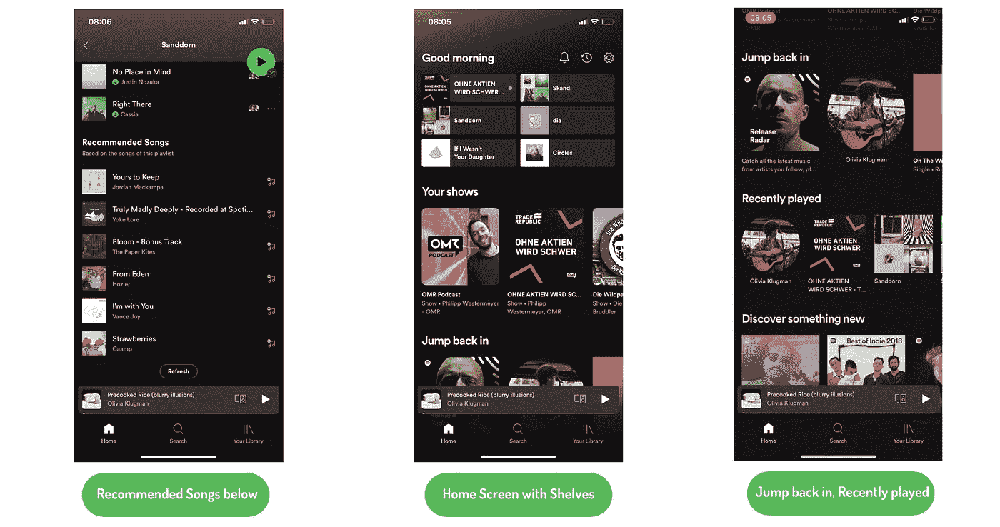

推荐系统出现的地方。来源:自己的图像。

在这些推荐的播放列表旁边，有**推荐歌曲(自动播放列表继续)**部分，你**可能也会喜欢每个播放列表和每张专辑下面的**。因此，你几乎可以在每个 Spotify 屏幕上找到一个定制部分。

为了向客户推荐音乐，并预测主屏幕内外适合的歌曲，Spotify 必须依靠数据。所以让我们来看看可用的数据来源。

## 数据

Spotify 收集和使用的数据相当广泛。在 Spotify，几乎所有东西都被跟踪。你可能已经温和地体验过了:Spotify 的一年回顾。在这个部分你可以看到你一年来听的分钟数，所有流派，最喜欢的艺术家，新人，热门播放列表，最喜欢的播客，老实说，这只是冰山一角。在 Spotify 的例子中，大多数用户对被跟踪没有意见，因为他们受益于良好的用户体验、良好的统计数据和一流的推荐。

Spotify 一年回顾。来源:自己的图像。

现在让我们更详细地看看收集的数据。先说艺术家。当然，Spotify 存储艺术家输入的所有数据:**歌曲名称、描述、流派、图像、歌词和歌曲文件**。除了这种从“提供商端”输入的数据之外，Spotify 还收集并跟踪对方——消费者——的数据。这些数据包括消费者**的收听历史、跳过的歌曲、歌曲播放的频率、存储的播放列表、下载的音乐、社交互动**，如共享播放列表或共享音乐，以及更多变量。除了这两个“内部”数据来源，Spotify 可能还使用外部数据，如文章、博客帖子或其他关于歌曲或艺术家相关主题的文本数据。

 [## 通过我的推荐链接加入 Medium-Hucker Marius

### 作为一个媒体会员，你的会员费的一部分会给你阅读的作家，你可以完全接触到每一个故事…

medium.com](https://medium.com/@hucker.marius/membership) 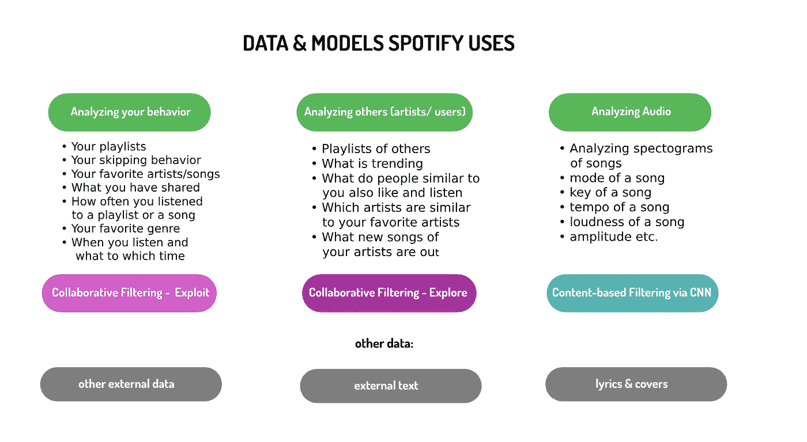

Spotify 使用的数据和模型。来源:自己的图像

## Spotify 的收购

2014 年，Spotify 以 1 亿美元收购了麻省理工学院音乐智能相关初创公司 Echonest。Echonest 在 2014 年已经拥有超过 1 个关于歌曲和艺术家的数据。[4]

2012 年，Echonest 创始人 Brian Whitman 表示，他们的系统每天都会对 1000 万个音乐相关网站进行评分，以分析音乐市场上的趋势和动态。除了 Echonest，Spotify 还加强了其 M&A 战略，并在 2015 年收购了数据科学和分析咨询公司 Seed Scientific，以获得内部知识和专业技能。[5]他们人工智能道路上的另一项重大收购是在 2017 年，Spotify 合并了音频检测初创公司 [Sonalytic](https://sonalytic.com/) 。[6]音频检测您可能从 Shazam 或类似的应用程序中了解到，这些应用程序可以帮助您识别您不知道其名称的歌曲。此外，音频检测系统也可以用于防止侵犯版权。Spotify 使用音频检测来增强播放列表和歌曲的个性化，以“将歌曲与作品相匹配，并改善其发布数据系统”。[6]

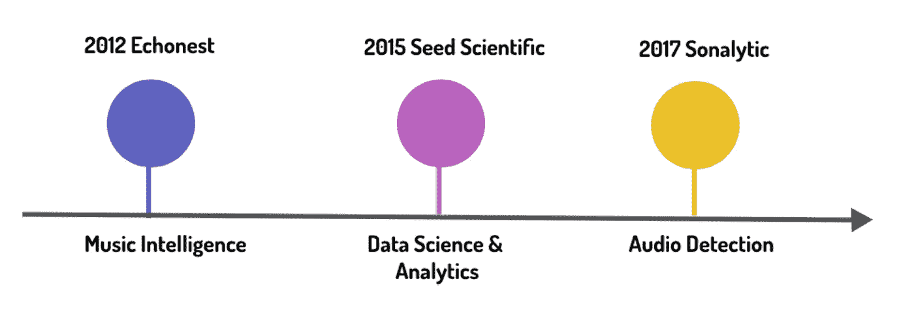

Spotify 的敏锐度。来源:自己的图像。

上述所有收购一直是 Spotify 构建其复杂推荐系统的基础。

## 推荐系统

推荐系统一点都不新鲜，你在互联网的每个角落都会遇到它们:网飞、谷歌、亚马逊、电子商务商店等等。每当你得到可能合适的产品、服务或人员的推荐时，我们就谈论推荐系统。在 LinkedIn 的例子中，推荐系统根据你的社交网络、工作经历和兴趣推荐人，网飞算法推荐最适合你的电影风格的电影和连续剧，亚马逊为你提供类似的产品或其他顾客与手头产品一起购买的补充产品。

因此，推荐系统所做的只是根据系统所跟踪的行为或特征提供建议。正如 Spotify 研究团队所言，“用户被在线观看、购买、阅读和收听的内容所淹没”，因此推荐系统对于帮助导航和促进决策过程是必要的[2]。

亚马逊的推荐系统。来源:自己的图像

推荐系统基本上可以分为 3 种类型:

*   协作过滤(Collaborative-filtering):协作过滤是基于这样一种假设，即过去同意的人将来也会同意，而且他们会像过去一样喜欢相似种类的对象。
*   **基于内容:**基于内容的推荐系统依靠用户-项目关系的可用“特征”来建立模型，例如性别年龄等。
*   **混合型:**这种类型显然结合了两个世界，基于内容和协同过滤。

Spotify 利用了协同过滤和基于内容的推荐系统，但还有更多值得探索的地方。现在这只是一个理解基础知识的一般性介绍，让我们来看看算法背后的更多细节！

## Spotify 的巴特解释道——那是什么？

Spotify 定制背后的系统被称为 BaRT(“作为治疗的建议的强盗”)。BaRT 模式有两种模式:**开采和勘探**。

*TL；dr:* 当系统使用它收集的关于你(用户)的信息，例如你的跳过，你最喜欢的歌曲等时，就使用了利用..相反，当系统基于系统可以使用的所有其他信息(例如，其他用户听了什么、已经建立了什么播放列表、什么是流行的、发布了什么等等)向您建议歌曲时，使用探索。

**开发模式**是基于协同过滤的推荐系统使用的常规模式。在有足够的用户历史数据和用户听了什么的情况下，这种模式是完美的。开发模式使用关于用户和项目的所有可用数据，例如跳过的歌曲、歌曲播放的频率、共享的歌曲、播放列表等。仅基于开发**的系统的**主要问题**之一是物品相关性**。如果几乎没有关于用户或项目(在这种情况下是某首歌曲)的数据，例如该歌曲没有被经常播放，则系统不确定是推荐(利用)还是不推荐(忽略)。

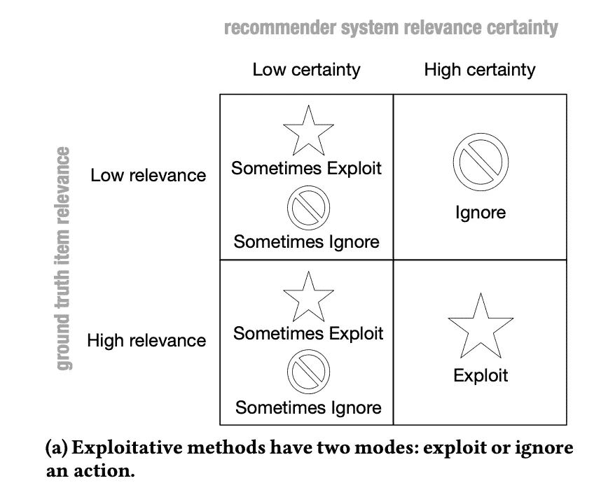

来源:[2]

这就是班迪特算法出现的地方，也是第二种模式成为焦点的地方:**探索**。由于开发模式在存在不确定性(没有足够的数据)时表现不佳，因此探索模式正好涵盖了这些情况。“Exploration 推荐预测用户参与度不确定的内容，以收集更多信息。近年来，探索的重要性已经得到认可，尤其是在有新用户、新项目、非固定偏好和属性的环境中。”[2]

换句话说，如果一首新歌还没有经常播放，你需要数据来验证这首歌是否有潜力。因此，Spotify 的 BaRT 通过 exploration 推荐这些歌曲，并为新歌收集信息。一首歌曲在 30 秒后被认为是正面推荐。这意味着如果你听一首歌少于半分钟，它被认为是负面的。如果你听了超过 30 秒，你会得到积极的反馈。

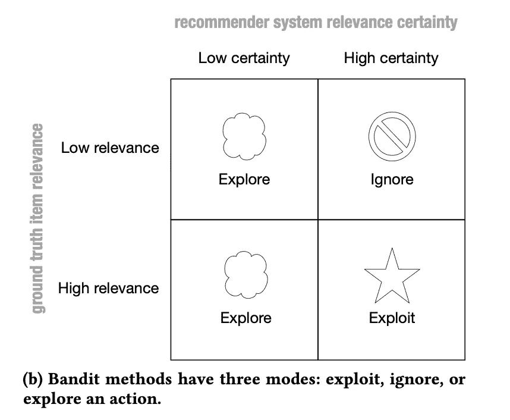

来源:[2]

从上图可以看出，当歌曲的相关性确定性较低时，探索模式是必要的，并且比利用模式更有帮助。

BaRT 模型能够“学习和预测满意度”，这可以通过点击率和消费概率来衡量。它不断地记录、重新训练，并从自己的错误中学习。[2]

因此，换句话说，BaRT 基于**强化学习**，并试图获得反馈，以最大限度地提高用户满意度，并纠正预测的建议。为此，BaRT 模型使用了一个**多臂强盗**，它被训练来执行某个动作 A，该动作 A 获得奖励 r 的概率最高。因此，每个动作 A 都依赖于之前的动作和奖励。“多臂土匪(MAB)的目标是选择报酬总和最大化的行动”[2]。传统的 MAB 忽略了它们的上下文，例如一天中的时间、设备、播放列表、用户特征等。，完全。这就是为什么 Spotify 团队推出了背景多臂强盗 T4。它关注上下文信息，并在决定执行动作之前评估这些信息。

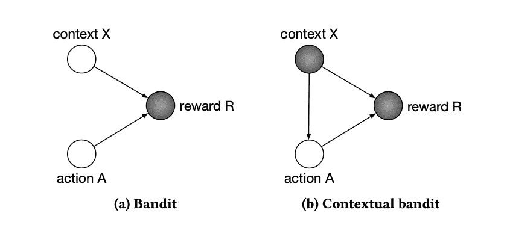

来源:[2]

来源:[2]

对于一个表现出色的背景强盗来说，四个要素是至关重要的:当然是背景、奖励模式、训练程序和开发政策。[2]“在奖励模型中存在三个参数:解释 e(解释为什么选择该项目)、项目 j(歌曲)和上下文 x

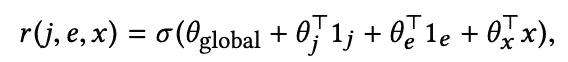

奖励模式。来源:[2]

其中θ表示逻辑回归的系数，
并且 1_i”表示在索引“[2]处具有单个 1 的 0 的独热向量

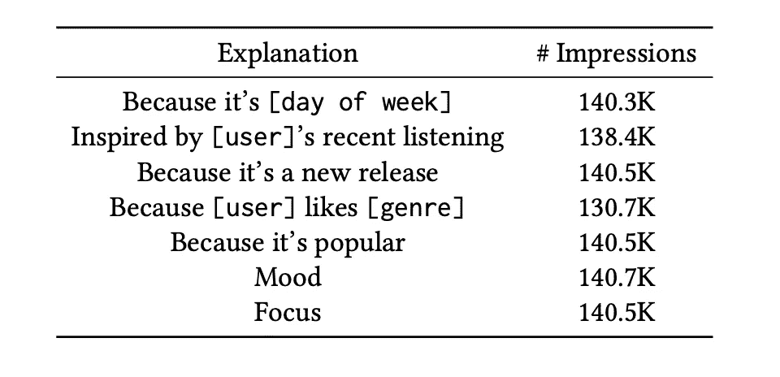

来源:[2]

现在这个奖励功能对行动产生了影响。在某个上下文 x 中，用户 u 执行最佳动作

来源:[2]

对于探索方法，作者使用ε-贪婪。这“为有效性集合 f (e，x)中的所有非最优项目赋予了相等的概率质量，并且为最优动作(j∫，e∫)赋予了(1-ε)额外的质量。”[2]策略设置为“同时利用或探索项目和解释”[2]。

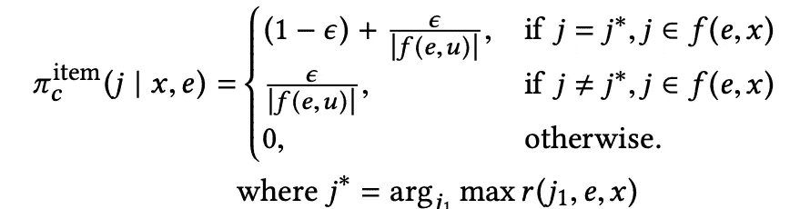

来源:[2]

训练程序本身没什么特别的。BaRT“定期以批处理方式进行重新训练。”[2]

协同过滤对于已经上传了一首歌或听过一首歌的用户和音乐来说效果很好。但是如果一个艺人是全新的，甚至还没有任何歌曲呢？这种类型被称为冷启动问题。对于新的和不受欢迎的歌曲，推荐系统失败。

## Spotify 如何解决冷启动问题

在这种情况下，唯一有帮助的是分析原始音频文件。尽管这可能是最复杂的推荐类型，并且计算量也很大，但它在创建行业领先的推荐系统中起着至关重要的作用。

Spotify 的一名员工 Sander Dieleman 在 2014 年写了一篇关于他创建的一个模型的博客文章。它由四个卷积层和三个密集层组成。机器学习模型的输入不是原始音频文件，而是它们的表示，称为**频谱**。所以每首歌都被转换成 mel-spectorgram，这是一个独立的模式，有点像指纹(正如你在下图中看到的)。

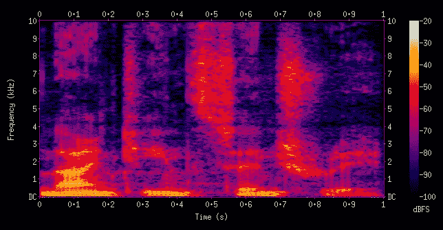

一部电影。来源:[光谱图](https://en.wikipedia.org/wiki/Spectrogram#/media/File:Spectrogram-19thC.png)

Mel 频谱图是音频的时间-频率图。mel 标度背后的想法是复制人类的听觉反应。

Dieleman 在他的博客文章中描述的网络如下(有四个 conv 层和三个密集层):[6]

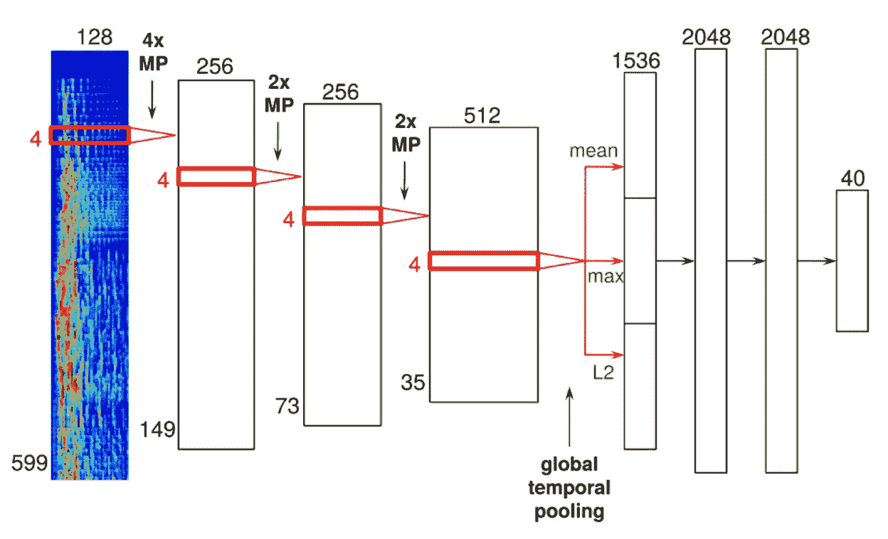

来源:[6]

如图中两个 conv 层之间的小 MPs 所示，Dieleman 在每个卷积层后实现了一个池层。在四个 conv 层的最后一个之后，他设置了另一个全局时态池层，该层“跨越整个时间轴进行池化”。然后，将生成的要素放入三个完全连接的密集图层中，并使用经过校正的线性单元。最后一层输出 40 个潜在因素。

> 总共执行大约 750000 次梯度更新。我不记得这种特殊的架构花了多长时间来训练，但我尝试过的所有架构都花了 18 到 36 个小时。”—桑德·迪勒曼

Dielenman 的网络学习不同的过滤器，仅在第一 conv 层多达 256 个过滤器。正如他所说，一个过滤器学习颤音唱法，另一个学习铃声环境，第三个学习低音鼓，另一个学习三分之一声乐(多个歌手和声音)。其他过滤器有噪音、失真、特定音高、低音、特定和弦(如 A 和弦)等等。

你可能已经想知道 Dielenman 引用的文章和解释是 2014 年的，所以已经过时了。我确实相信，理解 Spotify 的算法还是有好处的。当然，7 年后，模型更加复杂，Spotify 在如何跟踪和分析方面获得了更多的洞察力，但在其主要特征方面，系统可能是相似的。

## 自然语言处理和音乐智能

你已经认为这是最后一款了吗？不，当然，Spotify 也使用 NLP。如上所述，Spotify 收购了 Echonest，从而收购了其音乐智能平台。而这个平台显然是基于网页抓取和自然语言处理的。这有助于 Spotify 跟踪超过 1000 万个网站，并通过自然语言处理分析它们的内容。这些网站包括博客、艺术家网站、社交媒体、论坛等等。最终，Spotify 可以设法观察讨论，跟踪什么是趋势，什么是新的，人们喜欢什么，人们不喜欢什么。甚至他们使用哪种语言来跟踪某些国家或地区的讨论。[8]

该系统识别与歌曲或艺术家相关的描述性术语和名词短语，并将这些关键词分类为文化向量和顶级术语。这产生了一组术语，这些术语基于权重显示了每个术语对于艺术家和歌曲的重要性。[8]

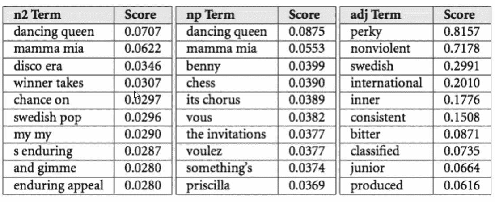

来源:[https://notes . variogr . am/2012/12/11/how-music-recommendation-works-and-donts-work/](https://notes.variogr.am/2012/12/11/how-music-recommendation-works-and-doesnt-work/)

# 结论

依靠 NLP、基于内容的过滤和协作过滤的三重策略是一种非常复杂的确定客户音乐品味的方法。未来，Spotify 必须依赖并更加专注于分析音频数据，这比协作过滤更复杂，计算量更大。尽管如此，这三种类型都非常重要，随着越来越多的数据和更复杂的模型，Spotify 将能够越来越好地预测我们的音乐品味。

在私下使用 Spotify 时，我可以说他们在提供大量定制内容和推荐方面已经做得很好了。从推荐部分开始，一年来在 reverse Stories，the week 的混音中，当然还有很多更个性化的播放列表，基于我听的和其他人听的(有类似音乐品味的)。当然，Apple Music 或 Amazon Music 也可以提供这些服务，但最终，推荐系统的质量对用户体验至关重要。Spotify 尚未赢得这场战斗，但他们有一个清晰的战略，看起来很有希望。老实说，我希望 Spotify 能够战胜科技巨头。

 [## 通过我的推荐链接加入 Medium-Hucker Marius

### 作为一个媒体会员，你的会员费的一部分会给你阅读的作家，你可以完全接触到每一个故事…

medium.com](https://medium.com/@hucker.marius/membership) 

*消息来源*

[1]公司信息(未注明)。[https://newsroom.spotify.com/company-info/](https://newsroom.spotify.com/company-info/)

[2] MCInerney，j .等人(2018 年)。探索，利用和解释:个性化的强盗可解释的建议。[https://static 1 . squarespace . com/static/5a E0 d0b 48 ab 7227d 232 C2 bea/t/5ba 849 E3 c 83025 fa 56814 f 45/1537755637453/bartrecsys . pdf](https://static1.squarespace.com/static/5ae0d0b48ab7227d232c2bea/t/5ba849e3c83025fa56814f45/1537755637453/BartRecSys.pdf)

[3][https://chaitanyabelhekar . medium . com/recommendation-systems-a-walk-trough-33587 fecc 195](https://chaitanyabelhekar.medium.com/recommendation-systems-a-walk-trough-33587fecc195)

[4][https://www . br . de/puls/musik/aktuell/Spotify-the-echo-nest-discover-weekly-100 . html](https://www.br.de/puls/musik/aktuell/spotify-the-echo-nest-discover-weekly-100.html)

[5][https://TechCrunch . com/2015/06/24/把数据地毯从苹果下面拉出来/](https://techcrunch.com/2015/06/24/pulling-the-data-rug-out-from-under-apple/)

[6][https://TechCrunch . com/2017/03/07/Spotify-acquisites-audio-detection-startup-sonalytic/](https://techcrunch.com/2017/03/07/spotify-acquires-audio-detection-startup-sonalytic/)

[https://www.univ.ai/post/spotify-recommendations](https://www.univ.ai/post/spotify-recommendations)

[8][https://outside insight . com/insights/how-ai-helps-Spotify-win-in-the-music-streaming-world/](https://outsideinsight.com/insights/how-ai-helps-spotify-win-in-the-music-streaming-world/)