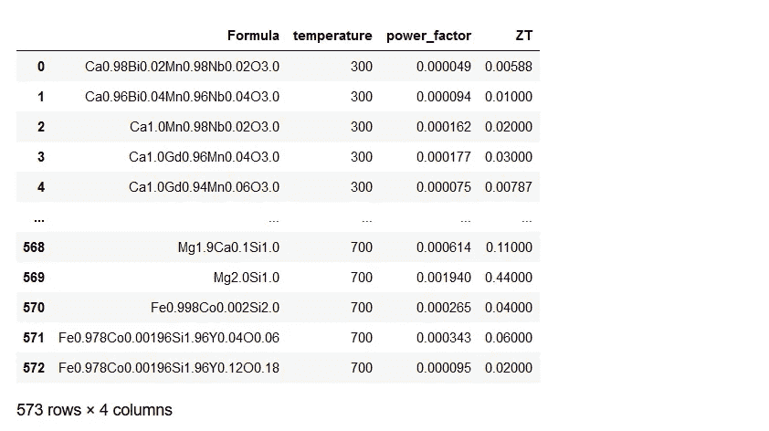
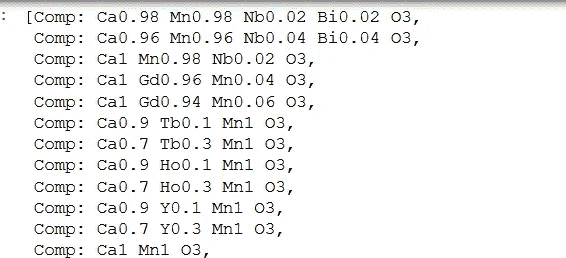
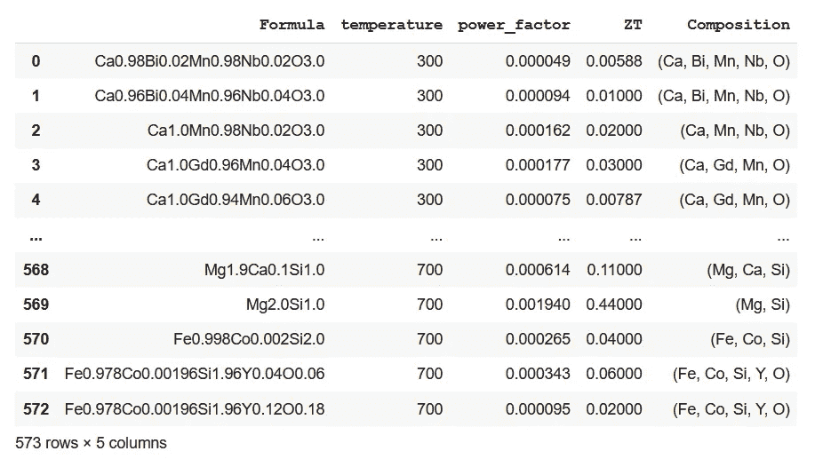
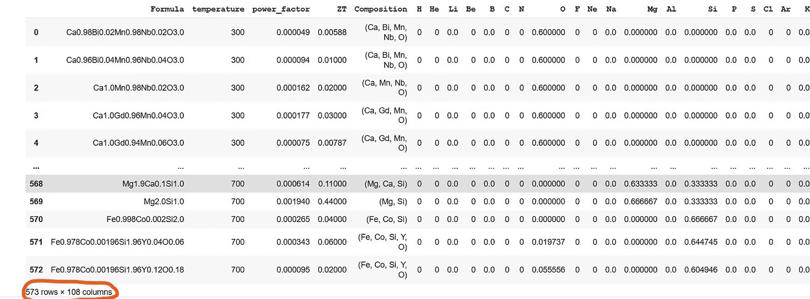
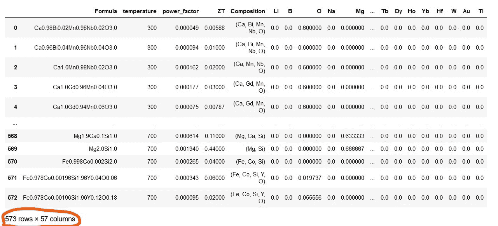

# 使用 Matminer 和 Pymatgen 发掘材料数据的潜力

> 原文：<https://towardsdatascience.com/uncovering-the-potential-of-materials-data-using-matminer-and-pymatgen-83126fadde1c?source=collection_archive---------23----------------------->

## 基于 python 的材料库解读材料化学的步骤


材料四面体:图片由作者提供，灵感来自马库斯·斯皮斯克在 Unsplash 上的一张照片

**简介**

不同类型设备的使用是我们日常生活不可或缺的一部分。并且这些装置由构成日常应用材料的元素的无数组合制成。材料科学家从事这些材料的加工，研究它们的结构和性质。例如，为了开发一种新的半导体，材料科学家需要从元素周期表的调色板中选择最佳的成分组合，以使新的半导体具有正确的特性。

此外，材料的性能取决于从电子尺度到宏观尺度的三位一体的加工条件、结构及其各种结构和功能特性。于是，材料科学家们提出了**[**材料四面体**](https://www.e-education.psu.edu/matse81/node/2094)**的概念，其中顶点代表加工、结构、性质和性能，连接这些顶点的线表示它们之间的相互关系。这些相互连接也被称为 [**PSPP**](https://doi.org/10.1063/1.4946894) 连杆机构。****

****一个全面的已发现材料库及其 PSPP 联系将极大地有利于材料科学家和工程师，他们的目标是设计下一代超级材料，如比现有锂离子电池更有效的电池，或比新特斯拉汽车更轻更坚固的汽车。****

****因此，从这些相互关联的参数中提取有意义的数据成为设计和发现高性能尖端材料的关键步骤。参数的数量可能如此多样，以至于很难提取所有这些参数之间基于物理学的因果关系。在这种情况下，机器学习(ML)可以通过提取这些参数之间的有用相关性来促进新知识的发展。****

******材料数据******

****不管使用什么算法，ML 的第一步也是最关键的一步是导入和预处理数据。干净的数据增加了训练的可靠性，并为成功的部署建立了机器学习模型。这些数据进一步分类为输入变量(在 ML 语言中也称为预测器/描述符)和结果(称为目标/响应)。****

********

****`Image by author`****

****材料数据包括一系列广泛的描述符。这些包括****

*   ******加工条件:** *成分与组成元素、温度、压力、升温和降温速率、相对湿度等。*****
*   ******结构信息:** *原子或晶体结构的排列，微观结构和织构图案跨越长度尺度跨越几个* [*埃(*](https://en.wikipedia.org/wiki/Angstrom) *1 埃= 10* ⁻ ⁰ *米)和几百个* [*微米*](https://en.wikipedia.org/wiki/Micrometre) *(1 微米= 10* ⁻ *⁶米)。*****
*   ******物理性质:** *密度、粘度、折射率、导热导电率等等。*****
*   ******机械性能:** *韧性、硬度、屈服强度、弹性刚度、断裂韧性、延展性、硬度及其他。*****

****目标或响应通常是决定材料整体性能的性质。****

****从给定数据集中挖掘重要特征是开发健壮的数据驱动模型的最关键和最具挑战性的步骤。否则，模型将遵循 [**GIGO**](https://en.wikipedia.org/wiki/Garbage_in,_garbage_out) (垃圾入垃圾出)规则。****

****我们可以用一个非常简单的例子来说明材料数据集中特征化的重要性。让我们考虑包含几种材料的化学式及其密度的数据集。化学式是由元素及其原子比例的组合来表示的。例如，化学式(AᵢBⱼCₖDₗ)包含四种元素 a、b、c 和 d，其中它们相应的下标 I、j、k 和 l 代表每种元素的原子数。例如，水的分子式是 H₂O，这意味着两个氢原子(h 是元素符号)和一个氧原子(用符号 o 表示)。****

****现在，为了了解特征之间的相关性，并从这些数据中设计超密度材料，我们需要挖掘每个元素对密度的贡献。这些单独的元素贡献成为目标变量预测的特征(描述符)，在本例中为密度。因此，需要将配方分解成各个成分(或元素)及其相应的量。在诸如编码的传统 ML 技术中没有直接的方法来实现这个任务。然而，多亏了基于 Python 的素材库 Pymatgen 和 Matminer，这有助于实现这个目标。****

****在本文中，我将演示如何借助上述材料库从公式中导入组成元素及其数量。****

******预处理的逐步指南******

****在逗号分隔(csv)或 Excel 文件(XLSX)中列出描述符和目标变量是组织机器学习数据的好方法。一旦 csv/ excel 文件准备就绪，我们就可以将其导入到任何机器学习环境中。在这里，我将显示所有的步骤，写和运行，在 Jupyter 笔记本。出于同样的目的，你也可以选择谷歌 Colab 笔记本。****

******第一步:导入库******

****第一步也是最重要的一步是导入所有需要的基本库，如 Pandas、NumPy、Matplotlib。此外，安装材料数据挖掘( **Matminer** )和材料分析( **Pymatgen** )的专用库，然后导入必要的模块。Matminer 和 Pymatgen 都是开源的 python 库。****

```
**import numpy as np
import pandas as pd
from matplotlib import pyplot as plt
from matplotlib.pyplot import figure**
```

******第二步:加载数据******

*****(这里使用的数据集是* [*原始数据集*](https://github.com/ngs00/DopNet/tree/main/dataset) *的子集)。)*****

****导入基本库之后，我们需要使用 pandas 从它们的文件路径加载和读取包含数据的 csv 或 excel 文件。在下面的代码片段中，前三列是指定为 X 的描述符变量，而最后一列是指定为 y 的目标变量。****

```
**ds_PF_ZT = pd.read_csv('TE/csv/PF_ZT.csv')
X = ds_PF_ZT.iloc[:, 0:3]
y = ds_PF_ZT.iloc[:, -1]
ds_PF_ZT**
```

********

****输出片段****

****现在，我们需要添加组成材料的单个元素(在上面的数据框架中表示为公式)作为预测值。这些基本因素与其他变量的协同作用导致了结果或反应。下面是 Pymatgen 和 Matminer 工具的应用程序，这些工具具有诸如 core.composition 和 featurizers.composition 之类的特性，可以将给定的公式分解成单个的元素。在进行编码活动之前，让我先介绍一下 Matminer 和 Pymatgen。****

*******Pymatgen 和 Matminer:有益于素材数据预处理的库*******

****Pymatgen 和 Matminer 都是用于材料数据挖掘和分析的开源 Python 库。****

****[**Pymatgen**](https://pymatgen.org/) 有许多模块和子模块以及它们各自的类，帮助分析材料的结构和功能特性。我们将查看这样一个模块的应用:**pymatgen . core . Composition**和它的类: **Composition** 。这个类将数据集中的每个成分映射到单个元素，并以不可变和可哈希的形式映射到元素的数量，而不是像 Python 字典那样。在 Python 中，数据有两种类型: [*可变*和*不可变*](/https-towardsdatascience-com-python-basics-mutable-vs-immutable-objects-829a0cb1530a) 。可变数据的值可以被改变/变异，而不可变数据的值不能。可变数据的几个例子是列表、字典。另一方面，元组是不可变数据的典型例子。所有不可变的对象都是可散列的，这意味着这些对象都有唯一的标识号，以便于跟踪。****

****[**Matminer**](https://hackingmaterials.lbl.gov/matminer/index.html?highlight=featurize_dataframe) 有助于应用各种特征提取复杂的材质属性。几乎有超过 70 个特征器(matminer.featurizers)将材质属性转换成数字描述符或向量。我们将关注**组合特征器**和它的**元素分数**类来预处理我们的数据集。所述类计算成分中的单个元素的元素分数。****

******第三步:安装 Pymatgen 和 Matminer******

```
**pip install pymatgen
pip install matminer**
```

*****注意:Matminer 和 Pymatgen 需要 Python 版本。*****

******步骤 4:使用 Pymatgen 映射元素及其数量******

*****Composition*pymatgen 类将给定数据集中的每个公式拆分成组成元素及其数量。我们来看第一个公式，Ca0.98Bi0.02Mn0.98Nb0.02O3.0，在第 1 列第 1 行:****

********

****每个元素及其数量的映射****

```
**from pymatgen.core.composition import Composition
ds_PF_ZT['Formula']
Comp = []
for value in ds_PF_ZT['Formula']:
  Comp.append(Composition(value))
Comp**
```

********

****输出片段****

****一个**附加成分列**被添加到仅包含对应于每个成分的组成元素的原始数据集中。****

```
**ds_PF_ZT['Composition'] = Comp
ds_PF_ZT**
```

********

****输出片段****

******步骤 5:使用 ElementFraction 类计算原子分数******

****我们现在需要在数据帧中添加单个元素及其原子分数，以进行机器学习。mat miner . featurezer . composition 中的一个名为“ElementFraction”的类服务于上述目的。****

```
**from matminer.featurizers.composition import ElementFraction
ef = ElementFraction()**
```

****然后，我们使用**featureze _ data frame**函数创建一个数据帧，它包含周期表的所有元素以及其他变量。dataframe 的尺寸增加到了 **573 X 108** (在下面显示的代码片段的输出中用橙色圈起来)。****

```
**ds_PF_ZT = ef.featurize_dataframe(ds_PF_ZT,'Composition')
ds_PF_ZT**
```

********

****输出片段****

****让我详细说明元素分数计算。让我们考虑第一个组合(在给定数据集的公式列中)。该组合物 Ca0.98Bi0.02Mn0.98Nb0.02O3.0 具有五种元素:Ca(钙)、Bi(铋)、Mn(锰)、Nb(铌)和 O(氧)。公式中存在的 Ca 的量是 0.98，并且通过考虑公式中存在的其它元素的量来计算 Ca 的元素分数。因此，Ca 的元素分数为 0.196((0⋅98)/(0.98+0.02+0.98+0.02+3.0))。类似地，Bi、Mn、Nb 和 O 的元素分数分别为 0.004、0.196、0.004 和 0.6。对于这个公式，周期表中其余元素的元素分数保持为零。****

******步骤 6:降维并显示最终的、干净的、预处理过的数据******

********

****`Photo by Tim Peterson on Unsplash`****

****请注意，上面的数据帧包含许多只有零值的列。这是因为在给定数据集中的成分中不存在这样的元素。因此，这些零列从数据帧中省略，这导致数据帧的维度从 **573 行×108 列**减少到 **573 行×57 列**。****

```
**ds_PF_ZT = ds_PF_ZT.loc[:, (ds_PF_ZT != 0).any(axis=0)]
ds_PF_ZT**
```

********

****输出片段****

****上述预处理的干净数据帧是机器学习的最终形式。将响应或目标列作为最终数据帧中的最后一列是一个很好的做法。
*代码发布于*[*Github*](https://github.com/Bjoyita/ThermoelectricDataAnalysis)*。*****

******结束语******

****在当代世界，“数据是新的石油”——这是英国数学家克莱夫·亨比创造的一个短语。因此，挖掘这个宝藏以获得最大的有用的潜在信息对于技术进步是必要的。从材料科学的角度来看，大量的材料属性、加工参数和元素构成了一个完整的数据集。这些细节构成了材料信息学的一部分，在新的高性能材料的发现中发挥着巨大的作用。揭示组成元素在材料属性中的作用是一项关键但棘手的工作。Matminer 和 Pymatgen 使这项任务变得更加容易。在这里，我描述了使用这些素材库的一些相关模块从原始数据集中收集基本信息。我希望这篇文章是信息丰富的，特别是对从事新材料设计和发现的工程师和科学家来说。****

****如果您需要任何澄清，请随时[联系](http://bjoyita@gmail.com)，并分享您的反馈和建议。****

****感谢您的阅读！****