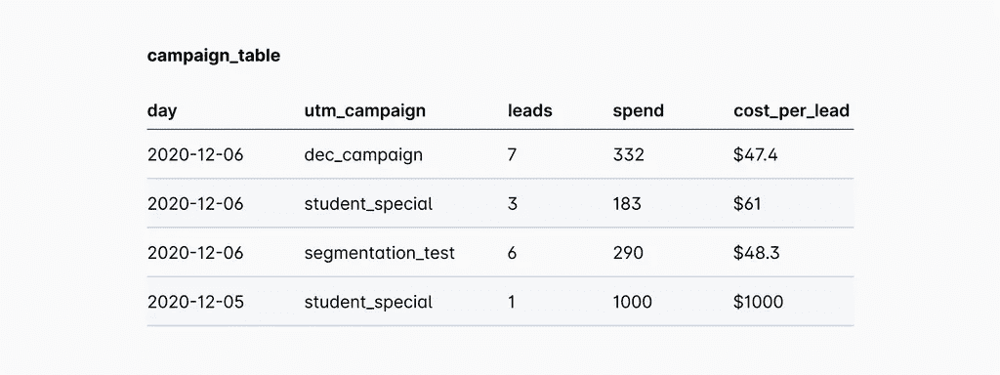
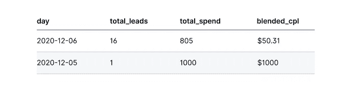
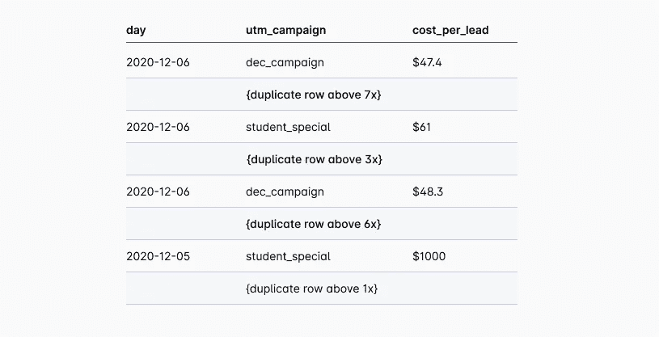
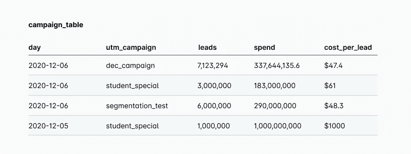
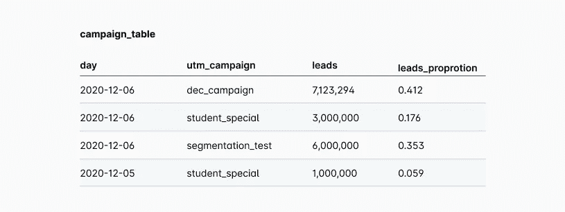

# 解开数据:使用 SQL 扩展聚合数据

> 原文：<https://towardsdatascience.com/uncubing-data-using-sql-to-expand-aggregated-data-3a339194d88?source=collection_archive---------37----------------------->

## *用于分解聚集数据集的 SQL 技术*

作者创建的图像

任何时候聚合数据，都会丢失包含在更细粒度中的信息。在 [Sisu Data](https://sisudata.com/blog/uncubing-data-using-sql-expand-aggregate-data-prevent-data-loss?utm_source=towardsdatascience&utm_medium=blog&utm_campaign=uncube-data-sql) ，我们不断应用新技术来防止我们客户的信息丢失，因为我们知道有了更多的功能，分析可以更加全面和准确。

虽然[广泛的平面数据是理想的](https://sisudata.com/blog/designing-datasets-four-principles-to-advance-data-diagnosis)，但有时你可能只能访问聚合数据，比如谷歌或脸书广告报告。这些工具导出摘要数据，其中主键是 utm_campaign 和 day(如下表所示)，而不是点击甚至销售线索级别的粒度。

这些报告必须提供总体数据，因为粒度数据对于大多数用户来说太难处理。事实上，这种类型的表是现成的，可以用来可视化度量的日常性能，但是没有为更深入的分析留下多少空间。例如，您只能通过合计一天的花费，然后除以销售线索数，向上合计到每天的每销售线索成本(CPL)指标:

*出局*:

但是，如果我们需要快速获得不同因子值的许多不同子人群的平均 CPL，要求分组可能会很乏味。理想情况下，我们可以使用 AVG 来聚合行，使用 WHERE 子句来选择任何子群体。

# 分解表格以简化查询并找到准确的见解

为了详细说明，我们假设您想知道原始表中 student_special 活动的平均 CPL。如果您使用了查询

您将生成一个错误答案$530.50。正确答案是 **($183 + $1000) / 4** 或 **$295.75** ，因为 2020 年 12 月 5 日与 2020 年 12 月 6 日的销售线索数量不同。CPL 指标需要根据销售线索的数量进行适当加权。

正确的方法是按 utm_campaign 分组，并用 SUM(支出)除以 SUM(销售线索)得出平均 CPL。但是，如果我想在不同因子值的许多不同子人群中选择任何不同的平均 CPL，查询的复杂性会迅速增加。

相反，我们可以以不同的粒度对数据建模，并通过将每一行等同于一个销售线索来分解表格。这种方法将生成一个类似于下图的表:

此表支持简单的 cost_per_lead 平均值，而不必分组并使用 SUM(spend) / SUM(leads)。现在，如果我们在这个新表上再次使用上面的查询，

`SELECT AVG(cost_per_lead)
FROM campaign_table
WHERE utm_campaign = 'student_special'`

它将返回准确的 CPL，而不需要使用 GROUP BY。虽然为每个销售线索生成一个新行的表会占用更多的空间，但是向云数据仓库的转移会使额外的成本变得微不足道。

# 分解的 SQL 方法

虽然在 Python 中使用简单的行乘法命令将每一行分隔开很简单，但是在 SQL 中做同样的事情就比较复杂了。这里有一种用 SQL 解决这个问题的方法:

让我们来分解这个查询。前两个 cte ten _ numbers 和 gen_numbers 创建一个单列表格，列出从 0 到 99999 的数字。Ten_numbers 是十个数字的列表。然后，通过将其自身连接几次，我们扩展了十个数字的列表，使得每个十个数字的集合出现在数字中的不同占位符中:

*   “ **WHERE 1=1** ”子句创建 10 个数字的初始向量与不同列中相同的 10 个数字的所有可能组合，即[0，0]；[0,1]…[0,10];[1,0];[1,1]…[10,10]
*   顶部的“**选择**”语句确保每个组合出现在数字中的不同占位符处，例如，一位数、十位数、百位数等。

有了这个数字矩阵，最后的代码片段扩展并复制了这些行:

`SELECT
campaign_table.*
FROM campaign_table AS t
JOIN gen_numbers AS g ON 1 = 1
WHERE g.gen_num <= t.leads`

通过再次连接 1=1，我们创建了 campaign_table 中的行与 gen_numbers 表中的每个数字的所有可能组合，自动将 campaign_table 中的每一行复制 99，999 次。然后，通过使用 WHERE g.gen_num <= t.leads，我们缩小了重复项的数量，使其与原始表中的 leads 数量相对应。

# 使用秤重来处理巨大的桌子

这种分解表的方法是内存密集型的，如果行需要复制数百万次，这种方法就不太值得了。但是，我们可以通过提取销售线索的数量并创建一个简单的权重列，轻松地将这种类型的权重精确到某个百分点。

例如，在下表中，您不需要创建 1700 万行。

相反，您可以创建一个新列，将 leads 值除以所有 leads 的总和，并指定一个浮点小数，这将得到该特定组贡献的 leads 占总 leads 的比例。

然后，将 leads proportion 列乘以 100 或 1，000，根据需要得到 1%或 0.1%的精确度。因此，gen_numbers 表可以从 99，999 个初始副本缩小到 99 个，精度为 1%，或者 999 个，精度为 0.1%。

`gen_numbers AS
(
SELECT (100 * t3.num) + (10 * t4.num) + t5.num AS gen_num
FROM ten_numbers AS t3 ON 1 = 1
JOIN ten_numbers AS t4 ON 1 = 1
JOIN ten_numbers AS t5 ON 1 = 1
WHERE (100 * t3.num) + (10 * t4.num) + t5.num > 0
ORDER BY gen_num
)`

现在，在初始自连接中，每行只能复制 999 次。

有了一个被人工分解到更低粒度的聚合表，计算权重变得更快更容易，比如销售线索的数量或支出的金额。现在，我们可以用一个简单的 WHERE 子句获得多个子群体的平均值，这使得跨不同因子、列和日期周期的扫描变得更加容易。这极大地扩大了表的大小，但由于廉价的存储和闪电般的计算，这是一个值得做出的权衡。

希望利用您的粒度和聚合数据做更多事情？查看我们的[设计更好的数据集](https://sisudata.com/resources/guides-and-whitepapers/how-to-design-better-datasets-for-diagnostic-analytics)指南或[与团队](https://sisudata.com/kpi-diagnosis)取得联系，以帮助分析您的关键指标。

*本帖原载于 Sisu Data* [*博客*](https://sisudata.com/blog/uncubing-data-using-sql-expand-aggregate-data-prevent-data-loss?utm_source=towardsdatascience&utm_medium=blog&utm_campaign=uncube-data-sql) *。*