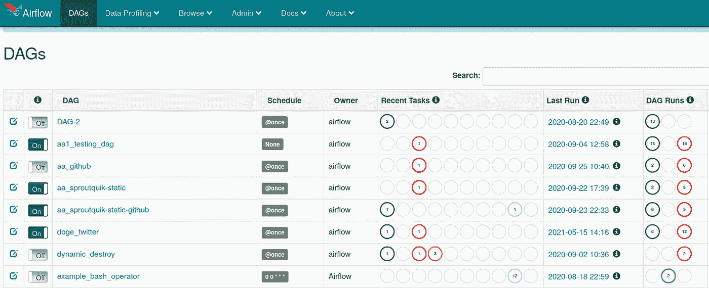
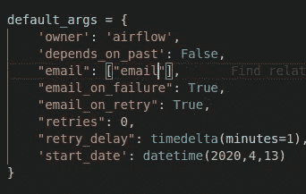
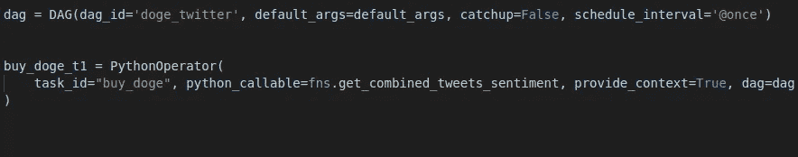
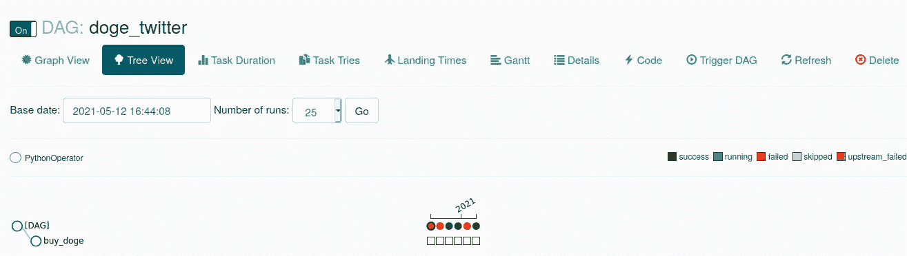
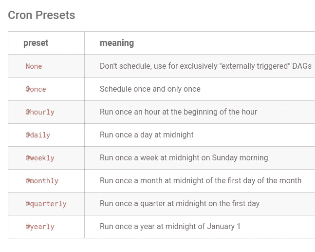

# 一个不被重视的 ML/AI 工作流工具:MLOps 气流

> 原文：<https://towardsdatascience.com/under-appreciated-workflow-tool-airflow-a078a3c71a67?source=collection_archive---------23----------------------->

# 介绍

Airflow 是一种工作流管理工具，在 MLOps 中经常被低估和较少使用。我在各种任务中使用 airflow 来自动化其中的许多任务，从以特定间隔运行人工智能模型，到重新训练模型，批处理，抓取网站，投资组合跟踪，定制新闻提要等。在这篇文章中，我们将回顾气流的基础知识以及如何开始。


布雷特·乔丹在 [Unsplash](https://unsplash.com?utm_source=medium&utm_medium=referral) 上的照片

# 什么是气流？

[Airflow](https://airflow.apache.org/) 是开发人员调度、执行和监控工作流程的工具。Airflow 最初由 Airbnb 开发，目前是 Apache 孵化器项目。Airflow 的最大优势是可以使用纯 python 代码创建工作流。它为开发人员提供了灵活性，可以根据需要阐明工作流，并以特定的频率调度或运行它。

Airflow 还可以连接从 AWS Lambda 到 GCP 数据流的云服务。在大多数场景中，大到中等规模的组织使用 Airflow 来处理大量的数据，并在其上执行一些数据操作。它也可以在集群模式下运行。AWS 和 GCP 提供了气流的管理实例，以便与其他云服务一起使用。

1.  [AWS 管理的气流工作流程](https://aws.amazon.com/managed-workflows-for-apache-airflow/)
2.  [GCP 云作曲](https://cloud.google.com/composer/docs#docs)

**气流术语**

**DAG**:DAG 是一个有向无环图，代表一个单独的工作流。Dag 指示执行的工作流顺序。

**操作符**:操作符表示 DAG 的每一步正在执行什么任务。如 python_operator、s3_file_transform_operator 等。您可以在这里查看[操作员列表](https://airflow.apache.org/docs/apache-airflow/stable/_api/airflow/operators/index.html)

# 装置

安装可以在本地完成，也可以在基于云 Linux 的实例中轻松完成。否则气流码头集装箱可供您使用。

气流安装:[https://air flow . Apache . org/docs/Apache-air flow/stable/installation . html](https://airflow.apache.org/docs/apache-airflow/stable/installation.html)

需要安装一些系统包，可以在上面的链接中看到，最后，在虚拟环境中安装 python 包。

```
pip install apache-airflow
```

在设置上可能会有一些挑战。但是，一旦您调试并修复了它，您可能会在启动 web 界面后看到如下所示的 web 界面。



作者图片

# 经营者

操作员是气流工作流程的核心部分。运算符可以是不同的类型。一些常用的运算符有

*   `BashOperator` - Bash 命令被执行
*   `PythonOperator` -调用 python 函数
*   `EmailOperator` -发送电子邮件
*   `SimpleHttpOperator` -发送一个 HTTP 请求

这样的例子不胜枚举。你可以点击查看[的完整列表。你可能会注意到一些云运营商也在列表中。所以你不需要从头开始写代码。](https://airflow.apache.org/docs/apache-airflow/stable/_api/airflow/operators/index.html)

# 执行

可以使用 web UI、命令行或按计划触发工作流。

**默认参数**

下面是我们可以定制的一些参数。



按作者列出的工作流参数

**气流代码**

这里我们将使用一个简单的 dag 来安排它。Python 运算符可用于调用带有附加参数的 python 函数。



作者的简单 Dag 代码

您还可以在气流门户中看到气流的执行。下面是我的本地主机门户，它显示了 DAG 的执行。红色表示执行失败。



按作者列出的 Dag 执行

# 频繁调度

通常一次性设置是为了测试或开发。实时设置和自动交易需求不涉及日常设置，而实时系统会出现在画面中。理想情况下，我喜欢一切都自动化，所以它不需要我的干预。这是气流闪耀的地方。在下面的部分中，您可以执行一系列计划选项。

你甚至可以一分钟一分钟地计划。但是，我觉得有点矫枉过正。气流可以安装在云中持续执行。



按作者安排工作流

# 云中的设置

Airflow 可用作云提供商的托管服务，或用于在云中执行 airflow 的定制安装。查看这篇好的[文章](https://medium.com/@abraham.pabbathi/airflow-on-aws-ec2-instance-with-ubuntu-aff8d3206171)，了解在 EC2 实例中安装的分步说明。

# 用例

检查我的其他文章，看看气流用例。在这里，我们将回顾气流的一些使用案例:

1.  经常运行人工智能模型预测
2.  创建服务的完整产品安装
3.  执行数据工程操作，如数据迁移
4.  基于某些触发条件购买股票/密码
5.  基于条件和人工智能的自动投资组合再平衡
6.  基于反馈开始人工智能模型训练

这样的例子不胜枚举。

# 最后的想法

Airflow 是一个很棒的工作流工具，它为想要自动化大量工作的 python 开发人员和技术投资者提供了更大的灵活性。选项是无限的，以自动化的方式涵盖了各种各样的使用案例。

**参考文献**:

[https://medium . com/@ Abraham . pabba thi/air flow-on-AWS-ec2-instance-with-Ubuntu-aff8d 3206171](https://medium.com/@abraham.pabbathi/airflow-on-aws-ec2-instance-with-ubuntu-aff8d3206171)

*请订阅我的* [***简讯***](https://makemoneywithcode.substack.com/welcome) *获取我的文章和其他更新的免费工作代码。*