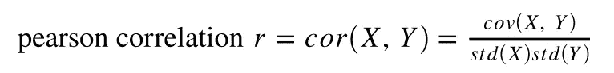
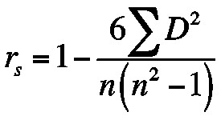

# 引擎盖下:相关性和共线性

> 原文：<https://towardsdatascience.com/under-the-hood-correlation-and-collinearity-b6674b1fb33b?source=collection_archive---------26----------------------->

## 使用相关性充分利用您的数据和建模

unsplash.com/alinnnaaaa 摄

在我的上一篇文章中，我讨论了[基尼系数](/under-the-hood-using-gini-impurity-to-your-advantage-in-decision-tree-classifiers-9be030a650d5)，以及它如何帮助你建立决策树模型。然而，数学知识并不局限于解释机器学习算法的结果和性能。更重要的是，没有什么数据科学的概念不值得重新审视或更深入地研究。我们经常被新的、令人兴奋的项目和挑战所吸引，但有时回到我们认为已经理解的基础上是值得的。这是本文的驱动力；我希望讨论一个我们都认为自己了解冷的概念(我知道我以为我了解！)，这样做可以为数据科学家工具箱中一个非常常用的工具增加更多深度。

在这篇文章中，我将讨论在任何建模之前的探索性数据分析的开始阶段，为了特征选择和潜在的特征工程的目的，对我们的数据中的相关性概念进行稍微深入的思考是如何有所帮助的。其中包括一个注意事项，并简要讨论了只关注高(或低)相关系数分数而忽略潜在的共线性会如何给你带来麻烦。

**相关系数对你的数据说明了什么？**

对于大多数数据科学家来说，这似乎是一个显而易见的问题，一个我们都很熟悉的问题。相关系数表示一个变量与另一个变量之间的关系强度:当一个值增加时，它如何影响另一个值？可能的值范围从-1 到 1。-1 表示完全负相关(x 增大，y 减小)，1 表示完全正相关(x 增大，y 增大)，0 表示完全不相关的数据(x 和 y 完全相互独立)。这是一种非常常用的方法来分析数据，并在探索性数据分析阶段识别强学习者以传递到模型中。事实上，对于我们这些 Python 用户来说，调用 pandas 的 *df.corr()* ，以及在 seaborn 或 matplotlib 中构建热图和散点图来可视化目标的特征，这些代码行对于数据科学家来说是如此常见，以至于我们甚至可以在不看键盘的情况下通过肌肉记忆来键入这些代码行(就在那里有*)。read_csv()* ！).

然而，如果你调用 *df.corr()* 你得到的相关系数，比我上面提到的更微妙更具体。默认情况下，这种方法在分析相关性时会将 [P *厄森相关系数*应用到您的数据中。这是皮尔逊系数公式(或它的一种形式):](https://en.wikipedia.org/wiki/Pearson_correlation_coefficient)

严格来说，这是对 x 和 y 之间的*线性关系*的强度(或存在/不存在)的测量。对于许多数据项目来说，这是识别数据相关性的合适方法。但是，通过使用皮尔逊系数，您假设线性的标准假设，例如同方差性(您的数据具有相等的方差，而不是在其他点或多或少地变化)，并且您的数据近似呈正态分布。此外，该系数旨在应用于连续变量，虽然它对一些二进制分类变量(0 或 1)仍然有效，但它不适用于顺序变量(大于 0 或 1，也称为*排序的*变量)。最后一点，皮尔逊系数对于非正态分布的数据以及离群值非常不稳健。这是因为它度量的是线性相关性，当所度量的数据不能线性表达时，这个度量就不能准确描述相关性。

那么，如果你的数据不是线性的，你该怎么办呢？如果您计划首先应用非参数模型，那么度量线性关系有意义吗？例如，如果我计划运行支持向量机或 k 近邻模型，我为什么要关心线性度？在这些情况下，是时候调整熊猫的默认参数了。corr()方法。

**斯皮尔曼的 Rho**

Spearman 系数专门用于计算有序数据。您可以通过将 method = 'spearman '参数传入。corr()(*df . corr(method = ' spearman '*)。公式如下:

其中 D 是等级差，n 是样本量。和皮尔逊系数一样，斯皮尔曼系数的范围是-1 到 1，解释非常相似。然而，重要的是，这不是所描述的*线性*关系，而是*单调*关系。这是什么意思？在很高的层面上，记住不是每个函数都是线性的(比如指数曲线和[复杂的公式](https://tutorial.math.lamar.edu/classes/calci/CommonGraphs.aspx))。在这些情况下，相对于 y 绘制的 x 的函数将不具有有意义的线性，但是这并不意味着该函数通常不趋向于正或负。这就是斯皮尔曼系数所描述的。例如，斯皮尔曼系数 1 表示当 x 增加时，y *总是*增加，即使它没有增加相同的固定量(如曲线)。斯皮尔曼系数-1 正好相反:当 x 增加时，y *总是*减少一些。系数为 0 意味着没有单调关系(x 的变化和 y 的变化之间没有一致的关系)。[抛物线](https://saylordotorg.github.io/text_elementary-algebra/s12-05-graphing-parabolas.html)就是一个例子，增加 x 的负值会减少 y，但增加 x 的正值会增加 y。

简而言之，单调的关系*表示关系在一个方向上的一致变化，但不假设线性。从寻找强学习者的数据科学家的角度来看，这里的要点是，当您的数据不是线性的、包含有序(分级)特征和/或您计划使用非参数估计器(如 KNN)时，在分析数据的相关性时应用 Spearman 系数。您得到的相关系数值将更加合适，并可能有助于您为模型识别更好的要素，这反过来意味着(希望)在需要考虑诸如增强或正则化等因素之前，模型会表现出更少的偏差和方差。*

**肯德尔的τ**

同样，可以选择应用肯德尔的 Tau 系数(*df . corr(method = ' Kendall ')*)。和斯皮尔曼的 rho，肯德尔的 tau 有很多相似之处。例如，Kendall 的 Tau 不做线性假设，因此在试图分析离散变量的相关性时是一个合适的选择。肯德尔的 Tau 测量变量的“一致性”(concordance)，这同样是这些变量一起移动的趋势的指示(同样，随着 x 增加，y 也有增加的趋势)，因此可以类似于其他两种方法进行解释。

就 Spearman 的 rho 和 Kendall 的 Tau 之间的差异而言，深入探究数学差异超出了本文的范围。然而，同样在高层次上，值得注意的是，Kendall 的 Tau 往往给出比 Spearman 的 rho 更低的值(不太可能得到接近 1 或-1 的值)，但同时，Kendall 的 Tau 对数据中的错误和差异(如异常值)不太敏感。因此，如果您已经看到了与上述类似的情况，尤其是比较有序数据和非线性数据，但您还怀疑可能会产生误导性结果的差异和异常值，这是在探索数据和搜索模型中的理想特征时考虑使用肯德尔τ的绝佳案例。

**关于特征选择相关性的注意事项**

因此，您需要仔细分析您的数据，运行适当的相关系数，并选择最有希望的要素，即那些与您的目标具有最强正相关或负相关的要素。你训练并评估这个模型，然后…它显示出很高的方差。是时候应用正则化了，对吗？也许吧，但是你花在相关性分析上的时间是值得的，因为此时此刻相关性对你有利。

**多重共线性是回归中两个或两个以上解释变量相互高度线性相关的术语。尤其是在线性回归的情况下，这可能会导致模型中出现更高的方差。这是因为这些高度相关变量的微小变化会导致你的反应变量发生夸大的变化。这种夸大实际上会给模型的预测添加噪声，从而导致模型无法很好地利用验证数据进行概括。如果您的模型显示出较高的方差，请花时间检查您的要素之间的关系，因为这有助于识别要删除和/或聚合的良好要素，从而简化您的模型。快速检查一下你的回归模型的性能是否遭受多重共线性是[方差膨胀因子(VIF)](https://www.statisticshowto.com/variance-inflation-factor/) 。这是 VIF 公式:**

****

**简而言之，这会产生一个比率，该比率表示与没有多重共线性时的预期值相比，您在模型中预期会看到的方差膨胀程度。例如，VIF 为 2 意味着与要素中不包含多重共线性的模型相比，差异大约是前者的两倍。根据上面的文章，解释 VIF 时的一个很好的经验法则是:1 分完全不相关，多重共线性使 1-5 分略微膨胀，超过 5 分则高度膨胀。请务必利用这些工具，为您的决策提供信息！诚然，监管是一个强有力的工具，但无法与做出合理的统计和量化决策相提并论。**

**即使不做回归模型，也值得花时间检查解释变量之间是否高度相关，尤其是如果您的早期模型显示出高方差。当然，VIF 是无法计算的，因为在分类模型中没有 R 分数，但是检查解释变量的相关性仍然可以使用 *df.corr()* 进行相互比较。在试图简化模型时，使用这些信息做出正确的决策！**

****总之****

**很容易被数据项目中的“大问题”分散注意力，或者在试图最大化其性能时完全专注于模型及其超参数。通常，项目中更“简单”的部分，比如数据的相关性，很容易被忽略。这可能是一个很大的错误，这是一个例子，说明耐心和明智的决策实际上可以使你成为一个更有效的数据科学家，而不是仅仅依赖网格搜索和微调各种参数，希望找到模型的最佳性能。**

**使用 *df.corr()* 分析要素的相关性就是一个很好的例子。如果没有使用合适的系数来测量相关性，将不会收到任何错误消息或警告，因此很容易认为根据这些结果在模型中构建要素没有问题。然而，这可能会导致一个次优模型，您现在必须花费数小时或数天来调整、微调和令人沮丧地与之搏斗，如果您选择了更合适的功能(或排除了潜在的问题)，它可能会“开箱即用”地工作得更好。永远不要忘记，作为一名数据科学家，你不是一个拿工资打字的按钮工。将()"放入脚本中。一个伟大的数据科学家不仅知道数据背后的数学原理，还有点像哲学家；询问“*这对我的数据意味着什么？”*从这个角度来看，正如我的导师和导师经常告诉我的那样，我们甚至是艺术家，几乎是在用我们处理的数据画画。对你遇到的数据要有耐心和深思熟虑，并使用你所掌握的工具，你将会比匆忙地跳过“简单”的步骤更有效和高效。**