# 引擎盖下——神经网络到底是如何工作的？

> 原文：<https://towardsdatascience.com/under-the-hood-how-do-neural-networks-really-work-7b48b171dc8c?source=collection_archive---------14----------------------->

## 使用 MNIST 数据集理解神经网络背后的数学——这是我从 fast.ai 中获得的主要收获

神经网络构成了深度学习的核心，这是机器学习的一个子集，我在我的上一篇文章中介绍了[。接触过人工智能的人通常对神经网络如何工作有一个很好的高层想法——数据从神经网络的一层传递到下一层，这些数据从最顶层传播到底层，直到以某种方式，算法输出关于图像是吉娃娃还是松饼的预测。](https://studentsxstudents.com/a-teenagers-foray-into-the-world-of-artificial-intelligence-868e5145ab92)

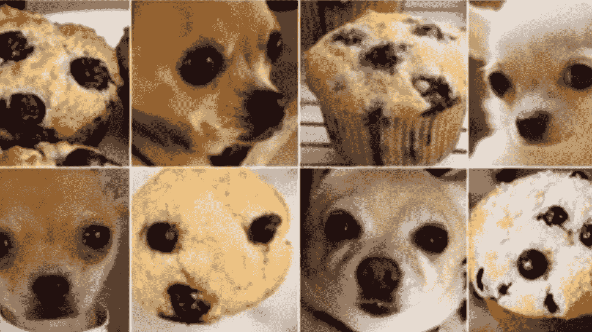

看不出区别吗？图像识别软件可能比人类更难做到。图片来自 [FreeCodeCamp](https://www.freecodecamp.org/news/chihuahua-or-muffin-my-search-for-the-best-computer-vision-api-cbda4d6b425d/) (BSD-3 许可证)。

似乎很神奇，不是吗？**令人惊讶的是，计算机视觉模型的神经网络可以用*高中数学*** 来理解。它只需要以最简单的方式进行正确的解释，让每个人都明白神经网络是如何在引擎盖下工作的。在本文中，我将利用 MNIST 手写数字数据库来解释*从头开始利用神经网络**创建***模型的过程。

在我们开始之前，重要的是强调一下*为什么*我们需要理解神经网络是如何工作的。任何有抱负的机器学习开发者都可以简单地使用 10 行代码👇来区分猫和狗——那么为什么要费心去了解它们下面发生了什么呢？

以下是我的观点:如果不能完全理解机器学习中发生的事情，我们将 1)永远无法完全定制所需的代码，并使其适应现实世界中的不同问题，2)调试将是一场噩梦。

> 简而言之，一个初学者使用一个复杂的工具却不了解这个工具是如何工作的，他仍然是一个初学者，直到他完全理解大多数事情是如何工作的。

在本文中，我将介绍以下内容:

1.  [深度学习预测如何工作的概述](#da8a)
2.  [完成导入的先决条件，并处理数据](#3d9a)
3.  [深入 7 个步骤创建一个单层机器学习模型](#33c0)
4.  [使用激活功能创建多个层](#1630)

# 对计算机生成的预测如何工作的高层次理解

为了完全理解这一点，我们必须回到术语“机器学习”首次流行的地方。

根据人工智能的早期先驱之一、世界上第一个成功的自学程序的创造者亚瑟·塞缪尔的说法，他是这样定义机器学习的:

> 假设我们安排一些自动方法来测试任何当前权重分配在实际性能方面的有效性，并提供一种机制来改变权重分配以最大化性能。我们不需要研究这样一个过程的细节，就可以看出它是完全自动化的，并且看出这样编程的机器会从它的经验中“学习”。

从这句话中，我们可以确定机器学习的 7 个基本步骤。在识别任意两个手写数字“2”或“9”的上下文中:

1.  [初始化重量](#6c80)
2.  [对于每张图片，使用这些权重来预测它是 2 还是 9。](#0f5a)
3.  从所有这些预测中，找出模型有多好。
4.  [计算梯度——测量每个重量，改变重量将如何改变损失](#b70a)
5.  [根据计算结果改变所有权重](#dc99)
6.  [返回步骤 2，重复](#1692)
7.  迭代直到决定停止。

我们可以在下图中看到这 7 个步骤的流程:

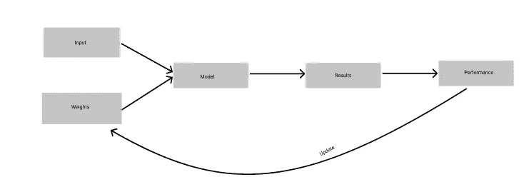

图片作者。

是的，看这个有点让人不知所措，因为有很多新的技术术语可能不熟悉。什么是重量？什么是时代？请继续关注我，我将在下面一步一步地解释这些。这些步骤可能没有太多意义，但是坚持住！

# 先决条件—导入、处理数据

首先，让我们完成所有的先决条件—导入必要的包。这是开始创建任何计算机视觉模型的最基本步骤。我们将使用 PyTorch 和 fast.ai。由于 [fast.ai](http://fast.ai) 是一个构建在 PyTorch 之上的库，本文将解释*fast . ai 内置函数的一些*是如何编写的(例如，上述要点第 9 行的 learner 类)。

```
from fastai.vision.all import *  
from fastbook import *
```

其次，让我们从 [MNIST 数据集](http://yann.lecun.com/exdb/mnist/)中抓取图像。对于这个特殊的例子，我们必须从手写数字 2 和 9 的训练目录中检索数据。

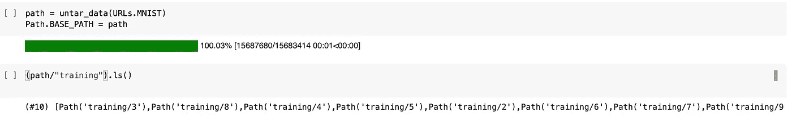

在谷歌 Colab 笔记本^.上图片作者。

为了找出文件夹包含的内容，我们可以使用。 [fast.ai](http://fast.ai) 中的 ls()函数。然后，我们打开图片，看看它到底是什么样子-

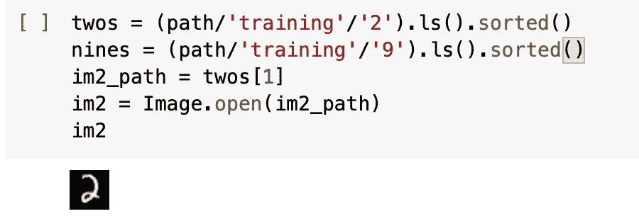

图片作者。

如你所见，这只是一个手写数字“2”的图像！

然而，计算机无法识别像这样传递给它们的图像——计算机中的数据被表示为一组数字。我们可以在这个例子中说明:

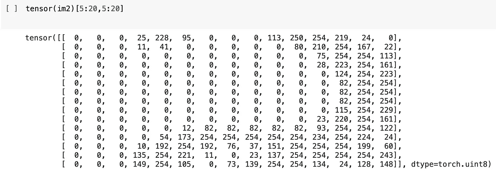

这说明了图像“2”是如何在张量(列表的列表)中表示的。图片作者。

现在，所有这些数字代表什么？让我们使用熊猫为我们提供的一个方便的功能来看看它:

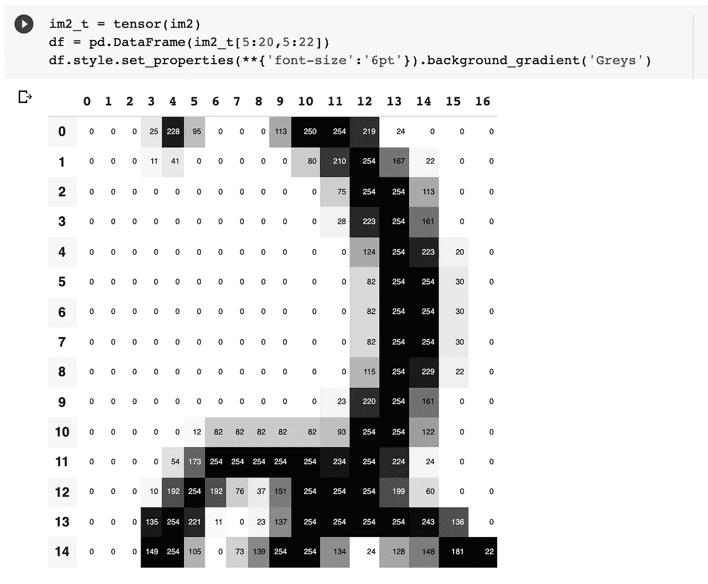

正如你可以模糊地辨认出手写数字的轮廓，上面张量中显示的数字是不同像素的激活，0 代表白色，254 代表黑色。图片作者。

如上所示，计算机解读图像的主要方式是通过像素形式的**，像素是任何计算机显示器的最小构建块**。这些像素以数字的形式记录下来。

既然我们对计算机如何真正解释图像有了更好的理解，让我们深入研究如何操纵数据来给出我们的预测。

## 数据结构和数据集

在计算预测之前，我们必须确保数据以相同的方式组织，以便程序处理所有不同的图像。让我们确定我们有两个不同的张量，每个都代表数据集中所有的 9 和 2。

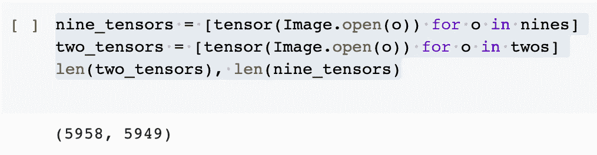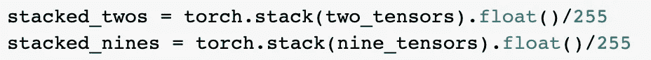

使用 torch.stack 将不同的张量组合在一起。

在进一步深入之前，我们必须讨论一下张量到底是什么。名字里第一次听说张量这个词 *TensorFlow* ，是个(完全！)我们正在使用的独立库。**在这种情况下，PyTorch 张量是一个多维数据表，所有数据项都属于同一类型**。列表或数组与 PyTorch 张量之间的区别在于，这些张量完成计算的速度比使用传统 Python 数组快得多(几千倍)。

解析*所有*我们收集的作为模型训练数据的数据并不能解决问题——因为我们需要一些东西来检查我们的模型。我们不希望我们的模型在我们的训练数据上过度训练或*过度拟合*，在训练中表现非常好，但在训练数据之外遇到从未见过的情况时就会崩溃。因此，我们必须将数据分成*训练数据集*和*验证数据集*。

为此，我们会:

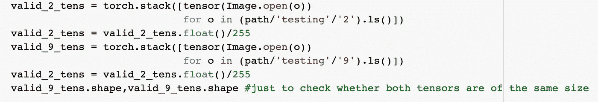

正在为数字“2”和“9”创建验证张量堆栈。图片作者。

此外，我们必须创建变量——自变量**和因变量**来跟踪这些数据。

```
train_x = torch.cat([stacked_twos, stacked_nines]).view(-1, 28*28)
```

这个 train_x 变量基本上会把我们所有的图像作为**自变量**(也就是我们要测的东西，想想:5 年级科学！).

然后我们创建因变量，赋值‘1’代表手写的 2，赋值‘0’代表数据中手写的 9。

```
train_y = tensor([1]*len(twos) + [0]*len(nines)).unsqueeze(1)
```

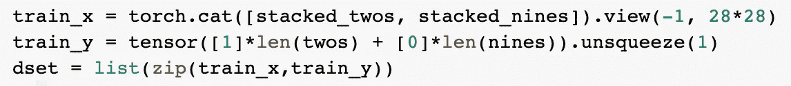

然后，我们创建一个基于自变量和因变量的数据集，将它们组合成一个元组，一种不可变列表的形式。

然后，我们对验证数据集重复该过程:

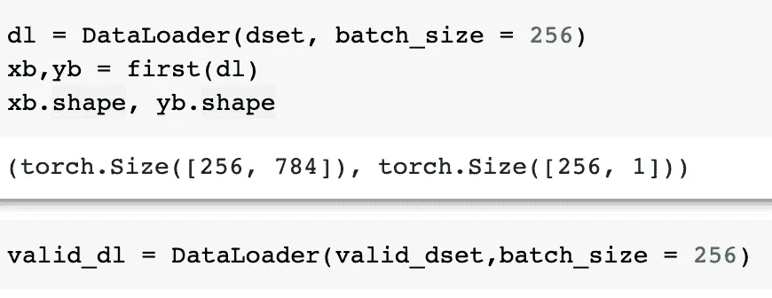

图片作者。

然后，我们将两个数据集加载到一个具有相同批处理大小的数据加载器中。

现在我们已经完成了数据的设置，我们可以开始用我们的模型处理这些数据了。

# 创建一层线性模型

我们已经成功地完成了数据的设置。回到机器学习的七个步骤，我们现在可以慢慢地完成它们。

## 步骤 1:初始化权重

什么是*重量*？权重基本上是变量，权重分配是对这些变量的值的特定选择。可以想到的是，为了使程序正常工作，每个数据点都被赋予了重点。换句话说，改变这些权重集将改变模型，以针对不同的任务表现不同的行为。

这里，我们为每个像素随机初始化权重—

权重和偏差(由于权重有时可能为零而存在，我们希望避免这种情况)一起构成了参数。

有件事困扰着我——与输入一个随机数相比，有没有更好的初始化权重的方法？

原来，神经网络中的随机初始化是一个特定的特征，而不是错误。在这种情况下，**随机优化算法(将在下面解释)在向下搜索之前使用随机性**来选择搜索的起始点。

## 第二步:预测——对于每张图片，预测这是 2 还是 9。

然后我们可以继续计算我们的第一个预测:

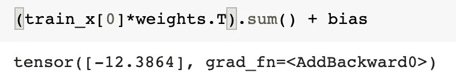

接下来，我们使用*小批量:*计算其余数据的预测

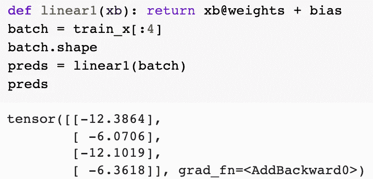

在这种情况下，小批量包含 4 个值，因此有 4 个输出值。以上图片由作者提供。

👆这一步是**至关重要的**，因为它有能力**计算预测**，并且是任何神经网络的两个基本方程之一。

## 第三步:利用损失函数来理解我们的模型有多好

为了找出模型有多好，我们必须使用*损失函数*。这是“根据实际表现测试任何当前权重分配的有效性”的条款，并且是模型将如何更新其权重以给出更好预测的前提。

考虑一个基本的损失函数。我们不能使用准确度作为损失函数，因为准确度只会在对图像是“2”还是“9”的预测完全改变的情况下才会改变——在这种意义上，**准确度不会捕捉到模型预测结果的置信度或确定性的微小更新。**

然而，我们可以做的是创建一个函数，该函数记录模型给出的的预测值(例如，对于它正在解释的图像更接近于 2 而不是 9 的相当确定的预测，它给出 0.2)和与之相关的实际标签(在这种情况下，它将是 0，因此预测值和模型之间的原始差值*损失*将是 0.2)。

但是等等！正如您从输出中看到的，并不是所有的预测 w **都在 0 和 1** 之间，其中一些可能真的很远。我们想要的是*另一个函数*，它可以挤压 0 和 1 之间的值。

嗯，有一个方便的函数——它被称为 *Sigmoid 函数*。它基本上是一个数学函数，由(1/ 1+e^(-x)给出，包含 0 到 1 之间的所有正数和负数。


Sigmoid 函数的可视化。图片来自维基百科。

Sigmoid 函数在这里非常方便，因为我们可以使用随机梯度下降法(下一节)来计算任意输入处的曲线梯度。

> 现在，可能有些人在通过介绍性视频学习机器学习时会有一种误解——我当然有一些。如果你在网上用谷歌搜索，Sigmoid 函数通常是不被认可的，但是在批评它之前，了解一下使用 Sigmoid 函数的上下文是很重要的。在这种情况下，它只是作为一种压缩损失函数在 0 和 1 之间的数字的方法。我们**而不是**使用 Sigmoid 作为激活函数，这将在后面讨论。

因此，我们可以计算我们的*小批量:*的损失

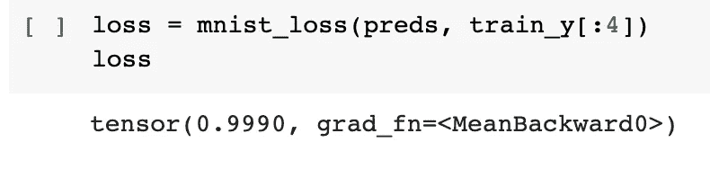

## 步骤 4:计算梯度——随机梯度下降的原理

由于我们可能从任何给定的权重(随机权重)开始，机器学习模型的要点是在模型的训练限制内达到最低可能损失的**。**

这听起来可能很复杂，但实际上只需要高中数学就能很好地理解这个概念。假设我们的损失函数是任意的二次函数 y = x，我们想最小化这个损失函数。我们会立即想到这个函数的导数或**梯度为零的点，这个点恰好在最低点**(或“谷”)。在这一点上画一条与曲线相切的线，就会得到一条直线。我们希望程序不断更新自己，以达到最小点。

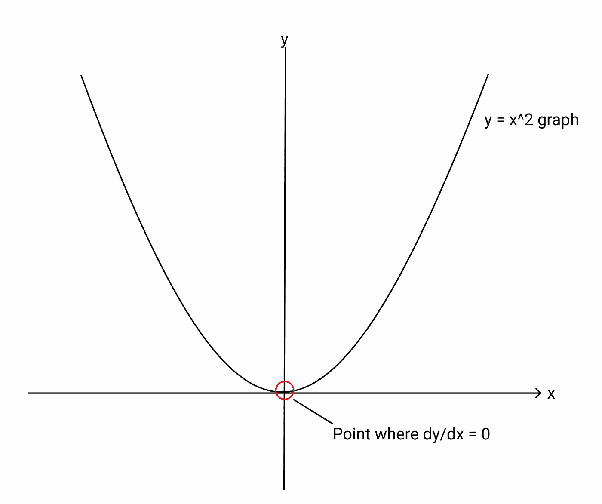

达到任何给定损失函数的最小值是至关重要的。

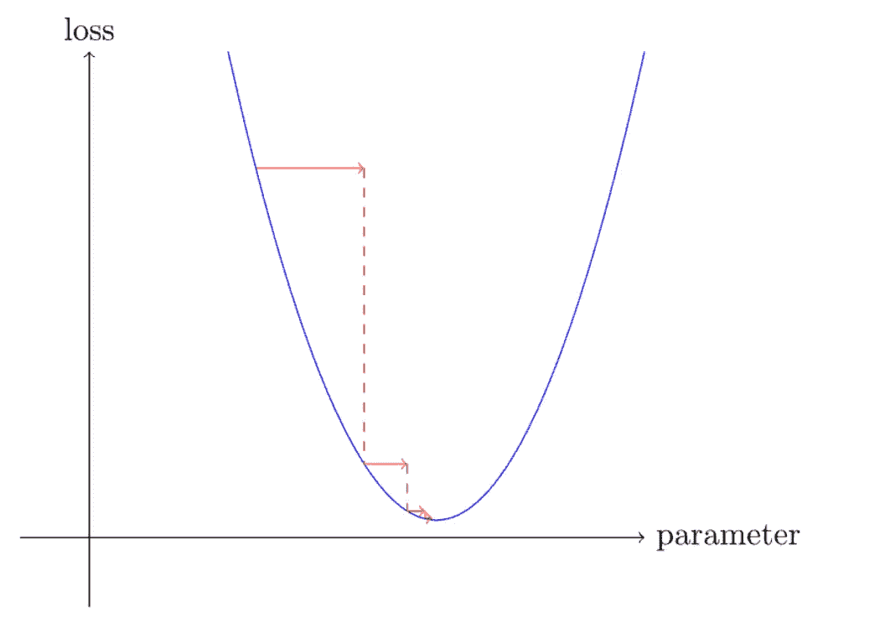

梯度下降的本质。以上图片由作者提供。

这是机器学习中损失最小化的主要方式之一，它提供了如何快速加快模型训练的广泛概述。

为了计算梯度(不，我们不需要手动计算，所以你不需要翻出你的高中数学笔记)，我们编写以下函数:

## 步骤 5:基于计算的梯度改变权重(步进权重)

为了改变 calc_grad 函数的权重，我们必须*步进*该函数，使我们的值接近损失函数的最小值。我们通过一段非常重要的代码来实现这一点，如下所示:

如果你已经走了这么远，就是这样！这些是以线性方式训练模型一次所需的原始步骤。步骤 1 到 5 基本上是遍历一次数据需要的基本步骤，遍历一次数据**的周期称为“epoch”。**

***随机梯度下降(SGD)* 和*梯度下降(GD)* 的区别是“对于 xb，yb 在 dl 中”这条线——SGD 有，GD 没有。梯度下降将计算*整个数据集*的梯度，而 SGD 计算不同大小的小批量的梯度。**

**现在，为了简单起见，我们将所有其他函数(验证、准确性)合并到更高级别的函数中，并将不同的批处理放在一起:**

## **步骤 6:从步骤 2 开始重复**

**然后，我们将所有函数传递到一个 for 循环中，重复这个过程一定次数，直到我们的精度提高到最佳水平。**

**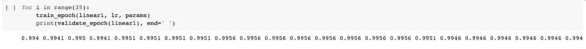**

**到第 25 次迭代时，我们的模型现在可以达到几乎 100%的准确率——这意味着它几乎可以肯定地预测手写数字是“2”还是“9”！**

**耶！我们刚刚建立了一个*线性(一层)*网络，它能够在很短的时间内训练出惊人的精确度。**

**为了优化这一过程并减少低级函数的数量(当然，也为了让我们的代码看起来更好)，我们使用了预建的函数(例如，一个名为*学习者*的类)，这些函数与之前的代码行具有完全相同的功能。**

# **使用*激活功能*创建多个层**

**我们如何从线性分层程序发展到多层程序？关键在于一行简单的代码-**

**这被称为激活函数，它将两个线性层组合成一个双层网络。**

**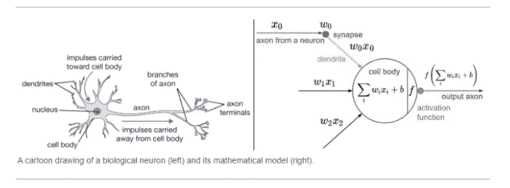**

**人工神经网络与生物神经元的可视化。图片来自斯坦福的 cs231n。**

**特别是这个 **res.max 函数也被称为*整流线性单元(ReLU)*** ，这是一种“将所有负数转换为零，保留正数不变”的花哨说法。这是一个这样的激活函数，还有很多其他的——比如 Leaky ReLU、Sigmoid(不赞成专门用*作为激活函数*)、tanh 等等。**

**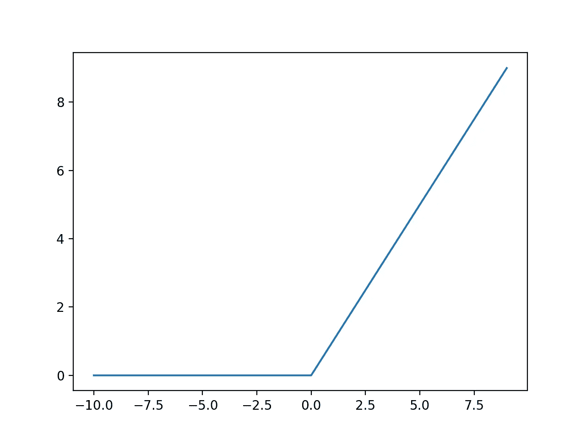**

**ReLU，观想。图片来自维基百科。**

**既然我们已经了解了如何将两个不同的线性层结合在一起，现在我们可以创建一个简单的神经网络:**

**然后我们最终可以使用我们的双层人工神经网络来训练我们的模型:**

**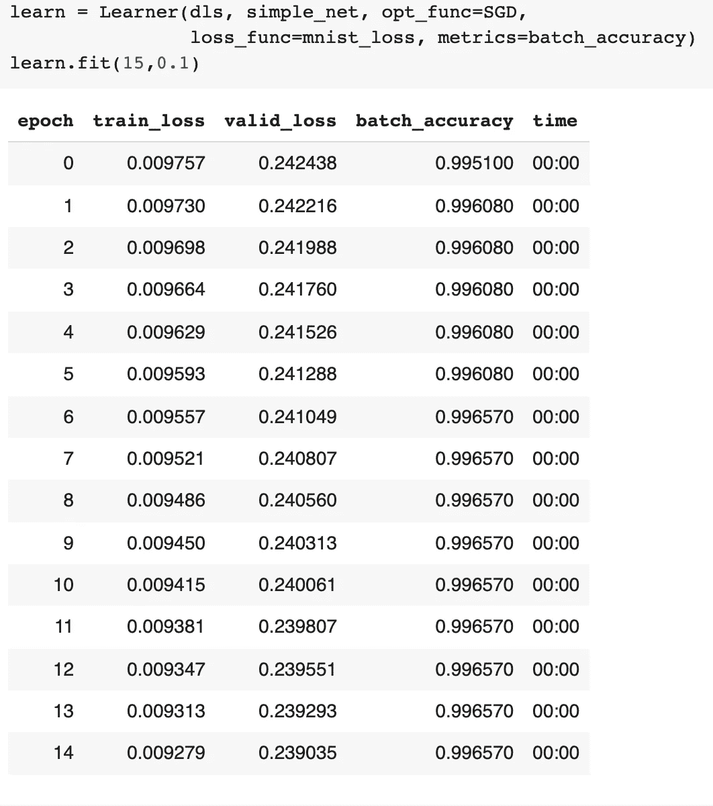**

**更有趣的是，我们甚至可以看到模型在这个简单的网络架构的各个层中试图处理什么图像！**

**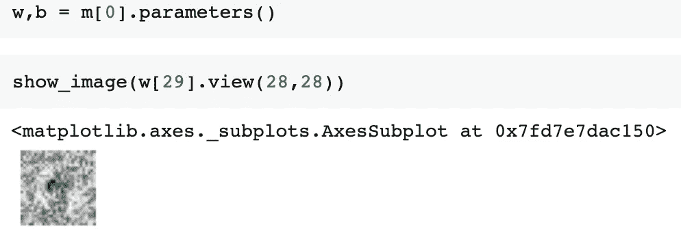**

**在这种情况下，它正在识别手写“9”数字的曲线:)**

# **结论**

**理解人工神经网络内部的情况起初似乎令人生畏，但如果我们必须从头开始构建一个模型，这是定制和理解模型的哪些部分出错的关键。要深入研究人工智能，需要的只是决心、一台正常工作的计算机，以及对高中数学概念的一些基本理解。**

**如果你想玩玩代码，看看它是如何工作的，点击这个[链接](https://colab.research.google.com/drive/1t85lNzxSzhm30t2OgTyAGAeFBLV3IGND?usp=sharing)自己试试吧！或者，您可以在这里查看我的 github 存储库:[https://github . com/danielcwq/mni ST 2-9/blob/main/mni ST 2 _ 9 . ipynb](https://github.com/danielcwq/mnist2-9/blob/main/mnist2_9.ipynb)**

# **请随时联系我的[网站](http://danielching.netlify.app/)！**