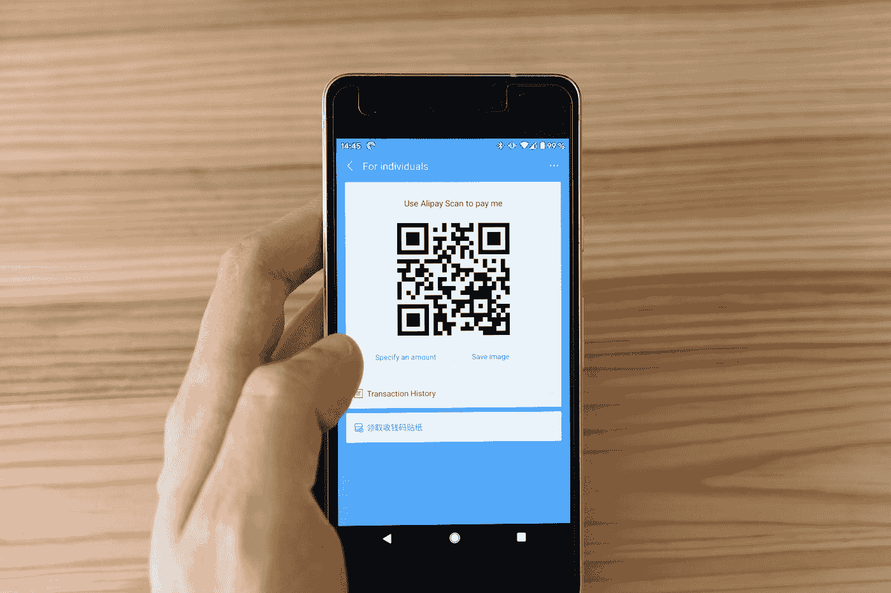
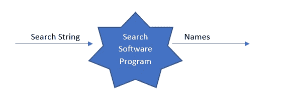
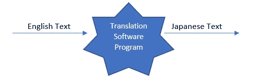
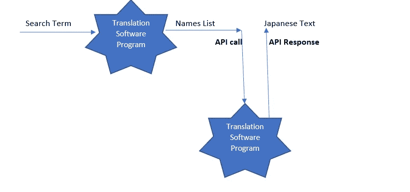
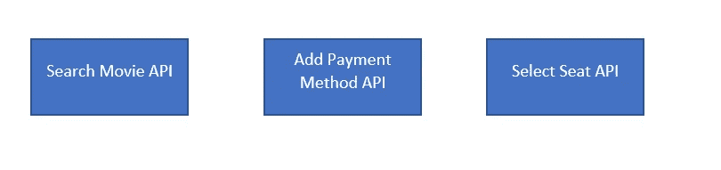

# 在应用程序编程接口(API)的掩盖下

> 原文：<https://towardsdatascience.com/under-the-hood-of-application-programming-interfaces-apis-30f5be4b996f?source=collection_archive---------39----------------------->

## 简化 API 的行话

马库斯·温克勒在 [Unsplash](https://unsplash.com?utm_source=medium&utm_medium=referral) 上的照片

T 他的文章谈到了应用程序编程接口(API)。今天，API 是现代软件开发的核心。它们变得如此普遍，以至于像“嘿！为此使用一个 API 或*“已经有一个 API 了”*在软件人的对话中经常使用。事实上，围绕 API 的行话也已经开始在日常语言中使用。但有时“不太懂技术”的人可能会发现很难理解这些术语。因此，本文试图以一种易于理解和联系的方式解释 API 背后的概念。

# 什么是 API？

在回答这个问题之前，我们先从概念层面来思考一个软件程序。从根本上说，软件程序是一堆代码，它们接受一些输入，进行一些处理，并给出一些输出。通常，这些代码是可重用单元的集合，如函数、模块或例程。

假设我们有一个软件程序，它接受一个文本字符串作为输入，并返回一组匹配的数据。所以，也许我们输入“冰淇淋”作为搜索项，程序会返回喜欢冰淇淋的顾客的名字。

作者图片

现在，假设我们有一个将输出(在这个例子中是名字)翻译成日语的需求。怎么做？

一种选择是，我们雇用一组人工翻译人员，他们获取输出，手动翻译并将其存储回数据库。这将是非常繁琐和低效的。下一个选择是修改软件，添加一些可以自动将输出翻译成日语的代码。这将是一个理想的解决方案，但同样需要大量的技术和语言专业知识来开发它。

我们认识一个朋友，他拥有一个软件程序，可以完全满足我们的需求。他的软件程序可以将文本作为输入，并将日文翻译文本作为输出。

作者图片

如果我们能以某种方式使用我们朋友的程序，我们的问题就解决了。但是当然，我们的朋友不会把他的软件程序原样给我们。这是他的知识产权。但是，他可以做一个安排。如果我们的程序可以将英文名字发送给他的程序，而他的程序会将翻译好的日文文本返回给我们，那会怎么样呢？我们不需要知道他的软件程序里面有什么。我们可以根据需要简单地使用这个程序的功能。我们只需要确保我们以一种他的程序能够理解的特定方式或格式给出英文名字。这就像他给自己的程序提供了一个 ***【接口】*** ，然后程序可以翻译这些名字，并返回给我们(或给我们)译文。这种一个程序从另一个程序获取服务的安排叫做 API。真的！！正如 GUI(图形用户界面)是人与软件交互的工具一样，API 是一个软件程序与另一个软件程序交互并使用其功能的工具。

用技术术语来说，我们的朋友可以让我们访问他的软件的 API。我们可以在程序中使用这个 API 来满足我们的需求。我们**“调用”**这个 API，API 给我们一个**“响应”**。

作者图片

# API 有什么用？

不同的公司根据他们的专业领域解决不同的问题。谷歌地图是查找位置的绝佳应用。你可以输入一个地址，它会显示你的位置(基本上，它可以找出这个地方的纬度和经度)。比方说，一家公司正在开发一个应用程序，其需求之一是找出一个地方的位置。他们可以简单地使用谷歌地图 API 并继续他们的其他开发，而不是为这一需求开发自己的软件。这将节省他们大量的时间和精力。此外，他们可以更专注于自己的专业领域。这是一个使用 ***供应商 API*** 或第三方 API 的例子，即我们与外部公司合作使用他们的服务。

由于与 API 的交互使事情变得如此高效和省时，公司可以决定将他们的应用程序或软件作为一组交互的 API 来设计和开发。例如，如果我们正在构建一个预订电影票的应用程序，我们可以决定围绕不同的 API 来构建我们的代码——每个 API 执行一个特定的操作。

作者图片

我们的内部团队可以在应用程序的其他部分使用这些 API，如果需要，甚至可以在公司内部的其他项目中使用。这些 API 被称为**内部 API**。

> 这种将软件构建为一堆交互 API 的方法最近变得非常流行。有人称之为**微服务。**

一些公司可能决定向公众免费提供他们的 API。这些被称为**公共 API**。例子有 [Twitter API](https://developer.twitter.com/en/docs/getting-started) 或者 [PubMed API](https://www.ncbi.nlm.nih.gov/home/develop/api/) 。他们发布了开发者可以遵循的关于如何使用这些 API 的说明。

## 如何构建一个 API？

API 的主要好处:它可以被许多人使用，跨许多应用程序，不需要理解它里面写了什么。为了使它如此通用，API 的开发者应该遵循一个标准的方法或者一套通用的规则。这就是所谓的协议。最常见的协议称为 ***REST*** ，使用该协议构建的 API 称为**REST API**。(还有其他协议，比如 SOAP，但它们不再像 REST 那样流行)

REST 代表**Re**presentation**S**state**T**transfer。这不是一个非常直观的缩写。要记住的主要事情是，它是一组规则*，通过这些规则构建一个 API。规则如:*

1.  *通过 API 发出请求有一种特定的方式或格式*
2.  *接收来自 API 的响应有一种特定的方式或格式*
3.  *API 以特定的方式或格式表示响应的内容*
4.  *有一种使用 API 进行身份验证的特定方式*

*以预订电影票的应用程序为例，我们的“搜索电影”REST API 类似于:*

*[https://dummy movie company/movies](https://dummymoviecompany/movies)*

*这被称为**“终点”——**这将向我们展示数据库中可用的电影列表*

*每个 REST API 请求也需要一个**【方法】**来指定它到底需要什么。有 4 种最常用的方法:*

***获取:**从服务器读取数据*

***上传:**在服务器上保存数据*

*发布:开始一个动作(例如预定电影)*

***删除:**从服务器中删除数据*

*在下面的帖子中解释了用 Python 从头开始构建 REST API 的一步一步的例子。*

*</the-right-way-to-build-an-api-with-python-cd08ab285f8f> * 

*理解 API——它们是什么，它们如何交互，以及它们做什么，是在当前软件开发环境中必须掌握的技能。希望这篇文章能对不熟悉这些概念的读者有所帮助。*

*我现在将把我支持 API 的理由搁置起来！:)*