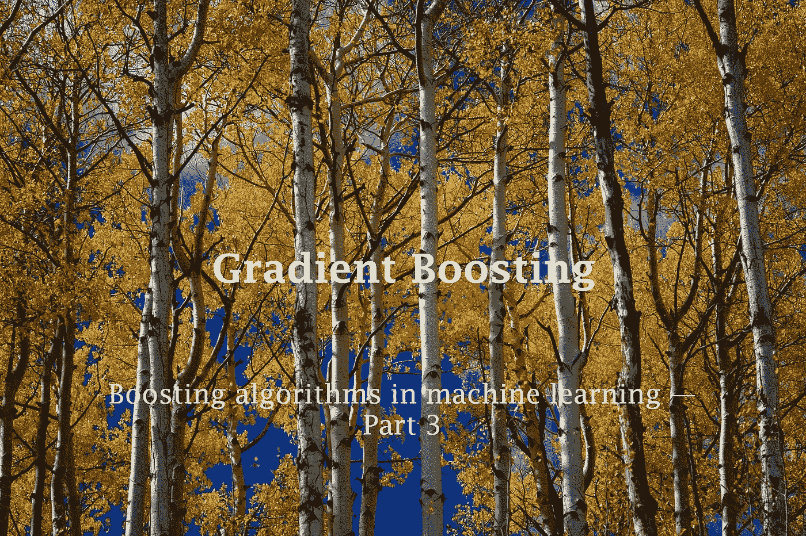
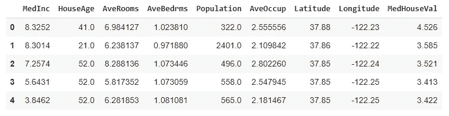
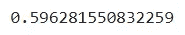
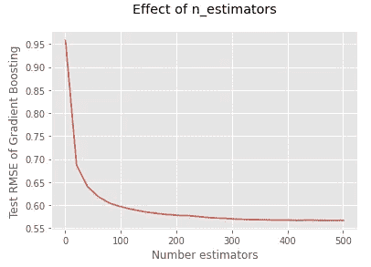
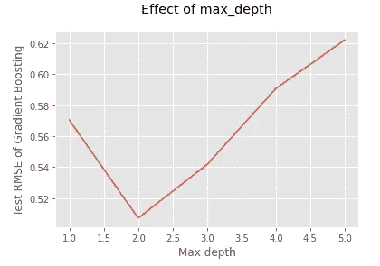
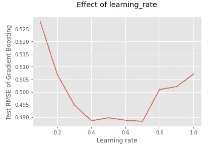
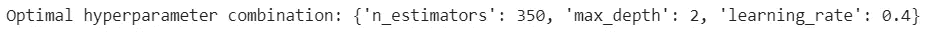

# 梯度增强及其 Python 实现

> 原文：<https://towardsdatascience.com/under-the-hood-of-gradient-boosting-and-its-python-implementation-99cc63efd24d?source=collection_archive---------9----------------------->

## 助推技术

## 机器学习中的助推算法——第三部分



唐纳德·詹纳蒂在 [Unsplash](https://unsplash.com/?utm_source=unsplash&utm_medium=referral&utm_content=creditCopyText) 上的照片

到目前为止，我们已经在[第一部分](/introduction-to-boosted-trees-2692b6653b53)中讨论了升压的一般含义和一些重要的技术术语。我们还在第 2 部分的[中讨论了 AdaBoost(自适应增强)的 Python 实现。](/how-do-you-implement-adaboost-with-python-a76427b0fa7a)

今天我们来讨论另一个重要的 boosting 算法:**梯度 Boosting** 。它是 AdaBoost 的一个很好的替代方案，有时甚至超过 AdaBoost。

梯度增强使用**梯度下降算法**，它试图通过梯度下降来最小化误差(残差)。

就像其他提升技术一样，在梯度提升的训练过程中，通过纠正先前树的错误，每个新树都被添加到集成中。

与 AdaBoost 相反，梯度增强中的每个新树都适合于由先前树的预测产生的 ***残差*** 。

有一个增强版本的梯度增强，称为 **XGBoost(极限梯度增强)**，将在第 4 部分讨论。

# 残差

在讨论梯度增强是如何工作的之前，我们想了解一下*残差*背后的想法。

数学上，模型中的残差可以定义为实际值和预测值之间的差异。

```
**Residual = Actual value — Predicted value**
```

残差可以是正数，也可以是负数。

# 梯度增强的手动实现

为了理解梯度增强是如何工作的，我们需要手动实现该算法。为此，我们使用[加州房价数据集](https://drive.google.com/file/d/1Kees3lk-Zo7AsrYz7svcj8Hnbr6gHok6/view?usp=sharing)做了一个回归任务。请注意，梯度增强也适用于分类任务。

数据集的前几行如下所示:

```
import pandas as pddf = pd.read_csv('cali_housing.csv')
df.head()
```



(图片由作者提供)

目标列是最后一列(MedHouseVal)。因此，我们将 X(特征矩阵)和 y(目标列)定义如下:

```
X = df.drop(columns='MedHouseVal')
y = df['MedHouseVal']
```

然后，我们为 X 和 y 创建训练集和测试集

现在，我们准备好手动实现梯度推进。

**第一步:**在集成中训练初始决策树。这棵树被称为基础学习者。用 **max_depth=1** 调节。所以，这棵树被专门称为决策树桩。

**第二步:**对第一棵树进行预测。

```
tree_1_pred = tree_1.predict(X_train)
```

**第三步:**计算第一棵树的预测残差。

```
tree_1_residuals = y_train - tree_1_pred
```

**第四步:**在第一棵树的残差上训练第二棵树，进行预测，计算残差。

同样，我们可以根据第二棵树的残差训练第三棵树，进行预测并计算残差。

这是第三次迭代的结尾。我们继续构建新的树，直到残差接近 0。整个过程可能包含由 **n_estimators** 定义的数百或数千次迭代(这将在后面讨论)。

第三次迭代后，我们可以计算 RMSE 值。


(图片由作者提供)

y 单位的近似值为 0.86。我们可以通过增加迭代次数来最小化这个值。但是，我们不能手动操作。Scikit-learn 提供了以下特殊类来轻松实现梯度增强。

*   [**【GradientBoostingRegressor()**](https://scikit-learn.org/stable/modules/generated/sklearn.ensemble.GradientBoostingRegressor.html)**—用于回归**
*   **[**GradientBoostingClassifier()**](https://scikit-learn.org/stable/modules/generated/sklearn.ensemble.GradientBoostingClassifier.html)—用于分类**

# **Scikit-learn 梯度增强的实现**

**现在，我们使用 Scikit-learn 的**GradientBoostingRegressor()**类在同一数据集上训练梯度增强模型。**

****

**(图片由作者提供)**

**在使用 100 次迭代后，RMSE 值显著降低！然而，这也取决于**最大深度**和**学习率**。让我们测量每个超参数的影响。**

# **测量 n 估计量的效果**

**在 1 到 500 的范围内，我们将测量 **n_estimators** 的效果，并绘制由梯度推进模型给出的测试 RMSE 值。**

****

**(图片由作者提供)**

**随着估计器数量的增加，RMSE 值逐渐减小，并在 400 次迭代后保持不变。最好选择 300 到 500 之间的值。如果选择更高的值，模型将需要很长时间来完成训练过程。**

# **测量 max_depth 的效果**

**在 1 到 5 的范围内，我们将测量 **max_depth** 的效果，并绘制由梯度推进模型给出的测试 RMSE 值。**

****

**(图片由作者提供)**

****最大深度**的最佳值为 2。**

# **衡量学习率的影响**

**在 0.1 到 1.0 的范围内，我们将测量 **learning_rate** 的效果，并绘制梯度增强模型给出的测试 RMSE 值。**

****

**(图片由作者提供)**

**最好的学习率是 0.4 或 0.7。**

# **使用随机搜索找到最佳超参数值**

**在这里，我们用 [**随机搜索**](/python-implementation-of-grid-search-and-random-search-for-hyperparameter-optimization-2d6a82ebf75c) 一下子找到最优的超参数值。我们也可以使用网格搜索，但这需要几个小时才能完成。**

****

**(图片由作者提供)**

**您可以将这些超参数值与之前逐个获得的值进行比较。**

# **摘要**

**到目前为止，我们已经完成了 2 个 boosting 算法。在梯度增强中，RMSE 值受 **n_estimators** 、 **max_depth** 和 **learning_rate** 的值影响很大。**

**最佳超参数值将根据您拥有的数据集和许多其他因素而变化。**

**有时，梯度增强可以胜过 AdaBoost。但是，梯度推进比随机森林好得多。**

**在[第 4 部分](https://rukshanpramoditha.medium.com/unlock-the-power-of-xgboost-738536b9f36f)中，我们将讨论 **XGBoost(极限梯度增强)**，一个梯度增强的增强版本。下一个故事再见。祝大家学习愉快！**

**我的读者可以通过下面的链接注册成为会员，以获得我写的每个故事的全部信息，我将收到你的一部分会员费。**

**[](https://rukshanpramoditha.medium.com/membership) [## 通过我的推荐链接加入 Medium

### 作为一个媒体会员，你的会员费的一部分会给你阅读的作家，你可以完全接触到每一个故事…

rukshanpramoditha.medium.com](https://rukshanpramoditha.medium.com/membership) 

非常感谢你一直以来的支持！

特别感谢 Unsplash 上的 **Donald Giannatti** ，为我提供了这篇文章的封面图片。

[鲁克山普拉莫迪塔](https://medium.com/u/f90a3bb1d400?source=post_page-----99cc63efd24d--------------------------------)
**2021–10–24****