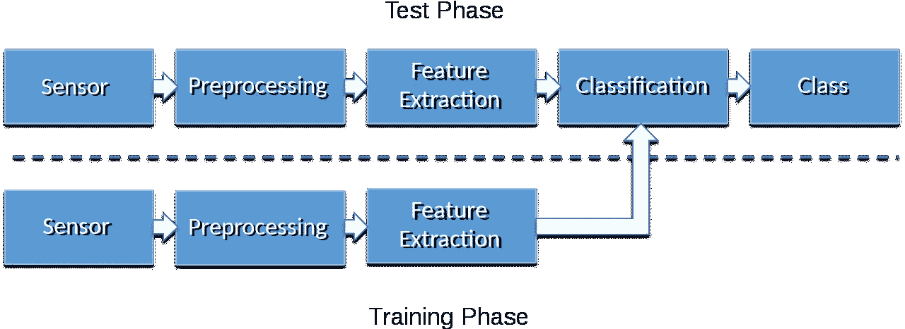
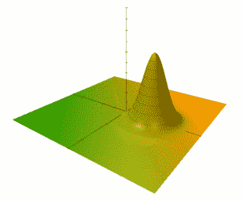
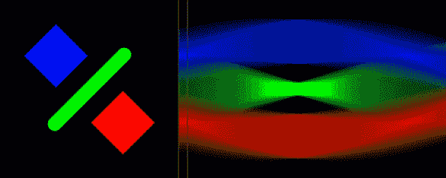
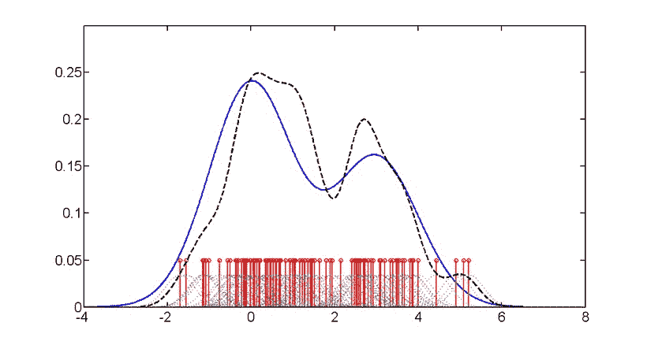

# 模式识别和机器学习的基本方法

> 原文：<https://towardsdatascience.com/under-the-hood-of-modern-machine-and-deep-learning-d76fc1249467?source=collection_archive---------6----------------------->

现代深度和机器学习“在引擎盖下”有许多经典的方法。内森·范·埃格蒙德在 [Unsplash](https://unsplash.com/s/photos/under-the-hood?utm_source=unsplash&utm_medium=referral&utm_content=creditCopyText) 上拍摄的照片

## 在机器和深度学习的引擎盖下

## 经典 ML 方法综述

现代深度学习方法每天都会产生非凡的结果。为了理解它的基础，最好也理解经典的模式识别和机器学习方法。在 2020/21 年的冬季学期，我教了一门关于这个主题的课，这是完全可以作为开放存取材料获得的。你可以在 Zenodo 上找到 PDF 格式的[幻灯片，在 github](https://doi.org/10.5281/zenodo.4429576) 上找到相应的 [TeX 源文件。所有材料都通过许可证](https://github.com/akmaier/pr-slides)在 [CC 4.0 下获得许可。在这篇文章中，我将对所有材料进行概述，并对每一章进行简短介绍，同时提供相应的视频和文字记录链接。](https://creativecommons.org/licenses/by/4.0/)

经典模式识别将学习过程分为训练和测试阶段。这对于任何有监督的、无监督的或强化学习方法都是一样的。图片来源:[维基共享](https://commons.wikimedia.org/wiki/File:PatternRecognitionSystem.svg)下 CC BY 4.0

# 第 1 章—简介

在第一章中，我们回顾了机器学习和模式识别的基本原理。尼曼的模式识别管道使用每个机器学习系统中基本出现的基本步骤引入了这一思想，并从数据处理的角度引入了对监督、非监督和强化学习系统有效的概念。基于这些观察，给出了详细的课程概述，并介绍了基本概念，如贝叶斯定理，最佳分类和评估措施。

模式识别流水线— [视频](https://youtu.be/8cZ-ljrSaEw) — [抄本](https://medium.com/codex/an-introduction-to-pattern-recognition-adb34cd5d7bd)
模式识别公设— [视频](https://youtu.be/lkf47tCvdbI) — [抄本](https://medium.com/codex/pattern-recognition-basics-assumptions-strategies-for-classifier-evaluation-987186d5072)
详细课程概述— [视频](https://youtu.be/BROB96fXtPI) — [抄本](https://medium.com/codex/pattern-recognition-the-big-picture-29bc556f3c42)
贝叶斯定理— [视频](https://youtu.be/NNigmXxPbGw) — [抄本](https://medium.com/codex/how-do-i-compute-probabilities-for-things-that-i-cannot-observe-5503bde33ad9)
最优分类器— [视频](https://youtu.be/2MN_7DpPDkY) — [抄本](https://medium.com/codex/the-optimal-classifier-b8444c264852)
评价措施

高斯钟形曲线通常用于模拟类别分布。图片来源:[维基共享资源](https://commons.wikimedia.org/wiki/File:SmallDisplacedGaussianWF.gif)

# 第 2 章——阶级分布和阶级界限

机器学习方法的一个关键要素是如何对底层分类问题建模。在本章中，我们介绍了逻辑函数(也称为 sigmoid 函数)，它是两个概率分布相交的一般结果，即两个类别之间的决策边界。如果使用高斯钟形曲线对类进行建模，则它们之间的决策边界通常会产生二次函数。对于指数族的所有分布，我们可以观察到类别之间的判定边界是线性的，如果它们共享相同的分散参数，例如高斯分布的相同协方差矩阵。基于这些观察，我们可以证明，我们可以使用嵌入到逻辑函数中的回归问题来直接估计类之间的决策边界。本章以朴素贝叶斯分类器的描述结束，该分类器假设所有类的对角协方差矩阵。

逻辑函数— [视频](https://www.youtube.com/watch?v=UdtR5ZOMFWE) — [抄本](https://medium.com/dataseries/an-introduction-to-the-sigmoid-function-cd654877efa3)
高斯人&他们的交集— [视频](https://youtu.be/gdxtzDFfR8E) — [抄本](https://medium.com/dataseries/gaussians-their-intersections-the-logistic-function-9cd75492b1a0)
指数家庭— [视频](https://youtu.be/euPnbXQuppk) — [抄本](https://medium.com/dataseries/what-do-gaussians-poisson-and-binomial-probability-mass-function-have-in-common-12588f51500f)—
逻辑回归&损失函数— [视频](https://youtu.be/dZQNlV9DCQo) — [抄本](https://medium.com/codex/classification-is-just-another-regression-problem-f324760bc695)
逻辑回归—函数拟合— [视频](https://youtu.be/hv0R8jktQug) —

并不是每一个低维度的投影都能够保留类别信息(这里是:颜色)。图片来源:[维基共享资源](https://commons.wikimedia.org/wiki/File:Radon_transform_sinogram.gif)

# 第 3 章—类最佳特征变换

在本章中，我们将讨论特征转换及其对后续分类任务的影响。如果我们能够将所有类别转换到一个空间中，在该空间中，它们共享它们的分散参数，则所有决策边界都将是线性的，并且随后的分类任务将更容易解决。线性判别分析(LDA)是一种变换，它假设情况是这样的，并确定进入这种分离超空间的最佳投影。

线性判别分析简介— [视频](https://youtu.be/LoegZ_-z7h8) — [抄本](https://medium.com/codex/if-your-problem-is-too-hard-linearise-it-a4bcfcbe507f)
线性判别分析—属性— [视频](https://youtu.be/zTsZdXMKbS4) — [抄本](https://medium.com/codex/how-many-dimensions-do-we-need-in-a-linearly-separating-space-fd760380dac7)
约束、凸优化&正则化— [视频](https://youtu.be/1kiKF1p6btY) — [抄本](https://medium.com/codex/what-the-heck-are-lagrange-multipliers-and-can-they-hurt-me-1e142f45791)
降秩形式的 LDA—[视频](https://youtu.be/6YSDM1hCO6M) — [抄本](https://medium.com/p/9fd71959bf9c/edit)
LDA —原公式— [视频](https://youtu.be/XnhY66H-OGs) —

即使对于高度非线性的问题，我们能找到最优和唯一的决策边界吗？内核技巧有助于解决这个问题。图片来源:[维基共享资源](https://commons.wikimedia.org/wiki/File:Kernel_Machine.png)

# 第四章——最优且唯一的分离超平面

在这一章中，我们研究是否能找到唯一的最优决策边界。为了做到这一点，我们首先要重温几个基本的数学原理。正则化是一种数学工具，它允许我们找到唯一的解决方案，即使是对于高度不适定的问题。为了使用这个技巧，我们回顾了规范以及它们如何被用来指导回归问题。Rosenblatt 的感知器和多层感知器(也称为人工神经网络)天生就有这种不适定性。作为一种补救措施，通常可以采用适当的规范和正规化。在大多数情况下，产生的优化问题是使用梯度下降程序解决的。有趣的是，规范的使用也会影响到最终梯度的方向。有了这些新的理论见解，我们接着引入支持向量机的概念。他们使用对偶，即原始问题到对偶变量的映射，即拉格朗日乘数，来解决问题。这允许找到全局最优的、唯一的解决方案。支持向量公式的一个副作用是，原始问题也可以被映射到高维空间，其中非线性决策边界变成线性边界。这被称为内核空间。使用 Mercer 定理，我们探索了不同的选择来构建这样一个空间，包括序列核。此外，核技巧可以用于机器学习中的其他众所周知的概念，例如主成分分析(PCA ),并且它甚至可以与流形学习相结合，从而产生拉普拉斯支持向量机。

正则化回归— [视频](https://youtu.be/1yXuIpv2IW8) — [抄本](https://medium.com/codex/if-regularization-doesnt-work-you-are-not-using-enough-of-it-ae837091e118)
规范和单位球— [视频](https://youtu.be/WSzA9YgKeEs) — [抄本](https://medium.com/codex/if-you-want-to-understand-norms-you-have-to-get-them-by-their-balls-a8894c034a18)
规范依赖回归— [视频](https://youtu.be/H6wqBwasWHQ) — [抄本](https://medium.com/codex/linear-regression-norm-based-regularization-from-closed-form-solutions-to-non-linear-problems-40621c342294)
罗森布拉特的感知器— [视频](https://youtu.be/uclj81wBdxQ) — [抄本](https://medium.com/codex/in-the-beginning-was-the-perceptron-through-them-all-nets-were-made-51bd9c6bff9f)
多层感知器— [视频](https://youtu.be/FONoPLXmPPY) — [抄本【T23
支持向量机的概念—](https://medium.com/codex/i-am-your-father-deep-net-the-multi-layer-perceptron-9ac61e1577cc) [视频](https://youtu.be/KMjDEymy5wc) — [抄本](https://medium.com/codex/a-simple-introduction-to-support-vector-machines-6fd330110293)
优化中的对偶— [视频](https://youtu.be/h5Up5FzCvWE) — [抄本](https://medium.com/codex/the-other-side-of-optimality-d0f07dedbe95)
支持向量机—优化— [视频](https://youtu.be/dQi9OyQah-I) — [抄本](https://medium.com/codex/how-to-train-your-svm-1641a090a063)
梅塞定理和核 SVM — [视频](https://youtu.be/Zi3Fu0M3QFI) — [抄本](https://medium.com/codex/can-my-kernel-really-be-implemented-as-a-transform-c38a3a85e9e9)
核 PCA 和序列核— 【T55

使用期望最大化算法可以稳健地估计高斯混合模型的参数。图片来源:[维基共享资源](https://commons.wikimedia.org/wiki/File:KernelDensityGaussianAnimated.gif)

# 第 5 章——期望最大化、隐藏信息及其应用

模式识别中的另一个关键问题是估计隐藏的、不可观察的信息。期望最大化算法是解决这类问题的通用方法。我们首先推导出高斯混合的情况下，其次是该方法的一般推导。
独立分量分析也揭示了一种隐藏的信息。它基于独立分量的混合可能产生高斯分布的观察。因此，ICA 使用这种先验知识，通过最大化变换分量的非高斯性来解开混合信息。ICA 的典型应用是盲源分离，例如几个声源的分离。

高斯混合 EM 算法— [视频](https://youtu.be/rZXfFBkJ0aA) — [抄本](https://medium.com/codex/how-to-estimate-gaussians-and-their-mixtures-1b2faf31d8a5)
期望最大化算法— [视频](https://youtu.be/NaSORPKoij8) — [抄本](https://medium.com/codex/on-hidden-information-and-how-to-estimate-it-638d97f5c9fb)
EM 算法应用实例— [视频](https://youtu.be/J2X-760nj5w) — [抄本](https://medium.com/codex/on-hidden-biases-in-mri-segmentation-56acfb3bef72)
独立分量分析简介— [视频](https://youtu.be/ku6cfaqXTCo) — [抄本](https://medium.com/codex/blind-source-separation-in-a-nutshell-a5e9dbf924a7)
独立分量分析与高斯性— [视频](https://youtu.be/Zw3mCi0aAO8)

训练数据很贵。我们能做什么来处理有限的数据？图片由 [1820796](https://pixabay.com/de/users/1820796-1820796/?utm_source=link-attribution&utm_medium=referral&utm_campaign=image&utm_content=2070384) 来自 [Pixabay](https://pixabay.com/de/?utm_source=link-attribution&utm_medium=referral&utm_campaign=image&utm_content=2070384)

# 第 6 章——有限数据及其处理方法

在这最后一章中，我们重温选择最佳分类方法的一般问题。“没有免费的午餐”——定理证明这样的方法在一般情况下是不存在的。然而，偏差-方差权衡告诉我们，只有先验知识才能同时减少两个误差源。一般来说，在几乎所有的模式识别问题中，我们都必须使用有限的数据源。为了估计有效的误差估计，必须使用重采样方法。基于对重采样的观察，boosting 制定了一种方法，旨在重新加权来自先前训练迭代的错误分类实例，以提高通用分类器的性能。有趣的是，这种方法实际上等同于使用指数损失函数。最后，我们来看看 boosting 在 Viola-Jones 人脸检测算法中最流行的应用。

没有免费的午餐定理&偏差-方差权衡— [视频](https://youtu.be/ibjN4G6ahCM) — [抄本](https://medium.com/codex/the-cake-is-a-lie-6ba31c1be921)
有限数据上的性能度量— [视频](https://youtu.be/RlxilgP25eo) — [抄本](https://medium.com/codex/how-to-estimate-out-of-distribution-errors-without-collecting-new-data-b4c3a4d307ca)—Adaboost 的概念— [视频](https://youtu.be/SiB6K2TImYk) — [抄本](https://medium.com/codex/can-the-wisdom-of-the-crowd-also-improve-machine-learning-14b19596db9d)
Adaboost &指数损失— [视频](https://youtu.be/fwoshNG5QpI) — [抄本](https://medium.com/codex/which-loss-function-does-adaboost-actually-optimise-6c645527127f)
维奥拉-琼斯算法—

如果你喜欢这篇文章，你可以在这里找到更多的文章，或者看看我们的讲座。如果你想在未来了解更多的文章、视频和研究，我也会很感激关注 [YouTube](https://www.youtube.com/c/AndreasMaierTV) 、 [Twitter](https://twitter.com/maier_ak) 、[脸书](https://www.facebook.com/andreas.maier.31337)或 [LinkedIn](https://www.linkedin.com/in/andreas-maier-a6870b1a6/) 。本文以 [Creative Commons 4.0 归属许可](https://creativecommons.org/licenses/by/4.0/deed.de)发布，如果引用，可以转载和修改。如果你有兴趣从视频讲座中获得文字记录，试试[自动博客](http://autoblog.tf.fau.de/)。