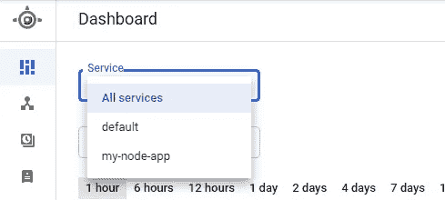

# 引擎盖下的 GCP 应用引擎

> 原文：<https://towardsdatascience.com/under-the-hood-with-gcps-app-engine-82d862cb3691?source=collection_archive---------37----------------------->

## 更深入地了解如何配置应用程序引擎和解读相关成本


照片由[胡佛·董](https://unsplash.com/@lozt?utm_source=unsplash&utm_medium=referral&utm_content=creditCopyText)在 [Unsplash](https://unsplash.com/s/photos/engine?utm_source=unsplash&utm_medium=referral&utm_content=creditCopyText) 拍摄

Google 的 App Engine 服务是一个很好的方法，可以让 web 应用程序轻松启动并运行。事实上，我有一篇[文章](/deploy-a-node-js-application-with-app-engine-in-10-minutes-69b03e4d54f0)介绍如何在这个平台上用大约 10 分钟的时间构建一个 Node.js 应用程序。这项服务是谷歌[免费层](https://cloud.google.com/free)的一部分，开始使用应用引擎很容易，但人们可能很难理解不同的配置选项和定价结构。本文分三个部分概述了在 App Engine 平台上配置和部署应用程序时需要考虑的问题。

**托管选项** —配置和部署 App Engine 应用程序时要记住的事情。

**定价**—App 引擎费用是如何产生的。

**其他注意事项** —部署 App Engine 应用程序时的一些其他注意事项。

让我们开始吧。

# 托管选项

部署应用程序时，您必须通过`app.yaml`配置文件向应用程序引擎提供使用何种设置的说明。本节旨在帮助您理解部署选项的差异以及如何在该文件中指定它们。

下面是一个`app.yaml`文件的例子:

```
runtime: nodejs14
env: standard
instance_class: F1
service: my-node-app
automatic_scaling:    
    max_instances: 2    
    min_instances: 0    
    min_idle_instances: 0    
    max_idle_instances: 1
```

## 运行时间

部署应用程序时，必须指定运行时语言。关于支持运行时环境的文档可以在这里[找到](https://cloud.google.com/appengine/docs/standard/runtimes)并且在配置文件中使用了`runtime`属性——这里是一个使用 Node.js v14 的部署示例:

```
runtime: nodejs14
env: standard
instance_class: F1
service: my-node-app
automatic_scaling:    
    max_instances: 2    
    min_instances: 0    
    min_idle_instances: 0    
    max_idle_instances: 1
```

## 环境

您可以从两种不同的环境类型中选择— **标准**和**灵活。**本[文档](https://cloud.google.com/appengine/docs/the-appengine-environments)概述了两个选项之间的详细差异。简而言之，**灵活的**环境的运行成本会高得多，只有当你使用的语言不受**标准**环境支持时，才推荐使用这种环境。以下是支持的语言列表:

*   Python 2.7、Python 3.7、Python 3.8、Python 3.9(预览版)
*   Java 8，Java 11
*   Node.js 8、Node.js 10、Node.js 12 和 Node.js 14(预览)
*   PHP 5.5、PHP 7.2、PHP 7.3 和 PHP 7.4
*   Ruby 2.5、Ruby 2.6 和 Ruby 2.7
*   Go 1.11，Go 1.12，Go 1.13，Go 1.14，Go 1.15(预览)

还有其他原因让我们变得灵活，但这应该是个例外。您可以在此处找到完整的特性矩阵对比环境类型能力。环境类型可以通过`env`属性在`app.yaml`文件中指定——值可以是 **flex** 或 **standard** :

```
runtime: nodejs14
env: standard
instance_class: F1
service: my-node-app
automatic_scaling:    
    max_instances: 2    
    min_instances: 0    
    min_idle_instances: 0    
    max_idle_instances: 1
```

## 实例类

像大多数其他云服务一样，当部署一个 App Engine 应用程序时，你可以选择一个[类](https://cloud.google.com/appengine/docs/standard#instance_classes)，它将决定分配的资源和功能选项。


作者图表

重要的是要记住，谷歌的免费等级[包括](https://cloud.google.com/appengine/quotas#Instances)每天 28 小时的 f1 或 9 小时的 B1 实例免费使用。


作者图表

**F 实例**被视为“前端实例”, **B 实例**被视为“后端实例”。正如您在上表中看到的，主要区别是可用的缩放选项。实例类型可以通过`instance_class`属性在`app.yaml`文件中指定:

```
runtime: nodejs14
env: standard
instance_class: F1
service: my-node-app
automatic_scaling:    
    max_instances: 2    
    min_instances: 0    
    min_idle_instances: 0    
    max_idle_instances: 1
```

## 服务

App Engine 将应用程序作为服务运行。您的第一个 App Engine 部署与默认的**服务相关联，但是您随后部署的任何东西都必须与专用的服务名相关联。如果指定的服务不存在，将创建一个新的服务，如果存在，则推送的应用程序将取代它的位置。未能在您的`app.yaml`文件中指定服务将会覆盖您的默认服务应用程序。您可以在 App Engine 仪表盘中查看正在运行的服务列表。**



作者图表

环境类型可以通过`service`属性在`app.yaml`文件中设置:

```
runtime: nodejs14
env: standard
instance_class: F1
service: my-node-app
automatic_scaling:    
    max_instances: 2    
    min_instances: 0    
    min_idle_instances: 0    
    max_idle_instances: 1
```

## 缩放类型

实例伸缩是一个需要理解的非常重要的配置，因为它会显著影响您的成本和性能。如上所述， **F 型**实例支持自动缩放，而 **B 型**实例可以利用手动或基本缩放。您可以在这里找到选项[的矩阵，在这里](https://cloud.google.com/appengine/docs/standard/python/how-instances-are-managed#scaling_types)可以找到配置标志的详细信息[。以下是总结。](https://cloud.google.com/appengine/docs/standard/python/config/appref#scaling_elements)

**自动伸缩** —基于请求和性能创建和终止实例。配置可能会有点复杂，但我建议至少使用`max_instances`、`min_instances`、`min_idle_instances`和`max_idle_instances`属性设置总实例和空闲实例的最小和最大设置。这应该可以防止产生意外的费用。还有其他标志，如`target_cpu_utilization`和`max_pending_latency`，应用引擎可以使用它们来优化性能和触发缩放变化。下面是一个运行 0 到 2 个实例和最多 1 个空闲实例的限制的示例:

```
runtime: nodejs14
env: standard
instance_class: F1
service: my-node-app
automatic_scaling:    
    max_instances: 2    
    min_instances: 0    
    min_idle_instances: 0    
    max_idle_instances: 1
```

**基本伸缩** —实例随着应用程序负载的波动而上下旋转。在`app.yaml`文件中，可以使用`max_instances`属性设置实例的最大数量，使用`idle_timeout`属性设置空闲周期，如下所示:

```
runtime: nodejs14
env: standard
instance_class: B1
service: my-node-app
basic_scaling:
  max_instances: 11
  idle_timeout: 10m
```

**手动扩展** —加速并维护一组实例，而不管服务上的负载如何。在`app.yaml`文件中，可以使用`instances`属性设置实例的数量，如下所示:

```
runtime: nodejs14
env: standard
instance_class: B1
service: my-node-app
manual_scaling:
  instances: 5
```

# 成本和定价

Google 在其免费层中提供了一定数量的应用引擎正常运行时间，但是，根据您的应用程序的设置，即使您的应用程序只运行了指定时间的一小部分，您也可能会产生费用。了解这些费用的来源有时是一个挑战——关于成本的详细文件可以在[这里](https://cloud.google.com/appengine/pricing)找到，但我将在下面概述关键要素。

## 实例正常运行时间费用

从今天起，Google 将按如下方式向您收取实例正常运行时间费用:


作者图表

你最终可能会被起诉，阅读以下三条警告可能会让你省去无数个挠头、漫无目的地在网上搜索答案的时间。


图片由[谢栋豪](https://unsplash.com/@teckhonc?utm_source=unsplash&utm_medium=referral&utm_content=creditCopyText)在 [Unsplash](https://unsplash.com/s/photos/warning?utm_source=unsplash&utm_medium=referral&utm_content=creditCopyText) 上拍摄

正如文档中概述的[这里的](https://cloud.google.com/appengine/quotas#Instances)，您将为正常运行时间**加上**一个实例停止运行时的额外 15 分钟付费。

*如果您的实例在一个小时内收到四个间隔均匀的请求(每隔 15 分钟一次)，并且只花了* ***一秒钟*** *来处理每个请求，然后就停止运行，尽管只使用了* ***4 秒钟的正常运行时间*** *，您仍然需要支付* ***60 分钟*** *的费用。*

如果启用了使用高峰和扩展，您的应用程序可能会扩展到多个实例。在这种情况下，您可能会看到每小时的费用是上述成本表的倍数。

应用程序版本也可能产生一些意想不到的费用。默认情况下，应用程序引擎维护应用程序的所有版本历史，并使每个版本映射到唯一的端点。如果不使用，这些历史版本应该只消耗存储资源，但是如果针对历史版本发出请求，它们将会启动专用实例—这当然会带来额外的利用成本。

# 定额

App Engine 通过[配额](https://cloud.google.com/appengine/quotas)限制应用程序的资源利用率。配额有三种类型:免费、每日和每分钟，如果你正在部署爱好应用程序，你不太可能会接近超过这些配额。如果您确实超过了配额限制，您的应用程序将不可用，直到资源在期限结束时重置，您可以在这里阅读有关此[的更多信息。](https://cloud.google.com/appengine/quotas#When_a_Resource_is_Depleted)

# 其他考虑

## 谷歌云存储

App Engine 利用 GCS 有几种不同的方式:

1.  `staging.<project-id>.appspot.com`桶用于在部署应用程序时存放一些对象
2.  `us.artifacts.<project-id>.appspot.com`桶用于存储构建工件
3.  一些应用程序可能使用桶来存储运行时对象
4.  存储桶可用于存储应用引擎部署的源代码构建文件

GCS 有一个很好的免费使用层，如这里的[所述](https://cloud.google.com/storage/pricing#cloud-storage-always-free)。

## 其他服务

应用程序引擎可能会利用其他一些谷歌云平台服务进行常规操作。这些服务的使用应包含在免费层中，但重要的是要了解这些服务是什么，以防您开始看到收费。你可以在这里看到完整的列表。

# 结论

尽管 App Engine 是让您的应用程序在高度可伸缩的平台上运行的好方法，但了解如何正确配置您的部署和成本可能会有点令人困惑。在这篇文章中，一些光照在初学者通常陷入困境的几个领域。我希望我的帖子是信息丰富的，并为您节省一些头痛和谷歌搜索。

**祝好运，编码快乐！**

*原载于 2021 年 5 月 14 日 http://www.theappliedarchitect.com*<https://www.theappliedarchitect.com/under-the-hood-with-gcps-app-engine/>**。**