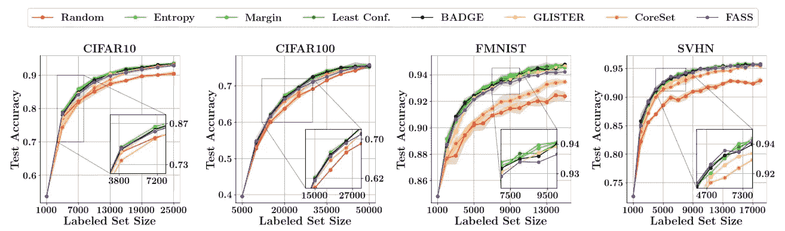
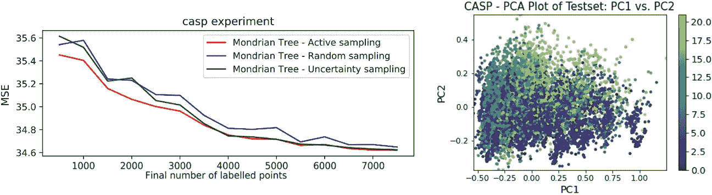
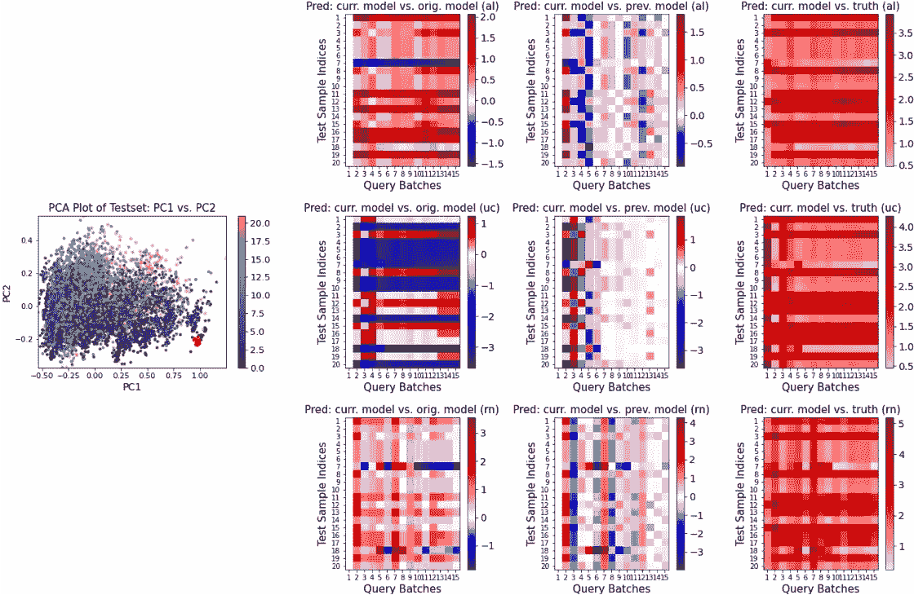
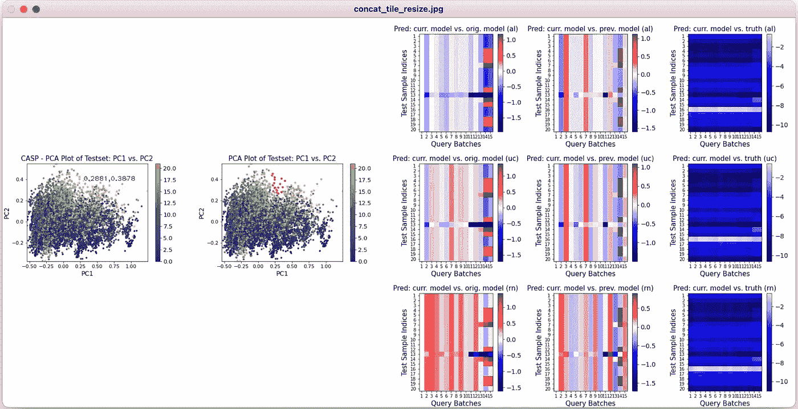

# 了解主动学习:交互式可视化面板

> 原文：<https://towardsdatascience.com/understand-active-learning-an-interactive-visualization-panel-a3e8029d288a?source=collection_archive---------26----------------------->

## 一个聪明的工具来阐明主动学习是如何工作的，为什么它是好的(或坏的)，并且可以做得更多

# 介绍

在这篇文章中，我们旨在介绍一种交互式可视化工具，帮助用户更好地理解传统主动学习的工作方式和原因。这项工作与我们最近在 NeurIPS 2021 以人为中心的人工智能研讨会上发表的一篇论文有关。

## 以人为中心的机器学习

在过去的几十年里，*机器学习*已经成为一个时髦词。最近的许多进展都集中在使模型更加精确和有效。与此同时，人类能够解释他们为什么工作至关重要，特别是在一些敏感领域，如自动驾驶、金融投资和医疗保健管理。如果我们不能说服自己为什么这些智能机器工作良好，领域专家将不会完全相信他们的预测。

不幸的是，仍然有许多机器学习应用程序，其中最先进的模型可以实现强大的预测能力，但准确性的提高是以透明度为代价的，并且所达成的决定缺乏可解释性。直到最近，我们才开始看到一种转变，即让高级算法变得具有交互性和可解释性。换句话说，我们希望放大和增强人类的能力，旨在保持人类的控制，并使机器学习更加高效、有趣和公平。这个想法得到了几个知名机构的支持，比如[斯坦福以人为中心的人工智能研究所](https://hai.stanford.edu/)和[谷歌人&人工智能研究](https://pair.withgoogle.com/)。

## 主动学习

主动机器学习。鸣谢:受张懿主动学习[幻灯片](https://www.cs.cmu.edu/~tom/10701_sp11/recitations/Recitation_13.pdf)的启发。

如果你读过我之前在 R 发表的关于[主动学习的帖子，你会知道我的研究热情是促进主动学习的可解释性。在这里，我想快速更新一下什么是主动学习:一种交互式方法，它查询 oracle(通常是人类注释者)来标记最“有价值”的数据，以便用最少的标记样本训练准确的机器学习模型。](/active-learning-an-exploratory-study-of-its-application-in-statistics-and-r-65713ccdad16)

主动学习的大部分理论工作都是在分类问题上进行的，发展了许多基本的和成功的算法，如不确定性抽样和委员会查询。为了评估主动学习，最常见的方法是通过查询的数量来绘制*准确度*，其中我们期望准确度随着更多样本被查询而提高。不限于分类，最近的研究也采用了一些类似的算法进行回归，标准的性能指标是*均方误差* (MSE)。

> **问题**:许多主动学习论文呈现了高度相似的准确度/均方误差曲线，然而却报道了几个相互矛盾的发现。从精度/MSE 图反映的信息既有限又可能对用户有偏见。

例子摘自最近的 [CVPR 论文](https://arxiv.org/abs/2106.15324?context=cs.LG)

例如，CVPR 最近的一篇论文中的 CIFAR10 实验(第一个图)显示了所有查询方法(除了“随机”)几乎相同的性能。一个合理的假设是，即使曲线是重叠的，这些主动学习方法也不会同样地改进分类模型。一个支持的证据是它们在其他实验中表现各异。但问题是:*我们如何测试它，并实际观察不同的算法是否工作不同？*

# OO**ur 方法&实验**

在我们[在 NeurIPS 2021 以人为中心的人工智能研讨会上发表的论文](https://arxiv.org/abs/2111.04936)中，我们提出了一种新颖的交互式可视化工具，让人们更好地理解主动学习为什么以及如何在某些分类和回归任务上工作。

在本节中，我们将通过一个生动的例子来简要分享这些见解是如何构建的(不要担心，不会有任何太专业或复杂的定义！).

## 测试数据集的主成分分析

在机器学习实验中，准确性或 MSE 是基于最初划分的测试集生成的。例如，“准确度=(准确预测的样本数/测试集中所有样本数)。”因此，第一个任务是布局所有测试样本，并创建一个用于可视化的二维特征嵌入。PCA 等降维技术会有所帮助。

## 实验设置

> **数据集:**在我们的论文中，我们用真实世界的数据进行了主动学习回归问题: [CASP](https://networkrepository.com/CASP.php) 。它最初包含 45，730 个实例，我们在测试集中随机选择了 9，730 个(21%)。
> 
> **机器学习模型**:回归器是一个纯粹的随机树模型，具体来说，来自 NeurIPS 2019 年[论文](https://proceedings.neurips.cc/paper/2018/file/dc4c44f624d600aa568390f1f1104aa0-Paper.pdf)中的蒙德里安树。
> 
> **主动学习过程**:我们从一个空的训练集开始，每次迭代批量查询 500 个，15 批(共 7500 个)后停止。考虑了三种基本的查询策略:基于树的主动算法(al)、不确定抽样(uc)和随机抽样(rn)。

**左**:主动学习实验的 MSE 图。**右侧**:所有测试样本的 PC1 与 PC2

PCA 图显示了所有测试样本之间明显的聚类模式。更重要的是，用户可以用 PCA 图选择一部分(一组)感兴趣的测试数据点。

左侧的 MSE-Query 图显示了理想的下降趋势。主动采样策略是最好的，但不确定性采样似乎具有竞争力，有超过 3，500 个样本被标记。

## 交互式可视化面板

在我们的案例中，我们想回答这个问题:*主动抽样策略是否与不确定性抽样同样有效？*这个问题可以通过**预测值**在每次查询迭代中如何变化来直接解释，这促使我们构建一个交互式可视化工具。

我们将预测值排列成一个二维网格图: **x 轴**表示查询过程(单元可以是单个或批量查询)； **y 轴**代表所选测试样本的指标；**每个像素**根据三个标准显示预测差异，这三个标准是:

> **1。当前模型与原始模型**:如果模型不断改进，并从查询的实例中学习，我们预计预测值会逐渐变得越来越不同。这可以通过更加丰富多彩的网格图来体现。
> 
> **2。当前模型与先前模型**:对于某些策略，我们预计稍后查询的样本对改变模型的影响较小。这可以通过图上较浅的颜色反映出来。
> 
> **3。当前模型与事实真相**:随着查询更多样本，我们期望模型做出更好的预测，更接近事实真相。这也可以通过一个较轻的情节体现出来。
> 
> (这些标准有严格的定义。如果您有兴趣了解更多信息，请查看我们的论文！)

小数值例子上三种人工智能策略的预测变化图

假设我们从 PCA 图中选择一组小值点(用红点标记)。3 为每行中三种策略(“al”、“uc”和“rn”)的预测变化图提供了 3 个面板图。

# 观察

查看三种查询算法的 *first* 预测变化图，很明显它们在改变回归模型时表现不同，即使它们在之前的图中有相似的 MSE 曲线。“al”的表现比“uc”或“rn”更有规律，与初始模型相比，始终具有较大的值(20 个纯红色行中的 18 个)或较小的值(20 个纯蓝色行中的 1 个)。

在“uc”的*第二*预测-变化图中，我们首先看到暗像素，在 5 个查询批次后看到相当亮的接近白色的像素。这表明“uc”倾向于在第一阶段显著地改变模型，并且在后面的查询中影响较小。

*第三个*预测变化图始终显示红色像素，这直观上是有意义的，因为我们选择的暗点具有接近 0 的小真值。树形回归往往用比事实更大的预测来拟合结构。

然而，与低值组的不同性能不同，三种算法对大值组表现出几乎一致的性能。

大值点上三种人工智能策略的预测变化图(实际用户界面)

# 讨论

这只是我们在最初发布的论文中举例说明的一个玩具。我们展示了可视化面板工具是如何工作的，并基于 CASP 实验提供了一些有趣的见解。到目前为止，我们只进行了一些实证实验。事实上，该工具可以揭示更多信息，例如:

> 1.某些主动学习方法是否总是对某些数据子群有效？
> 
> 2.对于拟合大值点(或者，来自稀疏区域的数据点)，树模型从查询的样本中学习得好吗
> 
> ……

虽然我们已经开始在其他不同的数据集上使用我们的工具，但还需要我们做更多的工作来严格回答这些问题。此外，还需要对不同的主动学习策略进行更深入的分析。它们与主动学习中几个相当重要的术语有关:**信息量**、**代表性**和**多样性**。未来，我们希望扩展这个项目，在一些主要会议上发表一些更有价值的作品。

## 限制

还有几个问题，既有内在的，也有评论者和用户指出的。我们注意到的主要一点是，可视化工具的性能依赖于 PCA 图上测试样本的一些**清晰关联**:如果显示了清晰的聚类，则更容易得出结论。如果测试样本在降维图中没有显示任何清晰的关联或聚类组，则由于没有清晰的决策边界，AL 任务将更加复杂，这进一步使我们的图更难区分。

## 摘要

尽管如此，我们高兴地看到，以人为中心的人工智能和机器学习正受到研究人员越来越多的关注。我们真的希望这个可视化工具可以接近、可用，并有助于用户测试传统的精度/MSE 图。它不仅定义简单明了，而且可以灵活地适用于几乎所有的分类和回归问题。

# 承认

我要感谢我的本科生荣誉导师马丁·埃斯特博士，感谢他指导我完成这个兼职项目。我也非常感谢陆家林和奥利弗·斯诺，感谢他们在过去的八个月里对我们的帮助。

# 来源

这个工具的 GitHub 演示可以在:[https://GitHub . com/AndyWangSFU/Active _ Learning _ Visualization _ Demo](https://github.com/AndyWangSFU/Active_Learning_Visualization_Demo)获得。如果你喜欢这个帖子，请留下一颗星，非常感谢！