# 了解并比较云功能与云运行

> 原文：<https://towardsdatascience.com/understand-and-compare-cloud-functions-vs-cloud-run-5afc2beb2fb?source=collection_archive---------3----------------------->

## 您是否对哪些 GCP 组件更合适感到困惑？


克里斯蒂安·斯塔尔在 [Unsplash](https://unsplash.com?utm_source=medium&utm_medium=referral) 上拍摄的照片

## 介绍

作为一名数据科学家，您需要决定如何执行模型部署步骤，这可能涉及转换您的脚本并将它们作为微服务进行部署。就我而言，我不知道应该使用哪些 GCP 组件来部署微服务。我应该部署在云运行还是云功能上？两者都是 GCP 的无服务器产品，易于部署和处理 HTTP 请求/事件。因此，我决定进行一些研究，在云功能和云运行上部署相同的微服务，并观察差异。在本文中，我将分享云功能和云运行之间的区别以及部署这两个组件的方法。

在深入研究这两个组件之间的区别之前，让我们先了解一下这两个组件。

## 云函数

云功能第一次公测发布是在 2017 年 3 月。云功能是一个事件驱动的无服务器平台，是一个支持个性化服务的轻量级解决方案，可以通过 HTTP 请求调用，也可以基于后台事件触发。云功能只支持 JavaScript、Python、Go 等特定语言。代码需要打包成一个功能，云功能组件将处理代码的打包、部署和执行。由于对于每个实例，云功能一次只处理一个请求，因此只有在用例是单一目的工作负载时，它才是合适的。

## 云运行

Cloud Run 测试版的发布晚于 Cloud Function，后者于 2019 年 4 月首次推出，是对其他 GCP 无服务器产品的补充。Cloud Run 是一个完全托管的计算平台，适合部署容器化的应用程序。Cloud Run 允许用户根据自己喜欢的编程语言编写脚本，然后将其推送到 Cloud Build 并打包成一个容器。与一次仅支持一个请求的云功能相比，云运行能够被配置为在单个容器实例上支持多个并发请求，这允许节省时间和成本。

## 在云功能和云运行上部署简单的服务

让我们测试部署一个简单的服务，该服务可以通过 HTTP 端点触发，并基于两个平台上的用户输入返回一条消息——云功能和云运行。

预期的输出将根据用户输入返回一条消息:

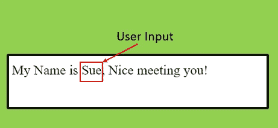

创建的微服务的预期输出(图片由作者提供)

**云功能部署步骤:**

我们可以用接收用户请求的 python 脚本创建一个 HTTP 触发器，并在云函数上进行设置。

(1)创建一个函数并测试它*(*我使用的环境是 GCP 的 Vertex AI Jupyternotebook)*

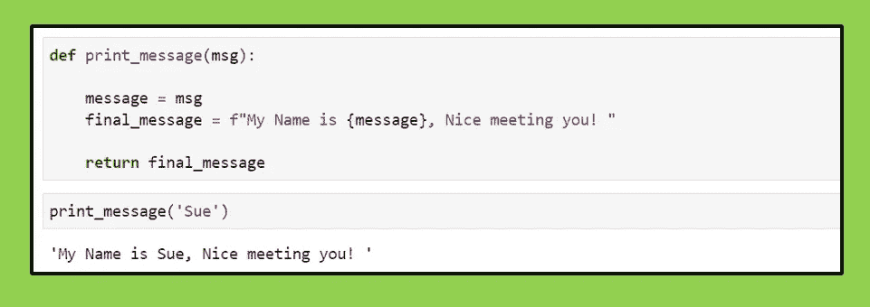

创建 python 函数(作者图像)

(2)进入谷歌云控制台的云功能，选择**创建功能**、*(*如果是第一次，请启用云功能 API 和云构建 API)*

*   为您的云功能命名
*   选择一个区域
*   选择 HTTP 触发器
*   如果您想从浏览器*触发并调用服务，请允许未经验证的调用(*不建议用于生产管道，但在开发时更容易看到输出)*

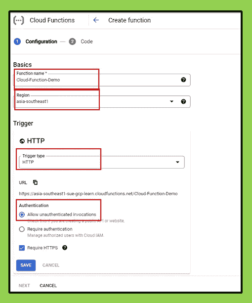

云功能配置(作者图片)

(3)下一步，在代码部分-选择运行时到 **Python 3.9** ，指向函数名 **print_message** ，并将您的 Python 函数添加到 **main.py** 文件中。

*   请注意，要在云函数中传递参数，您将需要使用 *request.args.get()* 更改函数以处理和检索参数

```
def print_message(request):

    message = request.args.get('msg')
    final_message = f"My Name is {message}, Nice meeting you! " 

    return final_message
```

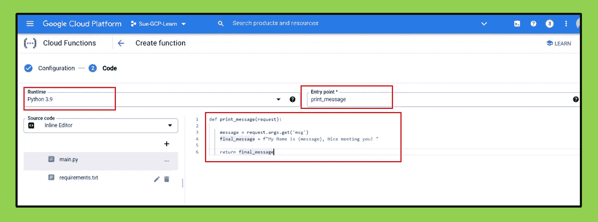

更新云功能源代码(作者图片)

(4)代码更新后，通过选择底部的“部署”按钮来部署该函数——然后该函数将开始在您的 GCP 环境中部署。

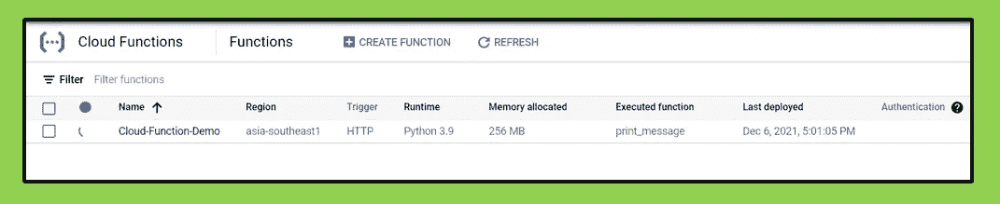

部署云功能“云功能-演示”(作者图片)

(5)在浏览器中测试并调用新部署的功能

*   您可以在部署的云功能的触发选项卡下检索您的 HTTP URL。

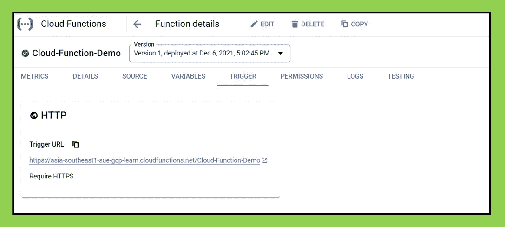

检索已部署的云功能 HTTP URL(按作者列出的图像)

*   从您的浏览器调用端点，并通过 URL 传入您的输入。

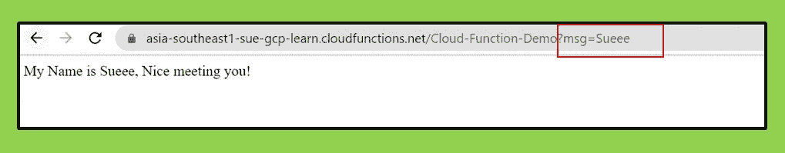

测试部署的云功能(作者提供的图像)

恭喜，感谢您陪我完成了将微服务部署到云功能所需的步骤。现在，让我们看看在云运行时创建相同的微服务所需的步骤。

**云运行时部署步骤:**

在云运行时创建微服务的方法将需要准备几个文件，这些文件是:

*   main.py
*   文件

(1)准备主副本文件和备审文件

main.py 文件由 web 框架(FastAPI)和接收用户输入并返回消息的 python 函数组成。

```
import uvicorn
from fastapi import FastAPI
import osapp = FastAPI()
[@app](http://twitter.com/app).get("/{msg}")
async def print_message(msg:str):

    message = msg
    final_message = f"My Name is {message}, Nice meeting you! " 

    return final_message
```

文件:

在部署和创建微服务的云运行中，需要将 python 脚本部署到 Docker Container 中。Dockerfile 指定在容器启动时如何创建容器并运行 web 服务。

```
# Use official lightweight Python image as base OS.
FROM python:3.7-slim# Copy local code to the container image.
ENV APP_HOME /app
WORKDIR $APP_HOME
COPY . ./# Install production dependencies.
RUN pip install fastapi uvicorn[standard] gunicornENV PORT 8080#Run the web service on container startup using gunicorn webserver.
CMD exec gunicorn --bind :$PORT --workers 1 --worker-class uvicorn.workers.UvicornWorker  --threads 8 main:app
```

(2)构建和部署码头工人形象

在 Google Cloud Console 上可以使用不同的方法来构建和部署云运行微服务。在我之前的文章中，我分享了通过云壳编辑器部署云运行微服务的方法。在本文中，我将从 Vertex AI Jupyternotebook 环境进行部署。

*   在您的笔记本中，创建一个特定的文件夹并上传文件——main . py & docker file

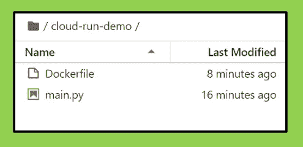

将所需文件上传到 Jupyternotebook(图片由作者提供)

*   在 Jupyternotebook 中启动/打开终端控制台

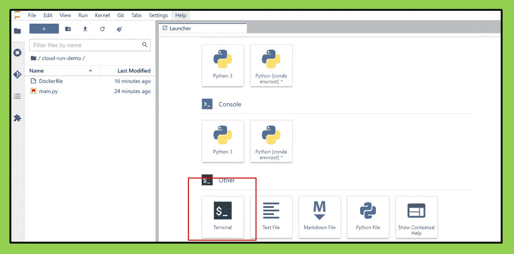

启动终端控制台(图片来自作者)

*   在终端中，导航到包含文件的文件夹

```
cd cloud-run-demo
```

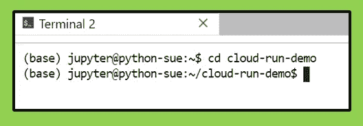

导航到目标文件夹(按作者排序的图像)

*   配置和设置将部署微服务的区域。

```
gcloud config set run/region asia-southeast1
```

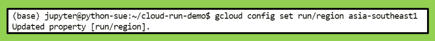

配置和设置区域(图片由作者提供)

*   运行命令在所选区域构建新的 docker 映像。这个过程需要几分钟。

```
gcloud builds submit --tag gcr.io/sue-gcp-learn/cloud-run-demo
```

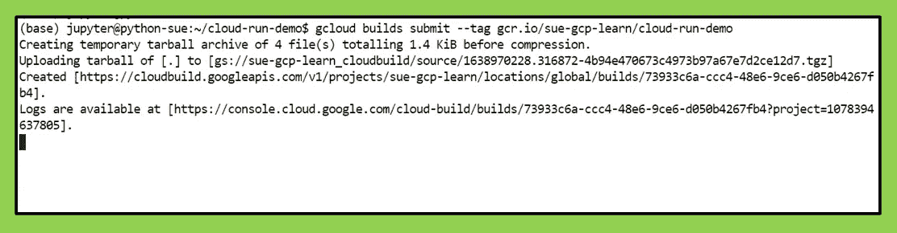

构建 Docker 图像(由作者创建的图像)

*   部署新构建的映像，并提供云运行服务名称。

```
gcloud run deploy --image gcr.io/sue-gcp-learn/cloud-run-demo --platform managed
```

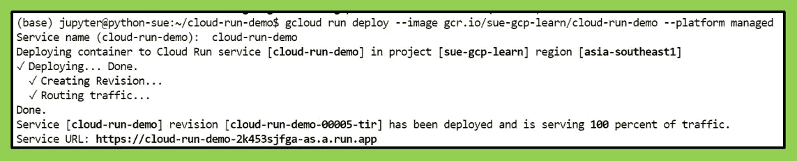

部署 Docker 图像并提供服务名(图像由作者提供)

(3)检查和测试部署的云运行服务

*   微服务 URL 将在完成部署后提供。该服务也可从云运行控制台获得。

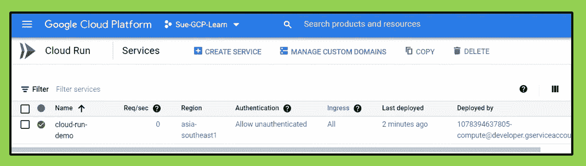

云运行控制台上部署的服务(图片由作者提供)

*   从浏览器测试并调用云运行端点，并通过 URL 传入您的输入。

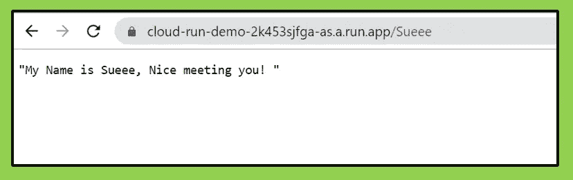

测试部署的云运行(图片由作者提供)

恭喜您，与我一起完成了将微服务部署到云运行所需的步骤。现在，您已经掌握了在两个不同的 GCP 组件上创建微服务的知识。

## 比较云函数和云运行

*   云功能允许用户基于支持的几种语言部署代码，而云运行没有这种限制，因为您将能够基于用户选择的语言构建和部署容器映像。
*   对于每个云功能实例，云功能一次仅支持一个请求，而云运行能够同时处理多个请求，并且能够根据需求进行扩展。
*   云功能能够处理特定的触发器，如 FireStore 事件和基于云存储上的更改的触发器，而 Cloud Run 不具备此附加功能。

## 我个人的结论/偏好

我有组件云功能和云运行的经验，我更喜欢云运行，因为它的灵活性和处理并发的能力。因为 cloud run 使用容器化，所以它被认为是可移植的，可以很容易地部署到另一个环境中，比如本地、另一个地区等。这减少了将来的返工。

尽管如此，我强烈建议您在这两个组件上测试创建您的微服务，如果您有额外的时间，并从您自己的角度比较它们。

*感谢你阅读我的文章，如果你喜欢并愿意支持我:*

*   *跟我上* [*中*](https://iam-suelynn.medium.com/) 🙆🏻
*   通过我的[推荐链接](https://iam-suelynn.medium.com/membership)成为 Medium 会员🙋

**参考文献&链接:**

[1][https://cloud . Google . com/blog/topics/developers-从业者/cloud-run-story-server less-containers](https://cloud.google.com/blog/topics/developers-practitioners/cloud-run-story-serverless-containers)

[2][https://data tonic . com/insights/cloud-functions-cloud-run-model-serving/](https://datatonic.com/insights/cloud-functions-cloud-run-model-serving/)