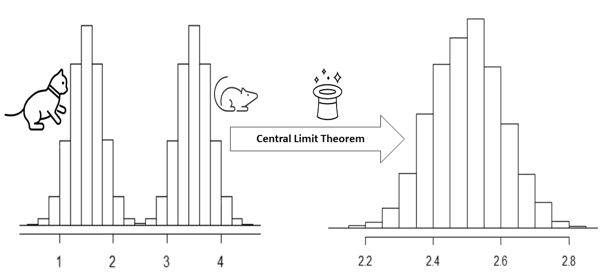
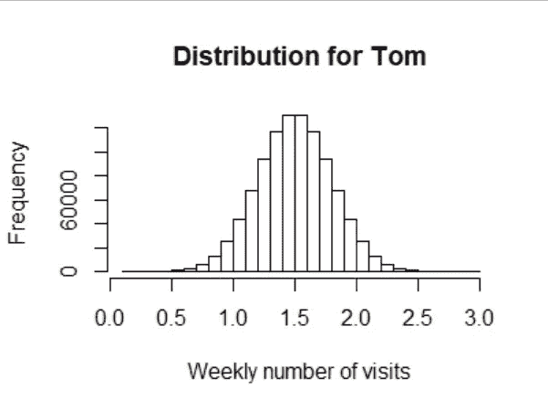
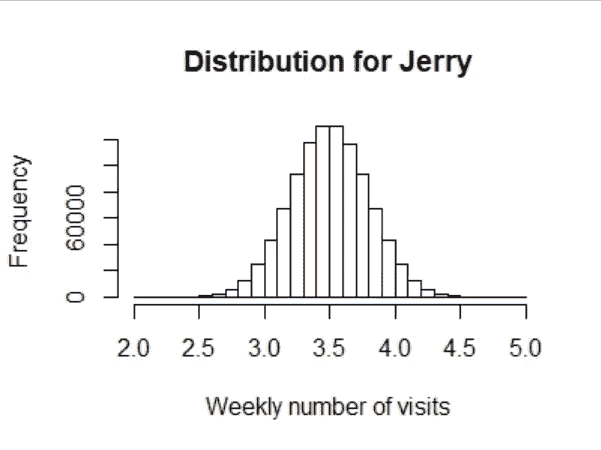
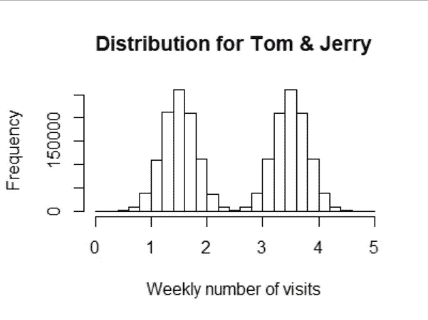
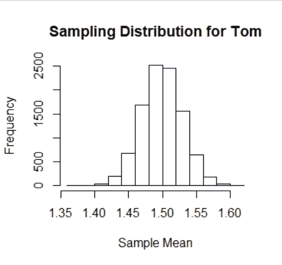
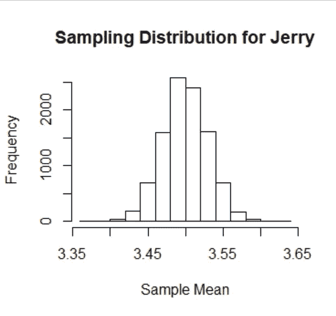
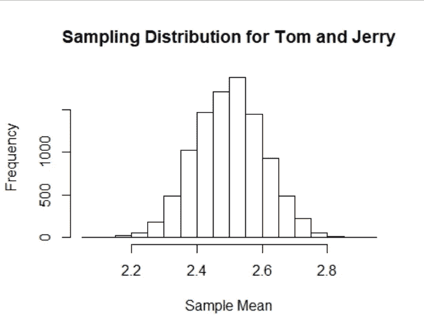

# 理解中心极限定理

> 原文：<https://towardsdatascience.com/understand-central-limit-theorem-e5d47959c163?source=collection_archive---------24----------------------->

## 教育

## 简单的英语解释，以及确保您不会在数据科学面试中被难住的关键假设

鸟瞰本帖中的假设示例(图片由作者提供)

尽管是数据科学中少数几个基本概念之一，中心极限定理(CLT)仍然被误解。

围绕这些基本统计概念的问题确实会在数据科学访谈中出现。然而，你会惊讶地发现，有抱负的数据科学家经常将他们的学习时间投入到最新趋势和新算法上，但由于没有重温基本概念而错过了窍门，并在面试中被难住了。

这篇文章将帮助你在直观的层面上更好地理解 CLT 定理。它还会帮助你更好地理解它的重要性，以及使用它时的关键假设。

# 简单的英语解释

用一种有点正式的语言，

*中心极限定理说明，任何分布的均值的抽样分布都将是正态的，前提是样本量足够大。*

**让我们用一个更具体的例子，用更简单的词语来解释上面的定义。**

想象一个假设的国家，有 200 万个家庭，分成两个关键区域:汤姆和杰瑞。为简单起见，让我们假设 100 万个家庭住在汤姆地区，100 万个家庭住在杰里地区。

一家受欢迎的快餐连锁店已经聘请你来帮助他们决定是否应该在该国投资并开设分店。如果他们这样做，他们应该打开它在汤姆或杰里地区。

让我们假设评估每个地区人们现有饮食习惯的一个有用指标是每个家庭每周光顾快餐店的次数。你的任务是为汤姆、杰瑞和整个国家解决这些问题。

在我们假设的国家中，Tom 的平均每周家庭访问次数是 1.5 次，其分布如图 1 所示。

图 1:汤姆地区每周光顾快餐店的次数分布(图片由作者提供)

Jerry 的平均每周家访次数为 3.5 次，分布如图 2 所示。

图 2:杰里地区每周光顾快餐店的次数分布(图片由作者提供)

总体而言，每周平均访问次数的分布如图 3 所示，平均值为 2.5 次

图 3:全国(即汤姆和杰瑞地区)每周光顾快餐店的次数分布(图片由作者提供)

理论上，我们可以询问这个国家每个人的饮食习惯，然后计算平均每周访问率。然而，这在现实世界的项目中是不可行的。

相反，我们所做的是从总人口中“取样”。所谓“抽样”，我们的意思是我们可以从全部人口中只去问一小组人(通常是出于正当理由随机选择的)。

假设我们从汤姆地区随机抽取 100 个*家庭，然后计算平均值。这是一个实验。*

*如果我们重复同样的实验，我们会得到不同的平均值。如果我们重复同样的实验 100 次，我们会得到 100 个不同的(样本)平均值。*

*如果我们绘制这些样本均值的分布图，它将看起来像一个正态分布。这个样本分布的平均值将非常接近真实的总体平均值。*

*图 4 显示了来自 Tom 区域的 10，000 个平均值的分布(在 R 中模拟)。每个平均值是通过 ***抽样*** 随机选择 100 户家庭计算出来的。*

**

*图 4:Tom 样本均值的分布，其中每个样本均值是通过从 Tom 地区随机抽样 100 户家庭计算的(图片由作者提供)*

*图 5 显示了杰里地区 10，000 个平均值的分布。同样，每个平均值是通过 ***抽样*** 100 个随机选择的家庭计算的。*

**

*图 5:Tom 样本均值的分布，其中每个样本均值是通过从 Tom 地区随机抽样 100 户家庭计算的(图片由作者提供)*

*图 4 和图 5 中的分布都是正态分布。此时，您可能会认为这些样本分布是正态的，因为总体分布(从中得出这些分布)是正态的。*

*然而，这对初学者来说可能是一个惊喜。*

****人口(原始)分布是什么并不重要。如果我们抽样，并且样本足够大，样本均值的最终分布将是正态分布。此外，该抽样分布的平均值将近似等于总体平均值。****

*你刚刚读到的是简单明了的 CLT 定理。*

*让我们用前面的例子来演示 CLT。让我们从由汤姆和杰里地区组成的整个国家中随机选择 100 个家庭并计算平均值，并将相同的实验重复 100，000 次。图 6 显示了这 10，000 个平均值的分布。*

**

*图 6:整个国家样本均值的分布(汤姆和杰里)，其中每个样本均值是通过随机抽样 100 个家庭计算的(图片由作者提供)*

*显然，这个国家的人口分布是不正常的。即使这样，抽样分布也是正态的，平均值非常接近总体平均值。*

*这就是 CLT 的魅力。我们不需要知道随机变量的基本分布是什么。我们仍然可以通过抽样，并正确地假设抽样分布将是近似正态的，来找出总体的平均值。*

# *是什么让 CLT 有用？*

*在大多数有用的、真实世界的项目中，由于时间和资源的限制，我们不能出去从整个人群中收集数据。然而，CLT 让我们能够自信地走出去，从人口的子集收集数据，然后使用统计数据得出关于人口的结论。*

*CLT 是假设检验的基础，假设检验是推断统计学的一个分支，它帮助我们仅从具有代表性的数据子集得出关于总体的结论。*

# *最后的想法*

*在假设的例子中，Tom 和 Jerry 的人口分布是正态的，而整个国家的人口分布是不正态的(它有两个峰值)。然而，在这三种情况下，抽样分布都是正态的。这是中心极限定理的结果。不考虑总体分布， ***均值*** 的抽样分布是正态分布，前提是样本足够大。在大多数实际应用中，大于 30 的样本量通常被认为是足够的。*

*只有当要建模的分布的均值和方差是有限的时，CLT 定理才有效。因此，这个定理不适用于[柯西](https://en.wikipedia.org/wiki/Cauchy_distribution)分布的情况。如果您想深入了解，请查看两个示例的模拟[演练](https://mikesmathpage.wordpress.com/2018/06/16/helping-kids-understand-when-the-central-limit-theorem-applies-and-when-it-doesnt/)，一个示例适用于 CLT，另一个示例不适用。*

*这篇文章中的所有数字都是用 r 语言生成的。带有注释的代码可以在我的 [GitHub](https://github.com/syedahmar/UnderstandCentralLimitTheorem) 上找到。*

****快乐学习！****

*<https://ahmarshah.medium.com/membership> *