# 理解决策树分类器

> 原文：<https://towardsdatascience.com/understand-decision-tree-classifier-8a7497d4c5b3?source=collection_archive---------35----------------------->

## 理解决策树分类器如何用简单的语言和最少的数学公式工作。从头开始弄清楚基尼不纯和信息增益是如何工作的。

我的儿子查尔斯·朱

与神经网络等机器学习模型相比，我认为决策树分类器应该是最简单的一种。但是我错了，这个模型比我想象的要复杂一点。该模型也为其他高级模型如 LightBGM 和随机森林决策树奠定了基础。所以，我花了一些时间学习它，并试图弄清楚决策树分类器是如何工作的。

# 决策树如何工作

该模型的工作方式非常类似于人类思维对现实世界中的物体进行分类的方式。

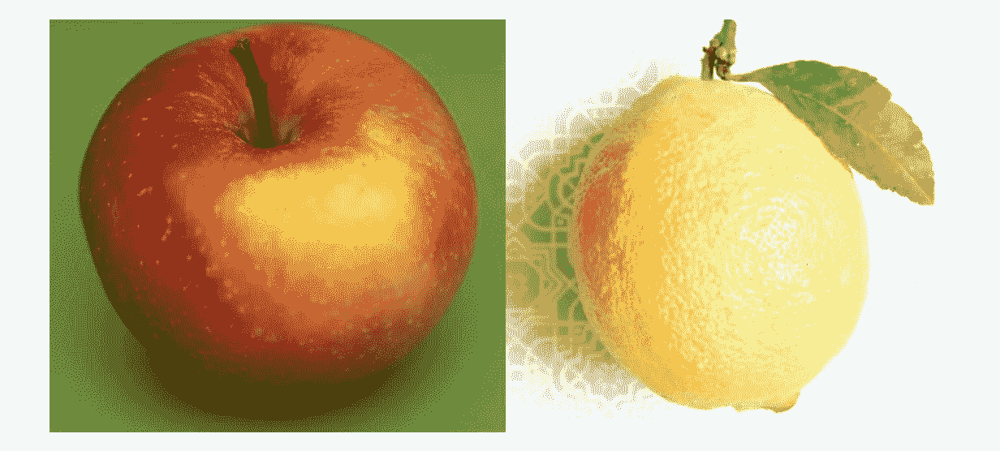

[苹果](https://unsplash.com/photos/6M7Keu2Kv2Y)和[柠檬](https://unsplash.com/photos/adLLNTSZVX4)，图片来自 Unsplash

当你看到上面的水果时，你会立刻从苹果中辨别出柠檬水。但是，怎么做呢？通过遵循决策树模型，你的大脑会在一瞬间问两个问题。

1.  这看起来像什么颜色？
2.  这个水果有多大？

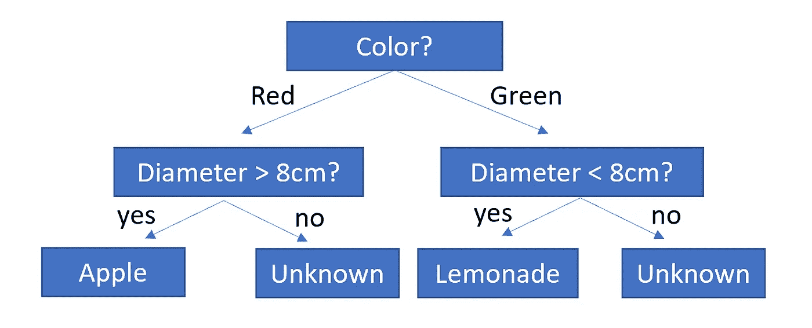

一种简化的水果标识符决策树

决策树已经很好地保存在你的记忆中，它将引导你找到正确的答案。

但是，当你试图教一个计算机模型做类似的事情时，如何建立一个这样的决策树呢？或者让我们在另外两个更具体的问题中问同样的问题。

1.  先问哪个问题？(以哪个功能列为目标)
2.  我应该问什么问题？(什么是数据分区规则)

决策树分类器的关键是构建如上所示的决策树。

# 一个有 3 个水果的盘子——样本数据

假设我们手头有一个训练数据集。这次，我们盘子里有三种水果:苹果、葡萄和柠檬。如下所示:

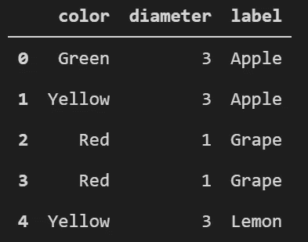

熊猫数据框中的 3 个水果，图片由安德鲁提供

解决问题:我如何知道先问哪个问题？还是先问颜色问题还是直径问题？并设置正确的数据分割点？

我们可能希望我们的第一个问题是划分数据集，以便更好地成形。如果你有清洁孩子玩具的经验，我们问的问题应该最好区分乐高和木块。或者用另一种说法，我们希望这个问题能引出下一个层次的多样性更少的数据。

维基百科会告诉你衡量多样性的公制叫做 [**基尼杂质**](https://en.wikipedia.org/wiki/Decision_tree_learning) 。

# 什么是基尼系数，为什么它会这样

例如，你面前有两个水果阵列。哪种水果阵列更多样？

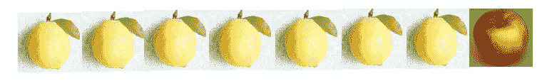

水果阵列 A，图片来自 Unsplash

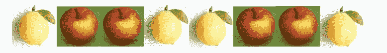

水果阵列 B，图片来自 Unsplash

很明显，我们的人脑会很快找到数组 b 的答案。但是，我们怎么能以数量的方式来衡量多样性呢？我建议你停下来，在继续前进之前，试着想出你的解决方案。

…

一个简洁的解决方案是计算每种水果的概率，然后计算概率的平方。求和数将有一个属性，数组的多样性越多，该数就越低。

例如，在水果数组 a 中。

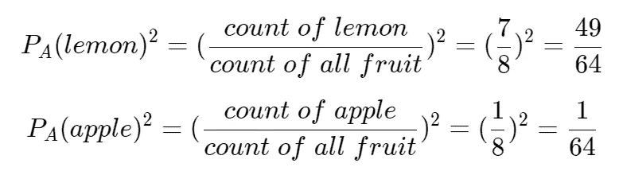

然后将平方概率相加。

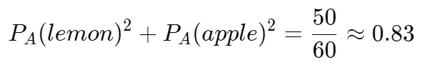

现在，在水果数组 b 中，使用相同的逻辑，您将得到平方概率之和为 0.5。

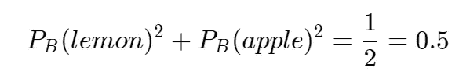

看到了吗？更多样的数组将产生更低的结果。吉尼杂质很简单:

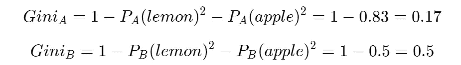

现在，你可能会问，为什么要把概率平方？如果没有正方形，数组 A 和数组 B 将生成相同的结果。(你可以试一试)。

# 使用信息增益来确定要问的正确问题

让我们回到果盘，我们所能产生的基尼杂质在其初始状态下是 0.64。

接下来，假设我们有一个问题要问，这个问题会将数据集划分为两个子集。

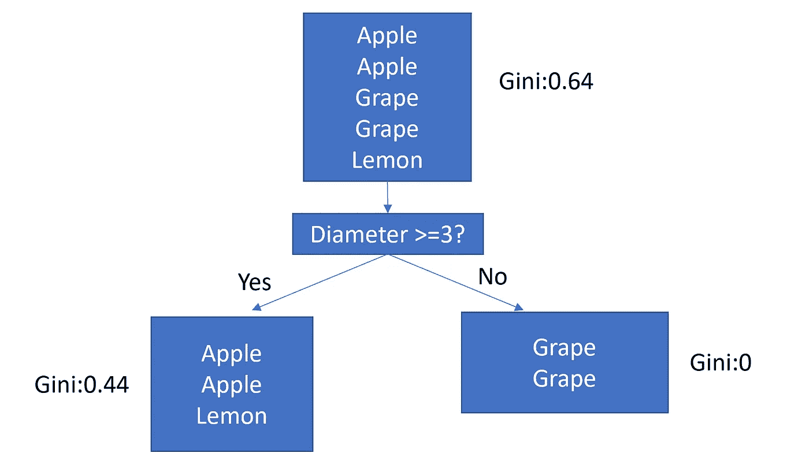

在一个真实的程序中，我们可以使用 nest 2-for 循环来尝试所有的细胞并产生所有的基尼杂质#。

什么是信息增益？信息增益是一种度量，用于度量一个问题减少了多少不确定性。

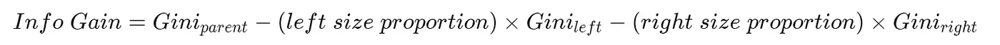

在上面的示例中。通过“果实直径≥3？”问题获得的信息是:

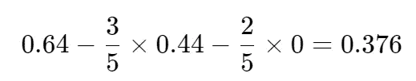

假设我们有最好的问题要问，这个问题必须最大程度地降低基尼系数，或者换句话说，获得最多的信息。

# 递归构建决策树

现在您已经有了吉尼和信息增益解决方案，您可以递归地将该过程应用于您的数据集，直到该过程无法生成更多的信息增益。在上面的示例中，右边的子对象只包含葡萄。你不能再减少杂质(或获取信息),因为不需要问任何问题。

最终，您将拥有一个能够接受新数据并为您预测水果类型的功能决策树模型。

# 链接和代码

*   决策树学习:[https://en.wikipedia.org/wiki/Decision_tree_learning](https://en.wikipedia.org/wiki/Decision_tree_learning)
*   让我们从头开始写一个决策树分类器:[https://www.youtube.com/watch?v=LDRbO9a6XPU&t = 306s](https://www.youtube.com/watch?v=LDRbO9a6XPU&t=306s)
*   决策树分类器的 Python 实现: