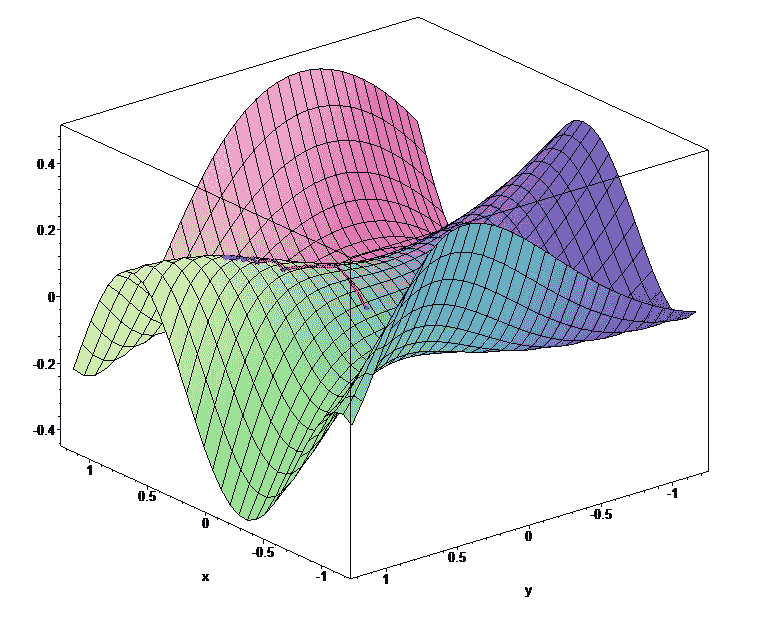

# 了解差异化编程

> 原文：<https://towardsdatascience.com/understand-differentiable-programming-54f11bfb574?source=collection_archive---------22----------------------->

## 一种编程范例，允许程序使用基于梯度的优化来重建自身的部分

图片来自 wikipedia.org

自 2014 年首次出现以来，可微分编程曾经是一个花哨的术语，在本文的[中被描述为“可微分函数编程”。Yann Lecun 将其描述为“深度学习的推广”[1]，许多知名的人工智能研究人员认为这种类型的编程是软件工程的未来，也称为软件 2.0。](http://colah.github.io/posts/2015-09-NN-Types-FP/)

在经典编程中，我们过去常常明确地列举 CPU 需要执行的指令集，以便创建我们的算法。这意味着，在运行时，程序有足够的知识来实现其预期目标。

对于可微分编程，我们希望使用加权参数网络构建一种新的程序，通过基于梯度的优化[2]的示例进行训练。这些程序能够以一种更优化的方式，沿着一个[梯度](https://en.wikipedia.org/wiki/Gradient)重写它们自身的部分。

在引擎盖下，它们可以被视为处理输入和输出的连续[可微函数](https://en.wikipedia.org/wiki/Differential_calculus)的复杂组合。因为每个表达式都是可微分的，所以可以使用[链规则](https://en.wikipedia.org/wiki/Chain_rule)传播模型中的优化。像在经典的监督学习中一样，可以通过关于每个加权参数的损失梯度的反向传播来训练模型。因此，每个表达式应该实现一个*向前*行为，这是解决问题所需的实际计算，以及一个*向后*行为，其目标是更新用于计算向前传递的权重。

实际上，当编写一个可微分程序时，你正在编写一个程序*，它在运行时构建另一个程序 ***B*** 。程序 ***A*** 基本上是一组定义可微分计算图的规则和函数。程序 ***B*** 然后计算这个图并自己更新所有的参数，所以它正在构建自己的最优架构来解决问题。*

**

*作者图片*

> *请记住，这些参数被视为**可微分函数**，而不是循环、条件、赋值等不被视为函数的常见操作。*

# *计算梯度*

**

*图片由 researchgate.net 拍摄*

*为了优化我们的可微分程序，我们将计算损失函数的梯度，这是一个系数向量。每个值给我们两条信息:斜率的意义(值的符号)和为了优化程序我们需要增加/减少参数的量(实际值)。*

*为了计算梯度，存在不同的实现方式:*

***符号微分**:*f '(x)= 2x | f '(cos(x))=-sin(x)……**

*难以在实际项目中应用，因为依赖于已知的有限的导数集(实际项目可能使用复杂的函数，如[泰勒级数展开](https://en.wikipedia.org/wiki/Taylor_series))。更多信息。*

***数值微分**:*f '(x)= lim(f(x+h)-f(x))/h**

*计算梯度的最简单的方法之一，但是很慢(需要计算 2 次函数 *f* +离散化的风险+由于变量 *h* 可能产生的舍入误差)。[更多信息。](https://en.wikipedia.org/wiki/Numerical_differentiation)*

***自动微分**:*

*考虑将程序区分为包含算术和基本运算(+、-、*、log、sin、cos…)的代码块，并使用链式法则计算整体导数。工程上任意程序，运行速度快，结果是准确的。更多信息。*

*在实践中，**自动微分是最常用的微分算法**，这得益于它的精度和效率。Tensorflow [3]和 PyTorch [4]等机器学习框架实现了这种技术来计算梯度。*

# *可微分编程语言*

*尽管基于梯度的优化和自动微分已经使用了很多年，但是可微分编程还是最近的事情，即使它与这两种技术紧密相关。大多数流行的语言没有实现本机可微分函数，尽管有些框架存在:*

*   *[张量流](https://github.com/tensorflow/tensorflow)， [PyTorch](https://github.com/pytorch/pytorch)*
*   *用于 Swift 的[Swift 4 传感器流量](https://github.com/tensorflow/swift)*
*   *【Swift 的差异化编程宣言*
*   *[张量](https://github.com/tensorlang/tensorlang)*
*   *【Scala 的灯笼*
*   *用于物理模拟的 [DiffTaichi](https://github.com/yuanming-hu/difftaichi)*

# *什么是神经网络？*

*差异化编程应该被看作是每个软件工程师在编写代码时应该考虑的一个工具。当从示例中学习算法模式比枚举详尽的规则列表更容易时，应该使用这种范例，枚举规则列表对于某些任务来说可能极其复杂。这些任务中的大部分是试图使用机器学习(例如 NLP、计算机视觉等)来解决的经典问题，但可能与特定的用例有关。神经网络可以被视为使用权重和偏差层的差分编程技术的具体实现，但是我们可以想象使用差分的不同架构，而不是神经网络。*

*可区分编程也是软件工程和数据科学之间的前沿，在未来看到更多的团队合并这两个方面也就不足为奇了！*

# *参考*

*[1] [乐存对甲方的回答 LikeLizLemon](https://www.reddit.com/r/science/comments/7yegux/aaas_ama_hi_were_researchers_from_google/) ，2018*

*[2] [可微规划张量网络](https://journals.aps.org/prx/pdf/10.1103/PhysRevX.9.031041)，2019*

*[3] [TensorFlow:大规模机器学习的系统](https://arxiv.org/pdf/1605.08695.pdf)，2016*

*[4] [PyTorch:命令式风格，高性能深度学习库](https://arxiv.org/pdf/1912.01703.pdf)，2019*