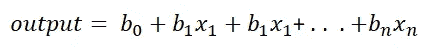
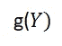
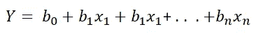
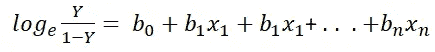
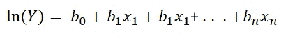
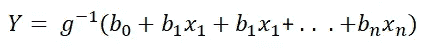
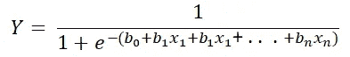

# 理解广义线性模型，以及它与线性、逻辑和泊松回归的关系

> 原文：<https://towardsdatascience.com/understand-generalized-linear-models-and-how-it-relates-to-linear-logistic-and-poisson-regression-53f3aea8a9d?source=collection_archive---------5----------------------->

## 教育

## 永远不要再混淆线性回归和广义线性回归，带着清晰的思路离开。

亚历山大·杜默在 [Unsplash](https://unsplash.com?utm_source=medium&utm_medium=referral) 上拍摄的照片

[2021 Kaggle](https://www.kaggle.com/kaggle-survey-2021) 调查显示，与去年一样，数据科学界最常用的算法是线性或逻辑回归。我一点也不惊讶。不同特征的加权求和毕竟是最直观的做法。然而，对于大多数初学者来说，线性回归和其他类型的回归之间的区别变得不那么明显了。

当你读完这篇文章后，你会对线性回归与逻辑回归和泊松回归的区别有一个非常清晰的概念。此外，你也会清楚地理解当它用于分类任务时，我们仍然称之为逻辑“回归”的原因。

如果你以前曾经对这些不同类型的回归感到困惑，那么你来对地方了。然而，我请求你在接下来的几分钟内暂停你对这个主题的先验知识。如果你做到了，我保证你会带着水晶般的清澈离开。让我们开始吧。

# 什么是广义线性模型？

简而言之，广义线性模型(GLM)是一种数学模型，它将输出(响应变量的函数，稍后将详细介绍)与一个或多个输入变量(也称为探索变量)联系起来。下面的等式显示了输出如何与 *n* 预测变量的线性求和相关。有相应的 n+1 个系数项(每个系数项对应于 *n* 个预测变量，还有一个附加项帮助对任何偏移进行建模)

GLM 方程(图片由作者提供)

无论是进行线性回归、逻辑回归还是泊松回归，上述等式的右边(输入要素的加权组合)保持不变。

让我们来谈谈等式的左边，即输出。这是随机成分。它是响应变量期望值的函数。为简单起见，我们称期望值为 *Y* 。

GLM 方程中的输出部分(图片由作者提供)

函数， **g(。)**，称为链接功能。正是这个链接功能使得 *Y* 的分布与右侧兼容(输入的线性组合)。

当函数 **g(.)**是一个恒等函数，那么 GLM 方程就简化为一个正规的线性回归方程。

当函数 g 是恒等式时，GLM 方程就相当于一个简单的线性回归

换句话说，当连接函数是恒等式时，常规线性回归是广义线性模型的特例。

# 常规线性回归和 GLM 的主要区别

正如我前面提到的，常规线性回归是 GLM 的特例。然而，在进一步讨论之前，让我们快速地解释一下这两者之间的一些关键区别。

常规线性回归的关键假设是输出 *Y* 的每个值都是独立的，输出是正态分布的，并且 *Y* 的平均值通过线性组合与预测变量相关。在 GLM 中，输出不局限于正态分布，而是可以属于指数族的任何成员。

要解决常规线性回归问题，您可以采用最小二乘法或最大似然估计。它们会给出相同的结果。然而，GLM 只能用最大似然估计法求解。

最后，正则线性回归模型有时也被称为标准最小二乘模型，是由高斯在 1809 年发明的，而 GLM 是由内尔德和威德伯恩在 1972 年发明的。

# GLM 与线性回归、逻辑回归和泊松回归有什么关系？

既然你开始将线性回归视为 GLM 的一个特例，我们可以继续并确定 GLM 的其他情况。

当连接函数是 logit(比例的自然对数)时，我们最终得到一个逻辑回归方程。

逻辑回归方程，其中输出是“赔率”的自然对数(图片由作者提供)

当结果是二元的(例如，成功/失败，有疾病/没有疾病)时，逻辑回归是最合适的。在这样的应用中，比率(*Y/(1-*Y*)*类似于成功概率与失败概率的比率(也称为“赔率”)。

当关联函数是比率的自然对数时，我们最终得到一个泊松回归方程。

当结果是给定时间间隔内的计数或给定时间内发生的事件数时，泊松回归最适合。

# 链接函数与激活函数的关系

**链接功能 *g(。)*** 是一个**可逆**函数，它转换输出的期望值，使其与线性预测器部分(GLM 等式的右边)兼容。然而，在机器学习社区中，我们经常首先被介绍到链接函数的逆函数。这就是所谓的激活功能。

带有激活函数的 GLM 方程，它是链接函数的反函数(图片由作者提供)

链接功能的逆功能与激活功能相同。术语“链接函数”在统计学文献中很常见，而术语“激活函数”在机器学习文献中更常见。

例如，如果您对逻辑回归的 GLM 方程(如前所示)的两边取指数，并应用简单的代数运算，您将最终得到以下逻辑回归方程(在机器学习文献中更常见)。

逻辑回归方程，它在机器学习文献中的表达方式(图片由作者提供)

# 最后的想法

人们经常混淆和混淆这些概念。更糟糕的是，当用于分类时，人们经常称之为逻辑回归。这部分是因为我们，在机器学习社区，已经将监督学习分为分类(当输出是离散的)和回归(当输出是连续的)。

当然，逻辑回归用于分类，但它仍然是一种回归技术。只有当你理解了广义线性模型，一个更重要的概念，这才有意义。

最终，您将不同的输入变量组合成一个加权和，无论使用线性、逻辑还是泊松回归，都需要确定未知系数。

 [## 通过我的推荐链接加入 Medium-Ahmar Shah 博士(牛津)

### 作为一个媒体会员，你的会员费的一部分会给你阅读的作家，你可以完全接触到每一个故事…

ahmarshah.medium.com](https://ahmarshah.medium.com/membership)