# 理解并在 Python 中实现逻辑回归

> 原文：<https://towardsdatascience.com/understand-implement-logistic-regression-in-python-c1e1a329f460?source=collection_archive---------9----------------------->

## Sigmoid 函数、线性回归和参数估计(对数似然和交叉熵损失)


梅格·波尔登在 [Unsplash](https://unsplash.com?utm_source=medium&utm_medium=referral) 上的照片

# 目标

这篇文章的主要目的是理解二元逻辑回归是如何工作的。

*   我将在高层次上回顾理解逻辑回归所涉及的基本数学概念和函数。
*   在此过程中，我将介绍两种众所周知的梯度方法(上升/下降),以使用对数似然和交叉熵损失函数来估计𝜃参数。
*   我将使用 Kaggle 的泰坦尼克号数据集从头创建一个逻辑回归模型来预测乘客存活率。train.csv 和 test.csv 文件可以在 [Kaggle 的 Titanic 数据页面](https://www.kaggle.com/c/titanic/data)上找到。为了加快模型构建，我将只使用三个特征，**年龄**(连续)、**p 类**(第一类= 1，第二类= 2，第三类= 3)，以及**性别**(女性= 1，男性= 0)。

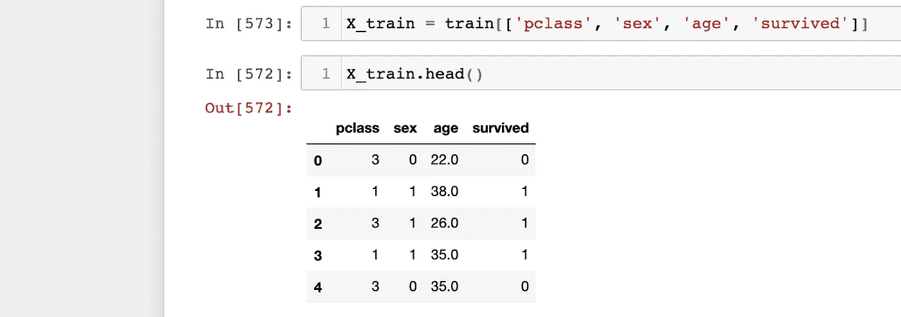

图 0:图片由[作者](https://dolee.medium.com)提供；数据来源: [Kaggle 的泰坦尼克号数据](https://www.kaggle.com/c/titanic/data)

# 目录

*   算法概要
*   数学概念和函数
*   行动中的代码
*   最后的想法

# 算法概要

逻辑回归是一种分类算法，它输出一组给定实例的预测概率，这些实例的特征与优化的𝜃参数和偏差项配对。这些参数也称为权重或系数。概率被转换成预测例如成功(“1”)或失败(“0”)的目标类别(例如，0 或 1)。虽然我将仔细研究二元逻辑回归模型，但是逻辑回归也可以用于进行多类预测。

**我们如何获取线性组合的输入特征和参数，并进行二元预测？**答案是自然对数(以 e 为底的对数)。更确切地说，对数概率。对线性组合的输入要素和参数求和，以生成对数优势形式的值。然后，对数优势值被插入到 sigmoid 函数中，并生成一个概率。就其核心而言，像许多其他机器学习问题一样，这是一个优化问题。使用梯度上升(例如，最大化对数似然)或下降(例如，最小化交叉熵损失)来估计最佳参数，其中选择的[目标(例如，成本、损失等。)功能](https://www.courses.psu.edu/for/for466w_mem14/Ch11/HTML/Sec1/ch11sec1_ObjFn.htm)决定梯度接近。

# 数学概念和函数

为了让一切变得更简单，我们必须深入数学。在逻辑回归中，sigmoid 函数起着关键作用，因为它输出一个介于 0 和 1 之间的值，非常适合概率。因此，这种表示通常被称为逻辑 sigmoid 函数。请记住，在自然环境中还有其他具有不同有界范围的 [sigmoid 函数](https://deepai.org/machine-learning-glossary-and-terms/sigmoid-function)。并且因为响应是二元的(例如，真对假，是对否，幸存对未幸存)，所以响应变量将具有伯努利分布。此外，每个响应结果由预测的成功概率决定，如图 5 所示。

> **关于数学符号:**小写的“I*”*将表示数据集中的行位置，而小写的“j*”*将表示数据集中的特征或列位置。你还会碰到小写粗体非斜体的“ ***x*** ”。这代表一个特征向量。更具体地说，当“I”伴随有“***x***”(***x***I)时，如图 5、6、7、9 所示，这代表一个向量(一个实例/单行)具有所有特征值。
> 
> 当您在图 8 和图 10 中看到小写斜体“x”(Xi，j)的“I”和“j”时，该值是第 I 个(单个特征向量)实例中第 j 个特征的表示。数据集中要素(列)的数量将表示为“n ”,而实例(行)的数量将表示为“m”变量。

## Sigmoid 函数

在图 1 中，第一个方程是 sigmoid 函数，它创建了我们经常在逻辑回归中看到的 S 曲线。给定 **x** ，输出等于条件概率 *y* = 1，由𝜃.参数化在这种情况下， **x** 是表示为特征向量的单个实例(训练集中的观察值)。

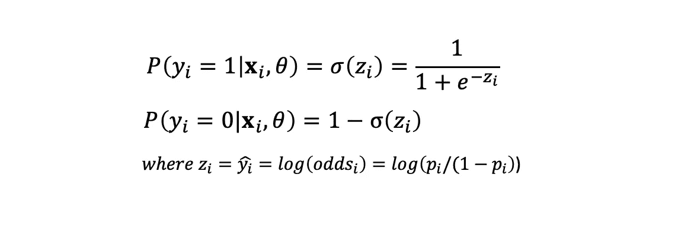

图 1: Sigmoid 函数[sigma(z)]和[1—sigma(z)]；图片作者[作者](https://dolee.medium.com)

向量中的每个特征将具有使用优化算法估计的相应𝜃参数。稍后我会在梯度上升/下降部分详细讨论这一点。还需要注意的是，通过求解 log(odds)= log(*p*/(1-*p*))中的 *p* ，我们得到了具有 *z =* log(odds)的 sigmoid 函数。

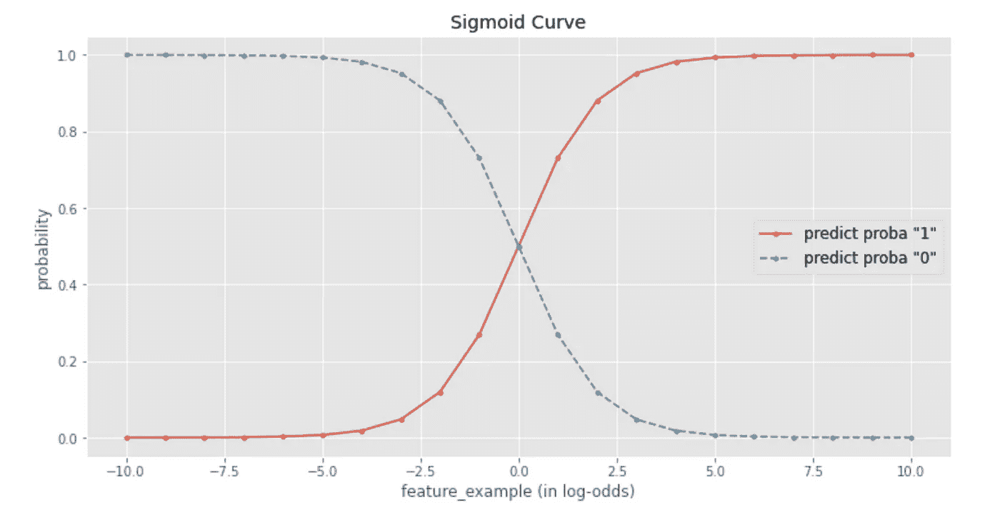

图 2:s 形曲线；图片作者[作者](https://dolee.medium.com)

```
 proba1, proba0 = [], []
feature_example = [i for i in range(-10, 11)]for instance in feature_example:
    p1 = 1/(1 + np.exp(-instance)) # sigmoid function
    p0 = 1 — p1
    proba1.append(p1)
    proba0.append(p0)plt.figure(figsize=(12,6))
plt.plot(feature_example, proba1, marker=’.’, label=’predict proba “1”’)
plt.plot(feature_example, proba0, marker=’.’, linestyle=’dashed’, label=’predict proba “0”’)
plt.title(‘Sigmoid Curve’)
plt.xlabel(‘feature_example (in log-odds)’)
plt.ylabel(‘probability’)
plt.legend(prop={‘size’: 12});
```

## 赔率和对数赔率

使用线性回归函数估计的 y 值(y-hat)代表对数优势。围绕比值或[比值比](https://stats.idre.ucla.edu/other/mult-pkg/faq/general/faq-how-do-i-interpret-odds-ratios-in-logistic-regression/)包装对数的过程被称为 **logit 变换**。关键是对数几率是无限的(-无穷大到+无穷大)。但是，我们需要一个介于 0 和 1 之间的值来预测概率。所以，本质上，对数概率是弥合线性和概率形式之间差距的桥梁。

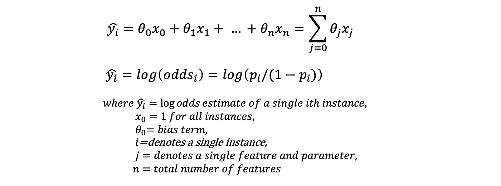

图 3:线性回归函数和 y 估计值的对数比；图片作者[作者](https://dolee.medium.com)

什么是对数概率？我们首先要知道赔率的定义——成功的概率除以失败的概率，P(成功)/P(失败)。例如，对于一枚普通硬币，正面和反面的概率都是 0.5。因此，几率是 0.5/0.5，这意味着得到反面的几率是 1。如果我们使用一个偏向反面的硬币，其中反面的概率现在是 0.7，那么得到反面的几率是 2.33 (0.7/0.3)。如图 3 所示，赔率等于 p/(1-p)。下一步是将赔率转换成对数赔率。

将概率转换为比值以及将比值转换为对数比值的一个基本要点是，这些关系是单调的。当概率增加时，几率增加，反之亦然。当赔率增加时，对数赔率也增加，反之亦然。在图 4 中，我使用 Titanic 训练集和 Scikit-Learn 的逻辑回归函数创建了两个图来说明这一点。我们可以清楚地看到概率、赔率和对数赔率之间的单调关系。

为什么这很重要？log-odds 值越高，概率越高。在图 2 中，我们可以非常清楚地看到这一点。任何等于或大于 0 的对数优势值都有 0.5 或更高的概率。这是由于我们在图 4 中观察到的单调关系。当我们解释估计的参数时，这也会派上用场。

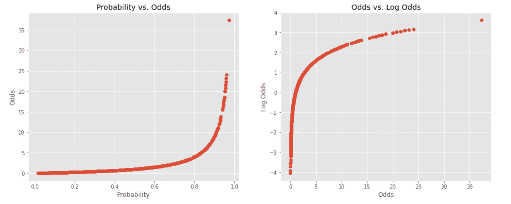

图 4:概率 vs .赔率&赔率 vs .对数赔率；图片由[作者](https://dolee.medium.com)

```
import pandas as pd
import numpy as np
from sklearn.linear_model import LogisticRegression
from sklearn.preprocessing import StandardScaler
from sklearn.pipeline import make_pipeline
import matplotlib.pyplot as plt
plt.style.use(‘ggplot’)
%matplotlib inlinelogreg = LogisticRegression(random_state=0)
model_pipe = make_pipeline(StandardScaler(), logreg)
X = train[[‘age’,’pclass’,’sex’]]
y = train[‘survived’]
model_pipe.fit(X, y)
model_pipe.predict_proba(X)y_pred_proba_1 = model_pipe.predict_proba(X)[:,1]
y_pred_proba_0 = model_pipe.predict_proba(X)[:,0]
odds = y_pred_proba_1 / y_neg_pred_proba_0
log_odds = np.log(odds)fig, (ax1, ax2) = plt.subplots(1, 2, figsize=(16,6))
ax1.set_title(‘Probability vs. Odds’)
ax1.set(xlabel=’Probability’, ylabel=’Odds’)
ax1.scatter(y_pos_pred_proba, odds)
ax2.set_title(‘Odds vs. Log Odds’)
ax2.set(xlabel=’Odds’, ylabel=’Log Odds’)
ax2.scatter(odds, log_odds);
```

## Sigmoid 组合概率、似然和对数似然

我们覆盖了很多领域，现在我们处于理解高层次逻辑回归的最后一英里。图 5 中的概率函数 P(Y=yi|X=xi)捕捉到了 Y=1 和 Y=0 的形式。基于 Y (0 或 1)，点积中的一项变为 1 并下降。这种组合形式对理解可能性至关重要。

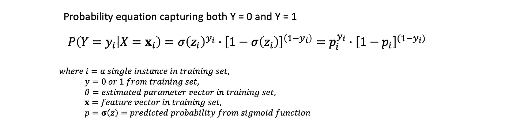

图 5:概率函数作为 Y=0 和 Y=1 项的组合形式；图片由[作者](https://dolee.medium.com)

**让我们来看看我们是如何得到** [**可能性**](https://en.wikipedia.org/wiki/Likelihood_function) **、L(𝜃).的**对于训练集中的每个实例，我们使用**随机估计参数(𝜃's)** 计算对数优势，并使用对应于特定二元目标变量(0 或 1)的 sigmoid 函数预测概率。这些概率的乘积将给出所有实例的概率和[可能性](https://stats.stackexchange.com/questions/2641/what-is-the-difference-between-likelihood-and-probability)，如图 6 所示。重要的是要注意，可能性被表示为𝜃的可能性，而概率被指定为 y 的概率

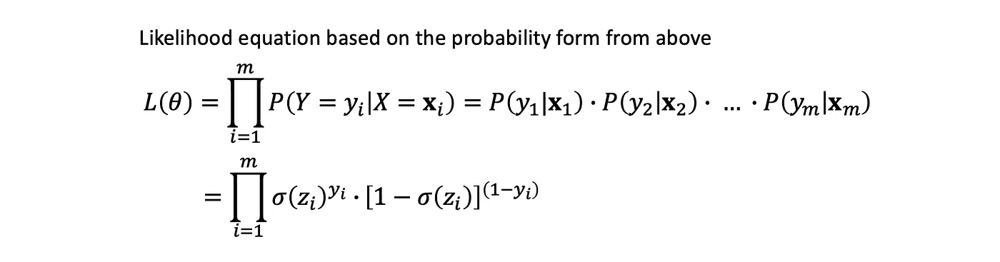

图 6:似然函数；来源阅读:[克里斯皮赫](https://stanford.edu/~cpiech/bio/index.html)，CS109 @斯坦福大学；图片由[作者](https://dolee.medium.com)

结果，通过最大化可能性，我们收敛到最优参数。换句话说，最大化似然估计最佳参数，我们直接最大化 y 的概率，这就是所谓的最大似然估计(MLE)。因此，当达到最大值时，初始参数值将逐渐收敛到最优值。收敛是由优化算法——梯度上升/下降驱动的。

对数似然法如何适应这种情况？取似然函数的对数，就变成了求和问题对乘法问题。我们知道 log(XY) = log(X) + log(Y)和 log(X^b) = b * log(X)。因此，我们可以轻松地将似然性(L(𝜃)转换为对数似然性(LL(𝜃)，如图 7 所示。因为似然性到对数似然性是一种单调变换，最大化对数似然性也将产生最佳参数，这被称为最大对数似然性。请记住，这是我们正在优化的𝜃的对数似然。


图 7:对数似然函数；来源阅读:[克里斯皮赫](https://stanford.edu/~cpiech/bio/index.html)，CS109 @斯坦福大学；图片由[作者](https://dolee.medium.com)

如何使用对数似然达到最大值？我们对每个𝜃参数取对数似然函数的偏导数。换句话说，你为每个参数取梯度，它有大小和方向。例如，在 Titanic 训练集中，我们有三个特征加上一个偏差项，所有实例的 x0 都等于 1。图 8 中的偏导数表示训练集中的单个实例( *i)* 和单个𝜃参数( *j)* 。 *x (i，j)* 表示实例中与其对应的𝜃 ( *i，j* )参数配对的单个特征。因此，对于单个实例，总共创建了四个偏导数——偏差项、pclass、性别和年龄。这些组成了梯度向量。

η是学习率，它决定了梯度上升算法每次迭代的步长。我们不希望学习率太低，需要很长时间才能收敛，也不希望学习率太高，会超调，会跳来跳去。学习率也是一个可以优化的超参数，但是我将在 Titanic 练习中使用固定的学习率 0.1。

一旦有了梯度向量和学习率，两个实体相乘并添加到当前要更新的参数中，如图 8 中的第二个等式所示。本质上，我们是在梯度方向上一小步一小步地缓慢而坚定地到达顶峰。这个更新步骤重复进行，直到参数收敛到它们的最优值——这是**梯度上升算法**在起作用。因为对数似然函数是凹的，最终，小的上坡步骤将达到全局最大值。

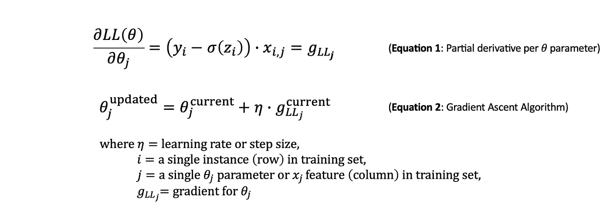

图 8:每个𝜃参数的偏导数和梯度上升算法；图片作者[作者](https://dolee.medium.com)

**最小化成本函数怎么样？**我们经常听到我们需要最小化成本或损失函数。它也被称为目标函数，因为我们试图最大化或最小化某个数值。在成本或损失函数的上下文中，目标收敛到全局最小值。例如，通过在对数似然函数前面放置一个负号，如图 9 所示，它就变成了交叉熵损失函数。目标是使用 [**梯度下降算法**](https://www.khanacademy.org/math/multivariable-calculus/applications-of-multivariable-derivatives/optimizing-multivariable-functions/a/what-is-gradient-descent#:~:text=Gradient%20descent%20is%20an%20algorithm,like%20we've%20seen%20before.) (图 10 中的第二个方程)最小化这个负函数。这个过程与最大化对数似然相同，只是我们通过下降到最小值来最小化它。

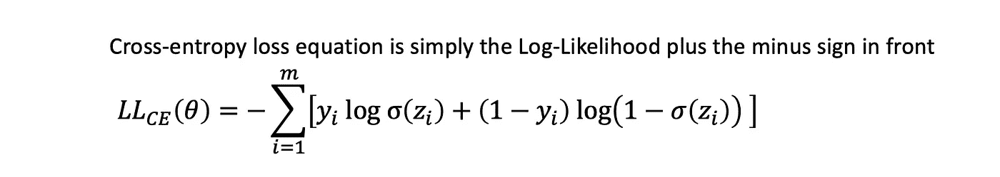

图 9:交叉熵损失函数或负对数似然(NLL)函数；来源阅读:[机器学习:概率视角凯文·p·墨菲](https://www.amazon.com/Machine-Learning-Probabilistic-Perspective-Computation/dp/0262018020) —第 8 章；图片由[作者](https://dolee.medium.com)

一旦每个𝜃参数的偏导数(图 10)被导出，形式与图 8 相同。最大的区别是减法项，它用 sigmoid 预测概率减去实际 *y* (0 或 1)重新排序。该项然后乘以 *x (i，j)* 特征。该过程与上面的梯度上升部分中描述的过程相同。因此，我们将得到训练集中每个实例的四个偏导数。并且使用梯度下降算法，我们更新参数直到它们收敛到它们的最优值。

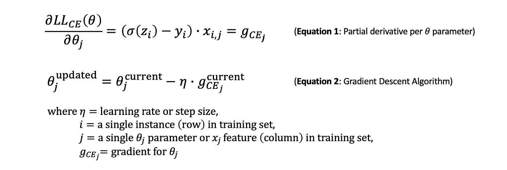

图 10:每个θ参数的偏导数和梯度下降算法；来源阅读:[丹·茹拉夫斯基、詹姆斯·h·马丁著《言语与语言过程》(第三版草稿)](https://web.stanford.edu/~jurafsky/slp3/) —第五章；图片由[作者](https://dolee.medium.com)

幸运的是，交叉熵损失函数是凸的，自然有一个全局最小值。最终，在坡度方向(最陡的下坡方向)迈出足够小的步伐后，它将到达山脚。

# 行动中的代码

既然我们已经回顾了相关的数学知识，那么现在只需要用代码来展示逻辑回归和梯度算法的能力。先说我们的数据。我们有来自卡格尔的泰坦尼克号挑战的训练和测试设备。如前所述，我只使用三个特征——年龄、阶级和性别——来预测乘客存活率。

**首先，我们需要扩展特性**，这将有助于融合过程。我将使用标准化方法来缩放数字要素。在标准化中，我们取每个数字特征的平均值，并从每个值中减去平均值。然后将该项除以特征的标准偏差。接下来，我们将添加一个全 1 的列来表示 x0。这是偏向项。

特征标准化代码由[作者](https://dolee.medium.com)

使用上面的代码，我们已经准备好了训练输入数据集。我们现在知道 log-odds 是线性回归函数的输出，这个输出是 sigmoid 函数的输入。唯一缺失的是𝜃参数。因为我们将使用梯度上升和下降来估计这些参数，我们**选择四个任意值**作为我们的起点。我将用四个零作为初始值。我们还需要在代码中定义 sigmoid 函数，因为这将生成我们的概率。

```
# sigmoid function where z = log-odds
def sigmoid(z):
    predict_proba = 1 / (1 + np.exp(-z))
    return predict_proba
```

我们已经准备好了所有的东西。**接下来，我们将把对数似然函数、交叉熵损失函数和梯度转换成代码。**我们还需要确定我们要对训练集进行多少次检查。我们需要定义历元的数量(在下面的代码中指定为 n_epoch，这是一个帮助学习过程的超参数)。**什么是纪元？**在梯度上升/下降算法的背景下，历元是单次迭代，其中它确定多少训练实例将通过梯度算法来更新𝜃参数(如图 8 和 10 所示)。

因此，我们通常会遇到**三种梯度上升/下降算法**:批量、随机和小批量。对于泰坦尼克号练习，我将使用批处理方法。这意味着，对于每个时期，整个训练集将通过梯度算法来更新𝜃参数。

梯度上升代码由[作者](https://dolee.medium.com)

给你！通过**利用梯度上升算法**最大化对数似然，我们已经为泰坦尼克号训练集导出了预测乘客存活率的最佳𝜃参数。

*   𝜃0: -0.89362715(偏差项)
*   𝜃1: 1.41685703(pclass)
*   𝜃2: 1.24119596(性别)
*   𝜃3: -0.60707722(年龄)

让我们想象一下最大化的过程。在图 11 中，我们可以看到，在第一个时期后，我们达到了最大值，并继续保持在这个水平。

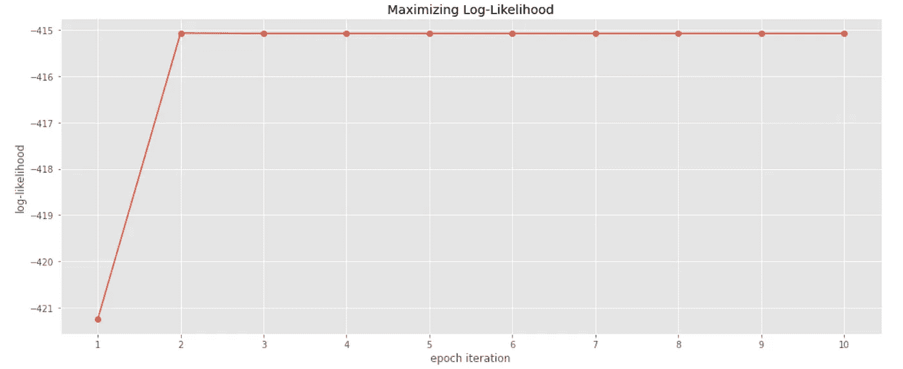

图 11:最大化每个历元迭代的对数似然函数；图片作者[作者](https://dolee.medium.com)

```
x_axis = [i for i in range(1, 11)]
plt.figure(figsize=(14,6))
plt.title(‘Maximizing Log-Likelihood’)
plt.xticks(x_axis)
plt.xlabel(‘epoch iteration’)
plt.ylabel(‘log-likelihood’)
plt.plot(x_axis, log_likelihood_vals, marker=’o’)
plt.tight_layout()
```

我们还可以看到每次历元迭代的𝜃参数收敛。正如我们在图 11 中看到的，对数似然在第一个时期后达到最大值；我们应该看到同样的参数。在图 12 中，我们看到参数在第一个时期后收敛到它们的最佳水平，并且最佳水平随着代码在剩余时期的迭代而保持。迭代训练集一次就足以达到最佳𝜃参数。让我们检查一下在每个时期间隔期间发生了什么。

图 12 右侧的曲线显示了𝜃参数值快速向其最佳值移动。当它继续迭代通过每个时期中的训练实例时，参数值上下振荡(时期间隔用黑色垂直虚线表示)。在每个时期结束时，我们以最佳参数值结束，并且保持这些值。

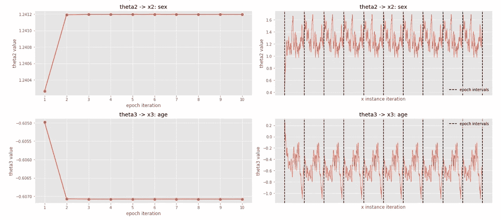

图 12:每个时期(左)和每个实例(右)的𝜃参数收敛；图片由[作者](https://dolee.medium.com)

图 12 —由[作者](https://dolee.medium.com)编写的代码

是时候使用该模型进行预测，并生成准确度分数来衡量模型性能了。有几个衡量性能的指标，但现在我们将快速了解一下准确性。下面的代码产生了 79.8%的准确率。

```
from sklearn.metrics import accuracy_scoredef make_predictions(X, thetas):
    X = X.copy()
    predictions = []
    for x_row in X:
        log_odds = sum(thetas * x_row[:4])
        pred_proba = sigmoid(log_odds)

        # if probability >= 0.5, predicted class is 1
        predictions.append(1 if pred_proba >= 0.5 else 0)
    return predictionsy_train = X_train[:, -1]
y_predict = make_predictions(X_train[:, :4], thetas)
accuracy_score(y_train, y_predict)
```

**交叉熵损失函数呢？**最小化交叉熵损失函数的结果将与上面相同。只有几行代码更改，然后代码就可以运行了(参见下面代码中的' # changed ')。这是代码。

梯度下降代码作者[作者](https://dolee.medium.com)

让我们看看使用梯度下降最小化交叉熵损失函数。我们在第一个时期后达到最小值，正如我们观察到的最大对数似然。最大的不同是，我们正朝着最陡下降的方向前进。这就是我们经常读到和听到的——最小化成本函数来估计最佳参数。我们现在已经具备了从头构建二元逻辑回归模型的所有组件。我希望这篇文章能帮助你，就像我帮助我加深对逻辑回归和梯度算法的理解一样。

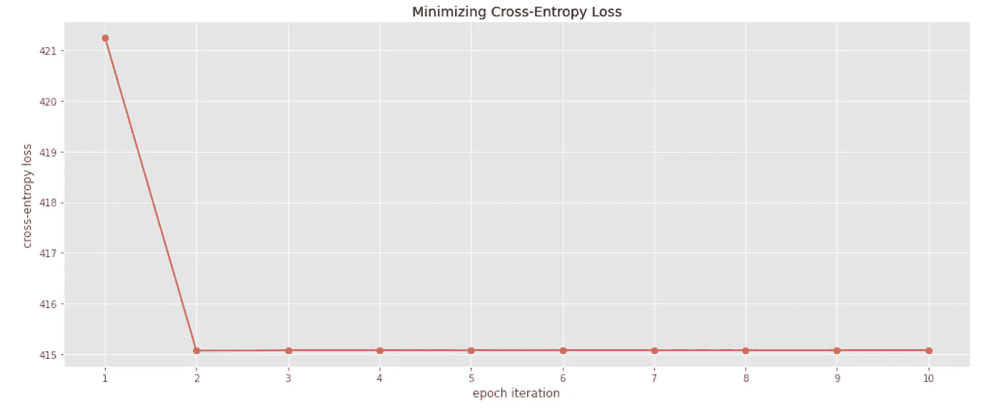

图 13:最小化交叉熵损失函数；图片由[作者](https://dolee.medium.com)

```
x_axis = [i for i in range(1, 11)]
plt.figure(figsize=(14,6))
plt.title(‘Minimizing Cross-Entropy Loss’)
plt.xticks(x_axis)
plt.xlabel(‘epoch iteration’)
plt.ylabel(‘cross-entropy loss’)
plt.plot(x_axis, ce_loss_vals, marker=’o’)
plt.tight_layout()
```

# 最后的想法

在这篇文章中，我的目标是提供一个坚实的二元逻辑回归模型和估计最佳𝜃参数的两种方法的介绍性概述。正如我们在泰坦尼克号的例子中看到的，主要的障碍是估计最佳的𝜃参数来拟合模型，并使用这些估计来预测乘客的存活率。我们使用梯度上升算法检验了(最大)对数似然函数。我们还使用梯度下降算法检查了交叉熵损失函数。当然，您可以将其他成本函数应用到这个问题上，但是我们已经讨论了足够多的内容，以了解我们试图通过梯度上升/下降实现的目标。

我们将何去何从？在改进模型方面，我们可以探索几个领域。我们可以从学习率开始。[学习率](https://en.wikipedia.org/wiki/Learning_rate)是一个超参数，可以调整。在许多情况下，随着梯度上升/下降算法向前发展，引入学习速率表来减小步长。

如果数据集很大，批处理方法可能并不理想。理解[随机和小批量梯度下降](https://machinelearningmastery.com/gentle-introduction-mini-batch-gradient-descent-configure-batch-size/)算法的机制会更有帮助。然而，一旦理解了批量梯度下降，其他方法就相当简单了。除了我在本文中使用的标准化方法之外，还有不同的[特性扩展](https://scikit-learn.org/stable/auto_examples/preprocessing/plot_all_scaling.html)技术。

如果你遇到任何问题或有反馈给我，请随时留下评论。感谢阅读！