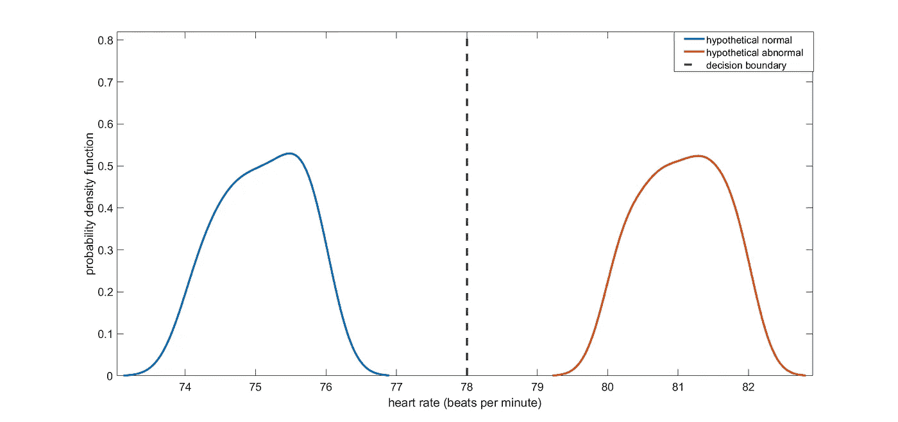
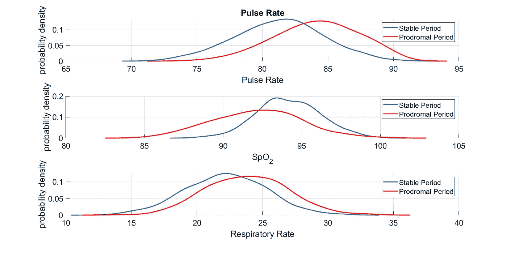
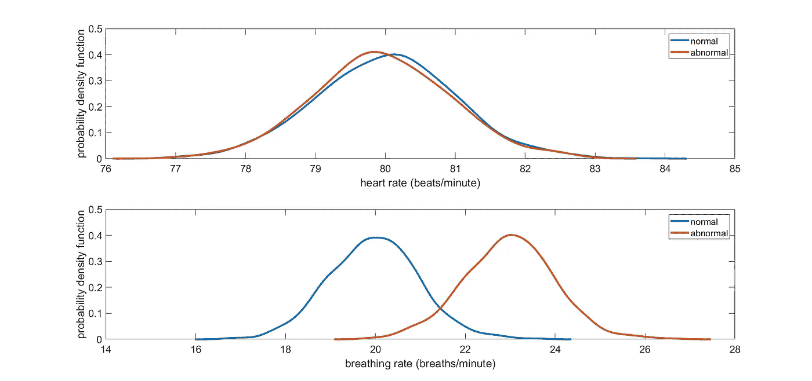
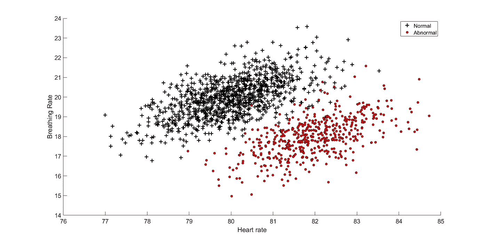
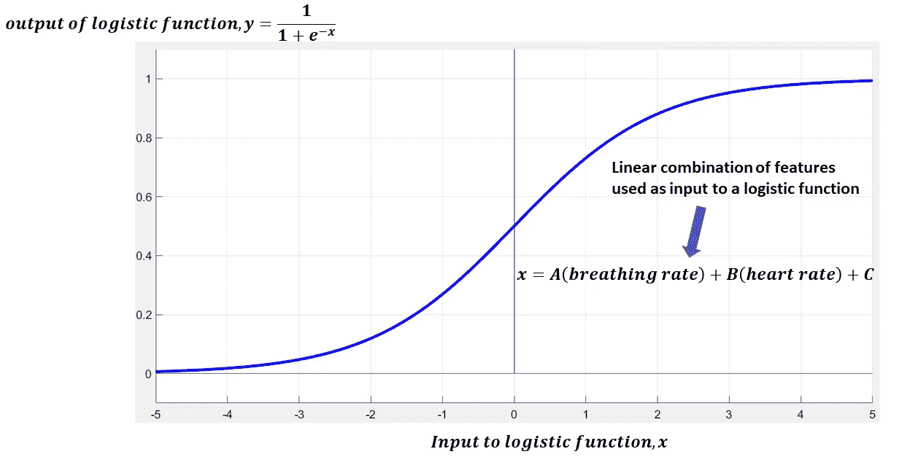
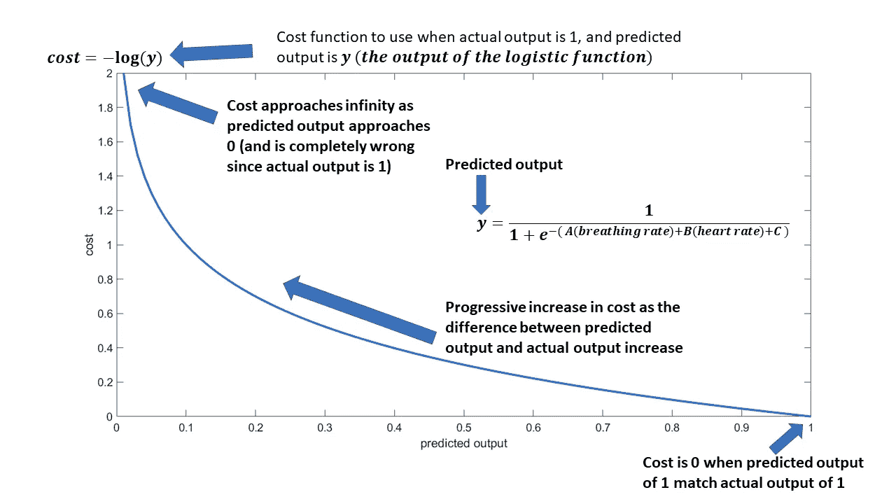
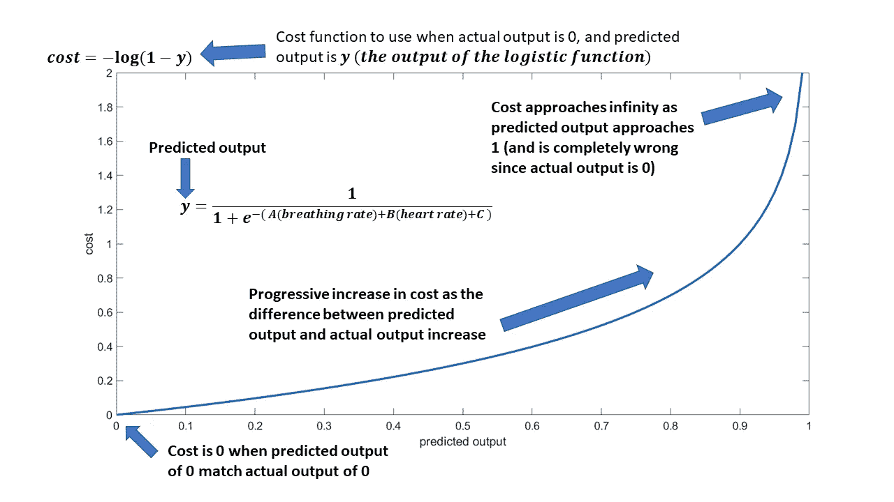
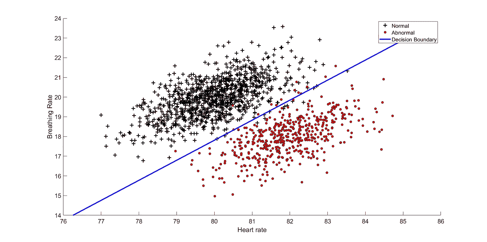

# 了解逻辑回归

> 原文：<https://towardsdatascience.com/understand-logistic-regression-c883e0d84693?source=collection_archive---------26----------------------->

## [入门](https://towardsdatascience.com/tagged/getting-started)

## 一个基于案例研究的介绍，带你从直觉到实现

```
**Table of Contents**· [Purpose](#f825)
· [Why Should You Read On?](#1fb3)
· [Logistic Regression in the Big Picture](#7e95)
· [Why Logistic Regression?](#ee06)
· [The Case Study](#9db8)
· [Logistic Regression Under the Hood](#8237)
  ∘ [The Classification Task](#1204)
  ∘ [The Rationale for Using Multiple Features](#f3aa)
  ∘ [Data Visualization](#bf8a)
  ∘ [The Linear Equation](#c9f1)
  ∘ [The Logistic Function](#c902)
  ∘ [The Cost Function](#2423) 
  ∘ [The Optimization](#6ccb)
  ∘ [The Prediction](#c7c5)
  ∘ [Implementation from Scratch](#aee7)
· [Summary](#a069)
```

# 目的

本文将通过一个受现实世界例子启发的案例研究，帮助您直观地理解逻辑回归。您还将能够从头开始实现您自己版本的逻辑回归(如果您愿意)。这篇文章假设没有机器学习的先验知识，将带你从基础(专注于直觉)开始，一路帮助你用自己选择的编程语言实现它。提供了相关的代码([在我的 GitHub 库](https://github.com/syedahmar/IntroductionToLogisticRegression))，这样任何人，如果感兴趣，都可以下载代码并使用这个案例研究来学习如何实现逻辑回归，并真正理解幕后发生的事情。一旦你读完这篇文章，你将有望开始看到并想象使用逻辑回归进行分类任务背后的数学原理(如果它是为了帮助你分类，你为什么要称之为回归呢？继续读下去),并有足够的信心将其应用到自己的工作中。

# **你为什么要继续读下去？**

如果你是一名有抱负的数据科学家，并认真学习这门手艺，你将需要投入一些时间，试图更好地理解直觉和一些算法的工作原理。将机器学习技术视为黑盒只能带你走这么远。你至少应该对基本原理有所了解，这样你就能在这个领域卓有成效地工作，并对使用什么技术、何时使用以及如何解释结果做出更好的决定。如果有一个算法你应该有一个清晰的理解，在引擎盖下，它是逻辑回归(如果你想知道为什么，在所有的技术中，它必须是逻辑回归)。

# 大背景下的逻辑回归

让我们从绝对的开始说起，数据科学的大图景。机器学习(ML)是数据科学的一个子集，位于计算机科学和数学的交叉点，该领域的核心和灵魂是从数据中学习。

要获得更有哲理、更详细的概述，请查看我的另一篇文章:

</learning-from-data-a-birds-eye-view-4e47bd53be8f>  

机器学习本身可以根据学习的类型分为三个子领域:监督学习、非监督学习和强化学习。这些学习类型中最广泛和公认的是监督学习。在监督学习中，解决的两种主要问题是分类和回归。在分类(这有助于将数据分为不同的类)中，您可以进一步将其分为生成模型和判别模型。在判别模型中，最常用的方法是逻辑回归。


展示逻辑回归在整个生态系统中的位置的数据科学景观(图片由作者提供)

# **为什么是逻辑回归？**

正如我提到的，在 ML 中，最常见的学习类型是监督学习，该领域中解决的最常见和公认的问题是分类(猫对狗，垃圾邮件对火腿，疾病对健康等)。).你可能想知道，为什么在众多的技术中，你还要费心去学习逻辑回归。有两个主要原因可以解释为什么你应该在深入学习之前花时间学习逻辑回归。

**首先**，如果任何高级算法没有附加价值，那么尝试实现它是没有意义的(在建模任何东西时，永远记住[奥卡姆剃刀](https://en.wikipedia.org/wiki/Occam%27s_razor))。需要有一个简单、可解释的算法，您可以轻松、快速地在您的数据集上实现，以作为您的**基准**。用于分类的逻辑回归是作为基准的理想算法。一旦有了基准，只有这样，您才能投入资源来改进您的基准解决方案(否则，当您不知道除了简单、可解释且易于实现的算法之外，实现更复杂的算法是否有任何价值时，这是对资源的不良利用)。

**其次**，如果你是该领域的新手，你可能会感到惊讶，在你的数据集上，支持向量机(SVM)等更高级的算法不一定总是比逻辑回归(LR)做得更好。事实上，在一些应用中，LR 做得相当好，并且当使用 SVM 或任何其他算法时，没有获得改进。底线是，在所有的可能性中，当你开始解决一个问题时，你应该使用 LR 作为你的分类算法，它对于分类的重要性不能被夸大。因此，绝大多数关于机器学习的课程在早期就教授 LR 也就不足为奇了。当你进一步阅读时，你会很快意识到 LR 非常直观并且易于实现。

# 案例研究

你可以在我们发表在《医学互联网研究杂志》(JMIR，医学信息学的知名研究期刊之一)上的论文中了解更多这方面的内容。

<https://www.jmir.org/2017/3/e69/>  

简而言之，慢性阻塞性肺病(COPD)是一种长期疾病，患者的肺部受到不可逆的损害，以至于日常活动可能会使他们喘不过气来。这种疾病无法治愈，患有慢性阻塞性肺病的人将在余生中一直处于这种状态。然而，如果 COPD 患者能够通过监测他们的症状并在需要时及时服药来自我管理他们的病情，他们仍然可以生活得很好并获得高质量的生活。虽然 COPD 症状很常见，但是在事情恶化到患者最终住院的程度之前，需要及时处理症状的持续恶化。患者如何识别自己的病情是否正在恶化？一种方法是使用一个小的手指探针(称为脉搏血氧计)，可以测量心率，血液中的含氧量(称为氧饱和度)和呼吸频率。我们的任务是在患者病情恶化时，仅使用脉搏血氧仪向患者提供早期预警。


问题的概念图(图片由作者提供)

**免责声明:**首先，数据集(您可以在 github 上找到)是模拟数据，而不是来自我们研究的实际数据。然而，它是使用论文中公布的类似平均值生成的(并可公开获得)。其次，在这篇文章中，我将挑战简化为只关注心率和呼吸率的二维问题，因为在二维空间中更容易可视化数据点。然而，一旦你理解了二维的概念，你就可以很容易地把它扩展到三维或更多维，并且基本原理不会改变。

# 幕后的逻辑回归

现在，你对大局有了很好的认识，逻辑回归在更大的事物计划中的位置，并且你对我们试图解决的问题有了理解，让我们进入一些细节。

## 分类任务

我们现在面临的挑战是，通过结合两种信息:心率和呼吸率，在患者病情恶化之前向他们提供早期预警。我们希望以最佳方式将这两种测量方法结合起来，以确定患者的病情是否在恶化。为简单起见，我们将这些情况称为“异常”。(在最初的论文中，他们被称为“前驱”)。当病人的情况稳定并且没有恶化的危险时，这一时期被称为正常时期。因此，我们现在的问题归结为基于两种测量来发现患者是正常还是异常:心率(HR)和呼吸率(BR)。

> 分类目标:使用患者的心率和呼吸率来识别患者是正常还是异常。

## 使用多种功能的基本原理

首先要问的问题是:为什么我们甚至需要两种不同的测量方法？难道我们不能用 BR 或 HR 来做决定吗？为什么使用多种测量方法会使我们的生活变得复杂？如果你有一种情况，单次测量导致正常和异常之间的完美分离，你不需要第二次测量。从图形上看，应该是这样的:



心率在两类中的分布，在一个假设的情况下，完美的分离是可能的，现实世界的例子不像这些(图片由作者提供)

事实上，为此你甚至不需要任何机器学习。您可以绘制数据，并直观地看到一个简单的规则可以将这两种情况分开。在单次测量的情况下，这个简单的规则在图形上是一条垂直线。在上图中，这相当于 HR 为 78。如果患者的心率高于 78，患者将被视为异常，如果患者的心率低于 78，患者将被视为正常。你在图中看到的这条垂直线被称为“决策边界”。对于这种情况，当你有一个单一的测量和如此明确的分离，任何垂直线都可以完美地分开两者(决策边界在 77，78 或 79 都同样完美)。然而，现实世界的问题是困难的(并且是问题),因为这种分离并不直接，并且有许多重叠。因为对于单个测量来说重叠是很多的，因此，我们对同一患者进行不同类型的测量，虽然有很多重叠，但是我们希望每个测量都有独立的信息，并且通过组合不同的测量，我们希望找到更好的决策边界，与仅使用单个测量相比，可以导致更少的误差。例如，检查案例研究中呼吸率、心率和氧饱和度的重叠(如果有人有兴趣使用，可以在我的 github 存储库中找到这些数据。它是使用本文前面引用的原始论文中可以看到的相同数据分布进行模拟的。



正常和异常(前驱)情况下心率(脉率)、呼吸率和血氧饱和度(SpO2)的概率分布(图片由作者提供)

为了简单起见，我们将使用另一个模拟数据集，该数据集受到相同问题的启发，但它显示了正常和异常之间更多的分离(如前所述，仅使用心率和呼吸率)。让我们从分别绘制两种情况下的心率和呼吸率分布开始。



正常和异常情况下的心率和呼吸率的概率分布，请注意正常和异常情况下的呼吸率和心率存在重叠(图片由作者提供)

## 数据可视化

如您所见，存在重叠，HR 或 BR 的单一阈值会导致相当大的误差。让我们在一个单独的图中绘制 HR 和 BR，以便您可以直观地看到问题。



在我们的案例研究中，心率与呼吸频率的散点图(图片由作者提供)

## 线性方程

如果我们将 HR 和 BR 结合起来帮助我们找到“最优”决策边界，我们能做的最简单的事情是什么？最简单的方法是将呼吸率和心率进行线性组合。从数学上讲，这相当于求一个加权和，如下式所示:


呼吸率和心率的加权和，其中 A 和 B 是未知参数(图片由作者提供)

从图形上看，这相当于在二维图上找到一条直线。因此，问题归结为找到正确的值 *A* 和 *B* 来拟合一条线(决策边界),这条线可以帮助我们区分正常和异常情况。

只是有一点需要注意:如果我们只需要将这个问题简化为寻找 *A* 和 *B* ，那么得到的直线将总是通过原点。为了消除这种限制，我们可以添加一个“偏差”项，因此，最终的等式变成如下:


为了确保“决策边界”不仅限于通过原点，我们添加了一个“偏差”项，这是一个需要在“学习”过程中确定的附加参数。在上面的等式中，“偏置”项是 c。

> 因此，分类问题在概念上可以被看作是寻找能够最好地分离正常和异常情况的直线方程的未知参数。

## 物流功能

我们仍然需要对一些事情进行排序，包括找出我们如何找到找到最佳线的方法(对于 2-D 情况，这在目前看起来可能是显而易见的，但请记住，这是一个有助于可视化的更简单的问题，一旦我们理解了这一点，相同的原则将适用于更高维度的问题，因此我们需要找到一种自动和有原则的方法来找到这一点)。

如你所知，心率和呼吸率的线性组合的输出没有限制。它可以取任何值，完全取决于 HR 和 BR 的值。

> 如果方程的输出可以转换成概率不是很方便吗？

事实证明，有一种方法可以迫使心率和呼吸率的线性组合的输出限制在 0 和 1 之间(这可以解释为一种概率)。为了实现这个目标，我们所要做的就是将线性组合的输出作为一个新函数的输入，该函数可以将从-无穷大到+无穷大之间的任何值作为输入，然后输出一个介于 0 和 1 之间的值。“逻辑”回归中使用的一个函数就是“逻辑”函数(该函数也称为 sigmoid 函数)。



逻辑函数及其与使用特征的线性组合的关系(图片由作者提供)

您可以将此过程视为制作一个要素线性组合包，然后将该包交给逻辑函数，该函数会将输出转换为 0 到 1 之间的变量。然而，这种转换不是随机的。如果你仔细观察逻辑函数，你会注意到它为任何正输入输出值 *> 0.5* ，为任何负输入输出值 *< 0.5* 。因此，我们需要做的就是找到 *A，B，C* 的值(根据前面定义的等式)，使得线性等式在真实值为 0 的情况下输出非常大的负值(按照惯例，我们将 0 分配给正常情况)，当真实值为 1 时输出非常大的正值(1 对应于患者异常的情况)。或者用更简单的话来表述:我们需要找到 *A，B，C* 的值，使得逻辑函数的输出接近实际值。

## 成本函数

一种方法是定义一个“成本”函数。并且该成本函数需要确保当来自逻辑函数的输出与实际值非常不同时它输出大的值(假设实际值是 1 并且逻辑函数输出非常小的值，接近 0，或者如果实际值是 0 并且逻辑函数输出接近 1 的大值)。相反，这个成本函数需要输出一个非常小的值，当输出与实际值匹配时，理想情况下为 0。如果我们可以有这样一个成本函数，那么我们所要做的就是找到导致最小成本函数的参数 A、B、C 的值。

## 优化

寻找成本函数最小值的过程称为“最优化”。我们要怎么做？我们可以使用微积分(更具体地说，是一种梯度下降算法，可以帮助我们找到函数的最小值)。虽然在理论上，我们可以使用几个具有这种特性的数学函数(当差异高时，成本值高，当差异低时，成本值低)，但我们还需要确保函数是“凸的”。这有助于我们使用微积分轻松找到成本最小的参数值。如果我们没有凸函数，那么我们不一定能找到全局最小值，它也不会是最优解。令人欣慰的是，逻辑回归的成本函数的要求已经被很好地研究和计算出来了，从图形上看，当实际输出为 1 时，它看起来像下面这样。为了强调这些概念，我给这幅图贴上了标签。成本函数取决于预测值，从图中我们可以看到，当实际产量和预测产量完全匹配时，成本为 0，随着预测值和实际值之间的差异增加，成本逐渐增加。



实际输出为 1 时使用的成本函数。请注意，当预测输出 y 为 1(实际值和预测值完全匹配)时，成本为 0。然而，随着预测产量接近 0(实际值和预测值完全不匹配)，成本逐渐增加。(图片由作者提供)

如果您已经掌握了上面的成本函数图，那么下一个应该马上就清楚了(它是前面图的镜像，描绘了实际输出为 0 时的场景)。



实际输出为 0 时使用的成本函数。请注意，当预测输出 y 为 0(实际值和预测值完全匹配)时，成本为 0。然而，随着预测产量接近 1(实际值和预测值完全不匹配)，成本逐渐增加。(图片由作者提供)

一旦你定义了成本函数，你现在需要做的就是运行一个优化算法，找到未知的值，可以帮助你得到最小值。为了开始优化过程，我们需要将未知数的值初始化为一些值。随后，我们可以运行该函数并获得未知参数的值，对于这些参数，成本函数是最小值。运行这个，在我们的问题中，我们得到下面的决策边界。



使用成本函数最小的 A、B 和 C 值得到的决策边界。(图片由作者提供)

## 预测

最后，如果我们需要对一个新的数据集进行预测，我们需要做的就是得到它们的 HR 和 BR，并使用学习时找到的参数值 *(A，B，C)* 找出预测输出， *y* 。从图形上看，这相当于确定新数据点位于决策边界的哪一侧。如果高于该线，则可认为患者正常。如果低于该线，则可认为患者异常。

## 从头开始实施

为了保持帖子简短，我将分享如何从头实现逻辑回归的要点。然而，你可以查看[我的 github 库](https://github.com/syedahmar/IntroductionToLogisticRegression)来访问产生这篇文章中的图片的代码(在 Matlab 中实现)。如果有兴趣的话，我随后也会在资源库中分享 Python 和 R 代码。关键的实施步骤是:

㈠以矩阵形式获取数据

(二)可视化数据(散点图以查看相关性，直方图或密度图以更好地了解数据的分布)

㈢增加截距(偏差)项

(iv)初始化未知参数(在这种情况下，任何随机数都可以)

(v)定义成本函数并运行优化例程(您会发现在您选择的任何编程语言中都有内置的例程来实现这一点)

㈥划定决策界限

㈦进行预测

这里的帖子中已经给出了需要实现的各种方程(见两个成本函数图)。结合代码阅读本文应该很简单，可以帮助您找出完整的管道并自己实现它。

# 摘要

本文假设没有机器学习的先验知识，并从数据科学的大背景出发介绍了逻辑回归。然后，它证明了为什么任何有抱负的数据科学家都应该投入时间来理解逻辑回归是如何工作的。然后，它继续解释逻辑回归的关键概念，并提供了数学方程和图形表示，以帮助理解。这些概念都解释了作者自己的研究工作启发的案例研究的帮助。

<https://ahmarshah.medium.com/membership> 