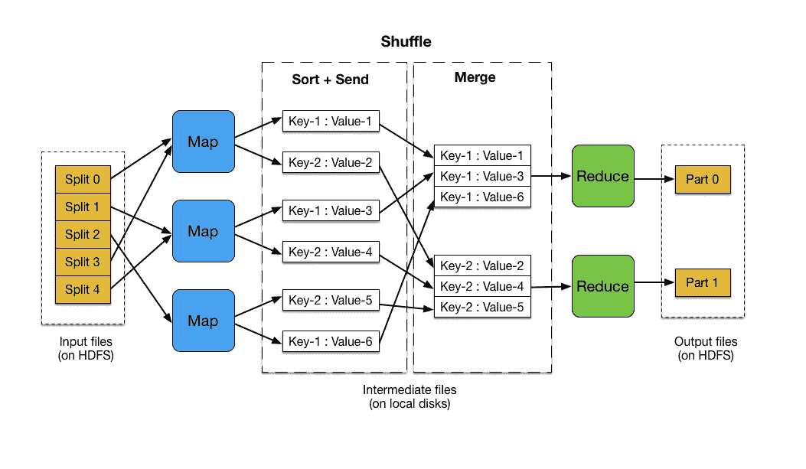

# 直观地理解 MapReduce

> 原文：<https://towardsdatascience.com/understand-mapreduce-intuitively-1301287e7677?source=collection_archive---------32----------------------->

## 了解处理大数据的商业秘密

[安德鲁·尼尔](https://unsplash.com/@andrewtneel?utm_source=medium&utm_medium=referral)在 [Unsplash](https://unsplash.com?utm_source=medium&utm_medium=referral) 上拍照

# 介绍

大数据到底有多大？根据[里奥纳尔迪·钱德拉塞塔](https://chandraseta.medium.com/)的说法，他在[处理大数据](/5-things-i-learned-from-my-first-time-working-with-big-data-a6193deb982f)时的经验是**128 Pb。这么大的数据量实在让人无法理解。如果您从未处理过这种规模的数据，我推荐您阅读他的文章，它也是这篇文章的灵感来源。**

简单来说，逐行执行操作在万亿级别是不够的。当处理不可逾越的数据量时，需要某些技术来计算各种统计数据，以及强大的计算集群。有许多方法可以提高性能，但最常用的技术是 MapReduce。在了解其工作原理或为何如此有效之前，我们先来了解并行化。

# 简而言之，并行化

假设您有一个 Python 脚本要运行，但没有关于如何运行的具体指令，它会连续运行。串行计算意味着每个进程都按照指定的顺序运行。然而，我们可以看到，对于大量的数据，这可能是一个严重的问题。然而，并行化允许同时或并行处理批量数据。

机器上的大多数 CPU 都有多线程能力。这意味着一个 CPU 有许多线程或内核，允许更多数据流通过进行并行处理。事实上，我的笔记本电脑是 2015 年制造的，它有 8 个核心。

假设您在一台拥有 16 个 CPU 内核的计算机上工作。你的机器允许数据被分割成 16 个不同的线程进行处理。如果在使用 16 个内核后仍有更多数据，下一批将被分配给第一个分配的内核，之后的一批将被分配给第二个内核，并且该过程将继续，直到所有数据都被处理完。

这使得每个 CPU 核心成为一个工作节点。工作节点被分配了许多要提前执行的作业，并且所有节点同时完成它们的作业。如我们所见，这允许同时操作大量数据，从而实现更快的性能。但是这和 MapReduce 有什么关系呢？

# MapReduce

Map 过程获取相关的数据集，并使用过滤或排序将其转换为另一个更小的数据集。每个数据点将被分配一个 ID，让计算机知道它将被分配到哪个工作节点。在 Reduce 步骤之前，有一个称为 Shuffle 过程的中间过程。这将获取经过排序/筛选的数据，并重新分配这些数据，以确保将它们分配给适当的工作人员。一旦完成，Reduce 过程可以是许多过程中的一个，但是顾名思义，就是将新的映射数据集简化为有问题的解决方案。

值得注意的是，您可以利用单核的 MapReduce 过程。然而，它并没有表现出比在没有 MapReduce 的情况下实现函数本身更快。简而言之，MapReduce 是一个在并行计算中发挥其最大潜力的过程。SunLab 的下图很好地展示了这一过程。

[照片由太阳实验室](http://www.sunlab.org/teaching/cse6250/fall2018/hadoop/mapreduce-basic.html)提供

# 结论

随着 MapReduce 的直觉开始形成，很容易看到它在数据科学和机器机器学习中的效用。最简单的用例可能是找到某个汇总统计数据。这可能像均值一样简单，也可能像[发现一首歌的可舞性一样复杂。](https://developer.spotify.com/discover/)

在数据科学中，特征提取是关键。当处理数 Pb 的数据时，以有效的方式找到必要的特征不仅会使您作为数据科学家的工作变得容易得多，而且还会让您找到以前从未梦想过的洞察力。

 [## 向机器学习

### 了解向我们学习的算法。

learningfrommachines.substack.com](https://learningfrommachines.substack.com/welcome)