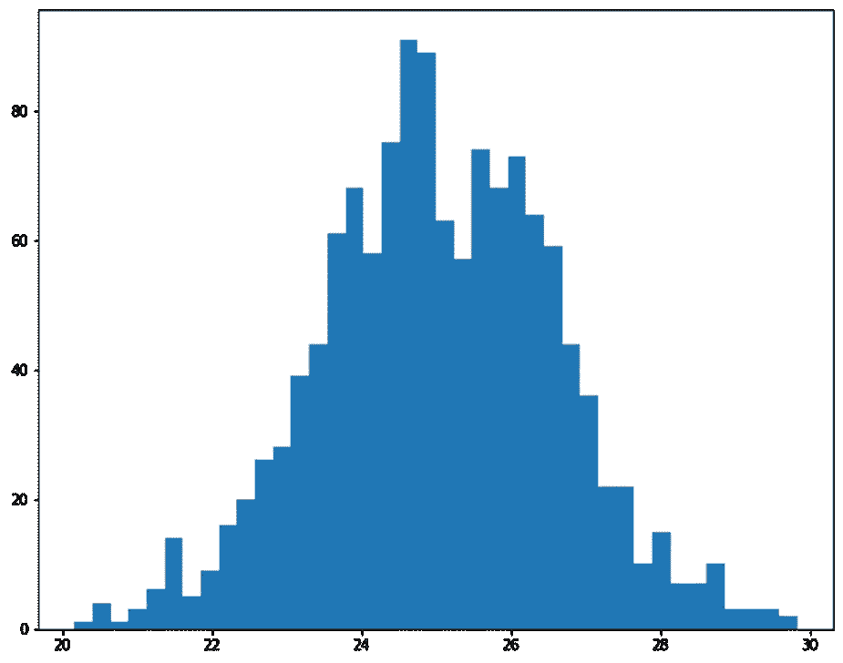
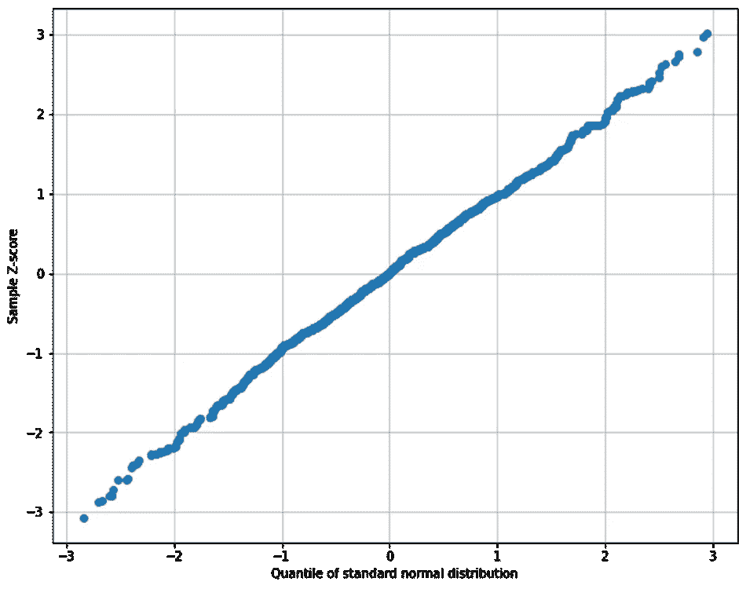
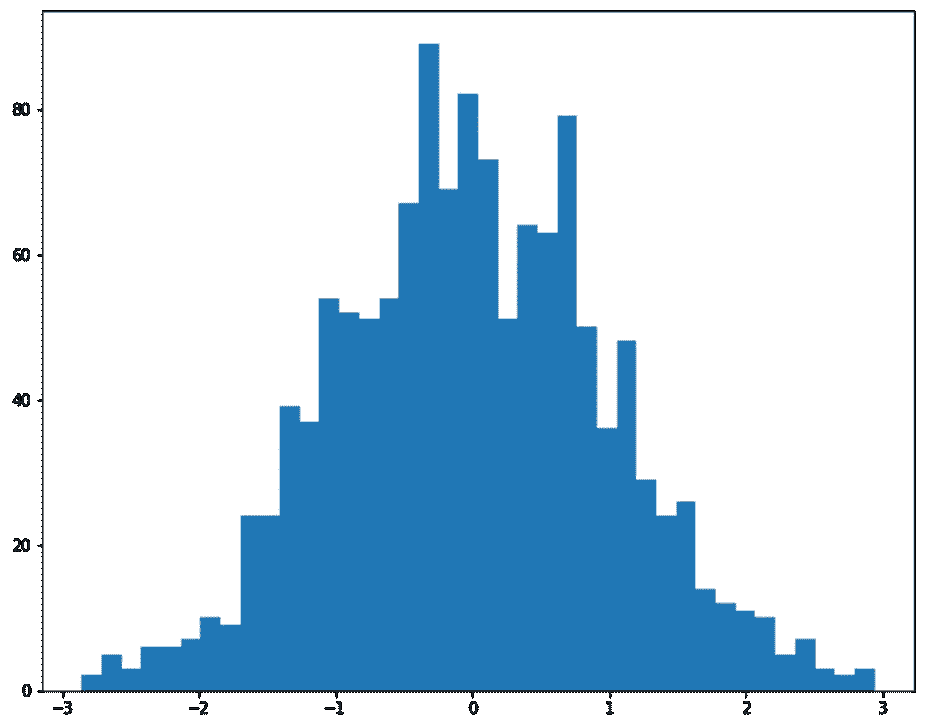
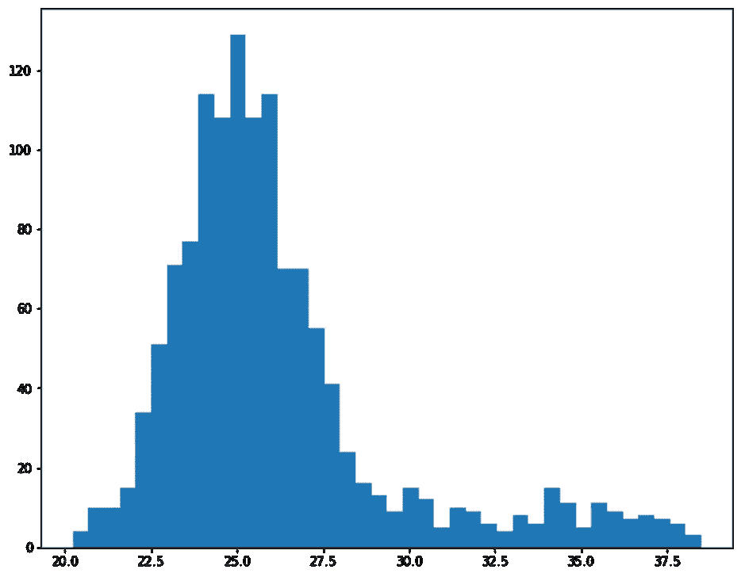
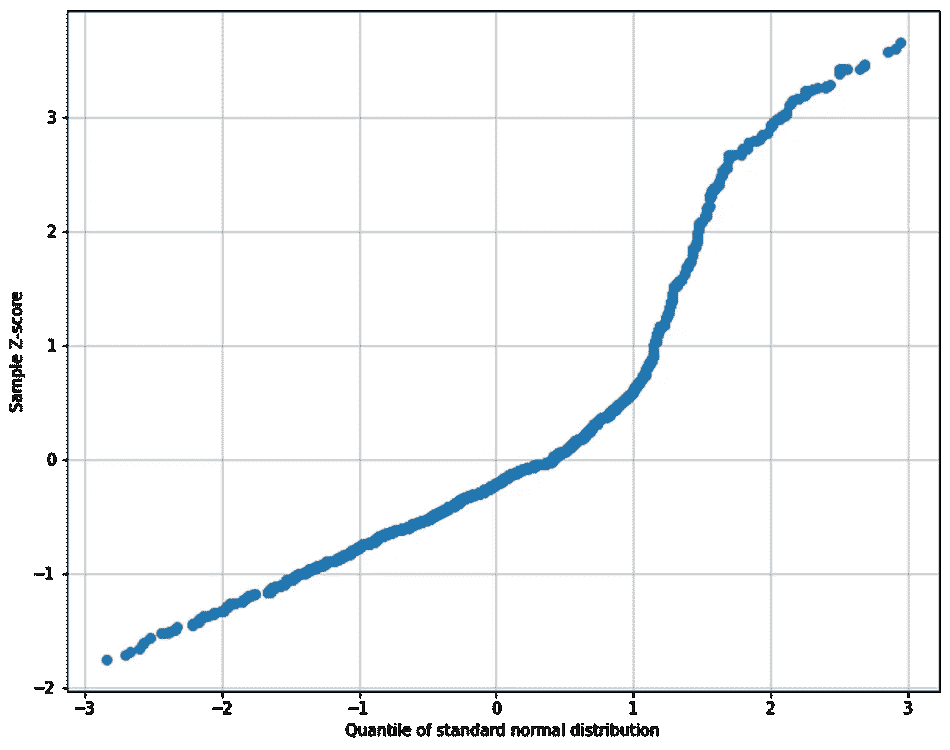
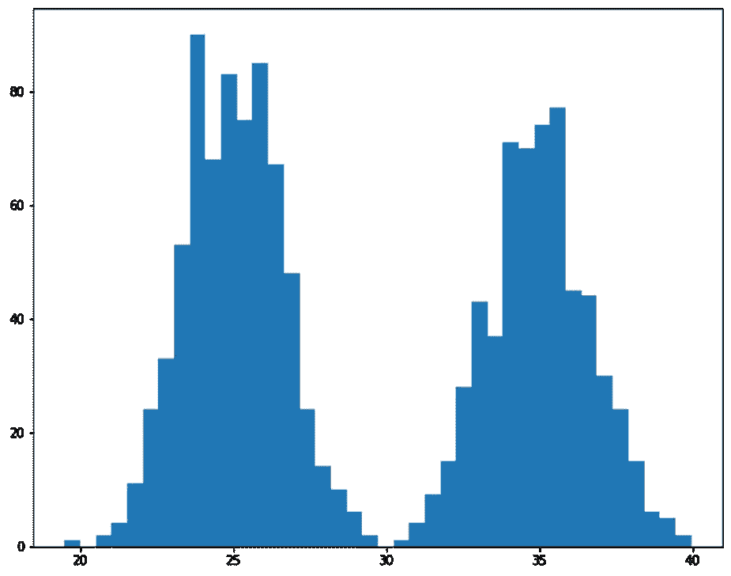
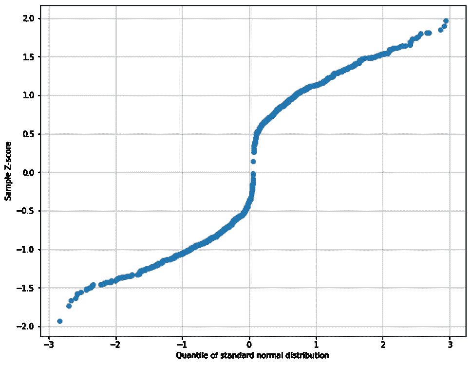
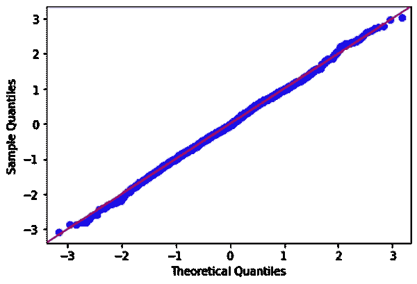

# 使用简单的 python 理解 Q-Q 图

> 原文：<https://towardsdatascience.com/understand-q-q-plot-using-simple-python-4f83d5b89f8f?source=collection_archive---------2----------------------->

## 可视化数据的有效方法

作者图片

> **简介**

工程师和科学家处理数据。没有数据，他们无法得出任何结论。现在是每天从我们生活的各个方面创造数据的时代。有些数据是随机的，有些是有偏差的。由于数据收集过程，有些人可能会有偏见。数据的一个非常重要的方面是分布概况。收集的数据可能呈正态分布，也可能远离正态分布。它也可以向一侧倾斜，或者可以遵循多模态模式。它可以是离散的，也可以是连续的。对于连续数据，正态分布相比于它的对应物有很多优势。各种推断统计过程都假设分布是正态的。钟形曲线很容易用均值和标准差来描述。

典型的正态分布数据(图片由作者提供)

> **为什么要阿 q 情节？**

由于正态分布如此重要，我们需要检查收集的数据是否正态。在这里，我们将演示 Q-Q 图来检查数据偏态的正态性。Q 代表分位数，因此，Q-Q 图代表分位数-分位数图。为了确定正态性，也有一些统计检验，如科尔莫戈罗夫-斯米尔诺夫检验和夏皮罗-维尔克检验。本文范围仅为 Q-Q 剧情。

> **简要说明**

我们现在知道 Q-Q 图是分位数-分位数图，但首先分位数是什么？当对整个数据进行排序时，第 50 个分位数意味着 50%的数据低于该点，50%的数据高于该点。这是中间点。当我们说第一分位数时，只有 1%的数据低于该点，99%的数据高于该点。第 25 和第 75 分位数点也称为四分位数。数据集有三个四分位数。

Q1 =第一个四分位数=第 25 个四分位数

Q2 =第二个四分位数=第 50 个四分位数=中位数

Q3 =第三个四分位数=第 75 个四分位数

分位数有时被称为百分位数。下面是一个典型的 Q-Q 图。让我们解释一下这个看起来几乎是一条直线的图。

Q-Q 图(图片由作者提供)

> **轴**

Q-Q 图的 x 轴代表标准正态分布的分位数。假设我们有一个正常的数据，我们想标准化它。标准化意味着从每个数据点中减去平均值，然后除以标准差。结果也称为 z 分数。让我们对这些 z 值进行排序，然后再进行绘图。下图显示 x 轴现在以 0°为中心，并在每侧延伸至 3 个标准差。据统计，99.7%的数据都在这个范围之内。

标准化正态数据的分布(图片由作者提供)

找到 Q-Q 图的 x 轴值的第一步是确定该正态分布标准数据的分位数/百分位数。这样，我们就可以得到在所有 Q-Q 图中非常标准的分位数。当我们使用这些 z 分数时，x 轴将大致从-3 延伸到+3。

一旦我们获得了沿 x 轴绘制的值，我们就需要对感兴趣的数据应用相同的方法。因此，我们将绘制 out 数据的 z 得分与标准正态数据的 z 得分。如果我们的数据是正常的，绘图将是一条直线，因为我们正在绘制非常接近的值。如果数据不是正态分布的，线就会偏离直线轨道，发出不同情景的信号。

右侧数据失真(图片由作者提供)

例如，如果数据偏高(如上所示)，我们将获得类似下图的 Q-Q 图。

偏斜数据的 Q-Q 图(图片由作者提供)

如果数据显示双峰，Q-Q 图也会显示这一点。

双峰数据(图片由作者提供)

双峰数据的 Q-Q 图(图片由作者提供)

本文的教程链接是[这里的](https://www.youtube.com/watch?v=8KKiwyiMhqU)。

> **用 python 实现**

Python 有 stastsmodels 库，里面有方便的 qqplot 模块可以使用。

Statsmodels 正常数据的 Q-Q 图(图片由作者提供)

为了更好地理解，我还将展示代码块的分解，以便简单地实现它。一旦我们有了数据框架中的数据，我们需要将其标准化。

接下来，我们需要找到分位数/百分位数。

最后，我们需要对输出和绘图进行排序。

就是这样。我们可以使用这个 Q-Q 图快速查看数据的正态性。

> **结论**

Q-Q 图是一个非常有用的工具，可以确定数据的正态性或数据偏离正态性的程度。此图表示沿 x 轴的标准正态分布的 z 得分以及所获得数据的相应 z 得分。有时，也可以沿 y 轴绘制样本分位数，而不是 z 得分。

[Github 页面](https://mdsohelmahmood.github.io/2021/11/28/QQplot.html)

感谢阅读。