# 理解支持向量机

> 原文：<https://towardsdatascience.com/understand-support-vector-machines-5bfe800a0e03?source=collection_archive---------17----------------------->

## 一个初学者友好的 SVM 方程推导与直观的解释

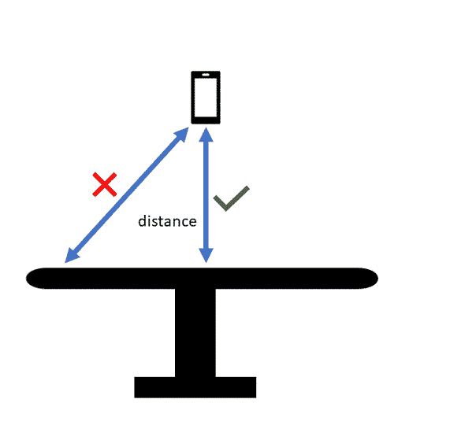

正交投影给出了我们从一个点到一个平面的最短距离，就像我们在日常生活中所习惯的一样(图片由作者提供)

> "真正的知识来自对一个主题及其内部运作的深刻理解."[人名]阿尔伯特·爱因斯坦(犹太裔理论物理学家)

# 为什么我要费心学习 SVM 背后的数学？

## 有许多可用的库可以帮助我使用 SVM，而不必担心底层的概念。

当然可以！你完全正确。你不需要理解 SVM 就能使用它。您甚至可以应用 SVM 来解决分类问题，而无需理解其背后的基本概念。有大量的工具随时可用。再也没有人在现实世界的项目中从头开始实现 SVM 了。

> 然而，如果你是一个有抱负的数据科学家，你应该花一些时间学习这些基本概念，以了解各种代数和几何参数如何最终成为一种算法。

学习或遵循每个算法的本质是不可能的，但有一些绝对基本的概念，任何认真的从业者都应该接触到。这样的曝光将新手和熟练者区分开来。

SVM 只是一个工具。就像锤子是木匠的工具一样。然而，拥有锤子并不会让每个人都成为有用的木匠。同样，把访问 SVM 作为一种工具并不一定会让你成为*有用的*数据科学家。

数据科学既是一门艺术，也是一门科学。作为一名数据科学家，如果你想精通你的技术，那么我建议你必须花一些时间去理解一些精选的、众所周知的算法的数学和几何论证。

> 这正是这篇文章的目的:使用高中数学和几何推导 SVM 方程，并使用直观和易于理解的论点！

SVM 是理解监督机器学习的几何观点和巩固向量代数在机器学习中的使用的理想算法。让我们开始吧！

> 如果你能仔细阅读这篇文章，那么你应该最终对 SVM 背后的数学有一个清晰的理解，并且(希望)认识到 SVM 数学只是看起来吓人，但实际上非常简单！

在以前的文章中，我已经给出了一个非常温和的介绍，仅提供几何直观。如果你不太熟悉 SVM 的基本概念(或者对 SVM 与逻辑回归的区别有点生疏)，那么我建议你先读一读我以前关于这个主题的文章。

</understand-support-vector-machines-6cc9e4a15e7e>  

# 线性可分的两类

帮助解释 SVM 概念的最基本的场景是解决一个二元分类问题，其中两个类是线性可分的。相应的解决方案也称为“硬”SVM。这是因为一旦找到了“最优”决策边界，就不会有错误。所有训练点都在决策边界的正确一侧。这与“软余量”SVM 形成对比，当我们处理不是线性可分的分类任务并且允许一些错误时。

SVM 方程(从技术上讲，是一个方程和一个不等式)是:

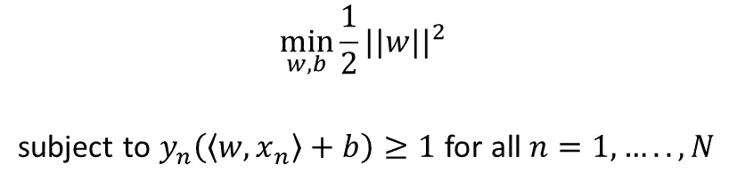

硬边界支持向量机方程(图片由作者提供)

文章的其余部分将推导出上述内容。先来个数学鸟瞰！

*注:知名的机器学习书籍中有很多关于这个话题的优秀资源。根据您查看的资源，您会发现在使用的符号方面有细微的变化。为了让这篇文章易于理解，我选择了“机器学习的数学”所采用的符号，可以在* [*GitHub*](https://github.com/mml-book/mml-book.github.io/tree/master/book) *上免费获得。*

# 分类的高级数学视图

您可以将分类任务视为一个映射，该映射接受一个 *n 维*输入(特征向量， ***x*** )并输出一个 *1 维*类标签， *y* (假设一个类为正，另一个类为负)。

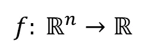

实数的 n 维向量空间(输入)被映射到 1 维向量空间(输出)的函数；(图片由作者提供)

为了进一步挖掘，我们需要理解超平面的概念！

# **超平面**

什么是超平面？在二维情况下，超平面是一条分隔线。在一个三维的 T21 案例中，它是一个平面。在 *n 维*的情况下，它是一个 *(n-1)* 维的向量空间(一个*超平面)。*

## 内积是表示超平面的一种方便的符号

我们需要在 ***x*** 中找到一些不同特征的线性组合，一个方便的向量符号是使用内积(在这种情况下，这也被称为标量或点积)。因此，我们对于分离超平面的表达式变成:

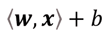

超平面的表达式；(图片由作者提供)

在上面的表达式中， ***w*** 是权重向量， ***x*** 是特征向量， *b* 是偏差项(进一步阅读可以理解这些术语的几何意义)。两个向量之间的内积是一种紧凑的表示，它将每个单独的对应分量相乘，然后将所有的乘积相加。例如，如果我们正在处理二维情况，我们可以将超平面表达式表示为:

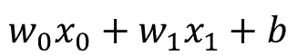

二维超平面的表达(图片由作者提供)

本例中，***w****=(w*₀*，w* ₁ *)，以及****x****=(x*₀*，x* ₁ *)。* 说白了， ***w*** 和 ***x*** 都是向量，各有两个分量。

# 超平面不等式和方程

我们对超平面表达式本身不感兴趣，而是使用它来帮助我们将 n 维*空间划分成区域。我们可以通过指定带有不等式的条件来做到这一点。*

在我们的具有 *n* 个特征的两类线性可分分类问题中，让我们假设这两个类被标记为+1 或-1(我们可以假设不同的数字来表示每个类，但是这种选择使得随后的数学变得简单)。我们想从超平面中得到的是保证任何属于一类的点(比如说+1)在超平面的一边(比如说正边)，属于另一类的点(比如说当 yn=-1 时)在负边。

数学上，对于正类，超平面不等式变成:

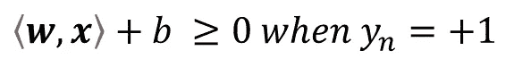

类为+1 时的超平面不等式(图片由作者提供)

对于消极阶层来说，

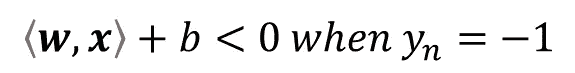

类为-1 时的超平面不等式(图片由作者提供)

我们可以将上述两个不等式表示为一个不等式:

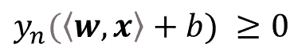

以上两个超平面不等式的紧凑表示，方程 A(图片由作者提供)

*(如果你对你的高中数学有点生疏的话，紧凑表示法相当于上面的两个表达式，因为当我们将一个不等式乘以一个负数时，不等式的符号会改变)*

简单地说，上述不等式说明了属于这两类的点位于超平面的相对两侧的条件。

满足上述约束的特定超平面将是超平面方程。

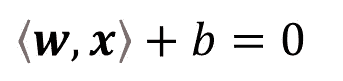

超平面方程(作者图片)

# 超平面的几何视图

任何超平面都可以用一个权重向量、 ***w、*** 和一个偏差项、 *b、*来表示，从图形上看，一个超平面在 3D 中看起来就像下图。权重向量 ***w*** 垂直于(成 90 度角)平面，偏移项 *b* 是平面到原点的距离(偏移)，并且 *x* ₘ和 *x* ₙ是平面上的两个点(平面上的任意两个点！).

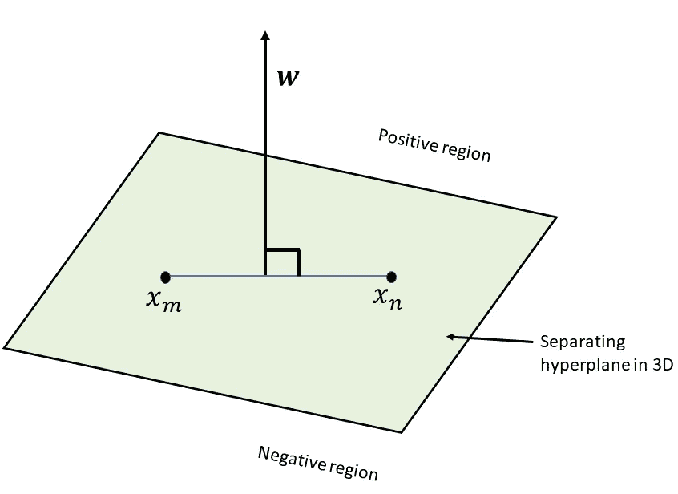

3D 中的分离超平面，改编自 Deisenroth，Marc Peter，A. Aldo Faisal 和 Cheng Soon Ong。*机器学习的数学* 。”(图片由作者提供)

如果你把上面的三维图形投影到一个平面上，这就变得很清楚了。你可以直观地认为投影是从边缘看同一个图形，这样平面看起来就像一条线。从那边看，连接ₘ和ₙ的线将会是一条线。

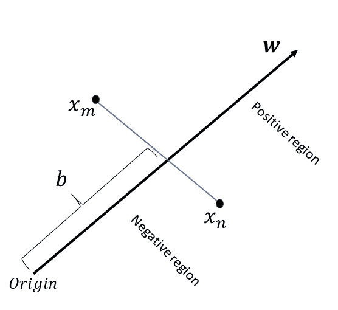

从侧面看的分离超平面(图片由作者提供)

此时，你可能会奇怪为什么重量向量， ***w，*** 垂直于平面。对此的一个简单证明就是，想象超平面上的任意两点，然后算出 ***w*** 与平面上两点连接形成的向量的内积为 0。换句话说， ***w*** 和**在超平面上的任何一个**向量的点积将会是 0。当两个向量的内积为零时，那么这两个向量总是正交的。下图以较慢的速度提供了相同的证明。

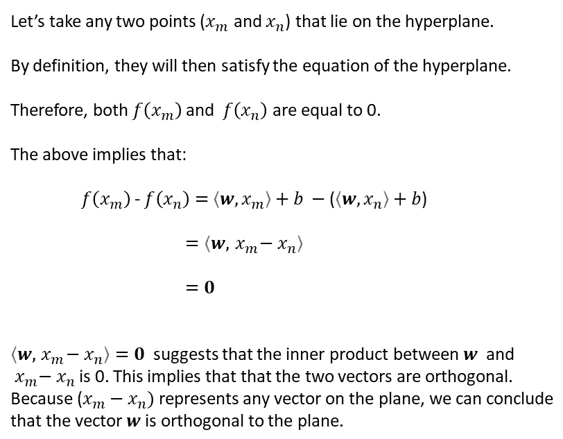

为什么超平面方程中的 ***w*** *与平面正交的证明(图片作者提供)*

**要记住的底线是这样的:**

> 超平面方程由一个矢量和一个偏差项表示。等式中的向量与超平面正交，偏差项表示从原点的偏移量。

# 点到超平面的距离

我们现在几乎完成了。记住 SVM 的目的:找到导致最大利润的*超平面。边缘只不过是最近的类数据点和超平面之间的距离。这正是我们现在要做的:找出点到超平面的距离。*

*让我们考虑一个点， *xₐ* ，属于其中一类。当我们说从一个点到一个平面的距离时，我们指的不是任何距离，而是最短的距离。*

> *想象一下把你的手机放在桌子上方。当我们说手机到桌子的距离时，我们指的是最短的距离， ***的直线距离，而不是*** 的任何其他距离。*

*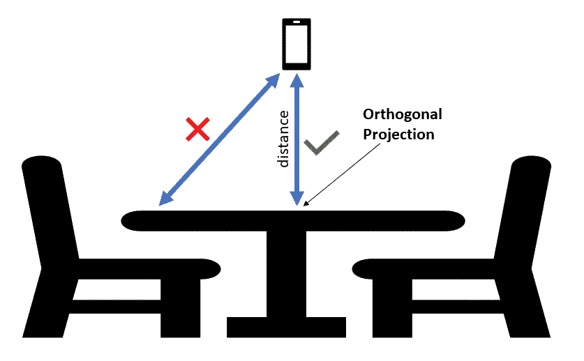*

*正交投影给出了点到平面的最短距离(图片由作者提供)*

> *同样的概念也适用于此。我们感兴趣的是这个点到超平面的最短距离(这也叫点在平面上的正交投影)。在下图中，让我们将此标记为 *x'ₐ* 。*

*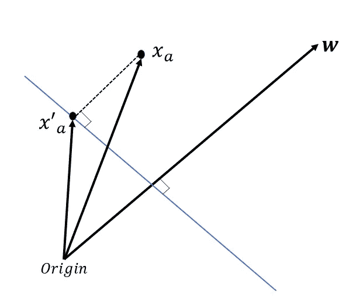*

*点(xₐ)和平面之间距离的概念，说明了正交投影的概念，改编自" [Deisenroth、Marc Peter、A. Aldo Faisal 和 Cheng Soon Ong。*机器学习的数学*](https://github.com/mml-book/mml-book.github.io/tree/master/book) (图片由作者提供)*

**x'ₐ* 和 *xₐ* 之间的矢量可以看作是由 r(边距)缩放的单位正交矢量(从 ***w*** 导出)。使用简单的向量加法和减法，我们得到:*

*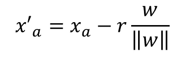*

*等式 1(图片由作者提供)*

*在哪里*

*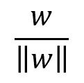*

*作者图片*

*是单位缩放矢量。如果你对向量加减法有点生疏，那么可以把等式(1)看作是从原点到达 x'ₐ的两种等价方式。基于等式(1)的左手边，你可以直接沿着矢量 x'ₐ.走基于等式(1)的右手边，你可以沿着 xₐ走，然后沿着*-r*(***w/| | w | |***)。在这两种情况下，你都将从原点出发，最终到达同一点，x'ₐ.*

# *SVM 方程，最后*

*我们现在几乎完成了。想想下面显示的场景:*

*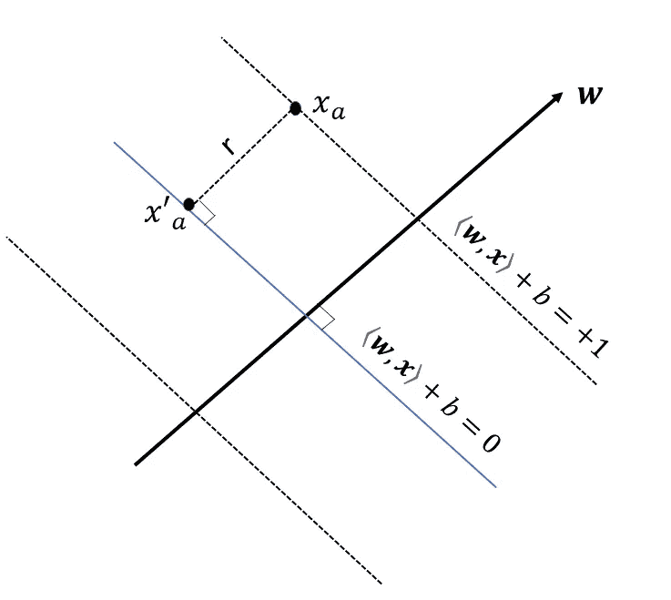*

*帮助推导利润公式的插图，改编自" [Deisenroth、Marc Peter、A. Aldo Faisal 和 Cheng Soon Ong。*机器学习的数学*](https://github.com/mml-book/mml-book.github.io/tree/master/book) (图片由作者提供)*

*让我们假设 xₐ是离超平面最近的点，离正类的距离为 1。给定为 x'ₐ的 xₐ的投影位于超平面上，因此:*

*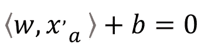*

*等式 2(图片由作者提供)*

*将等式(1)代入等式(2):*

*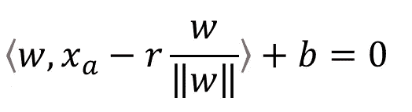*

*等式 3(图片由作者提供)*

*展开等式(3)中的各项并重新排列，我们得到:*

*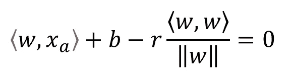*

*等式 4(图片由作者提供)*

*使用非常简单的简化方法(如下所示)，*

*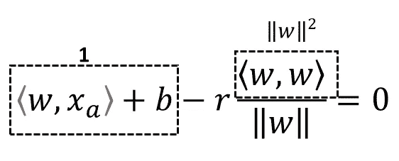*

*方程式 4 的简化(图片由作者提供)*

*我们得到:*

*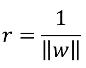*

*用垂直于超平面的向量表示的边距，等式 B(图片由作者提供)*

*因此，SVM 要求是最大化余量(等式 B)并确保点位于正确的一侧，如前面的不等式所示(等式 A)。*

*为了数学上的方便，我们没有最大化等式 B，而是最小化它的倒数(和平方)并添加 1/2 项(这不会改变优化函数，但在计算梯度时只会导致更整洁的解)。因此，目标是:*

**

*硬边界 SVM 方程(图片由作者提供)*

*好了，这些是 SVM 方程，你可以在几本机器学习的书中找到。它包括服从约束的最小化(即找到导致最大余量的 ***w*** 的值)。该约束表示在不等式中，该不等式确保来自正类和负类的数据点都在超平面的正确侧。这是一个约束优化问题，可以用语言乘数法来解决！*

> *“任何领域的专家都曾是初学者”海伦·海丝*

***祝贺你，你向成为数据科学专家又迈进了一步！***

*<https://ahmarshah.medium.com/membership> *