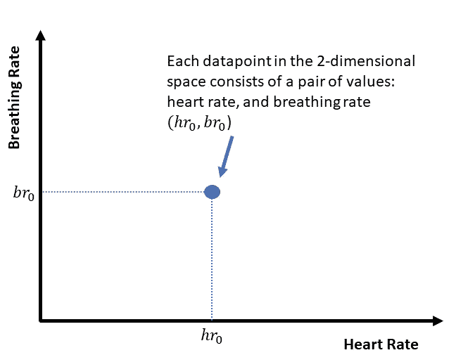
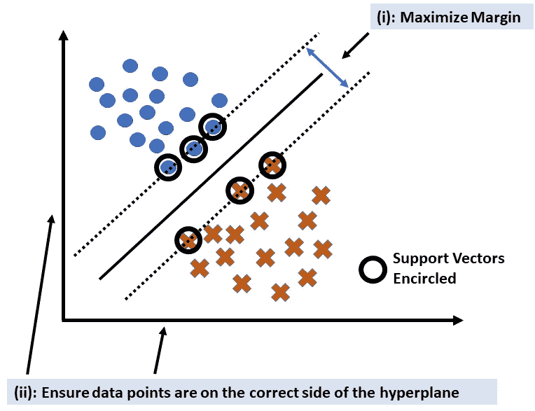

# 理解支持向量机

> 原文：<https://towardsdatascience.com/understand-support-vector-machines-6cc9e4a15e7e?source=collection_archive---------18----------------------->

## 系列的第 1 部分，提供全面介绍的简短文章；不假设任何先验知识

SVM 试图找到最大边界(图片由作者提供)

# 概观

这是 5 篇短文的第 1 部分，全面介绍了支持向量机(SVM)。该系列的目的是帮助你彻底了解 SVM，并能够自信地在你自己的项目中使用它。该序列假设没有机器学习(ML)的先验知识，并且熟悉高中数学足以跟随和理解。

# 大局

如果你是数据科学的绝对初学者，并且还不理解监督学习和非监督学习之间的区别，那么我建议你阅读我之前的文章，该文章假设完全没有先验知识，并使用一个故事来帮助你理解这些术语。

 [## 从数据中学习:鸟瞰

### 一个穴居人，艾萨克·牛顿和一个数据科学家讨论从数据中学习:从史前学会生火…

towardsdatascience.com](/learning-from-data-a-birds-eye-view-4e47bd53be8f) 

在数据科学的生态系统中，SVM 是一种非常受欢迎的算法，可以帮助你解决监督学习中的两种类型的机器学习问题:分类和回归。在分类中，我们希望开发一种算法，可以帮助我们预测一个“类”(从一组离散的可能性中做出的特定预测)。分类的一些例子是垃圾邮件与非垃圾邮件，从图像中识别 0-9 位数字中的任何一个，有病与没病(希望你明白)。在回归分析中，我们预测的是一个“连续的”输出(例如，房子的价格，或者从[大脑信号](https://ieeexplore.ieee.org/abstract/document/8370651)预测的力量)。

> 从概念上讲，回归和分类是相似的。在这两种情况下，我们都有一组数据点或属性(通常称为特征)，然后使用它们来预测输出。如果输出是离散的，我们称之为分类。如果输出是连续的，我们称之为回归。

SVM 可以帮助我们解决分类和回归问题。然而，SVM 背后的数学初看起来可能很可怕，但它有非常清晰的几何直觉(希望一旦你看完这个系列文章，SVM 背后的数学就不会看起来那么可怕)。

# **SVM 是生成性的还是歧视性的？**

概括地说，有两种分类方法。我们可以学习每一类数据的统计属性，然后使用该知识来识别特定数据点属于哪一类。这被称为生成方法，因为我们试图学习每个类的底层概率模型(如果我们有每个类的概率模型，那么我们可以使用该模型来“生成”新的数据点，因此得名生成模型)。

或者，我们可以尝试直接学习可以帮助我们确定特定数据点属于哪个类的决策边界。这是解决分类问题的“判别”分析方法。这相当于将数据点的“空间”划分为不同的区域，其中每个区域属于一个特定的类。

等等，我说的“空间”是什么意思？…

空间只是一个帮助我们表示数据点的概念构造。例如，考虑一个由两个元素组成的数据点:心率和呼吸率。我们可以在二维空间上表示这个数据点，其中一维是心率，另一维是呼吸率。

一个二维空间，其中每个数据点由一对值表示(图片由作者提供)

不一定是心率和呼吸频率。它可以是任何东西，取决于手头的问题。例如，考虑一个使用建筑面积和卧室数量的房价预测问题。在这种情况下，两个维度将是地板面积，并且卧室的数量和 2 维空间中的每个数据点将对应于唯一的数据点。此外，我们并不局限于二维空间，同样的概念可以扩展到更多的维度。

> 需要注意的关键点是:对于一个具有 *n* 个特征的问题，每个数据点在概念上都可以用一个 *n* 维空间来表示。

一个判别模型，如 SVM，试图找到一个边界来帮助我们划分这个 *n* 维空间(其中空间中的每个区域将属于一个特定的类别)。数学上，这个决策边界是一个 *n* -1 子空间，它被称为超平面(例如，如果我们有一个 2 维空间，那么决策边界的超平面将是 1 维空间，一条线；如果我们有一个三维空间，那么决策边界的超平面将是一个二维平面)。

# 我们如何确定决策边界？

问题归结为在一个 n 维空间中找到一个决策边界。从概念上讲，我们通过尝试识别不同的可能决策界限，然后选择最合适的一个来实现这一点。从数学上来说，这相当于找到一个“成本”函数的最小值，当预测很差时，该函数具有高值，而当预测很好时，该函数具有低值。([我之前关于 logistic 回归的文章已经更详细的介绍了成本函数的概念](/understand-logistic-regression-c883e0d84693))。因此，所有的神奇之处就在于我们如何定义“成本”函数。

> 这也是 SVM 不同于另一个著名的分类技术，逻辑回归的地方。在逻辑回归中，数学公式是这样的，我们取**所有的**数据点来寻找能给我们最小成本的决策边界。然而，在 SVM，我们试图找到导致判定边界(超平面)和两个类的最近(到超平面)数据点之间的最大距离(称为余量)的判定边界。(这些最接近的数据点“支撑”着超平面，就像一根柱子支撑着一座建筑)。

# SVM 背后的数学概述

如果 SVM 的数学令人不快，这里是 SVM 文字背后的数学鸟瞰图(我们将在本系列的后续文章中推导相关方程)。如前所述，将 SVM 与其他算法(如逻辑回归)区分开来的真正魔力在于“成本”函数。对于逻辑回归，我们定义一个“凸”的成本函数(这意味着它有一个 U 形和一个单一的最小点；这样的问题很好解决)。对于 SVM，我们有两个要求:

(I):我们希望最大化利润(优化)

(ii):我们希望确保这些点位于决策边界的正确一侧(一个约束)

因此，SVM 问题是一个“约束”优化问题，我们希望最大限度地提高利润(I)，但也确保满足约束(ii)。语言乘数法为我们提供了一种解决约束优化问题的方法(通过将其转化为无约束问题，然后我们可以用微积分来解决；我们将在本系列的后续文章中推导相关方程)。

支持向量机可以公式化为一个约束优化问题，目标是最大限度地增加利润，同时确保点位于超平面的正确一侧(图片由作者提供)

总之，SVM 是一个最大边际分类器。本文提供了一个简单的介绍，并使用一个简单的线性可分案例来说明基本概念。本系列的后续文章将向您展示 SVM 背后的数学是如何从几何直觉中推导出来的，并涵盖数据点不是线性可分的情况。敬请期待！

如果你喜欢读这篇文章，那么你可以考虑阅读下一篇文章，在这篇文章中，SVM 方程是用几何直觉推导出来的。

 [## 理解支持向量机

### 一个初学者友好的 SVM 方程推导与直观的解释。

towardsdatascience.com](/understand-support-vector-machines-5bfe800a0e03)  [## 阅读艾哈迈尔·沙阿博士(牛津)的每一个故事(以及媒体上成千上万的其他作家)

### 作为一个媒体会员，你的会员费的一部分会给你阅读的作家，你可以完全接触到每一个故事…

ahmarshah.medium.com](https://ahmarshah.medium.com/membership)