# 通过克罗内克乘积和线性方程理解李亚普诺夫方程

> 原文：<https://towardsdatascience.com/understand-the-lyapunov-equation-through-kronecker-product-and-linear-equation-bfff9c1e59ab?source=collection_archive---------14----------------------->

李雅普诺夫方程是一类矩阵方程，它在控制理论的许多分支中非常著名，如稳定性分析和最优控制。李亚普诺夫方程的术语来源于俄罗斯数学家亚历山大·李亚普诺夫的名字。他因发展和成就了动力系统的稳定性理论，以及对数学物理和概率论的许多贡献而闻名于世[1]。


亚历山大·李亚普诺夫(1857-1918)。俄罗斯数学家、机械学家和物理学家。

在这篇文章中，我们计划重温李亚普诺夫方程。具体来说，我们将

*   从线性代数角度引入李雅普诺夫方程，
*   利用 Kronecker 积和矩阵向量化建立李雅普诺夫方程和最简单线性方程之间的联系。

# 矩阵计算中的 Kronecker 积

Kronecker 积是矩阵计算中一个著名的运算[2]。虽然 Kronecker 积的概念在线性代数中并不广为人知，但该运算常用于矩阵计算。克罗内克积的基本思想很容易理解。例如，如果我们有两个矩阵 ***A*** 和 ***B*** ，它们的大小分别为 2 乘 2 和 2 乘 3，就像这两个矩阵:

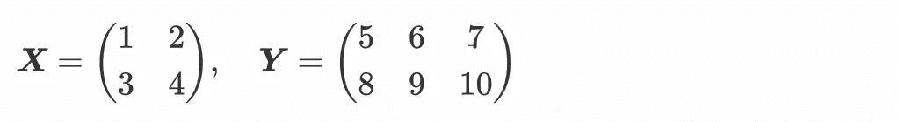

然后根据克罗内克积的定义，我们可以计算克罗内克积如下:

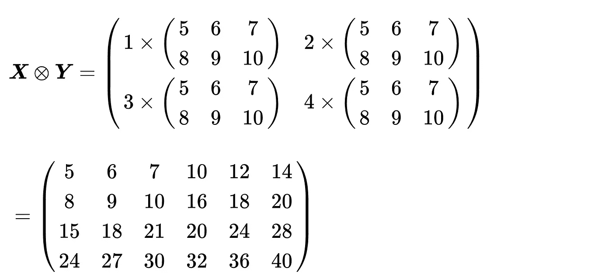

在这个操作中，遵循克罗内克积的思想并不困难。我们可以用矩阵 ***A*** 中的每个元素乘以矩阵 ***B*** 。以这种方式，得到的矩阵的数据大小是 4 乘 6。

在 Python 中，我们可以使用 Numpy 来计算两个矩阵之间的 Kronecker 积，让我们来试试:

```
import numpy as npA = np.array([[1, 2], [3, 4]])
B = np.array([[5, 6, 7], [8, 9, 10]])
print(np.kron(A, B))
```

输出将是:

```
[[ 5  6  7 10 12 14]
 [ 8  9 10 16 18 20]
 [15 18 21 20 24 28]
 [24 27 30 32 36 40]]
```

结果和上面的例子完全一样。

# 重温李亚普诺夫方程

如上所述，李雅普诺夫方程是一种特定类型的矩阵方程。形式上，我们可以把它写成


其中 ***A*** 和 ***W*** 都是已知矩阵，它们是 *n* -by- *n* 。 *n* -by- *n* 矩阵 ***X*** 未知。这里的问题是，如果****W***都已知，如何获得 ***X*** 的解。*

*一种简单的方法是使用克罗内克乘积和矩阵向量化。矩阵向量化用于将给定的矩阵转换成向量。让我们看一个关于矩阵矢量化的简单示例:*

*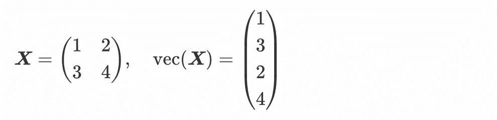*

*这是一个列向量化。*

*事实上，有一个方程可以建立矩阵方程和向量形式方程之间的联系:*

*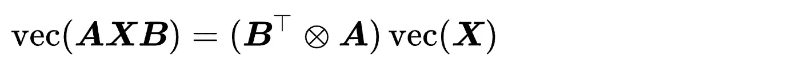*

*这里，方程包括克罗内克乘积和矩阵向量化。*

*因此，我们可以将李亚普诺夫方程改写为*

*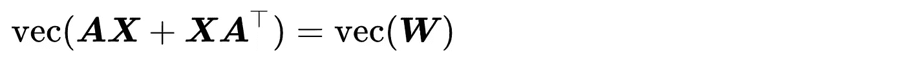*

*和*

*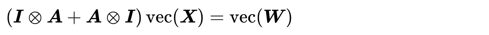*

*其中 ***I*** 表示单位矩阵。*

*我们知道，这确实是一个线性方程问题，其解由下式给出*

*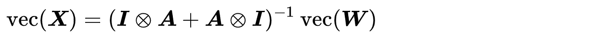*

# *李亚普诺夫方程的一个玩具例子*

*我们可以用 Kronecker 积和矩阵向量化写出李雅普诺夫方程问题的封闭解。在某些情况下，如果我们想把某个方程理解清楚，可以试着解一些简单的例子。这里，第一个冲动是考虑一个简单的例子来说明:*

*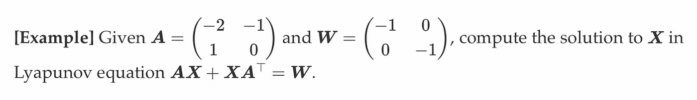*

*在这个例子中，根据克罗内克积的定义(请自行尝试:)，我们有*

*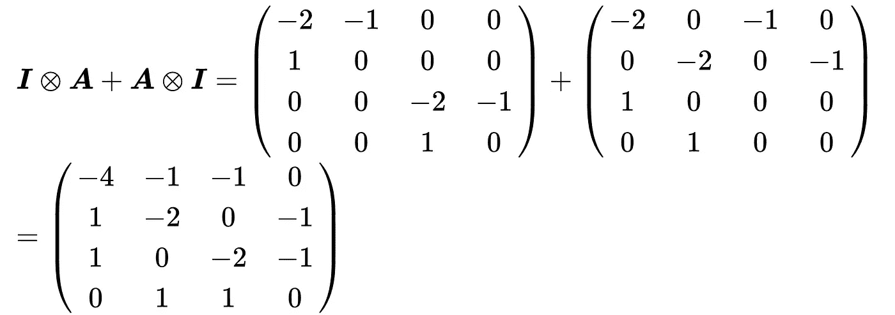*

*根据矩阵向量化的原理，我们有*

*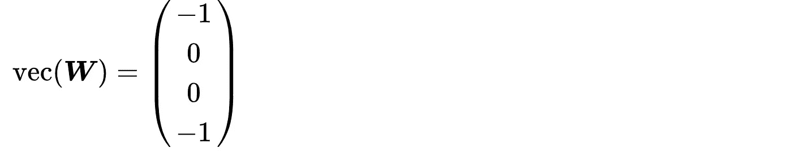*

*因此， ***X*** 的解为*

*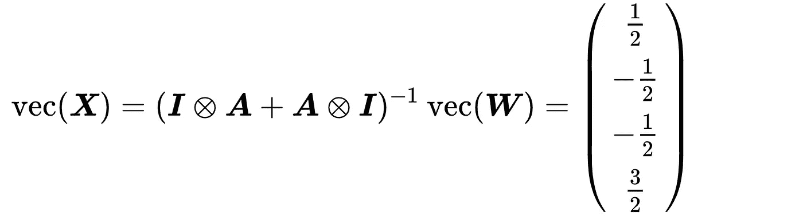*

*以矩阵的形式，它是*

*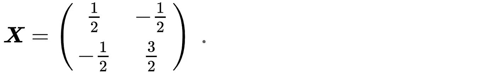*

*如果想用 Python 重现，可以阅读并尝试以下代码:*

```
*import numpy as np

A = np.array([[-4, -1, -1, 0], [1, -2, 0, -1], 
              [1, 0, -2, -1], [0, 1, 1, 0]])
b = np.array([-1, 0, 0, -1])
x = np.linalg.inv(A) @ b*
```

*请自己尝试一下，这样你会更熟悉李亚普诺夫方程。*

# *简短的讨论*

*李亚普诺夫是许多科学和工程领域中重要的矩阵方程之一。还有一些其他类型的矩阵方程，如西尔维斯特方程。使用李雅普诺夫方程的上述解不能产生有效的计算，因为克罗内克乘积和矩阵向量化会产生大的矩阵。上述解决方案的复杂性是 O(n⁶).在实践中，我们可以使用 Bartels-Stewart 算法来求解李雅普诺夫方程，因为该算法的复杂度为 O(n)。*

*这篇博文将是从克罗内克乘积和线性方程的角度理解李雅普诺夫方程的一个良好开端。如果您有任何问题，请随时给我反馈。感谢您的阅读！*

# *参考*

*[1]维基百科上的亚历山大·李亚普诺夫:[https://en.wikipedia.org/wiki/Aleksandr_Lyapunov](https://en.wikipedia.org/wiki/Aleksandr_Lyapunov)*

*[2]维基百科上的克罗内克积:[https://en.wikipedia.org/wiki/Kronecker_product](https://en.wikipedia.org/wiki/Kronecker_product)*