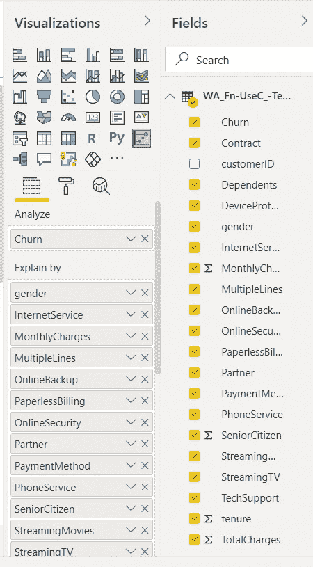
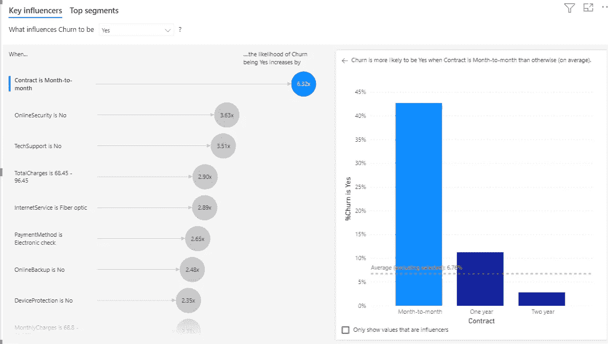
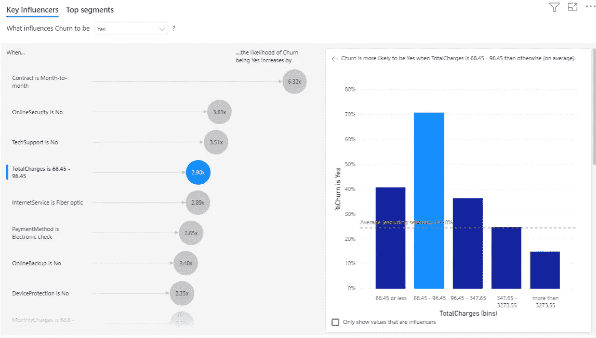
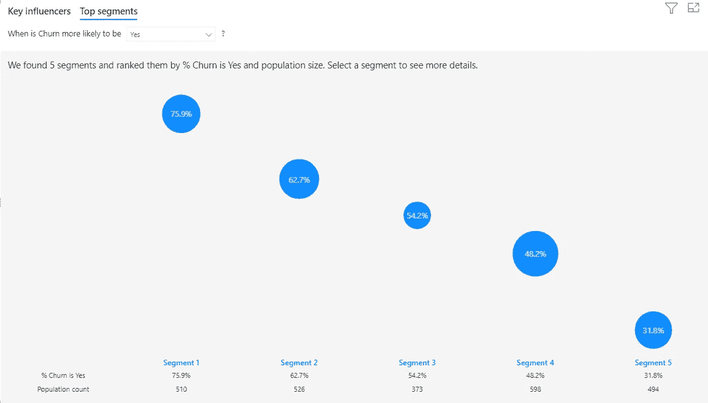
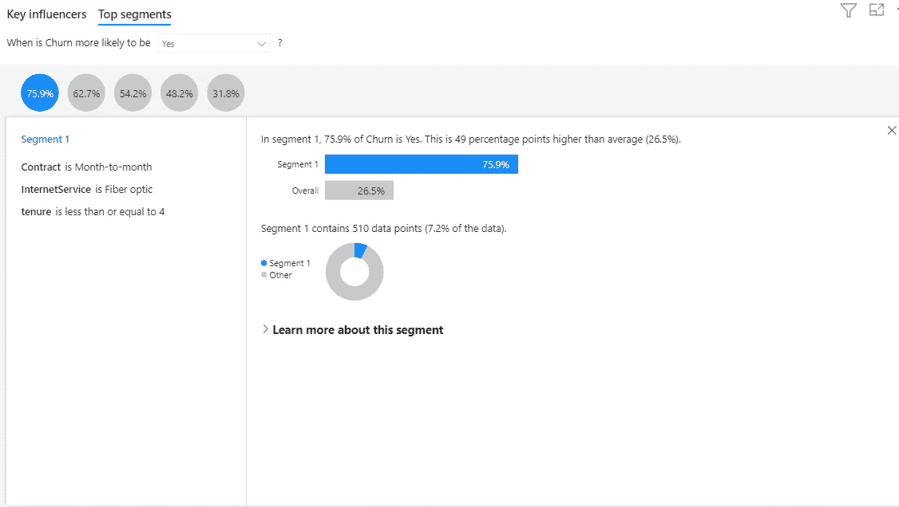

# 只需点击几下鼠标，就能了解是什么推动了您的客户行为

> 原文：<https://towardsdatascience.com/understand-what-drives-your-customer-behavior-in-clicks-9929f9d1b8e7?source=collection_archive---------40----------------------->

## 使用 PowerBI 进行关键驱动因素分析

弗兰基·查马基在 [Unsplash](https://unsplash.com/?utm_source=medium&utm_medium=referral) 上拍摄的照片

如果您是产品经理或营销专业人士，想要了解是什么驱动了特定的客户行为，您只需点击几下鼠标就能找到答案。

是什么驱使你的客户流失？是什么导致了令人惊叹的体验？是什么让他们购买你的产品？简而言之，理解驱动您感兴趣的指标的因素。Power BI 很好地利用了机器学习和人工智能的能力来分析你的数据，**对重要的因素**进行排序，并将它们显示为关键影响因素。它还根据各种因素的组合对客户进行智能**细分**。

好的一面是——你不需要有数据科学方面的专业知识。你所需要做的就是上传或连接你的原始数据，然后点击几下。让我们以 ka ggle-[https://www.kaggle.com/blastchar/telco-customer-churn](https://www.kaggle.com/blastchar/telco-customer-churn)上的电信客户流失数据集为例。目标变量是流失率，即上个月内离开的客户。数据集包括以下信息:

*   上个月内离开的客户—这一列称为流失
*   每位客户已注册的服务—电话、多条线路、互联网、在线安全、在线备份、设备保护、技术支持以及流媒体电视和电影
*   客户账户信息——他们成为客户的时间、合同、支付方式、无纸化账单、每月费用和总费用
*   客户的人口统计信息—性别、年龄范围，以及他们是否有伴侣和家属

让我们试着了解是什么因素导致了客户流失。

**步骤 1:在 PowerBI 中加载数据**

文件->获取数据->文本/CSV

有 7043 行和 19 列具有客户属性，我们将使用它们作为输入因子，最后一列“客户流失”作为输出变量。

**第二步:拖动&放下**

点击插入部分下的关键影响者。将目标变量(此处为变动)拖到“分析”下，将您想要保留的所有因素拖到“解释者”下。在下图中，我将所有 19 个变量作为因子进行了拖动。

**步骤 3:读取结果**

**3.1 了解关键影响者**

您会发现，当您在列表中添加或删除变量时，结果会自动更新。让我们来看看关键的影响者。正如我们在图中看到的，逐月合同是导致客户流失的首要因素。准确地说，与其他合同类型(一年期、两年期)相比，逐月合同的客户 **6.32 更有可能**流失。

第二个最重要的因素是在线安全性，其次是技术支持，其中 3.63 和 3.51 分别是流失率的提升。

到目前为止，您已经看到了不同的分类变量。“合同”是一个**分类变量**，有三个标签:逐月、一年和两年。Power BI 在右窗格中显示了所选变量的更多详细信息，您可以在这里看到每个标签对客户流失可能性的**比较效果。虚线表示平均值。除所选关键因素之外的所有值的变动百分比(合同是逐月的)。**

让我们看看变量连续时的细节——例如总费用。第四个最重要的因素是“总费用为 68.45–96.45”。请注意，PowerBI 已经自动将**装入**连续变量。右窗格中的分布显示总费用和流失之间的关系不是线性的。我发现这个最佳宁滨非常有用。作为保留经理，您可以特别关注总费用为 68.45-96.45 英镑的客户群。

到目前为止，我们探索了“关键影响因素”选项卡，以单独评估每个因素并对其进行排名。但实际上，影响指标的是**个因素的组合**。让我们来探索 PowerBI 的这一强大功能，它通过对关键影响者进行分组来进行细分。

**3.2 提取用户细分**

单击 Top segments 选项卡，查看各种因素的组合如何影响客户流失。根据满足条件的记录的百分比对这些段进行分级。每个区段气泡的大小表示区段中有多少记录(人口计数)。

在我们的例子中，发现了 5 个段。这些细分市场按照细分市场中“流失”的百分比进行排名。例如，细分市场 1 中有 75.9%的客户都曾抱怨过。泡沫越高，低收视率比例越高。选择一个气泡会显示该段的详细信息。让我们理解第一部分。

正如我们所看到的，第 1 部分用户是“按月”订购的用户，拥有光纤，并且是新用户(租期不超过 4 个月)。在这一细分市场中，75.9%的客户发生了流失，比平均水平高出 49 个百分点。段 1 也包含大约 7.2%的数据，因此它代表了人口中可寻址的部分。

您可以点击“了解有关该细分市场的更多信息”,进一步深入了解该细分市场，并查看影响该细分市场的其他因素。同样，我们可以理解创建的其他 4 个细分市场。

**思绪**

我发现这个 PowerBI 工具非常方便快捷。它是完全交互式的，这意味着您可以使用滤镜、切片器和其他视觉效果上的选择来影响结果。毫无疑问，**让**产品和营销策略师能够在没有技术诀窍的情况下利用 **ML/AI** 。在我的组织中，我用 A/B 测试实验数据制作了一个自动化的 PowerBI 仪表板。关键驱动因素分析是其中的重要部分。它有助于产品和营销经理理解是什么驱动他们的实验成功或失败，也有助于优化未来的实验。

不用说——作为一名数据科学家，我仍然喜欢用不同的方法处理原始数据——决策树、分类算法等等。关键驱动因素分析不仅仅是一种技术。如果你有兴趣知道 PowerBI 是如何做到这一点的，这里是我找到的链接-

 [## Power BI 通过 ML.NET |使用关键影响者。网

### 产品与服务 ML.NET 组织规模庞大(1000 多名员工)Power BI 是一款业务分析解决方案…

dotnet.microsoft.com](https://dotnet.microsoft.com/apps/machinelearning-ai/ml-dotnet/customers/power-bi) 

*   *保持连接在*[*LinkedIn*](https://www.linkedin.com/in/deep7/)*和* [*中*](https://vermadeepak.medium.com/)