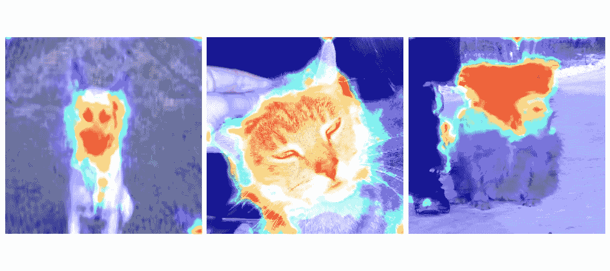
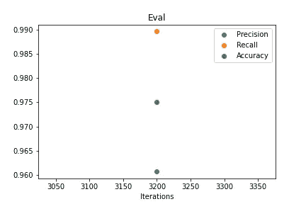
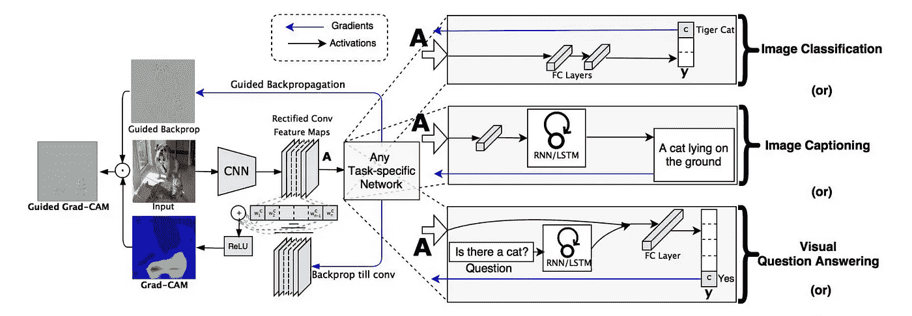
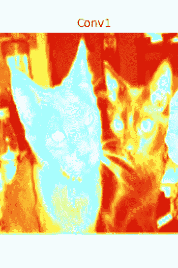
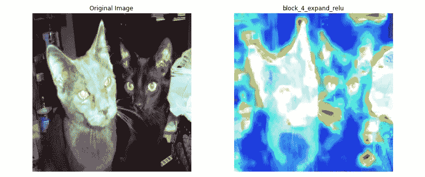
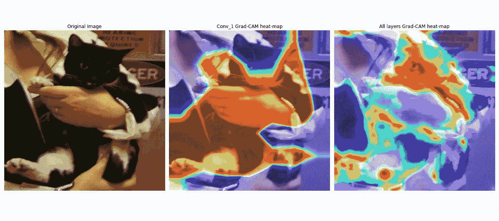
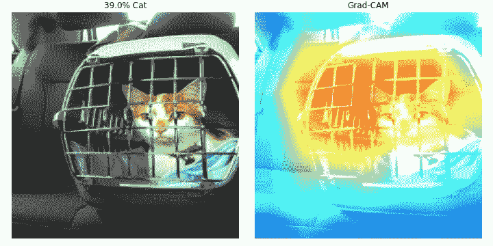
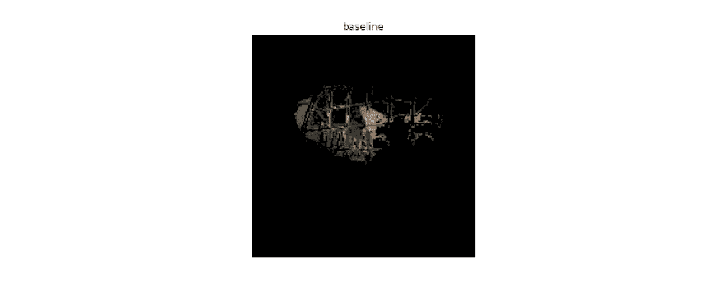
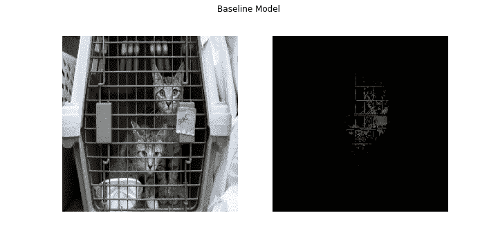
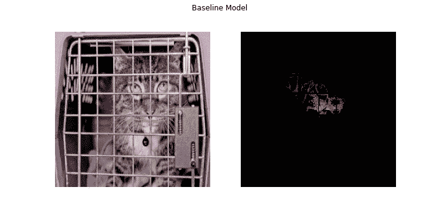

# 使用 Grad-CAM 了解您的算法

> 原文：<https://towardsdatascience.com/understand-your-algorithm-with-grad-cam-d3b62fce353?source=collection_archive---------0----------------------->

## *当它是一个黑匣子时，我们为什么要足够信任 AI 来驾驶汽车，检测疾病，识别嫌疑人？*



Grad-CAM 解读猫狗(图片由作者提供)

# 介绍

*人工智能仅仅是一个黑匣子，我们开始信任它足以驾驶汽车，检测疾病，识别嫌疑人，只是因为大肆宣传吗？*

你可能听说过网飞的纪录片， [*编码偏差*](https://www.codedbias.com/) (这里可以看电影[)。这部电影批评了深度学习算法固有的偏见；特别是他们没有发现深色皮肤和女性的脸。这部电影表明解决问题的办法在政府。“推动美国有史以来第一部针对影响我们所有人的算法偏见的立法。”是深度学习算法本身存在固有的偏见，还是训练数据中的偏见问题？虽然对人工智能监管的需求存在，但解决方案的很大一部分取决于机器学习工程师。我们需要让我们的深度学习算法更具可解释性，找到弱点和偏见的领域，并改进我们的算法。](https://www.netflix.com/watch/81328723?trackId=13752289&tctx=0%2C0%2Cc77bcc95096eda2155aea4834c5e05d7e93362a6%3A32c7d55a6b15cbadcb275c7f53e59f1978b6351f%2Cc77bcc95096eda2155aea4834c5e05d7e93362a6%3A32c7d55a6b15cbadcb275c7f53e59f1978b6351f%2C%2C)

**如何才能理解我们的卷积神经网络(黑盒)在做决策时看到和理解的东西？**

这篇博客文章完全是关于制作视觉解释热图，这将帮助我们理解深度学习算法如何做出决策。在专注于建筑安全和安保的建筑技术初创公司 [Forsight](https://forsight.ai/) ，我们的计算机视觉团队使用视觉解释来改进我们的数据集和模型。点击阅读更多关于我们工作的信息[。现在，我们要探讨的是视觉解释算法: **Grad-CAM** 。](https://medium.com/swlh/construction-feat-tf2-object-detection-api-4465a3937c87#)

在本文中，我们将向您展示如何使用 Grad-CAM 解读一组猫狗图像。您可以轻松地扩展这个示例，并使用它来调试您自己的模型。我们将向您展示如何通过查看模型中早期图层的 Grad-CAM 热图来提高现有文献的准确性和精确度。最后，我们将研究模型的错误，看看 Grad-CAM 如何帮助我们改进模型。让我们跳进来。

*补充*[*Google Colab*](https://colab.research.google.com/drive/1rxmXus_nrGEhxlQK_By38AjwDxwmLn9S?usp=sharing)*笔记本会帮你重现这里制作的热图。请随意复制代码并将其用于您自己的项目！*

# 数据集和模型

在将 Grad-CAM 解释应用于复杂的数据集和任务之前，让我们用一个经典的图像分类问题来简化它。我们将使用来自 [kaggle](https://www.kaggle.com/c/dogs-vs-cats/data) 的高质量数据集对猫&狗进行分类。这里我们有一个包含 37，500 张图像的大型数据集(25，000 次训练& 12，500 次测试)。数据包含两类:猫&狗。这些数据包含了各种背景下的猫和狗，不同的亮度水平，以及参与不同的活动，这将考验我们的视觉解释！

在 [Google Colab](https://colab.research.google.com/drive/1rxmXus_nrGEhxlQK_By38AjwDxwmLn9S?usp=sharing) 笔记本上，你将加载一个预先训练好的模型，它已经可以对猫&狗进行分类。对于那些对模型架构感兴趣的人来说:它由标准化的重新缩放层组成，随后是先前在 COCO 数据集上训练的 [**MobileNetV2**](https://arxiv.org/abs/1801.04381) 层。在基本模型之后，我们包括了一个全局平均池层、一个 10%漏失的漏失层和一个密集预测层。在下图中，您可以看到培训后的所有评估集指标。提醒误报表明猫被错误地归类为狗。同样，假阴性表示狗被错误地归类为猫。一个经过训练的模型已经准备好了，我们可以开始研究这个问题:*它是如何做出决策的？*



模型指标(作者图片)

# 摄像机



Grad-CAM 由 Ramprasaath R. Selvaraju 等人对 arxiv.org 进行概述

***警告，Grad-CAM 可能很难把你的头缠在*上。**

> 梯度加权类激活映射(Grad-CAM)使用流入最终卷积层的任何目标概念(比如分类网络中的“狗”或字幕网络中的单词序列)的梯度来产生粗略的定位图，该定位图突出显示图像中的重要区域以预测概念。

[该技术](https://arxiv.org/abs/1610.02391)在通用性和准确性方面比以前的方法有所改进。这很复杂，但幸运的是，输出很直观。从高层次来看，我们将一幅图像作为输入，并创建一个模型，该模型在我们想要创建 Grad-CAM 热图的层被切断。我们附加完全连接的层用于预测。然后，我们通过模型运行输入，获取图层输出和损失。接下来，我们找到我们期望的模型层的输出相对于模型损耗的梯度。从那里，我们采取有助于预测的梯度部分，减少，调整大小，并重新缩放，以便热图可以与原始图像重叠。你可以遵循下面代码中的具体步骤，并在这里查看概述完整数学的学术论文。

```
gradModel = Model(inputs=[model.inputs],outputs=[model.get_layer(layer_name).output,model.output])with tf.GradientTape() as tape: # cast the image tensor to a float-32 data type, pass the # forward propagate the image through the gradient model, and grab the loss # associated with the specific class index inputs = tf.cast(img_array, tf.float32) (convOutputs, predictions) = gradModel(inputs) loss = predictions[:, 0]# use automatic differentiation to compute the gradientsgrads = tape.gradient(loss, convOutputs)# compute the guided gradientscastConvOutputs = tf.cast(convOutputs > 0, "float32")castGrads = tf.cast(grads > 0, "float32")guidedGrads = castConvOutputs * castGrads * grads# the convolution and guided gradients have a batch dimension# (which we don't need) so let's grab the volume itself and# discard the batchconvOutputs = convOutputs[0]guidedGrads = guidedGrads[0]# compute the average of the gradient values, and using them# as weights, compute the ponderation of the filters with# respect to the weightsweights = tf.reduce_mean(guidedGrads, axis=(0, 1))cam = tf.reduce_sum(tf.multiply(weights, convOutputs), axis=-1)# grab the spatial dimensions of the input image and resize# the output class activation map to match the input image# dimensions(w, h) = (img_array.shape[2], img_array.shape[1])heatmap = cv2.resize(cam.numpy(), (w, h))# normalize the heatmap such that all values lie in the range# [0, 1], scale the resulting values to the range [0, 255],# and then convert to an unsigned 8-bit integernumer = heatmap - np.min(heatmap)denom = (heatmap.max() - heatmap.min()) + epsheatmap = numer / denom
```

配备了 Grad-CAM 生成代码，我们带着预先训练好的模型和验证集去看看*我们的模型对猫&狗*了解多少。

我们开始为模型中的最后一个卷积层 conv 1 创建 Grad-CAM 热图。理论上，该层的热图应该显示被模型分类的对象的最准确的视觉解释。


grad-CAM conv 1 层热图(图片由作者提供)

在梯度数学中，我们捕捉所有通向最后一个卷积层的连续特征图的重要性。我们注意到，虽然热图强调了分类对象，在本例中是一只猫，但它并不十分精确。被强调的区域(红色)包围了猫的区域，但是不太精确地适合猫。该区域包括人的衬衫、人的手和背景的部分。我们知道模型看到了一只猫，但是我们不太确定是这只猫的什么让模型相信这确实是一只猫。我们怎样才能使 Grad-CAM 热图更精确？

你会注意到上面的代码已经被包装在 Google Colab 笔记本的一个函数中，以允许 Grad-CAM 在不同的模型层中重现。让我们使用这个函数来探索早期的模型层。



所有模型层的 Grad-CAM 热图的 GIF(GIF 由作者提供)

这里有很多东西需要消化。当我们研究热图时，模型学习的逻辑开始出现。前 10 层(块 1 到块 3)检测图像中的轮廓和边界。深度方向层不强调对象，而投影和扩展层不强调轮廓。接下来的大约 20 层(块 4 到 11)是检测图像中的概念。Block 4 expand relu 就是一个很好的例子。



block_4_expand_relu 图层的 Grad-CAM 热图(图片由作者提供)

在模型架构的这一点上，定义猫的特征的形状开始从图像中的一般轮廓中脱颖而出。你可以看到猫的胡须、耳朵和眼睛是如何用红色和黄色的阴影强调的，而图像的其余部分是蓝色和绿色的。当我们深入模型的各层时，你可以看到模型是如何推理猫的定义特征如何区分这张图像的。最后的~16 层(块 12 到 16)尝试使用来自最早层的空间信息和最近开发的概念来识别图像中的对象。模型中的最后一层，Conv_1，确实正确地识别了物体的大致区域，但是它没有拾取存在于早期 Grad-CAM 热图中的物体的细微差别。我们用人类的直觉代替 Grad-CAM 的数学，它改进了 Grad-CAM 的结果。

为了合并早期的图层，我们将来自**所有模型图层**的 Grad-CAM 热图平均在一起。你可以在下面看到结果。



Grad-CAM 热图改进(图片由作者提供)

Grad-CAM 热图现在强调猫的脸、眼睛和爪子，不强调人的手臂。总的来说，我们有一个更精确的重点区域来定位猫。我们知道，该模型根据其内在特征将该图像分类为猫，而不是图像中的一般区域。

模型给人印象特别深刻，因为这是一个很难的图像！这个人穿着一件黑白相间的衬衫，和猫的颜色一样。然而，该模型可以区分黑猫脸和黑色人类衬衫。通过全层 Grad-CAM，我们了解了模型的优势。**我们如何使用 Grad-CAM 来了解我们模型的弱点？**

让我们仔细看看下面 7 张被错误归类为狗的猫的图片。


模型误报(图片由作者提供)

我们可以使用 Grad-CAM 热图来为我们提供线索，了解为什么模型在进行正确分类时遇到了困难。当一只猫坐在笼子后面时，这个模型似乎在区分它时遇到了一些困难。我们可以从 Grad-CAM 中看到，模型强调笼子的栅栏，很难找到猫的特征。在 5 和 6 中，猫尾巴是图像中的显著特征。但是从 Grad-CAM 中，我们可以看到模型很难识别这个特征，因为它带有绿色和蓝色的阴影。Grad-CAM 热图所能提供的最明显的例子在# 1 中。模特被猫玩的玩具弄糊涂了。从热图中我们可以看到，模型认为玩具是猫的一部分。这种混乱造成了模型的错误分类。使用这些知识，我们可以找到更多的猫玩玩具的例子，并将其包含在我们的数据集中，这将有助于我们的模型学习和改进。

**改进模型**

注意到我们的模型在笼子方面有问题，我们从 google images 中拿出了一些更具体的例子；特别是运输板条箱。



这个模型在运输工具上有问题(图片由作者提供)

从 grad-CAM 热图上的红色区域可以看出，模型关注的是猫周围的运输箱，而不是猫本身，这导致了错误的分类。当猫在运输板条箱中时，我们如何帮助模型区分它们？

我们从谷歌图片中创建了一个补充数据集，包括运输板条箱中的猫和狗。使用[相册](https://albumentations.ai/) *，*我们用额外的图像增强来增强数据集。有了我们需要的数据，我们开始实验。我们用原始数据集创建了一系列模型，并添加了 25%、50%、75%和 100%的补充运输板条箱数据集。在我们实验的每一次迭代中，我们都回到 Grad-CAM，看看模型是否在原始图像上调整了它的重点区域。

为了查看模型真正锁定的位置，我们创建了一个遮罩，使用阈值来捕捉 Grad-CAM 中最强烈的(红色)区域。然后，我们使用蒙版分割出原始图像中最重要的像素。



随着我们从扩充的集合中添加数据，模型得到了改进

正如您从上面的过滤图像中看到的，随着我们从补充数据集向训练数据集添加更多图像，模型的焦点从板条箱转移到猫的面部和特征。而且不需要很长时间，模型就开始得到正确的分类！当模型在原始数据集加上仅 25%的补充运输器板条箱数据集上训练时，模型指定上面的图像是猫的概率为 90%。

使用同样的实验，我们观察了笼子里的猫的其他图像，看看我们是否可以在模型焦点中找到相同的进展。下面是一些突出的例子。



作者 GIF



作者 GIF

# 结论

在这篇博客文章中，我们希望使用 Grad-CAM 为卷积神经网络可视化解释提供一些有用的见解和工具。在猫和狗的帮助下，我们探索了一个模型如何区分类别。通过考虑模型所有层的热图，我们改进了最终卷积层的 Grad-CAM 结果。我们用 Grad-CAM 瞄准了模型中的偏差和弱点。最重要的是，我们使用 Grad-CAM 来改进我们的算法。机器学习是一个迭代过程，我们的模型永远不够好。我们希望这里介绍的技术将有助于在整个改进过程中提供更多的透明度，并在模型中建立更多的信任。在 Forsight，我们使用 Grad-CAM 热图来识别模型中的错误重点区域。

为了帮助 ML/AI 爱好者，以及任何有兴趣帮助解决这个问题的人，我们创建并分享了一个 [Google Colab](https://colab.research.google.com/drive/1rxmXus_nrGEhxlQK_By38AjwDxwmLn9S?usp=sharing) 笔记本，它让你能够摆弄和制作我们在这篇博客中展示的 Grad-CAM 热图。

**如果你对这个话题感兴趣，并且你愿意致力于深度学习算法的解释，请** [**联系我们**](https://forsight.ai/contact/) **。**

# 参考

1.  Ramprasaath R. Selvaraju 等人，2019 年，“Grad-CAM:通过基于梯度的定位从深度网络进行视觉解释”，[https://arxiv.org/pdf/1610.02391.pdf](https://arxiv.org/pdf/1610.02391.pdf)
2.  狗对猫，[https://www.kaggle.com/c/dogs-vs-cats/data](https://www.kaggle.com/c/dogs-vs-cats/data)
3.  马克·桑德勒等人，2019，“MobileNetV2:反向残差和线性瓶颈”，[https://arxiv.org/abs/1801.04381](https://arxiv.org/pdf/1801.04381.pdf)
4.  *编码偏差*，2020，[https://www.codedbias.com/](https://www.codedbias.com/)