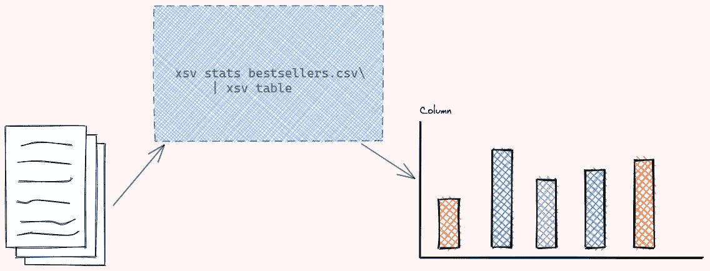
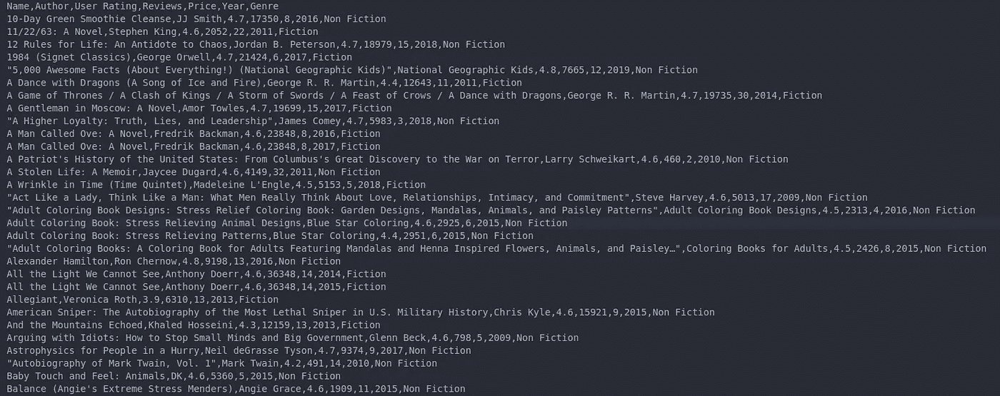

# 了解 CSV 文件从您的终端与 XSV

> 原文：<https://towardsdatascience.com/understand-your-csv-files-from-your-terminal-with-xsv-65255ae67293?source=collection_archive---------18----------------------->

## 用一行代码通过你的终端快速理解你的 CSV 文件



由作者创建

# 动机

你是否曾经试图通过盯着 CSV 文件来对其有一个大致的了解，但最终却没有理解你的文件？您可以打开一个 Jupyter 笔记本来分析您的 CSV 文件，但是仅仅为了理解一个 CSV 文件而打开笔记本是非常耗时的，尤其是当您主要使用 Python 脚本和终端时。

有没有一种方法可以让你在终端上用一行代码快速分析你的 CSV 文件？

```
$ xsv stats bestsellers.csv | xsv table
```

这就是 xsv 派上用场的时候了。

# xsv 是什么？

xsv 是一个命令行程序，用于索引、切片、分析、分割和连接 CSV 文件。我喜欢 xsv，因为它使处理 CSV 文件变得非常快捷和容易。

在这里找到安装 xsv [的说明。在本教程中，我将以 Kaggle](https://github.com/BurntSushi/xsv#installation) 的[亚马逊 2009-2019 年 50 大畅销书为例，向您展示如何操作和分析您的数据。](https://www.kaggle.com/sootersaalu/amazon-top-50-bestselling-books-2009-2019)

下载并解压缩 CSV 文件。将文件名改为`bestsellers.csv`,这样我们更容易操作。

现在，我们的任务是尝试理解我们的 CSV 文件



键入`xsv -h`获取命令。您应该会看到类似这样的内容

```
Commands:
    cat         Concatenate by row or column
    count       Count records
    fixlengths  Makes all records have same length
    flatten     Show one field per line
    fmt         Format CSV output (change field delimiter)
    frequency   Show frequency tables
    headers     Show header names
    help        Show this usage message.
    index       Create CSV index for faster access
    input       Read CSV data with special quoting rules
    join        Join CSV files
    sample      Randomly sample CSV data
    search      Search CSV data with regexes
    select      Select columns from CSV
    slice       Slice records from CSV
    sort        Sort CSV data
    split       Split CSV data into many files
    stats       Compute basic statistics
    table       Align CSV data into columns
```

# 快速浏览一下你的数据

要获得 10 条数据记录的随机样本，请使用

```
$ xsv sample 10 bestsellers.csv
```

输出:

输出难以阅读。让我们通过添加`xsv table`来美化输出

```
$ xsv sample 10 bestsellers.csv | xsv table
```

现在输出看起来更容易阅读了！

我们可能只是想看看书名、作者、用户评分和价格来决定我们应该买哪本书。要选择特定的列，使用`xsv select col1,col2`

```
$ xsv sample 10 bestsellers.csv | xsv select Name,Author,'User Rating',Price | xsv table
```

如果您喜欢每行查看一个字段，请使用`xsv flatten`而不是`xsv table`

```
$ xsv sample 2 bestsellers.csv | xsv flatten
```

# 查看统计数据

我们总共有多少记录？让我们用`xsv count`算出来

```
$ xsv count bestsellers.csv
550
```

我们总共有 550 行数据。我们还想获得数据的统计(例如，平均用户评级是多少)。我们怎么才能找到呢？

我们可以使用`xsv stats`来查看统计数据，比如总和、最小值、最大值、平均值和标准偏差

```
$ xsv stats bestsellers.csv | xsv table
```

酷！我们在 0.010 秒内创建了一个汇总表！但是，如果我们只关心用户评级的统计数据呢？我们可以使用`xsv search`选择相关的行

```
$ xsv stats bestsellers.csv | xsv search "User Rating" | xsv table
```

如果我们只想提取用户评分的平均值，我们可以使用`xsv select`

```
$ xsv stats bestsellers.csv | xsv search "User Rating" | xsv select mean | xsv table
```

注意`xsv search`用于选择行，而`xsv select`用于选择列。

# 查找频率

看起来有些书被提到不止一次。让我们找出每本书的频率。使用`--limit number`指定输出数量。

```
$ xsv frequency bestsellers.csv --limit 20| xsv search Name | xsv table
```

我们的数据中有 10 个*美国心理协会出版手册，第 6 版*！怎么会这样

# 过滤数据

xsv 的美妙之处在于我们可以重用同一个命令来执行不同的功能。我们将使用`xsv search -s column string_to_search`在一列中搜索与搜索字符串“美国心理学协会出版手册，第 6 版”匹配的行。

```
$ xsv search -s Name "Publication Manual of the American Psychological Association, 6th Edition" bestsellers.csv | xsv table
```

酷！原来*美国心理协会出版手册，第 6 版*出版于 10 个不同的年份。作者和收视率还是一样的。

# 获取指定范围内的行

您可能不希望获得数据的随机样本，而是希望获得前 10 行。要获得特定范围内的行，使用`xsv slice`。下面是用法

```
$ xsv slice --help
```

如果没有指定范围的开始，那么切片从 CSV 数据中的第一个
记录开始。要获取前 10 行，请使用

```
$ xsv slice -e 10 bestsellers.csv | xsv table
```

要获取从第 2 行到第 10 行的数据，请使用

```
$ xsv slice -s 2 -e 10 bestsellers.csv | xsv table
```

注意`-s`代表`start`，而`-e`代表`end`。

# 排序数据

您还可以基于一列或多列对数据进行排序。要根据列`User Rating`对数据进行逆序排序，请使用

```
$ xsv sort -s 'User Rating' -R bestsellers.csv  | xsv slice -e 10 | xsv table
```

注意`-s`代表`select`而`-R`代表`reverse`。

正如标题中所承诺的，我们在一行代码中得到我们想要的东西！

# 结论

恭喜你！您刚刚学习了如何使用 xsv 操作和分析您的 CSV 文件。如果您不记得上面显示的命令，只需使用`xsv --help`或`xsv <command> --help`，如`xsv search --help`。

即使 xsv 不能取代其他复杂的特性工程方法，如果您只想从终端快速分析您的 CSV 文件，xsv 是一个不错的选择！

我喜欢写一些基本的数据科学概念，并尝试不同的算法和数据科学工具。你可以在 LinkedIn 和 T2 Twitter 上与我联系。

星[这个回购](https://github.com/khuyentran1401/Data-science)如果你想检查我写的所有文章的代码。在 Medium 上关注我，了解我的最新数据科学文章，例如:

</3-python-tricks-to-read-create-and-run-multiple-files-automatically-5221ebaad2ba>  </supercharge-your-python-string-with-textblob-2d9c08a8da05>  </timing-the-performance-to-choose-the-right-python-object-for-your-data-science-project-670db6f11b8e>  </prettify-your-terminal-text-with-termcolor-and-pyfiglet-880de83fda6b> 