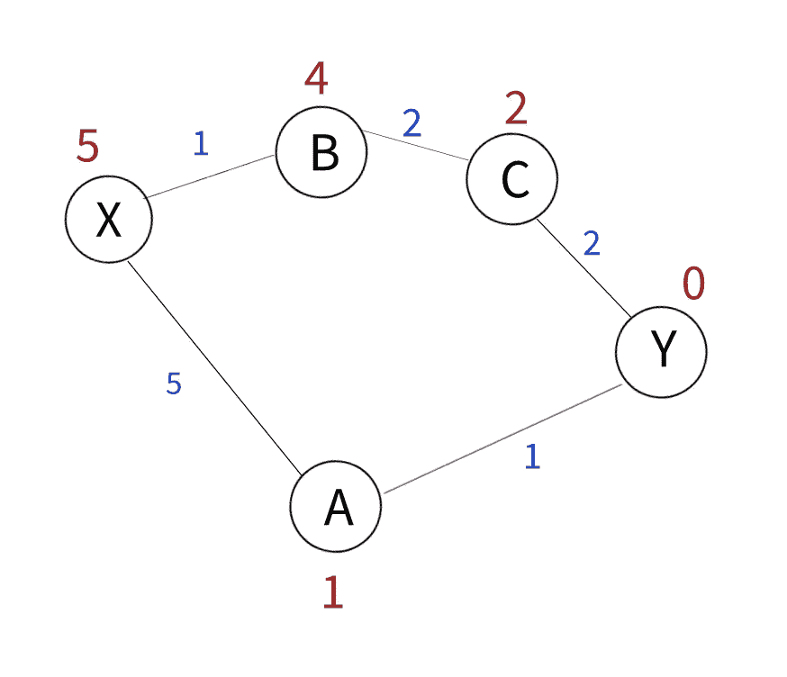
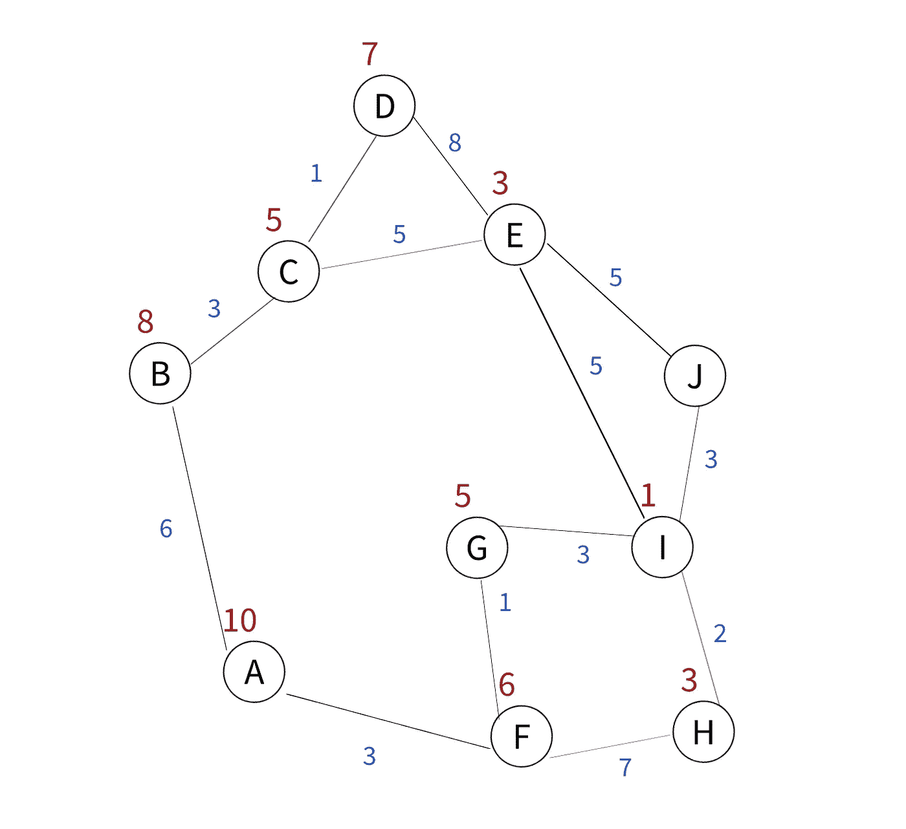
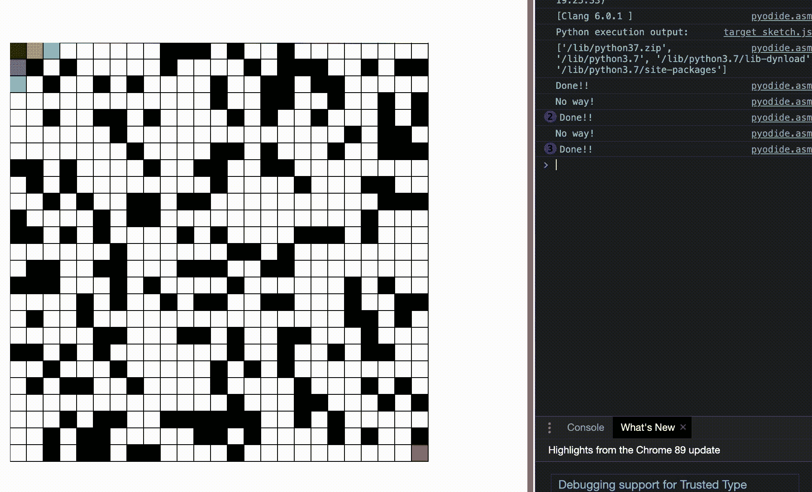

# 理解 A*路径算法并使用 Python 实现

> 原文：<https://towardsdatascience.com/understanding-a-path-algorithms-and-implementation-with-python-4d8458d6ccc7?source=collection_archive---------7----------------------->

*a*算法是最有效的路径查找算法之一，用于查找两点之间的最短路径。它由彼得·哈特、尼尔斯·尼尔森和伯特伦·拉斐尔于 1968 年首次出版。虽然它最初可以被看作是 T2·迪杰斯特拉算法的扩展，但它已经成为今天最常用的寻路算法之一。*


Via [Pixabay](https://pixabay.com/photos/forest-wood-log-nature-brown-tree-1500482/)

A*算法基本上通过计算起始节点和结束节点之间所有其他节点的位置来达到最优结果。此外，由于启发式函数[2]，它比 Dijkstra 的算法更快。

f(n) = g(n) + h(n)

f(n):计算出的路径总开销

g(n):第一个节点和当前节点之间的路径成本

h(n):启发式函数

如果我们想使用上面的函数找到图 2 中的最短路径；



图二。样本路线

假设我们试图从点 X 到达点 y，由于点 X 没有被移动到不同的节点，g(n)成本没有发生，其值为 0。这个点的启发值是写在红色节点上的值 5。在这样的问题中，启发值通常是当前节点和期望节点之间的空中距离。从 x 点到 A 点有两个点
在去 A 点的情况下，g(n) = 5(路径代价)，因为它移动到了一个新的节点。试探被设置为 h(n) = 1。发现 A 点的 f(n)值为 5+1 = 6。如果我们想用这种方法找到所有点的 f(n)值，

X— A => g(A) + f(A) = 5 + 1 = 6，

A — Y=> g(Y) + f(Y) = 6+ 0= 6，

X— B => g(B) + f(B) = 1+ 4= 5，

B — C => g(C) + f(C) = 3+ 2= 5，

C — Y=> g(Y) + f(Y) = 5 + 0= 5，

如上面简单的例子所示，最短路径是 X-B-C-Y 路线。这条路的成本是 5 个单位，而备选的 X-A-Y 路线的成本是 6 个单位。一旦我们完全理解了如何使用上述等式，就可以更详细地研究图 3 中的例子。



图 3。示例路线 v2

假设我们想从节点 j 到达节点 A。有 2 个点(B 和 F)，可以从点 A 到达。计算间接费用，我们得到 f(B) = 8 + 6 = 14，f(F) = 3+6 =9。因为最小成本在 F 点，A*算法从这里继续。f 点有 2 条路径，f(G) = 4 +5 = 9，f(H) = 10 + 3 = 13。因为最小成本在 g 点，我们可以从那点开始。然后，沿着 I 和 J 节点，我们得到 f(I) = 7 + 1 = 8，f(J) = 10。由于转到 F 节点后得到的所有值都小于 f(B)节点，所以没有返回到 B 节点。但是在不同的场景下，我们假设在节点 F 和 G 之后 f(I)大于 F(B)(F(I)> 14)。在这种情况下，根据 A*算法，该过程在这里被中断，并且路径继续到 B 节点。这里，一旦 f(C) > f(I)，路径确定过程再次从 I 节点继续。

## 用 Python 实现

以下所有代码均可从[https://github . com/ademakdogan/Implementation-of-A-Algorithm-Visualization-via-Pyp5js-](https://github.com/ademakdogan/Implementation-of-A-Algorithm-Visualization-via-Pyp5js-)获得

首先，创建网格结构。这里的一些节点被标记为障碍。然后确定开始和结束节点，并使用 A*算法[3]找到这两点之间的最短路径。该算法的工作逻辑基本上基于两个名为 open_set 和 closed_set 的列表。虽然存在可以在 open_set 中处理的节点，但是存在在 closed_set 中处理的节点路径，因此不应该重复(在一些方法中，障碍也被直接扔进 closed_set 列表中，而在一些方法中，它可以被添加为作为对象产生的每个节点的合格属性之一。).作为各种过程的结果，这些列表被填充和清空，并到达最终结果。

所有阶段的伪代码都可以在[维基百科](https://en.wikipedia.org/wiki/A*_search_algorithm)上查看。



图 4。A*算法示例- [链接](https://github.com/ademakdogan/Implementation-of-A-Algorithm-Visualization-via-Pyp5js-)

## 开源代码库

图 4 显示了 A*算法的 python 实现。Pyp5js 库被用来可视化这项工作。此外，A*算法可以根据要具体给出的障碍列表、起始和结束节点的坐标以及网格结构的大小来工作。因此，[这个项目](https://github.com/ademakdogan/Implementation-of-A-Algorithm-Visualization-via-Pyp5js-)也可以用来对抗特定的问题。

```
python AStar.py -c 25 -r 25 -s 1 -q 3 -e 23 -t 21 -l True
```

因此，

```
The way found!!!
23 20
23 19
23 18
23 17
23 16
23 15
23 14
23 13
23 12
23 11
23 10
23 9
23 8
23 7
23 6
23 5
23 4
23 3
22 3
21 3
20 3
19 3
18 3
17 3
16 3
15 3
14 3
13 3
12 3
11 3
10 3
9 3
8 3
7 3
6 3
5 3
4 3
3 3
2 3
1 3
```

## Pyp5js

Pyp5js 是一个在浏览器上可视化 python 代码的框架。它支持通过 Python 的 Transcrypt 使用 p5.js javascript 库。完成必要的安装后，只需使用以下命令运行即可。

```
$ SKETCHBOOK_DIR**=**'~/my-custom-sketchbook' pyp5js serve
```

之后，通过 [http://localhost:5000/](http://localhost:5000/) 访问接口部分进行必要的配置设置。在指定的文件夹(SKETCHBOOK_DIR)中，根据与项目名称同名的 python 文件中的代码执行操作。如果想详细考察这个项目，可以去 https://berinhard.github.io/pyp5js/的[看看。](https://berinhard.github.io/pyp5js/)

因此，A*算法是最常用的路径查找算法之一。本文讨论了该算法的工作原理及其 python 编码。所有代码都可以在 [github](https://github.com/ademakdogan/Implementation-of-A-Algorithm-Visualization-via-Pyp5js-) 找到。pyp5js 库用于可视化算法。在接下来的文章中，将讨论不同路径确定算法与 A*算法的比较。

**Github:**[https://github.com/ademakdogan](https://github.com/ademakdogan)

**领英:**[https://www.linkedin.com/in/adem-akdo%C4%9Fan-948334177/](https://www.linkedin.com/in/adem-akdo%C4%9Fan-948334177/)

# 参考

[1]哈特，体育；新泽西州尼尔森；拉斐尔，B. (1968)。“启发式确定最小成本路径的形式基础”。IEEE 系统科学与控制论汇刊。**4**(2):100–107。

[2]曾，w；丘奇，R. L. (2009 年)。[“在真实道路网络上寻找最短路径:A*的情况”](https://zenodo.org/record/979689)。*国际地理信息科学杂志*。23(4):531–543。

[3]赫特兰德，马格努斯·列(2010)， [*Python 算法:掌握 Python 语言中的基本算法*](https://books.google.com/books?id=9_AXCmGDiz8C&pg=PA214) ，Apress，第 214 页，[ISBN](https://en.wikipedia.org/wiki/ISBN_(identifier))[9781430232377](https://en.wikipedia.org/wiki/Special:BookSources/9781430232377)。