# 理解准确性、回忆性、精确性、F1 分数和混淆矩阵

> 原文：<https://towardsdatascience.com/understanding-accuracy-recall-precision-f1-scores-and-confusion-matrices-561e0f5e328c?source=collection_archive---------11----------------------->

## 这篇文章还包括显示你的困惑矩阵的方法


艾米丽·莫特在 [Unsplash](https://unsplash.com/s/photos/confusion?utm_source=unsplash&utm_medium=referral&utm_content=creditCopyText) 上的照片

# 介绍

**准确度、召回率、精确度和 F1 分数**是用于评估模型性能的指标。尽管这些术语听起来很复杂，但它们的基本概念非常简单。它们基于简单的公式，很容易计算。

本文将对以下每个术语进行讨论

*   说明
*   为什么相关
*   公式
*   不用 sklearn 计算
*   使用 sklearn 来计算它

在教程的最后，我们将讨论混淆矩阵以及如何呈现它们。我在文章末尾提供了 google colab 的链接。

# 数据📈

让我们假设我们正在分类一封电子邮件是否是垃圾邮件

我们将有两个数组，第一个数组将存储实际值，而第二个数组将存储预测值。这些预测值是从分类器模型中获得的。模型的类型并不重要，我们感兴趣的是模型做出的预测。

```
# Actual Value
labels = [1, 0, 0, 1, 1, 1, 0, 1, 1, 1]# Predicted Value
predictions = [0, 1, 1, 1, 1, 0, 1, 0, 1, 0]
```

**0** -电子邮件**不是**垃圾邮件(负面)

**1** -电子邮件**是**垃圾邮件(阳性)

# 关键术语🔑

## 真正积极的➕ ➕

当标签为正时，我们的预测值也为正时，就会出现这种情况。在我们的场景中，当电子邮件是垃圾邮件并且我们的模型也将其分类为垃圾邮件时。

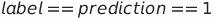

真正的条件

```
TP = 0
for i in range(0,len(labels)):
    if labels[i] == predictions[i] and labels[i] == 1:
       TP+=1
print("True Positive: ", TP) # 3
```

## 假阳性➖ ➕

当标签为负，但我们的模型预测为正时，就会出现这种情况。在我们的场景中，当电子邮件不是垃圾邮件，但我们的模型将其归类为垃圾邮件时。

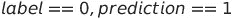

假阳性的条件

```
FP = 0
for i in range(0,len(labels)):
    if labels[i] == 0 and predictions[i] == 1:
       FP+=1
print("False Positive: ", FP) # 3
```

## 真阴性➖ ➖

这类似于真正，唯一的区别是标签和预测值都是负的。在我们的场景中，当电子邮件不是垃圾邮件并且我们的模型也将其分类为非垃圾邮件时。

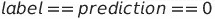

真阴性的条件

```
TN = 0
for i in range(0,len(labels)):
    if labels[i] == predictions[i] and labels[i] == 0:
       TN+=1
print("True Negative: ", TN) # 0
```

## 假阴性➕ ➖

当标注为正时，但预测值为负时，会出现这种情况。在某种程度上，与假阳性相反。在我们的场景中，当电子邮件是垃圾邮件，但我们的模型将其分类为非垃圾邮件。

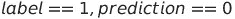

假阴性的条件

```
FN = 0
for i in range(0,len(labels)):
    if labels[i] == 1 and predictions[i] == 0:
       FN+=1
print("False Negative: ", FN) # 4
```

## 正确的预测💯

这种情况的唯一条件是标签和预测值相同。在我们的例子中，当模型将垃圾邮件分类为垃圾邮件，将非垃圾邮件分类为非垃圾邮件时。

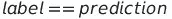

正确预测的条件

正确的预测也可以计算为真阳性和真阴性的总和


计算正确的预测

```
CP = 0
for i in range(0,len(labels)):
    if labels[i] == predictions[i]:
       CP+=1
print("Correct Prediction: ", CP) # 3
print(CP == TP + TN) # True
```

## 不正确的预测❎

这种情况的条件是标签和预测值必须不相等。在我们的场景中，错误的预测是当我们的模型将垃圾邮件分类为非垃圾邮件，将非垃圾邮件分类为垃圾邮件。


不正确预测的条件

不正确的预测也可以计算为假阳性和假阴性的总和

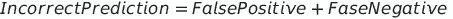

计算不正确的预测

```
ICP = 0
for i in range(0,len(labels)):
    if labels[i] != predictions[i]:
       ICP+=1
print("Incorrect Prediction: ", ICP)# 7
print(ICP == FP + FN) # True
```

# 准确(性)🎯

准确度是正确预测与预测总数的比率。这是模型最简单的度量之一。我们必须以模型的高精度为目标。如果一个模型有很高的准确性，我们可以推断该模型在大多数情况下做出了正确的预测。

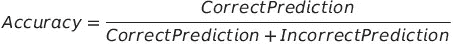

精确度公式

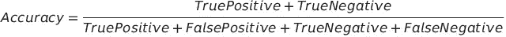

精确度公式

## 没有 Sklearn

```
accuracy = (TP + TN)/(TP + FP + TN + FN)
print(accuracy*100) 
```

## 使用 Sklearn

```
from sklearn.metrics import accuracy_score
print(accuracy_score(labels , predictions)*100)
```

# 回忆📲

## 准确性可能会产生误导的情况

高精度有时会产生误导。考虑下面的场景

```
labels = [0,0,0,0,1,0,0,1,0,0]
predictions = [0 ,0 ,0 ,0 ,0 , 0 ,0 ,0 ,0 ,0]
print(accuracy_score(labels , predictions)*100) # 80
```

与非垃圾邮件相比，垃圾邮件很少出现。因此，label = 0 的出现次数高于 label = 1 的出现次数。在上面的代码中，我们的标签数组包含 8 封非垃圾邮件和 2 封垃圾邮件。如果我们的模型总是将电子邮件分类为非垃圾邮件，它将达到 80%的准确率。这是非常误导的，因为我们的模型基本上无法检测垃圾邮件。

## 计算回忆分数

Recall 计算预测阳性与阳性标签总数的比率。

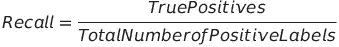

召回公式

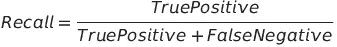

召回公式

在上面的例子中，我们的模型将有 0 个召回，因为它有 0 个真阳性。这告诉我们，我们的模型在垃圾邮件上表现不佳，我们需要改进它。

## 没有 Sklearn

```
recall = (TP)/(TP+FN)
print(recall*100)
```

## 使用 Sklearn

```
from sklearn.metrics import recall_score
print(recall_score(labels,predictions))
```

# 精确🐾

## 回忆分数可能具有误导性的情况

高召回率也可能是高度误导性的。考虑一下我们的模型被调整为总是返回正值预测的情况。它本质上将所有的电子邮件分类为垃圾邮件

```
labels = [0,0,0,0,1,0,0,1,0,0]
predictions = [1,1,1,1,1,1,1,1,1,1]
print(accuracy_score(labels , predictions)*100)
print(recall_score(labels , predictions)*100)
```

尽管上述案例的准确率较低(20%)，但召回率较高(100%)。

## 计算精度

精度是正确的正面预测与正面预测总数的比率

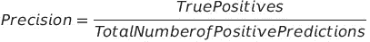

精度公式

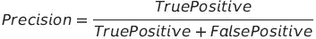

精度公式

在上面的例子中，精度会很低(20%)，因为模型总共预测了 10 个阳性，其中只有 2 个是正确的。这告诉我们，尽管我们的召回率很高，并且我们的模型在正面案例(即垃圾邮件)上表现很好，但在非垃圾邮件上表现很差。

> 我们的准确度和精确度相等的原因是因为模型预测的都是阳性。在现实世界中，模型可以正确预测一些负面情况，从而提高准确性。然而，精度将仍然保持不变，因为它仅取决于正确的肯定预测和总的肯定预测

## 没有 Sklearn

```
precision = TP/(TP+FP)
print(precision)
```

## 使用 Sklearn

```
from sklearn.metrics import precision_score
print(precision_score(labels,predictions)*100)
```

# F1 分数🚗

F1 分数取决于召回率和精确度，它是这两个值的调和平均值。

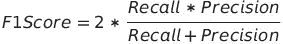

F1 分数公式

我们考虑调和平均值而不是算术平均值，因为我们希望较低的召回率或精确度产生较低的 F1 分数。在我们之前的例子中，我们的召回率是 100%，准确率是 20%，算术平均值是 60%，而调和平均值是 33.33%。调和平均值更低，更有意义，因为我们知道模型很糟糕。

```
AM = (1 + 0.2)/2
HM = 2*(1*0.2)/(1+0.2)
print(AM)# 0.6
print(HM)# 0.333
```

## 没有 Sklearn

```
f1 = 2*(precision * recall)/(precision + recall)
print(f1)
```

## 使用 Sklearn

```
from sklearn.metrics import f1_score
print(f1_score(labels, predictions))
```

# 混淆矩阵❓

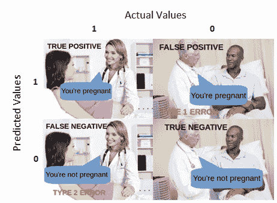

[https://towards data science . com/understanding-mission-matrix-a9ad 42 dcfd 62](/understanding-confusion-matrix-a9ad42dcfd62)

混淆矩阵是表示真阳性、假阳性、真阴性和假阴性数量的矩阵

假设我们正在处理以下数据

```
# Actual Value
labels = [1, 0, 0, 1, 1, 1, 0, 1, 1, 1]# Predicted Value
predictions = [0, 0, 1, 1, 1, 0, 1, 0, 1, 0]
```

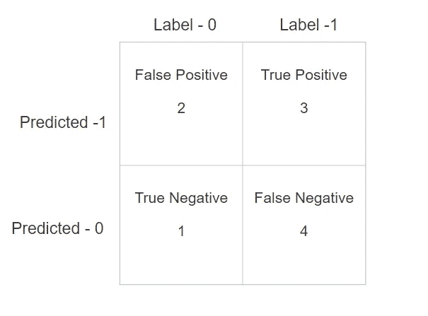

混淆矩阵示例

## 使用 sklearn 计算混淆矩阵

```
from sklearn.metrics import confusion_matrix
confusion = confusion_matrix(labels, predictions)
FN = confusion[1][0]
TN = confusion[0][0]
TP = confusion[1][1]
FP = confusion[0][1]
```

你也可以传递一个参数 **normalize** 来归一化计算出来的数据。

## 将混淆矩阵显示为条形图

```
plt.bar(['False Negative' , 'True Negative' , 'True Positive' , 'False Positive'],[FN,TN,TP,FP])
plt.show()
```

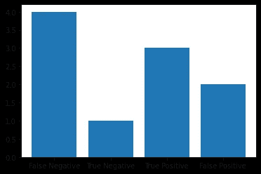

条形图形式的混淆矩阵

## 将混淆矩阵显示为热图

```
import seaborn as sns
sns.heatmap(confusion , annot=True , xticklabels=['Negative' , 'Positive'] , yticklabels=['Negative' , 'Positive'])
plt.ylabel("Label")
plt.xlabel("Predicted")
plt.show()
```

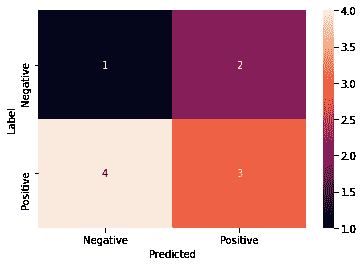

混乱矩阵作为热图

## 使用熊猫显示混淆矩阵

```
import pandas as pd
data = {'Labels' : labels, 'Predictions': predictions}
df = pd.DataFrame(data, columns=['Labels','Predictions'])
confusion_matrix = pd.crosstab(df['Labels'], df['Predictions'], rownames=['Labels'], colnames=['Predictions'])
print (confusion_matrix)
```

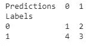

使用熊猫的混淆矩阵

# 使用 Sklearn 生成分类报告👔

```
from sklearn.metrics import classification_report
print(classification_report(labels,predictions))
```

下面是输出

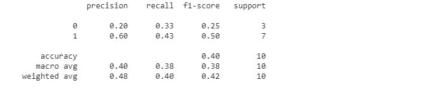

代码输出

# 结论

准确性本身并不能决定一个模型是好是坏，但是准确性与精确度、召回率和 F1 分数的结合可以给出一个关于模型性能的好主意。

## 链接到 Google Colab

<https://colab.research.google.com/drive/1QNKn117M7erJZvJ2BruubTxPKtmrvNM1?authuser=1#scrollTo=ehuf7RJm-PWv>  

我最近用 WordPress 创建了一个博客，如果你能看看的话，我会很高兴的😃

  

查看我的关于偏差、方差以及它们如何与欠拟合、过拟合相关的教程

</bias-variance-and-how-they-are-related-to-underfitting-overfitting-4809aed98b79>  

在 LinkedIn 上与我联系

<https://www.linkedin.com/in/rahulbanerjee2699/>  

*原载于 2021 年 1 月 2 日 https://realpythonproject.com*<https://realpythonproject.com/understanding-accuracy-recall-precision-f1-scores-and-confusion-matrices/>**。**