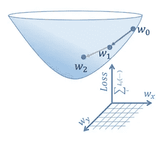
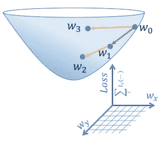
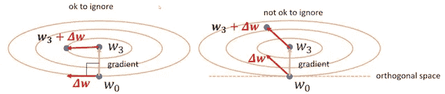
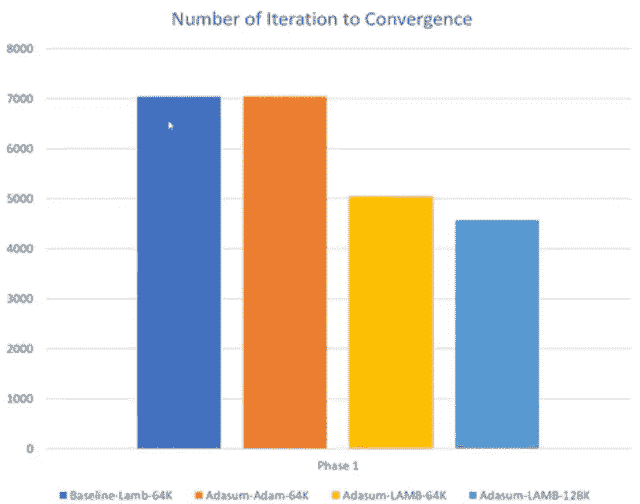

# 理解 AdaSum:用于扩展分布式训练的自适应求和方法

> 原文：<https://towardsdatascience.com/understanding-adasum-adaptive-summation-method-for-scaling-distributed-training-eb1440c5a165?source=collection_archive---------30----------------------->

深度神经网络的数据并行分布式训练将训练数据集划分为 *N* 个子集，其中 *N* 个计算节点中的每一个训练数据的子集。通过设置小批量等于单节点训练中的小批量，我们实质上将有效批量增加了 *N* 倍，从而提高了训练吞吐量。

然而，增加有效批量将对[【1】](https://arxiv.org/abs/1706.02677)中讨论的训练准确性产生负面影响。[1]中提出的解决方案是将学习速率与总批量成比例。然而，它仍然会达到一个上限，在该上限处，即使学习率缩放，训练也不能收敛。

论文[【2】](https://arxiv.org/abs/2006.02924)标题为*自适应求和缩放分布式训练*对造成单节点训练和分布式训练精度差异的一个关键因素给出了非常直观的解释。然后，提出了一种基于下降方向对梯度求和的增强算法，并表明它可以帮助减少 30%的收敛时间。

# 动机示例

图一。两个数据批次上的 SGD。

图二。分布式训练中两个数据批次的 SGD。

图一。显示了对单个节点上的两批数据顺序执行梯度下降的示例。从 *w0* 开始，在第一步执行梯度下降后，损耗移动到*w1*；并在第二步后从 *w1* 移动到 *w2* 。图二。显示了使用相同的批处理大小，但同时在两个训练节点上执行梯度下降的示例。在这种情况下，两个训练节点上的梯度下降都开始于 *w0* 。一步之后，一个节点中的损耗在 *w1* 处结束，另一个节点中的损耗在 *w3* 处结束。在分布式训练中，来自两个节点的梯度的算术平均值被应用于原始权重 *w0* ，并且得到的权重*w2’*被用于更新两个节点上的权重*。*在大多数情况下，这个更新的权重*w2’*将不同于 *w2* ，作者在【2】中认为这是单节点训练和分布式训练之间准确性差异的来源。

论文接着研究了 *w2* 和*w2’*差异最大的情况。他们在图 3 中观察到。以下说明当 *w1* 和 *w3* 为两个正交向量时，可以忽略 *w2* 和*w2’*之差；但当它们沿同一方向时， *w2* 和*w2’*之间的差异非常显著。

图 3。梯度向量求和的不同情况。

基于这一观察，该论文建议我们应该考虑梯度向量之间的相关性，而不是使用简单的 *allreduce* 运算来聚合梯度。作者提出了一种称为 *AdaSum* 的方法，当梯度向量正交时相加，当梯度向量方向平行时执行算术平均。关于这个算法的更多细节，请参考原始论文[2]。

# 结果

作者在[2]中表明，使用 *AdaSum* 运算，BERT 大训练比常规 *Allreduce* 收敛速度快 30%。与 *NCCL 缩减法、*相比，该操作符大约有 10~15%的延迟开销，但这通常只是总步进时间中微不足道的一部分。 *AdaSum* 操作符在 [Horovod](https://github.com/horovod/horovod) 分布式培训库中实现并准备使用。

[1] Priya Goyal 等人，[精确、大型迷你批量 SGD:1 小时训练 ImageNet](https://arxiv.org/abs/1706.02677)(2017)，CVPR 2017。

[2] Saeed Maleki 等人，[自适应求和的缩放分布式训练](https://arxiv.org/abs/2006.02924) (2021)，MLSys 2021。