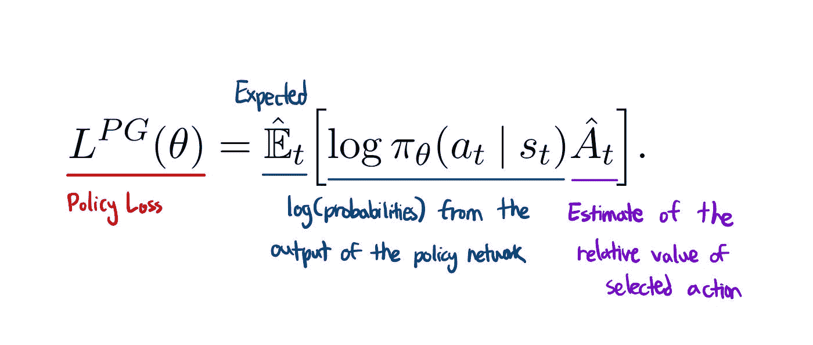
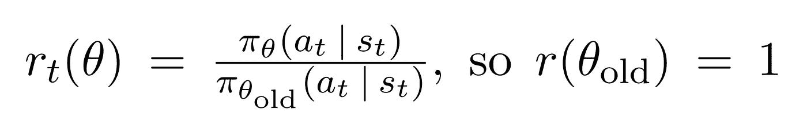
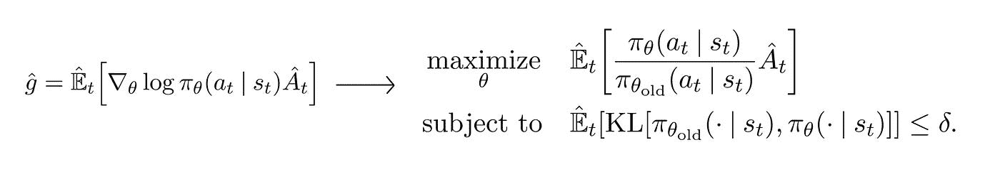
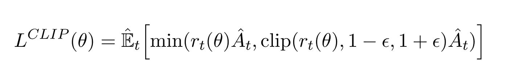
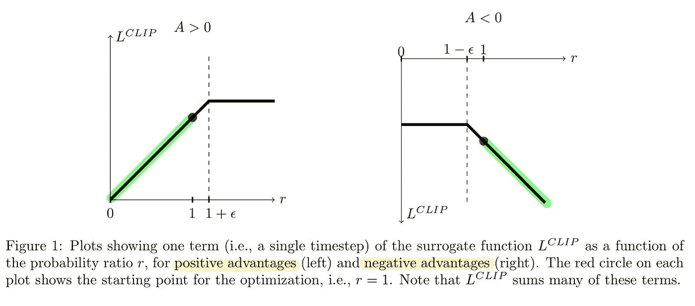
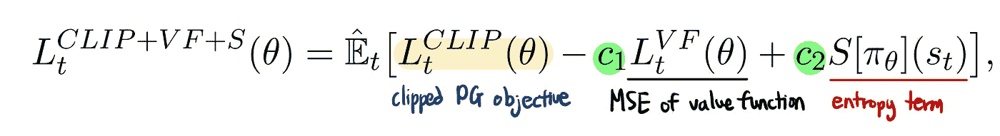
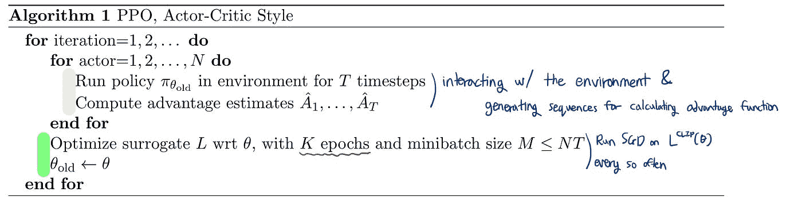

# 了解最接近的政策优化(舒尔曼等人，2017 年)

> 原文：<https://towardsdatascience.com/understanding-and-implementing-proximal-policy-optimization-schulman-et-al-2017-9523078521ce?source=collection_archive---------5----------------------->

## 作为一名初学者，我是如何自下而上地接触 PPO 文件的

近年来，政策梯度方法的研究一直很流行，TRPO、GAE 和 A2C/A3C 等算法显示了优于 Q-learning 等传统方法的最新性能。这个策略梯度/行动者-批评家领域的核心算法之一是 OpenAI 实现的**近似策略优化算法**。

在这篇文章中，我试图做到以下几点:

*   通过对政策梯度方法和信赖域方法(TRPO)提供一个初学者友好的概述来讨论 PPO 背后的动机
*   了解 PPO 的核心贡献:**削减替代目标**和**多时代政策更新**

# 目的

## 破坏性策略更新

我们首先需要理解如下定义的策略梯度方法的优化目标:

政策损失函数(舒尔曼等人，2017 年)

策略 pi 是我们的神经网络，它将来自环境的状态观察作为输入，并建议要采取的行动作为输出。优点是对当前状态下所选动作的相对值的估计，因此 hat 超过 A。它被计算为*折扣奖励(Q) —价值函数*，其中价值函数基本上给出了奖励折扣总额的估计值。在训练时，这个代表价值函数的神经网络将经常使用我们的代理在环境中收集的经验进行更新。然而，这也意味着**值估计会由于网络**引起的变化而非常嘈杂；网络并不总是能够预测该状态的精确值。

将政策产出和优势函数的对数概率相乘，给了我们一个巧妙的优化函数。如果优势为正，意味着代理人在样本轨迹中采取的行动导致了高于平均水平的回报，政策梯度将为正，以增加我们在遇到类似情况时再次选择这些行动的概率。如果优势是负的，政策梯度将是负的，以做完全相反的事情。

在一批收集的经验中不断地执行梯度下降步骤是很有吸引力的，它将经常更新参数，使之远远超出导致**“破坏性大的策略更新”的范围**

## 信任区域策略优化

防止这种破坏性策略更新的方法之一是 [*信任区域策略优化(舒尔曼等人，2015)*](https://arxiv.org/abs/1502.05477) 。在本文中，作者实现了一种算法来限制策略梯度步骤，使其不会偏离原始策略太多，从而导致经常完全破坏策略的过大更新。

首先，我们将 r(θ)定义为当前策略下的动作与先前策略下的动作之间的概率比。

舒尔曼等人，2017 年

给定一系列采样动作和状态，如果特定动作对于当前策略比对于旧策略更有可能，则 r(θ)将大于 1。对于我们当前的策略，当行动的可能性较低时，它将介于 0 和 1 之间。

现在，如果我们将这个 r(θ)乘以前面提到的优势函数，我们会以更易读的格式得到 TRPO 的目标:

(舒尔曼等人，2017 年)

在这个 TRPO 方法中，我们注意到它实际上非常类似于左边的普通政策梯度方法。实际上，这里唯一的区别是 log 运算符被替换为当前策略的动作概率除以前一个策略下的动作概率。优化这个目标函数在其他方面是相同的。

此外，TRPO 添加了 KL 约束，以限制梯度步长使策略远离原始策略。这导致梯度停留在我们知道一切正常的区域，因此命名为“信任区域”然而，已知这个 KL 约束增加了我们的优化过程的开销，这有时会导致不期望的训练行为。

# 近似策略优化(PPO)

## 剪切替代目标

基于上述动机，近似策略优化试图简化优化过程，同时保留 TRPO 的优点。本文的主要贡献之一是删减的替代目标:

删减的替代目标(舒尔曼等人，2017 年)

这里，我们计算最少两项的期望值:*正常 PG 目标*和*削波 PG 目标*。关键部分来自第二项，其中正常的 PG 物镜被 1-ε和 1+ε之间的限幅操作截断，ε是超参数。

由于 min 运算，当优势估计为正或负时，此目标表现不同。

(舒尔曼等人，2017 年)

让我们首先来看看左图，它描绘了积极优势:当选定的行动对结果产生了比预期更好的影响时的情况。在图表中，当 *r* 变得太高或者当在当前政策下比在旧政策下更有可能采取行动时，损失函数变平。我们不想因为走得太远而使动作更新过度，所以我们“剪辑”了目标以防止这种情况，同时用一条平线阻挡渐变。

当优势估计为负时，这同样适用于右图。当 *r* 接近零时，损失函数将变平，这意味着在当前政策下不太可能采取特定行动。

尽管这种方法很聪明，但裁剪操作也有助于我们“撤销”政策的错误。例如，右图中突出显示的部分显示了这样一个区域，在该区域中，最后一个梯度步骤使所选操作更有可能发生，同时也使策略变得更糟，如负优势所示。令人欣慰的是，我们的裁剪操作将友好地告诉梯度走在另一个方向，与我们搞砸的数量成比例。这是唯一一个`min()`里面第一项比第二项低的部分，作为备用方案。最棒的是，PPO 无需计算额外的 KL 约束就能完成所有这些工作。

所有这些想法都可以在最终损失函数中进行总结，将这个删减的 PPO 目标和两个附加项相加:

(舒尔曼等人，2017 年)

c1 和 c2 是超参数。第一项是负责更新基线网络的价值函数的均方误差。第二个术语，可能看起来不熟悉，是一个熵术语，用于确保我们的代理有足够的探索。这个术语将推动政策更自然地运行，直到目标的另一部分开始起主导作用。

## 策略更新的多个时期

最后，让我们一起来看看算法及其并行演员的优点:

PPO 算法(舒尔曼等人，2017 年)

该算法由两个大线程组成:米色线程和绿色线程。米色线程收集数据，计算优势估计值，并为绿色线程提供小批量样本。一个特别之处是:这些是由 *N* 个并行的角色各自独立完成自己的任务。

对样本运行梯度下降的多个时期并不常见，因为存在破坏性的大规模策略更新的风险。然而，在 PPO 的剪切代理目标的帮助下，我们可以利用并行参与者来提高采样效率。

每隔一段时间，绿色线程就会启动，对我们的削波损失函数运行随机梯度下降。又一次特殊拍摄？我们可以在相同的轨迹样本上运行 *K* 个优化时期。在 PPO 之前也很难做到这一点，因为在本地样本上采取大步骤的风险，但 PPO 防止了这一点，同时允许我们从每个轨迹中了解更多。

# 参考

[1] [近端政策优化(舒尔曼等，2017)](https://arxiv.org/abs/1707.06347)

[2] [信任区政策优化(舒尔曼等，2015)](https://arxiv.org/abs/1502.05477)

*最初发表于*

[https://blog . tylertaewook . com/posts/proximal-policy-optimization](https://blog.tylertaewook.com/posts/proximal-policy-optimization)