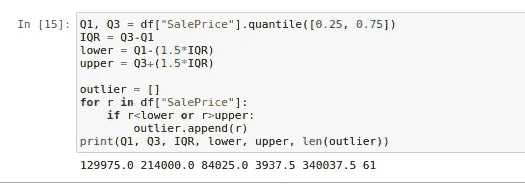
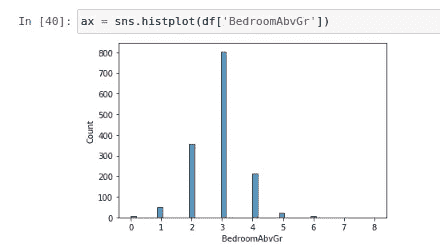

# 理解和解释 Python 中的数据

> 原文：<https://towardsdatascience.com/understanding-and-interpreting-data-in-python-db67b11865a0?source=collection_archive---------18----------------------->

## Python 中的探索性数据分析


弗兰基·查马基在 [Unsplash](https://unsplash.com?utm_source=medium&utm_medium=referral) 上拍摄的照片

作为数据科学家，我们都必须处理大量不同的数据集。要在数据集上拟合任何预测模型，我们需要先了解数据集的复杂性，然后再决定使用哪个预测模型来获得最佳性能。但是，数据集通常很大，手动理解数据集中的每个数据点是不可能的。因此，我们需要一些度量和可视化来帮助我们理解数据的本质，并给我们一个简要的概述。

探索性数据分析(EDA)对数据进行分析和可视化，以从中获取洞察力。它可以被描述为一个总结数据的重要特征以便更好地理解的过程。为了了解 EDA 的过程，我们将使用住房数据集，可在[这里](https://www.kaggle.com/c/house-prices-advanced-regression-techniques/data?select=train.csv)获得。我们将详细了解 EDA 的每个必要步骤，为什么需要它，以及如何实现它。

我们还将通过对数据集执行探索性数据分析来探索数据集。本博客涉及的主要话题如下:

*   统计洞察力
*   删除重复项
*   异常值处理
*   单变量分析的可视化
*   二元分析的可视化

# 统计洞察力

这里我们将分析数据统计，即均值、方差、分位数、唯一元素等。在我开始之前，让我们先看看 python 代码需要的库，以及如何加载数据。

```
import pandas as pd
import matplotlib.pyplot as plt
import seaborn as sns
import numpy as npdf = pd.read_csv("train.csv")
```

为了简要了解数据，我们将检查以下参数:

*   数据集的前 5 行
*   存储在每列中的变量的数据类型。
*   平均值、中间值和其他统计属性，
*   每行中的唯一元素。

要获得前 5 行，请使用以下命令:

```
df.head()
```


作者图片

输出如上图所示。这个函数为我们提供了关于数据集中存在的列以及每一列中存在的值的基本概念。

为了更好地理解每一列中的值的数据类型，我们使用下面的命令。

```
df.info()
```


作者图片

这个列表很大，有 81 列。但我只给出了前 10 列的截图。

下一步是检查数据的统计汇总，我们使用下面的函数。

```
df.describe()
```


作者图片

该函数的输出具有以下形式:

它在列中显示计数、平均值、标准差、最小值、25%百分点值、中值(50%百分点值)、75%百分点值和最大值。这里解释一些不太常见的术语:

*   Count 列中存在的非空值的总数。
*   25%百分位— 25%的数据小于该值
*   50%百分位— 50%的数据小于该值，也与中位数相同
*   75%百分比— 75%的数据小于该值

现在我们已经有了关于每一列的基本信息，让我们看看如何找出数据集中某一列的唯一元素。

```
df["OverallQual"].unique()
```


作者图片

标题为“总体平等”的列只有很少的独特元素。列中的元素是离散的，最大值为 10，这可以从上图中得到验证。

# 删除重复项

所谓重复，我指的是数据集中的两行，每一列都包含相同的值。在数据集中有重复项是不可取的，这通常会导致过度拟合。因此需要移除它们。

```
df.duplicated().sum()
```


作者图片

df.duplicated()提供了一个布尔列表，指示一行是否重复。然后 sum()将给出数据集中重复行的总数。在我们的例子中，它是 0，如图所示。但是如果有重复的行，可以按如下方式删除它们

```
df.drop_duplicates(inplace=True)
```

# 异常值处理

异常值是一般情况下不会出现的极端观察值，只有在非常特殊的情况下才会出现。我们训练的预测模型实际上是用来寻找一般情况下的输入和输出之间的关系，而不是特殊情况。因此，使用异常值来训练这种预测模型可能会导致性能恶化。因此，我们必须消除它们。

找出异常值的标准过程是

*   找到 *Q1* 和 *Q3* 四分位数。
*   将两个列表相减，找出内部四分位数范围( *IQR* )。
*   任何小于*Q1-1.5 iqr*或大于 *Q3+1.5IQR* 的点都被视为异常值。

为了找出异常值，我们将使用“销售价格”列。



作者图片

因此，数据集中出现的异常值总数为 61，我们应该在使用数据集进行训练之前删除它们。

# 处理缺失数据

缺失数据意味着数据集中几乎没有未填充的位置。首先，我们来看看如何找出缺失的数据。

```
df.isnull().sum()
```


作者图片

df.isnull()提供一个布尔数组，然后。sum()给出列中存在的空值的总数。由于有很多列，我不能在这个截图中显示所有的信息。

那么我们如何处理这些丢失的数据呢？这里，我将只讨论包含整数和浮点类型变量的列。如果一个列包含字符串，那么所有这些方法可能都不适用。

*   **Drop —** 我们将删除丢失的值，也就是说，如果特定行中有任何丢失的值，将删除整行。此方法仅适用于缺少值的行数非常少的情况。

```
df.dropna(subset=["BsmtQual"], inplace=True)
```

它将删除列“BsmtQual”包含空值的行。

*   **用统计参数估算—** 用平均值、中值或众数替换缺失值。这里通常使用平均值，但是在这一步之前检查异常值的数量是非常可取的。如果有很多异常值，那么使用中位数更为可取。

```
df["$NA"][df["$NA"].isnull()] = df["$NA"].dropna().mean()
```

将$NA 替换为要用 mean 替换其中缺失值的列名。

*   **插值—** 根据一列对数据集进行排序，“最重要的一列”，这通常是您想要预测的列。然后使用线性插值来填充缺失的值。

# 单变量分析的可视化

单变量分析是分析数据的最简单形式。这里“uni”代表一个变量。因此，在这里我们将看到如何可视化和分析一列数据。我们将讨论以下可视化

*   箱形图
*   柱状图

## 箱形图

箱形图仅用一个数字就包含了大量关于数据的统计信息。


方框图描述(图片由作者提供)

箱线图告诉我们中值、上四分位数、下四分位数、最大值、最小值和异常值，因此涵盖了所有的统计参数。

```
sns.boxplot(df["SalePrice"])
```


作者图片

对于我在这里展示的情况，方框图是水平的。请注意，所示的箱形图在下部区域有异常值。

## 柱状图

直方图显示了变量的频率分布。它将数值数据划分到称为“箱”的桶中，然后计算落入每个箱中的数据点的数量。因此，纵轴实际上代表每个箱中数据点的数量。

我们将可视化数据集中的“BedroomAbvGr”列。



作者图片

上面的直方图基本上表明，在给定的数据集中，大多数房子都有 3 间卧室。

# 二元分析的可视化

双变量分析用于理解数据集中存在的两个或多个变量之间的关系。例如，随着房屋整体质量的变化，分析房价的变化。让我们看看如何直观地理解两个变量之间的关系。我们将要讨论的可视化如下:

*   相关矩阵
*   回归图

## 相关矩阵

相关性用于衡量一个变量相对于另一个变量的变化程度。为了更好地理解这一点，考虑上面的例子。房子的价格会随着整体品质的变化而发生怎样的变化？我们基本上是找到数据集中存在的所有数值变量之间的相关性来构造相关矩阵。


作者图片

混淆矩阵对我们的数据集来说是巨大的，因为有很多变量。白色表示相关值为 1，这意味着这两个变量是相同的。可以看出，对角线是白色的，这是合乎逻辑的，因为对角线值表示元素与其自身的相关性，该相关性将为 1。黑色表示相关值为-1，这意味着两个变量完全相关，但方向相反。也就是说，如果一个值增加，另一个值就会减少，反之亦然。黑色和白色之间的一种特殊颜色表示相关值为 0，这意味着两个变量完全独立。现在，当您重新访问上述相关矩阵时，可以检查浅色块具有正相关值，深色块具有负相关值。在预测“销售价格”时，与“销售价格”相关的绝对值较高的特征是有益的。

## 回归图

它用于理解两个变量之间的关系。它与分析两个变量之间的相关性相同，但它只用于分析两个变量，这与相关矩阵不同。这可以看作是一个正常的图表，我们绘制所有的数据点，然后找到最佳拟合线。

```
sns.regplot(x='BedroomAbvGr',y='SalePrice',data=df)
```


作者图片

这是总体质量与房价的回归图。由于斜率增加，这意味着相关值为正。此外，斜率值越高，表示绝对相关值越大。


作者图片

现在从这两个图表中，我们可以观察到以下情况:

*   房子的整体质量和价格之间的相关性，以及卧室数量和房子价格之间的相关性是正相关的。
*   房屋整体质量与价格的相关性高于卧室数量与房屋价格的相关性。

太激烈了！！

但是现在我们知道一列中有多少异常值，如何识别和删除这些异常值，整个数据中有多少行存在缺失数据，一个变量如何影响另一个变量，哪些特征对于预测来说是最重要的等等。

我希望这篇博客能帮助你理解我们是如何探索数据并从中提取信息的。我建议在找到合适的预测模型之前使用这些技巧，因为每次理解和探索您的数据是至关重要的。

如果您喜欢这些内容，并希望了解数据科学的广阔领域，请关注我们的 [medium](https://medium.com/@AnveeNaik) 。

*成为* [*介质会员*](https://medium.com/@AnveeNaik/membership) *解锁并阅读介质上的许多其他故事。*