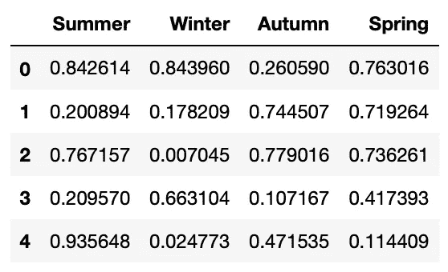

# 理解 Python 中的*args 和**kwargs

> 原文：<https://towardsdatascience.com/understanding-args-and-kwargs-in-python-321937f49c5b?source=collection_archive---------12----------------------->

## 了解如何在 Python 中向函数传递可变数量的参数


照片由[克里斯里德](https://unsplash.com/@cdr6934?utm_source=medium&utm_medium=referral)在 [Unsplash](https://unsplash.com?utm_source=medium&utm_medium=referral) 拍摄

如果您是一名初级 Python 程序员，您可能会遇到带有如下所示参数的函数声明:

```
def do_something(num1, num2, ***args**, ****kwargs**):
```

上面的`*`和`**`操作符允许您向函数传递可变数量的参数。然而，这个特性经常给 Python 程序员带来很多困惑。本文将试图阐明`*`和`**`操作符的用途，以及如何在日常编程任务中使用它们。

# **使用*** 传递可变数量的参数

首先，考虑以下函数定义:

```
def do_something(num1, num2, *args):
    print(num1)
    print(num2)
```

要调用 **do_something()** ，需要传入:

*   两个强制参数，后面是，
*   可选的可变参数数量

让我们试试这个，看看会发生什么。我们可以先这样调用 **do_something()** :

```
# calling the function with two mandatory arguments
do_something(5,6)
```

您现在应该看到:

```
5
6
```

您也可以在前两个参数后传递附加参数，如下所示:

```
do_something(5,6,**7,8,9**)
```

第三个参数向前传递到 **do_something()** 函数中的 **args** 变量中。 **args** 的数据类型为**元组**。因此，您可以在函数中使用一个 *for-in* 循环来提取传入的单个可选参数:

```
def do_something(num1, num2, *args, **kwargs):
    print(num1)
    print(num2)
 **for arg in args:
        print(arg)**
```

因此，您的输出将如下所示:

```
5
6
7
8
9
```

以下对 **do_something()** 函数的调用都是有效的:

```
do_something(5,6,**7**)
do_something(5,6,**7,8**)
do_something(5,6,**7,8,9**)
do_something(5,6,**7,8,9,True**)
do_something(5,6,**7,8,9,True,3.14**)
```

虽然您可以为可选参数传入不同类型的不同参数，但传入相同类型的参数更常见(也更符合逻辑)。例如，您可能有一个名为 **average()** 的函数来计算一组数字的平均值:

```
def average(*args):
    return sum(args) / len(args)print(average(1,2))            # 1.5
print(average(1,2,3))          # 2.0
print(average(1,2,3,4,5))      # 3.0
print(average(1,2,3,4,5, 6.1)) # 3.516666666666667
```

在这种情况下，传入相同类型(数值类型)的参数很有意义。

> 值得一提的是，变量参数的命名并不局限于“ **args** ”。您可以使用自己的变量名来命名它。

# 使用*解包参数

在上一节中，您看到了如何向函数传递可变数量的参数，如下所示:

```
do_something(5,6,**7,8,9**)
```

如果您的可选参数存储在一个**列表**或**元组**中，如下所示:

```
values = (7,8,9)   # tuple
```

在这种情况下，要将 values 变量传递给 **do_something()** 函数，您可以使用`*****`操作符来*解包*值，以便可以将它们传递给函数:

```
do_something(5,6,***values**)
```

`*`操作符也处理列表:

```
values = **[**7,8,9**]** # list
do_something(5,6,*values)
```

# 使用**传入“带关键字的”参数

可变参数的第二种形式对初学者来说稍微有点混乱。考虑以下函数定义:

```
def do_something(num1, num2, ****kwargs**):
```

> **kwargs** 中的 **kw** 代表 **k** ey **w** orded。同样，您可以使用自己喜欢的名称给这个变量命名。

除了传入前两个强制参数之外，现在还可以传入一个可选的“关键字”参数。一个例子可以说明这一点:

```
do_something(5,6,**x=7**)
do_something(5,6,**x=7,y=8**)
```

> 就个人而言，我更喜欢称 x=7 和 y=8 为**键/值**对。

在上面的例子中，您可以通过指定键(`x`和`y`)和它们相应的值(7 和 8)来传递额外的参数。

在这个函数中，关键字对作为一个*字典*被传递给`**kwargs**`。因此，您可以使用 *for-in* 循环提取它们，如下所示:

```
def do_something(num1, num2, ****kwargs**):
    print(num1)
    print(num2)
 **for k,v in kwargs.items():   # get each key/value pair one at a 
        print(k,v)               # time**
```

当然，您也可以提取键，然后像这样提取值:

```
def do_something(num1, num2, **kwargs):
    print(num1)
    print(num2)
 **for k in kwargs.keys():    # retrieve all the keys
        print(k, kwargs[k])    # then get the value based on the key**
```

在任一情况下，输出将如下所示:

```
5
6
**x 7
y 8**
```

# `**kwargs`的用途

关于`**kwargs`的一个常见问题是它的用例。`****kwargs**`在什么情况下有用？考虑以下情况，其中您有一个包含四列的数据帧:

```
import pandas as pd
import numpy as npdf = pd.DataFrame(np.random.randn(5,4), 
                  columns=['Summer','Winter','Autumn','Spring'])
df
```

数据帧看起来像这样:



以熊猫数据为例

假设您被要求编写一个函数，比如说 **fetch_data()，**允许用户从一个或多个单元格包含的值大于某些特定值的列中提取行。例如，您希望从 **Summer** 列中提取值大于 0.5 的所有行。此外，您可能还想从 **Winter** 列中提取值大于 0.2 的行。在这些情况下，您的函数应该足够灵活，可以指定多个列名和值，如下所示:

```
fetch_data(Summer=0.5)             # retrieve only the Summer column
fetch_data(Summer=0.5, Winter=0.2) # retrieve the Summer and Winter 
                                   # columns
```

要实现此功能，您的函数可以使用关键字对接受这些列和值，如下所示:

```
def fetch_data(****kwargs**):
    for k,v in kwargs.items():
        print(df[[k]][df[k]>v]) # df[[k]] first returns the specified column (k) as a 
        # dataframe, then [df[k]>v] retrieves all the rows whose 
        # cell value is more than the value specified (v)
```

所以下面调用 **fetch_data()** :

```
fetch_data(Summer=0.5, Winter=0.2)
```

产生以下输出:

```
 Summer
0  0.842614
2  0.767157
4  0.935648
     Winter
0  0.843960
3  0.663104
```

# 使用**解包参数

正如您可以使用`*`操作符解包值列表并将其传递给具有可变参数的函数一样，您也可以使用`**`操作符解包 dictionary 对象并将其传递给接受关键字参数的函数，如下所示:

```
**kwpairs = {'Summer':0.5, 'Winter':0.2}    # dictionary
fetch_data(**kwpairs)** # same as
fetch_data(Summer=0.5, Winter=0.2)
```

# **可变参数和关键字参数的顺序**

在函数声明中，可以有以下类型的参数:

*   强制参数，和/或
*   可变参数，和/或
*   关键词论据

然而，如果一个函数接受带关键字的参数，它必须总是放在函数声明的最后*处。以下函数声明无效:*

```
def do_something(**kwargs, *args):
    ...def do_something(*args, **kwargs, num1):
    ...def do_something(**kwargs, num1):
    ...
```

> 如果一个函数接受带关键字的参数，它必须总是放在函数声明的最后。

以下示例显示了一些有效的函数声明:

```
def do_something(num1, *args, **kwargs):
    ...def do_something(num1, num2, *args):
    ...def do_something(*args, **kwargs):
    ...def do_something(**kwargs):
    ...def do_something(*args, num1):
    ...def do_something(*args, num1, **kwargs):
    ...
```

我将把它作为一个练习留给读者，让他们尝试上面的函数声明，并探索如何将值传递给它们。

我希望你现在对`*args`和`**kwargs`有更好的理解！