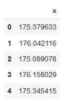
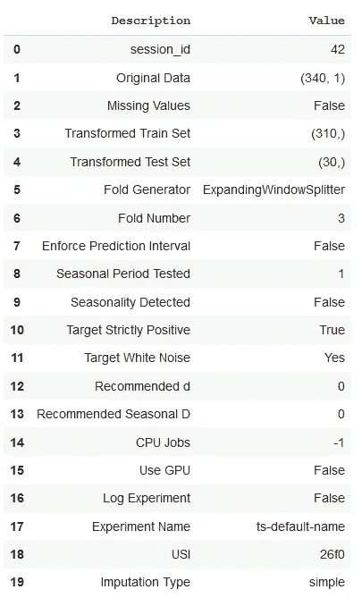
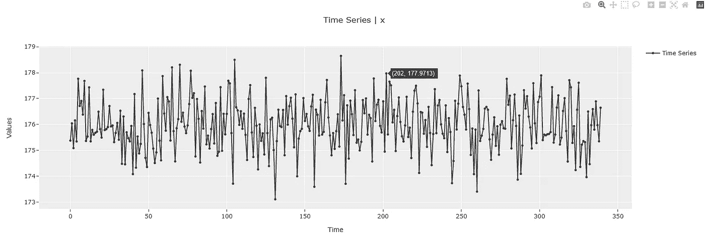
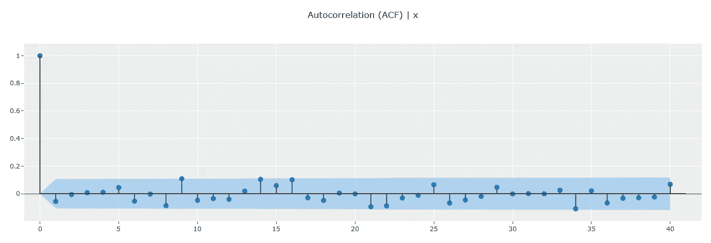
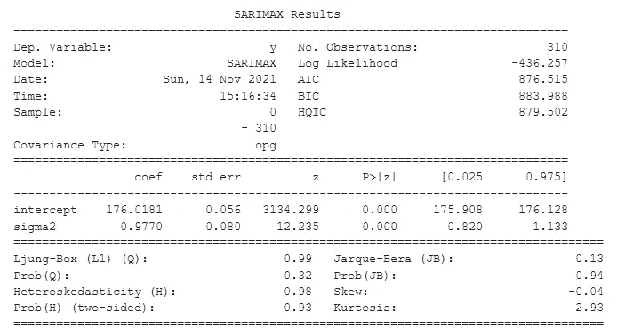
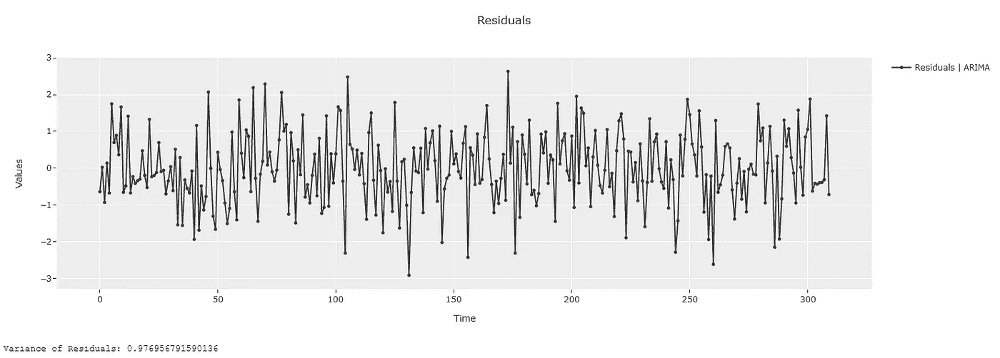
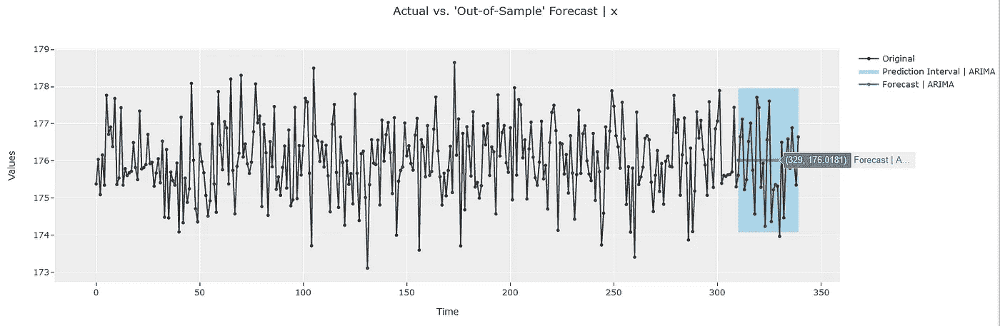
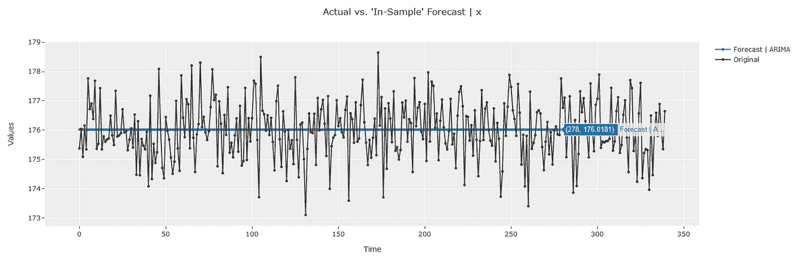

# 使用 PyCaret 的 ARIMA 模型实用指南—第 1 部分

> 原文：<https://towardsdatascience.com/understanding-arima-models-using-pycarets-time-series-module-part-1-692e10ca02f2?source=collection_archive---------8----------------------->

## 奠定统计基础


由[阿格巴洛斯](https://unsplash.com/@agebarros?utm_source=medium&utm_medium=referral)在 [Unsplash](https://unsplash.com?utm_source=medium&utm_medium=referral) 上拍摄的照片

# 📚**简介**

PyCaret 是一个用 Python 编写的开源、低代码的机器学习库，可以自动化机器学习工作流。这是一个端到端的机器学习和模型管理工具，可以成倍地加快实验周期，提高您的工作效率。

PyCaret 最近发布了一个时间序列模块，它附带了许多方便的特性，使得时间序列建模变得轻而易举。你可以在这篇文章中了解更多。

</announcing-pycarets-new-time-series-module-b6e724d4636c>  

在这个由多个部分组成的系列文章中，我们将重点讨论如何使用 PyCaret 这样的“低代码”库来更深入地理解 ARIMA 模型的工作原理。在第一部分中，我们将对 ARIMA 模型及其参数进行概述。然后，我们将从一个简单的 ARIMA 模型开始，为这个模型的预测和预测区间创建一个理论框架，以发展对其工作的直觉。最后，我们将使用 PyCaret 构建这个 ARIMA 模型，并将理论计算与模型输出进行比较。将模型的输出与我们的理论框架联系起来，有望加深我们对模型的理解，并为后续文章中更详细的分析奠定基础。

# 📖建议的先前阅读

本文推荐给那些对时间序列有基本了解(例如，季节性、自相关 ACF、白噪声、训练-测试-分割等概念)但有兴趣了解更多 ARIMA 模型的人。如果你不熟悉这些概念，我建议你先阅读这些短文。这将有助于理解这篇文章。

👉[时间序列中的季节性和自相关性](https://github.com/pycaret/pycaret/discussions/1765)

👉[什么是「白噪音」](https://github.com/pycaret/pycaret/discussions/1800)？

👉[时间序列交叉验证](https://github.com/pycaret/pycaret/discussions/1761)

# **1️⃣ ARIMA 模型概述**

ARIMA 是一个经典的时间序列模型，用于模拟时态数据的自回归特性。自回归意味着依赖于自身过去的值。时间序列可能依赖于(1)其最近的过去值，或者(2)可能表现出季节性行为，并在一定数量的时间点过去后重复自身。

直观上，(1)的一个例子是股票数据。这是时间数据，明天的价格受今天(或最近的过去)价格的影响很大，而与一个月或一年前发生的事情没有太大关系。类似地,( 2)的一个例子可以是在零售店销售冬装。这通常在冬季前达到高峰，在夏季逐渐减弱。因此，它表现出季节性模式。今年冬天的销售额将与去年冬天的销售额高度相关。

现在我们已经看到了一些基本的例子，让我们看看这是如何在模型中表示的。经典的 ARIMA 模型有几个超参数，但我们将重点关注其中的两个主要参数— `order`和`seasonal_order`。

```
**order:** iterable or array-like, shape=(3,), optional (default=(1, 0, 0))
The (p,d,q) order of the model for the number of AR parameters,     differences, and MA parameters to use.**seasonal_order:** array-like, shape=(4,), optional (default=(0, 0, 0, 0))
The (P,D,Q,s) order of the seasonal component of the model for the     AR parameters, differences, MA parameters, and periodicity.
```

现在，你可能想知道这些术语与我们上面强调的例子有什么联系，以及`order`和`seasonal_order`中的三个和四个术语分别是什么意思。在非常高的层次上，`order`与上面的例子(1)相关，其中下一个值与紧接的前一个值强相关。`seasonal_order`与上面的示例(2)相关，其中下一个值与过去一个或多个季节的数据相关。

但这仍然没有回答什么是`(p, d, q)`和`(P, D, Q, s)`的问题。这正是我们将在这一系列文章中试图回答的问题。

注意:本系列文章采用“代码优先”的方法来理解 ARIMA 模型。我强烈建议读者也参考[5]，以便从理论角度更好地理解。

# 2️⃣基线 ARIMA 模型

为了更好地理解 ARIMA 模型的各种超参数，让我们从一个非常简单的 ARIMA 模型开始——一个没有任何自回归属性的模型。这通常用于表示白噪声(即数据中没有任何信号)。你可以在[1]和[2]中找到更多关于它的信息。该模型由以下超参数表示:

```
##############################################
#### Baseline ARIMA Model Hyperparameters ####
##############################################(p, d, q)    = (0, 0, 0)
(P, D, Q, s) = (0, 0, 0, 0)
```

理论上，由于时间序列数据没有任何信号，未来预测(样本外)的最佳表示是用于训练模型的数据的平均值(详细信息请参见[2])。同样，样本内预测的最佳估计也是用于训练模型的数据的平均值。

我们可以通过计算样本内拟合的残差来获得这些预测的预测区间。残差表示实际样本内数据(即用于训练的数据)和由该模型产生的样本内估计(在这种情况下是训练数据的平均值)之间的差异。

好吧，理论是一回事，但一张图胜过千言万语。所以让我们来实践一下。我们将使用 PyCaret 的时间序列模块来更深入地了解这个模型。注意，可以在这里的 和参考资料部分找到代码的笔记本 [**。**](https://nbviewer.org/github/ngupta23/medium_articles/blob/main/time_series/pycaret/pycaret_ts_arima_000_0000.ipynb)

# 3️⃣使用 PyCaret 了解 ARIMA 模型

PyCaret 的时间序列模块提供了超过 2000 个已知属性的时间序列的数据游乐场。我们将使用来自这个操场的“白噪声”数据集来解释这个例子。

👉**步骤 1:设置 PyCaret 时间序列实验**

```
#### Get data from data playground ----
y = get_data("1", folder="time_series/white_noise")
```



实验的白噪声数据(仅前 5 行)[图片由作者提供]

接下来，让我们设置一个时间序列实验来探索和建模这个数据集。“时间序列实验”是一个一站式商店，用户可以在这里执行**探索性分析(EDA)** 、**模型构建**、模型**适合度评估**以及**部署**——同时遵循引擎盖下的最佳建模实践。

在这个设置中，我将预测范围`fh`设置为 30(即我们打算预测接下来的 30 个时间点)。我还暂时将`seasonal_period`设置为 1。注意，如果您的数据有一个`DatetimeIndex`或`PeriodIndex`指数(这里不是这种情况)，那么季节周期是自动推断的。如果是别的什么，我们需要度过季节期。我还传递了一个会话 ID，它充当种子并使实验可重复。

```
#### Setup experiment ----
exp = TimeSeriesExperiment()
exp.setup(data=y, seasonal_period=1, fh=30, session_id=42)
```



[图片由作者提供]

该设置从一开始就为我们提供了一些方便的信息。

(1)我们看到我们的数据有 340 个数据点。在这个实验中，pycaret 保留了最后 30 个数据点(与预测时间范围相同)作为“测试集”，剩余的 310 个数据点用于训练。

(2)我们通过了季节性周期 1，但是在内部测试季节性之后，没有检测到它。这是意料之中的，因为这是没有季节性的白噪声数据。

(3)内部进行了白噪音的永盒测试(见前面的读数),确定数据与白噪音一致。同样，这也是我们所期望的，因为我们是从白噪音领域中挑选数据的。

👉**步骤 2:执行 EDA**

接下来，我们可以对这些数据进行快速 EDA:

```
# `plot_model` without any estimator works on the original 
exp.plot_model()
```



绘制数据[图片由作者提供]

```
# Plot ACF ----
exp.plot_model(plot="acf")
```



ACF 图显示没有显著的自相关[图片由作者提供]

ACF 数据显示没有显著的自相关，并且与白噪声一致。这也是意料中的事(详见前面的内容)。

## 👉第三步:理论计算

接下来，让我们从实验中获得一些数据统计，并添加上面我们框架中的理论计算。

注意:训练和测试数据分割可以使用实验对象的“get_config”方法获得，如下所示。

```
# Get Train Data
y_train = exp.get_config("y_train")# Get Test Data
y_test = exp.get_config("y_test")#########################################################
# Convert into dataframe & add residual calculations ----
#########################################################train_data = pd.DataFrame({"y":y_train})
train_data['preds'] = y_train.mean()
train_data['split'] = "Train"test_data = pd.DataFrame({'y': y_test})
test_data['preds'] = y_train.mean()
test_data['split'] = "Test"data = pd.concat([train_data, test_data])data['residuals'] = data['y'] - data['preds']
data.reset_index(inplace=True)
```

接下来，让我们计算进行理论预测和计算预测区间所需的计算。

```
#######################################################
#### Compute values based on theoretical equations ----
#######################################################y_train_mean **=** data**.**query("split=='Train'")['y']**.**mean()
resid **=** data**.**query("split=='Train'")['residuals']
resid_sigma2 **=** (resid******2)**.**sum()**/**len(resid)

print(f"Mean of Training Data: {y_train_mean}")
print(f"Residuals Sigma2: {resid_sigma2}")***>>> Mean of Training Data: 176.01810663414085
>>> Residuals Sigma2: 0.9769567915901368***######################################
#### Compute Prediction Intervals ----
######################################import scipy.stats as st
alpha = 0.05# 2 sided multiplier
multiplier = st.norm.ppf(1-alpha/2)lower_interval **=** np**.**round(y_train_mean **-** multiplier ***** resid_sigma2******0.5, 2)
upper_interval **=** np**.**round(y_train_mean **+** multiplier ***** resid_sigma2******0.5, 2)
print(f"Prediction Interval: {lower_interval} - {upper_interval}")***>>> Prediction Interval: 174.08 - 177.96***
```

## 👉步骤 4:构建模型

既然我们已经完成了理论计算，让我们使用 PyCaret 构建这个模型并检查结果。模型创建就像从实验对象调用`create_model`方法一样简单。此外，此时您还可以将特定的超参数传递给模型。在我们的例子中，我们正在建模没有任何自回归属性的数据，所以我们将为`order`和`seasonal_order`传递全零。如果你想了解更多关于如何用 PyCaret 创建时间序列模型，以及如何定制它们，请参考[3]。

```
model1 = exp.create_model(
    "arima",
    order=(0, 0, 0),
    seasonal_order=(0, 0, 0, 0)
)
```

## 👉第五步:分析结果

接下来，我使用 PyCaret 一行程序编写了一些小的包装器函数来帮助进行模型评估(参见附录中的定义)。这些是

(1) `summarize_model`:生成模型的统计概要

(2) `get_residual_properties`:绘制并显示残差的方差

(3) `plot_predictions`:绘制样本外和样本内预测

如果你想知道更多关于这些功能是如何工作的，特别是`summarize_model`，请参考【4】。

现在，让我们看看当我们通过这些助手函数运行模型时会得到什么

```
summarize_model(model1)
get_residual_properties(model1)
```



ARIMA 模型的统计摘要[图片由作者提供]



模型残差和残差方差[图片由作者提供]

上面显示了模型的统计摘要。截距是训练数据的平均值。它与我们上面的理论框架中的计算相吻合！

sigma2 是残差的方差。我们怎么知道？检查`get_residual_properties`功能的输出。它显示了残差的方差。这个值与统计概要完全匹配，也与我们的理论框架的计算完全匹配！

但是预测呢？接下来让我们检查一下。

```
plot_predictions(model1)
```



样本外预测和预测区间[图片由作者提供]



在样本预测中[图片由作者提供]

默认情况下，PyCaret 使用`plotly`库提供交互式绘图，因此我们可以通过悬停在绘图上来快速验证值。我们可以很快看到，样本外和样本内预测值都等于 176.02，这与我们理论框架的计算结果相匹配。预测区间也与我们理论框架中的值相匹配！

# 🚀结论

希望这个简单的模型为我们理解 ARIMA 模型的内部运作打下了良好的基础。在下一组文章中，我们将开始逐一介绍其他参数，并查看它们对模型行为的影响。在那之前，如果你愿意在我的社交渠道上与我联系(我经常发布关于时间序列分析的文章)，你可以在下面找到我。暂时就这样了。预测快乐！

🔗 [LinkedIn](https://www.linkedin.com/in/guptanick/)

🐦[推特](https://twitter.com/guptanick13)

📘 [GitHub](https://github.com/ngupta23)

*喜欢这篇文章吗？成为* [***中等会员***](https://ngupta13.medium.com/membership) *继续* ***无限制学习*** *。如果你使用下面的链接，* ***，我会收到你的一部分会员费，而不会给你带来额外的费用*** *。*

<https://ngupta13.medium.com/membership>  

# 🔖建议下次阅读

[使用 PyCaret 的时间序列模块理解 ARIMA 模型—第二部分](/understanding-arima-models-using-pycarets-time-series-module-part2-308ea7bfecf6)

# 📗资源

1.  [**Jupyter 笔记本**](https://nbviewer.org/github/ngupta23/medium_articles/blob/main/time_series/pycaret/pycaret_ts_arima_000_0000.ipynb) 包含这篇文章的代码

# 📚参考

[1] [诊断 PyCaret](https://github.com/pycaret/pycaret/discussions/1800) 中的“白噪声”

[2] [在 PyCaret 中建模“白噪声”](https://github.com/pycaret/pycaret/discussions/1837)

[3] [创建和定制时间序列模型](https://github.com/pycaret/pycaret/discussions/1757)

[4] [了解 PyCaret 时间序列模块的底层架构](https://medium.com/p/57336a2f39c7)

[5] [第八章 ARIMA 模型](https://otexts.com/fpp2/arima.html)，《预测:原理与实践》，罗伯 J 海曼和乔治阿萨纳索普洛斯

# **📘附录**

1.  助手功能

```
**def summarize_model(model):**
    """
    Provides statistical summary for some statistical models
    """
    # Statistical Summary Table
    try:
        print(model.summary())
    except:
        print("Summary does not exist for this model.")**def get_residual_properties(model):**
    """
    Plots and displays variance of residuals
    """
    *#### Residuals ----*
    try:
        plot_data = exp.plot_model(
            model,
            plot="residuals",
            return_data=True
        )
        resid = plot_data['data']
        resid_sigma2 = (resid**2).sum()/(len(resid))
        print(f"Residual Sigma2: {resid_sigma2}")
    except:
        print("Residuals can not be extracted for this model.")**def plot_predictions(model):**
    """
    Plots out-of-sample and in-sample predictions
    """
    # Out-of-Sample Forecast
    exp.plot_model(model) # In-Sample Forecast
    exp.plot_model(model, plot="insample")
```